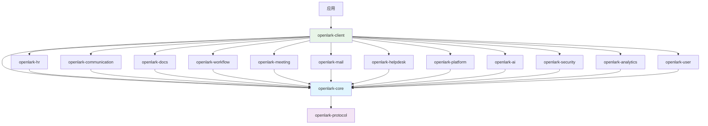

# Open-Lark 架构设计文档

## 项目概览

**Open-Lark** 是为飞书开放平台构建的高覆盖率 Rust SDK，提供对 1,688+ 个 API 的类型安全访问。本文档描述了重构后的模块化架构设计。

## 设计理念

### 核心原则

1. **业务领域驱动**: 按业务功能而非技术层次组织模块
2. **高内聚低耦合**: 相关功能聚合在同一crate中，减少跨模块依赖
3. **可扩展性**: 易于添加新的业务模块和功能
4. **开发者友好**: 符合飞书用户的业务思维模式
5. **类型安全**: 充分利用Rust的类型系统保证安全性

### 架构目标

- **模块化**: 12个主要业务模块，清晰的功能边界
- **可维护性**: 每个模块独立开发、测试和维护
- **性能**: 优化的编译时间和运行时性能
- **易用性**: 简洁直观的API设计

## 整体架构

```
┌─────────────────────────────────────────────────────────────────┐
│                        应用层 (Application Layer)                │
├─────────────────────────────────────────────────────────────────┤
│                        客户端层 (Client Layer)                   │
│                      openlark-client                            │
├─────────────────────────────────────────────────────────────────┤
│                        业务层 (Business Layer)                   │
│ ┌─────────────┬─────────────┬─────────────┬─────────────┐      │
│ │   HR模块     │  通讯协作    │   文档协作    │   任务审批    │      │
│ │openlark-hr  │communication│ openlark-docs│openlark-work│      │
│ │   (484 APIs)│  (153 APIs) │  (254 APIs) │ (134 APIs)  │      │
│ └─────────────┴─────────────┴─────────────┴─────────────┘      │
│ ┌─────────────┬─────────────┬─────────────┬─────────────┐      │
│ │   会议日程    │   邮件服务    │   帮助台     │   应用管理    │      │
│ │openlark-meet│ openlark-mail│openlark-help│openlark-plat│      │
│ │ ing (117 APIs)│  (67 APIs)  │ desk (50)   │ form (86)   │      │
│ └─────────────┴─────────────┴─────────────┴─────────────┘      │
│ ┌─────────────┬─────────────┬─────────────┬─────────────┐      │
│ │   AI智能     │   安全认证    │   数据分析    │   个人设置    │      │
│ │openlark-ai  │openlark-secu│openlark-ana│openlark-user│      │
│ │   (23 APIs) │ rity (44)   │ lytics (38) │  (21 APIs)  │      │
│ └─────────────┴─────────────┴─────────────┴─────────────┘      │
├─────────────────────────────────────────────────────────────────┤
│                       基础设施层 (Core Layer)                   │
│           openlark-core + openlark-protocol                     │
└─────────────────────────────────────────────────────────────────┘
```

## 模块详细设计

### 核心模块 (Core Modules)

#### 1. openlark-core
**职责**: 核心基础设施
- HTTP客户端和传输层
- 配置管理和环境处理
- 错误处理和日志系统
- 令牌自动管理
- WebSocket支持

**错误码对齐与优先级**
- 优先级：`飞书通用 code` > `HTTP status` > `内部业务码`（同一响应仅选一层）。  
- 核心映射：响应体含 `code` 时优先调用 `ErrorCode::from_feishu_code`；未命中再用 `status`；都缺省时使用内部业务码。  
- 观测：`log_id` 写入 `ErrorContext.request_id`，`feishu_code` 写入上下文 `feishu_code` 键，便于链路与告警。  
- 关键通用码（示例）：
  - 99991661：AccessToken 格式/内容无效  
  - 99991671：AccessToken 无效；99991677：AccessToken 过期  
  - 99991663/64：Tenant/App AccessToken 无效；99991670：SSO Token 无效  
  - 99991672：缺少权限；99991676：Token 权限不足  
  - 99991641/42/45：用户会话失效/不存在/超时  
  - 99991669：用户身份解析失败；99991674：用户类型不支持；99991675：身份不匹配  
  - 99992351/52/53：UserID/OpenID/UnionID 非法  
  - 429/5xx：HTTP 优先级次于通用码，用于回退。

#### 2. openlark-client
**职责**: 高级客户端封装
- LarkClient主客户端
- 服务注册和发现
- 异步接口抽象
- 构建器模式API

#### 3. openlark-protocol
**职责**: 协议定义
- WebSocket protobuf定义
- 消息协议和事件处理
- 数据序列化/反序列化

### 业务模块 (Business Modules)

#### HR人力管理模块 (openlark-hr)
**API数量**: 484个
**包含业务**:
- **hire** (182 APIs): 招聘管理、Offer处理、候选人管理
- **corehr** (144 APIs): 核心HR功能、员工管理
- **feishu_people** (105 APIs): 人员信息管理
- **attendance** (39 APIs): 考勤管理
- **payroll** (12 APIs): 薪酬管理
- **ehr** (2 APIs): 电子人力资源

**目录结构**:
```
openlark-hr/src/
├── hire/
│   ├── v1/
│   │   ├── mod.rs
│   │   ├── offer.rs
│   │   ├── candidate.rs
│   │   └── interview.rs
│   └── models/
│       ├── offer.rs
│       └── candidate.rs
├── corehr/
├── attendance/
├── payroll/
├── people/
└── lib.rs
```

#### 通讯协作模块 (openlark-communication)
**API数量**: 153个
**包含业务**:
- **contact** (77 APIs): 联系人管理、通讯录
- **im** (75 APIs): 即时消息、群聊管理
- **moments** (1 API): 动态圈功能

#### 文档协作模块 (openlark-docs)
**API数量**: 254个
**包含业务**:
- **ccm** (174 APIs): 云文档管理
- **base** (49 APIs): 基础服务
- **baike** (27 APIs): 知识库管理
- **minutes** (4 APIs): 会议纪要

#### 任务审批模块 (openlark-workflow)
**API数量**: 134个
**包含业务**:
- **task** (75 APIs): 任务管理
- **approval** (53 APIs): 审批流程
- **board** (6 APIs): 看板管理

#### 其他业务模块

| 模块 | API数量 | 主要功能 |
|------|---------|---------|
| openlark-meeting | 117 | 日历管理、视频会议、会议室 |
| openlark-mail | 67 | 邮件发送和管理 |
| openlark-helpdesk | 50 | 客服和工单系统 |
| openlark-platform | 86 | 应用平台和管理工具 |
| openlark-ai | 23 | AI服务和智能功能 |
| openlark-security | 44 | 认证、安全、合规 |
| openlark-analytics | 38 | 搜索、报表、目录服务 |
| openlark-user | 21 | 个人化设置和用户体验 |

## 依赖关系图



## openlark-client 服务层重构方案（crates/openlark-client/src/services）

### 重构目标
- 消除重复：统一 `services/` 与 `registry/` 的能力，避免双重工厂/注册逻辑。
- 显式依赖：服务之间的依赖关系由拓扑图驱动，阻断隐式耦合。
- 生命周期可观测：标准化 init → ready → running → stopped 状态，暴露健康检查与统计。
- 可插拔：支持业务团队按需注册自定义服务或第三方实现，保持特性裁剪能力。
- 配置收敛：全局 `Config` + 按服务覆盖（超时、重试、base_url、鉴权策略）。

### 目标目录结构
```
crates/openlark-client/src/services/
├── mod.rs                # Facade 与预导出
├── service.rs            # Service / ServiceKind / Health / Lifecycle traits
├── context.rs            # ServiceContext：Config、HTTP client、token provider、tracing
├── graph.rs              # 依赖图 & 拓扑排序，包装 registry::DependencyResolver
├── registry.rs           # TypedServiceRegistry，屏蔽 Any/Downcast
├── loader.rs             # 按 feature 注册 provider；支持动态插件
├── runtime.rs            # ServiceRuntime：init/start/stop/health 路径
├── middleware/           # 横切：重试、限流、metrics、logging
└── providers/            # 领域服务实现，按特性裁剪
    ├── auth.rs
    ├── communication.rs
    ├── docs.rs
    ├── hr.rs
    ├── ...
```

### 核心接口（草案）
```rust
pub trait Service: Send + Sync + 'static {
    fn kind(&self) -> ServiceKind;              // name + version
    fn capabilities(&self) -> &'static [&'static str];
    fn dependencies(&self) -> &'static [&'static str];
    async fn init(&self, ctx: &ServiceContext) -> SDKResult<()>;
    async fn start(&self, ctx: &ServiceContext) -> SDKResult<()>; // 连接池、预热
    async fn stop(&self) -> SDKResult<()>;                       // 清理资源
    fn health(&self) -> ServiceHealth;                           // ready / degraded
}

pub struct ServiceContext {
    pub config: Config,
    pub http: Arc<dyn HttpClient>,
    pub token: Arc<dyn TokenProvider>,
    pub tracer: Arc<dyn TracingExporter>,
    pub metrics: Arc<dyn MetricsSink>,
}
```

### 生命周期与依赖解算
1. `loader` 按 feature 收集 `ServiceProvider` 列表。
2. `graph` 将 `dependencies()` 构建成 DAG，循环依赖在启动前 fail fast。
3. `runtime` 按拓扑序调用 `init → start`，失败将状态标记为 `Error(reason)` 并可重试。
4. `registry` 维护 `ServiceHandle<T>`，暴露类型安全访问与健康查询，替换 `Box<dyn Any>`。

### 配置与横切关注点
- `ServiceConfig` 支持局部覆盖：`timeout`, `retry_policy`, `base_url`, `auth_strategy`。
- `middleware/` 提供可插拔的重试、限流、日志、指标；通过 `ServiceContext` 注入。
- 观测统一：所有 `Service` 方法返回 `CoreError`，自动附带 `component=service::<name>` 上下文。

### 渐进式迁移路径
1. 引入 `service.rs` 与 `context.rs` 基础抽象，`AuthService` 先落地为示例。
2. 将 `ServiceFactory` 迁移到 `runtime` + `registry`，保留旧 API 但内部委托新实现。
3. 逐个业务模块接入：communication → docs → hr → ...，每步补齐健康检查与配置覆盖。
4. 删除遗留的 `services/mod.rs` 构造函数分支，转为 `loader` 自动注册。
5. 更新集成测试，增加“服务图完整性”“生命周期幂等”两个维度的测试用例。

### 预期收益
- 代码可维护性：服务添加/删除仅需实现 `Service` + 注册，不再改动大工厂。
- 运行稳定性：显式依赖 + 生命周期管理降低初始化竞态。
- 可观测性：统一健康与指标输出，便于运维排障。
- 生态扩展：第三方/实验性服务可独立发布，不污染核心依赖树。

## Feature配置策略

### 功能分组原则

1. **核心功能**: security (认证和基础功能)
2. **默认功能**: communication + docs + security (最常用功能)
3. **完整功能**: 所有业务模块
4. **最小功能**: 仅核心基础设施

### Feature设计

```toml
[features]
# 默认配置 - Phase 1 核心模块
default = ["communication", "docs", "security"]

# 完整配置 - 所有业务功能
full = [
    "communication", "docs", "security", "workflow", "meeting",  # Phase 1
    "hr", "mail", "platform",                             # Phase 2
    "ai", "analytics", "helpdesk", "user"            # Phase 3
]

# 最小配置 - 仅核心基础设施
minimal = ["core", "security"]

# 业务模块独立功能
# Phase 1: 核心协作模块 (P0优先级)
communication = ["openlark-communication"]
docs = ["openlark-docs"]
security = ["openlark-security"]

# Phase 1: 业务流程模块 (P1优先级)
workflow = ["openlark-workflow"]
meeting = ["openlark-meeting"]

# Phase 2: 企业功能模块 (P2优先级)
hr = ["openlark-hr"]
mail = ["openlark-mail"]
platform = ["openlark-platform"]

# Phase 3: 扩展功能模块 (P3优先级)
ai = ["openlark-ai"]
analytics = ["openlark-analytics"]
helpdesk = ["openlark-helpdesk"]
user = ["openlark-user"]
```

## API设计模式

### 统一接口模式

```rust
// 每个业务模块都遵循统一的设计模式
pub struct ModuleService {
    pub config: Config,
}

impl ModuleService {
    pub fn new(config: Config) -> Self {
        Self { config }
    }

    // 按版本提供服务
    pub fn v1(&self) -> V1Service { /* ... */ }
    pub fn v2(&self) -> V2Service { /* ... */ }
    pub fn v3(&self) -> V3Service { /* ... */ }
}

// 版本化服务
impl V3Service {
    // 构建器模式
    pub fn user_create(&self) -> UserCreateBuilder { /* ... */ }
    pub fn message_send(&self) -> MessageSendBuilder { /* ... */ }
}

// 构建器模式
pub struct UserCreateBuilder {
    config: Config,
    request: UserCreateRequest,
}

impl UserCreateBuilder {
    pub fn name(mut self, name: impl Into<String>) -> Self {
        self.request.name = name.into();
        self
    }

    pub fn department_id(mut self, id: impl Into<String>) -> Self {
        self.request.department_id = id.into();
        self
    }

    pub async fn send(self) -> SDKResult<UserCreateResponse> {
        // 实现API调用
    }
}
```

## 错误处理系统架构

open-lark项目采用基于thiserror的企业级错误处理系统，以CoreError为核心，为1,134+ API提供类型安全、用户友好且可观测的错误处理能力。

### 核心错误系统设计 (CoreError)

#### 架构特点

**现代化设计**：
- 基于`thiserror`的类型安全错误体系
- 统一的`SDKResult<T> = Result<T, CoreError>`返回类型
- 丰富的错误上下文信息和可观测性支持
- 完整的错误分析和恢复机制

**核心组件**：
```rust
// 主要错误类型
#[derive(Debug, Error)]
pub enum CoreError {
    Network(NetworkError),
    Authentication { message: String, code: ErrorCode, ctx: ErrorContext },
    Api(ApiError),
    Validation { field: Cow<'static, str>, message: String, code: ErrorCode, ctx: ErrorContext },
    Configuration { message: String, code: ErrorCode, ctx: ErrorContext },
    Serialization { message: String, source: Option<AnyError>, code: ErrorCode, ctx: ErrorContext },
    Business { code: ErrorCode, message: String, ctx: ErrorContext },
    Timeout { duration: Duration, operation: Option<String>, ctx: ErrorContext },
    RateLimit { limit: u32, window: Duration, reset_after: Option<Duration>, code: ErrorCode, ctx: ErrorContext },
    ServiceUnavailable { service: Cow<'static, str>, retry_after: Option<Duration>, code: ErrorCode, ctx: ErrorContext },
    Internal { code: ErrorCode, message: String, source: Option<AnyError>, ctx: ErrorContext },
}

// 统一结果类型
pub type SDKResult<T> = Result<T, CoreError>;
```

**错误严重程度分级**：
```rust
pub enum ErrorSeverity {
    Info,      // 信息性错误，通常可忽略
    Warning,   // 警告性错误，需要注意但不影响核心功能
    Error,     // 严重错误，影响功能使用
    Critical,  // 关键错误，需要立即处理
}
```

#### 错误码映射和对齐策略

**智能映射优先级**：
1. **飞书通用码** > HTTP status > 内部业务码
2. **关键通用码覆盖**：
   - 令牌相关：99991661（格式无效）、99991671（无效）、99991677（过期）
   - 权限相关：99991672（缺少权限）、99991676（权限不足）
   - 用户身份：99992351/52/53（ID非法）
   - 应用相关：10003（未安装）、19001（权限不足）

**映射实现示例**：
```rust
pub fn map_feishu_auth_error(
    feishu_code: i32,
    message: &str,
    request_id: Option<&str>,
) -> AuthError {
    let mut ctx = ErrorContext::new();
    if let Some(req_id) = request_id {
        ctx.set_request_id(req_id);
    }
    ctx.add_context("feishu_code", feishu_code.to_string());

    // 优先映射飞书通用错误码
    match ErrorCode::from_feishu_code(feishu_code) {
        Some(ErrorCode::AccessTokenExpiredV2) => {
            CoreError::Authentication {
                message: format!("访问令牌已过期: {}", message),
                code: ErrorCode::AccessTokenExpiredV2,
                ctx,
            }
        },
        Some(ErrorCode::PermissionMissing) => {
            CoreError::Authentication {
                message: format!("权限不足: {}", message),
                code: ErrorCode::PermissionMissing,
                ctx,
            }
        },
        // ... 更多映射规则
        _ => {
            // 回退到HTTP状态码或内部业务码
            CoreError::Api(ApiError {
                status: feishu_code as u16,
                endpoint: "auth".into(),
                message: message.to_string(),
                source: None,
                code: ErrorCode::from_feishu_code(feishu_code).unwrap_or(ErrorCode::InternalError),
                ctx,
            })
        }
    }
}
```

### 业务层错误处理模式指南

#### 标准业务层错误扩展模式

**1. 业务特定错误类型**：
```rust
// 认证服务错误处理示例
pub type AuthError = CoreError;
pub type AuthResult<T> = Result<T, AuthError>;

// 业务错误构建器
pub struct AuthErrorBuilder;

impl AuthErrorBuilder {
    pub fn token_expired(detail: impl Into<String>) -> AuthError {
        token_expired_error(detail)
    }

    pub fn scope_insufficient(
        required: &[impl AsRef<str>],
        current: &[impl AsRef<str>],
    ) -> AuthError {
        let mut ctx = ErrorContext::new();
        ctx.add_context("required_scopes", required.iter().map(|s| s.as_ref()).collect::<Vec<_>>().join(","));
        ctx.add_context("current_scopes", current.iter().map(|s| s.as_ref()).collect::<Vec<_>>().join(","));

        CoreError::Authentication {
            message: "权限范围不足".to_string(),
            code: ErrorCode::PermissionMissing,
            ctx,
        }
    }
}
```

**2. 错误传播和转换标准**：
```rust
// API方法标准返回类型
pub async fn your_method(&self, request: YourRequest) -> SDKResult<YourResponse> {
    // 验证输入
    request.validate()?;

    // 调用核心API
    match self.core_client.send_request(request).await {
        Ok(response) => Ok(response),
        Err(error) => {
            // 业务层错误处理和转换
            self.handle_business_error(error).await
        }
    }
}

// 错误处理模式
match result {
    Ok(response) => println!("✅ 成功: {:?}", response),
    Err(error) => {
        println!("❌ {}", error.user_friendly_message());

        // 智能错误恢复
        if error.is_token_expired() {
            client.refresh_token().await?;
            // 重试请求
        } else if error.is_retryable() {
            tokio::time::sleep(error.retry_delay(0).unwrap_or(Duration::from_secs(1))).await;
            // 重试逻辑
        }
    }
}
```

#### 业务层错误设计规则

**规则1：统一错误类型**
- 所有业务模块必须使用`CoreError`作为主要错误类型
- 可定义业务特定的类型别名（如`AuthError = CoreError`）
- 禁止在业务层创建独立的错误枚举

**规则2：丰富错误上下文**
```rust
// ✅ 正确：提供丰富的上下文信息
let mut ctx = ErrorContext::new();
ctx.set_request_id(request_id);
ctx.add_context("operation", "user_create");
ctx.add_context("user_id", user_id);
ctx.add_context("department", department_id);

CoreError::Validation {
    field: "email".into(),
    message: "邮箱格式不正确".to_string(),
    code: ErrorCode::ValidationError,
    ctx,
}

// ❌ 错误：缺乏上下文信息
return Err("邮箱格式不正确".into());
```

**规则3：用户友好的中文消息**
```rust
impl CoreError {
    pub fn user_friendly_message(&self) -> String {
        match self {
            CoreError::Authentication { code: ErrorCode::AccessTokenExpiredV2, .. } => {
                "登录已过期，请重新登录".to_string()
            },
            CoreError::Validation { field, .. } => {
                format!("{} 输入不正确，请检查后重试", field)
            },
            CoreError::Network(_) => {
                "网络连接不稳定，请检查网络后重试".to_string()
            },
            CoreError::RateLimit { reset_after, .. } => {
                match reset_after {
                    Some(duration) => format!("请求过于频繁，请在{}秒后重试", duration.as_secs()),
                    None => "请求过于频繁，请稍后重试".to_string(),
                }
            },
            // ... 更多用户友好消息
            _ => "操作失败，请稍后重试".to_string(),
        }
    }
}
```

### 企业级错误处理最佳实践

#### 自动重试和恢复机制

**重试策略**：
```rust
impl CoreError {
    pub fn is_retryable(&self) -> bool {
        matches!(
            self,
            CoreError::Network(_) |
            CoreError::Timeout { .. } |
            CoreError::ServiceUnavailable { .. } |
            CoreError::RateLimit { .. } |
            CoreError::Authentication { code: ErrorCode::AccessTokenExpiredV2, .. }
        )
    }

    pub fn retry_delay(&self, attempt: u32) -> Option<Duration> {
        match self {
            CoreError::RateLimit { reset_after, .. } => *reset_after,
            CoreError::Network(_) | CoreError::Timeout { .. } => {
                Some(Duration::from_secs(2u64.pow(attempt.min(5)))) // 指数退避
            },
            CoreError::ServiceUnavailable { retry_after, .. } => *retry_after,
            _ => None,
        }
    }
}
```

**自动重试实现**：
```rust
pub async fn robust_api_call<F, T>(mut operation: F) -> SDKResult<T>
where
    F: FnMut() -> Pin<Box<dyn Future<Output = SDKResult<T>> + Send>>,
{
    let mut attempts = 0;
    let max_attempts = 3;

    loop {
        match operation().await {
            Ok(result) => return Ok(result),
            Err(error) => {
                attempts += 1;

                if attempts >= max_attempts || !error.is_retryable() {
                    return Err(error);
                }

                if let Some(delay) = error.retry_delay(attempts - 1) {
                    tokio::time::sleep(delay).await;
                } else {
                    tokio::time::sleep(Duration::from_secs(1)).await;
                }
            }
        }
    }
}
```

#### 可观测性和监控集成

**错误记录和导出**：
```rust
// 可序列化的错误记录
#[derive(Debug, Serialize)]
pub struct ErrorRecord {
    pub error_id: String,
    pub code: ErrorCode,
    pub message: String,
    pub severity: ErrorSeverity,
    pub error_type: ErrorType,
    pub is_retryable: bool,
    pub request_id: Option<String>,
    pub context: HashMap<String, serde_json::Value>,
    pub timestamp: chrono::DateTime<chrono::Utc>,
}

impl From<&CoreError> for ErrorRecord {
    fn from(error: &CoreError) -> Self {
        Self {
            error_id: Uuid::new_v4().to_string(),
            code: error.error_code(),
            message: error.to_string(),
            severity: error.severity(),
            error_type: error.error_type(),
            is_retryable: error.is_retryable(),
            request_id: error.context().request_id().map(|s| s.to_string()),
            context: error.context().to_serializable(),
            timestamp: chrono::Utc::now(),
        }
    }
}
```

**监控集成示例**：
```rust
// 错误处理中间件
pub async fn error_handling_middleware(
    request: Request,
    next: Next,
) -> Result<Response, StatusCode> {
    let start_time = Instant::now();

    match next.run(request).await {
        Ok(response) => {
            // 记录成功指标
            metrics::counter!("api_requests_total", ["status:success"]).increment(1);
            Ok(response)
        },
        Err(error) => {
            let duration = start_time.elapsed();

            // 转换为错误记录
            let error_record: ErrorRecord = (&error).into();

            // 记录错误指标
            metrics::counter!("api_requests_total", ["status:error"]).increment(1);
            metrics::histogram!("api_request_duration_seconds").record(duration);
            metrics::counter!("api_errors_total", [
                &format!("code:{}", error_record.code),
                &format!("severity:{}", error_record.severity),
            ]).increment(1);

            // 记录结构化日志
            tracing::error!(
                error_id = %error_record.error_id,
                error_code = ?error_record.code,
                error_message = %error_record.message,
                request_id = %error_record.request_id.unwrap_or_default(),
                "API请求失败"
            );

            // 根据错误类型返回HTTP状态码
            match error.error_type() {
                ErrorType::Validation => StatusCode::BAD_REQUEST,
                ErrorType::Authentication | ErrorType::Permission => StatusCode::UNAUTHORIZED,
                ErrorType::RateLimit => StatusCode::TOO_MANY_REQUESTS,
                ErrorType::NotFound => StatusCode::NOT_FOUND,
                _ => StatusCode::INTERNAL_SERVER_ERROR,
            }
        }
    }
}
```

#### 错误分析和报告

**深度错误分析**：
```rust
pub struct ErrorAnalyzer;

impl ErrorAnalyzer {
    pub fn analyze_error(error: &CoreError) -> ErrorAnalysisReport {
        ErrorAnalysisReport {
            error_id: Uuid::new_v4().to_string(),
            error_type: error.error_type(),
            severity: error.severity(),
            is_retryable: error.is_retryable(),
            recovery_suggestion: self.suggest_recovery(error),
            user_impact: self.assess_user_impact(error),
            business_impact: self.assess_business_impact(error),
            context_summary: self.summarize_context(error.context()),
        }
    }

    fn suggest_recovery(&self, error: &CoreError) -> RecoveryAction {
        match error {
            CoreError::Authentication { code: ErrorCode::AccessTokenExpiredV2, .. } => {
                RecoveryAction::ReAuthenticate
            },
            CoreError::RateLimit { reset_after, .. } => {
                RecoveryAction::RetryAfter(*reset_after.unwrap_or(Duration::from_secs(60)))
            },
            CoreError::Validation { field, .. } => {
                RecoveryAction::FixInput(vec![field.to_string()])
            },
            CoreError::Network(_) => {
                RecoveryAction::RetryWithBackoff(Duration::from_secs(1))
            },
            _ => RecoveryAction::ContactSupport,
        }
    }
}
```

### 错误恢复和用户指导

#### 智能错误恢复

**自动恢复策略**：
```rust
pub struct ErrorRecoveryManager {
    token_manager: Arc<dyn TokenManager>,
    circuit_breaker: Arc<CircuitBreaker>,
}

impl ErrorRecoveryManager {
    pub async fn handle_error(&self, error: &CoreError) -> SDKResult<RecoveryResult> {
        match error {
            CoreError::Authentication { code: ErrorCode::AccessTokenExpiredV2, .. } => {
                // 自动刷新令牌
                self.token_manager.refresh_token().await?;
                Ok(RecoveryResult::Recovered("令牌已自动刷新".to_string()))
            },
            CoreError::RateLimit { reset_after, .. } => {
                // 等待限流重置
                if let Some(delay) = reset_after {
                    tokio::time::sleep(*delay).await;
                }
                Ok(RecoveryResult::Retry("限流已解除，可以重试".to_string()))
            },
            CoreError::ServiceUnavailable { .. } => {
                // 检查熔断器状态
                if self.circuit_breaker.is_open() {
                    Err(error.clone())
                } else {
                    Ok(RecoveryResult::Retry("服务可用，可以重试".to_string()))
                }
            },
            _ => Err(error.clone()),
        }
    }
}
```

#### 用户指导和错误消息

**分层错误消息系统**：
```rust
impl CoreError {
    // 终端用户友好消息
    pub fn user_message(&self) -> String {
        match self {
            CoreError::Authentication { code: ErrorCode::AccessTokenExpiredV2, .. } => {
                "您的登录已过期，请重新登录".to_string()
            },
            CoreError::Validation { field, .. } => {
                format!("{} 输入不正确，请检查后重新输入", self.friendly_field_name(field))
            },
            CoreError::Network(_) => {
                "网络连接不稳定，请检查网络后重试".to_string()
            },
            CoreError::RateLimit { .. } => {
                "请求过于频繁，请稍后重试".to_string()
            },
            _ => "操作失败，请稍后重试或联系技术支持".to_string(),
        }
    }

    // 开发者技术消息
    pub fn developer_message(&self) -> String {
        format!("{} [Code: {:?}] - {}",
            self.error_type(),
            self.error_code(),
            self.context().summary()
        )
    }

    // 运维人员消息
    pub fn ops_message(&self) -> String {
        format!("Error: {} | RequestID: {} | Retryable: {} | Severity: {:?}",
            self.error_code(),
            self.context().request_id().unwrap_or("N/A"),
            self.is_retryable(),
            self.severity()
        )
    }

    fn friendly_field_name(&self, field: &str) -> &str {
        match field {
            "email" => "邮箱地址",
            "phone" => "手机号码",
            "user_id" => "用户ID",
            "app_id" => "应用ID",
            _ => field,
        }
    }
}
```

### 部署和监控

#### 生产环境配置

**错误处理配置**：
```rust
pub struct ErrorHandlingConfig {
    // 重试配置
    pub max_retry_attempts: u32,
    pub base_retry_delay: Duration,
    pub max_retry_delay: Duration,

    // 熔断器配置
    pub circuit_breaker_threshold: u32,
    pub circuit_breaker_timeout: Duration,

    // 错误报告配置
    pub enable_error_reporting: bool,
    pub error_report_endpoint: Option<String>,
    pub sensitive_data_filters: Vec<String>,

    // 日志配置
    pub log_user_errors: bool,
    pub log_system_errors: bool,
    pub log_network_errors: bool,
}
```

**错误处理最佳实践总结**：

1. **统一性**：所有业务模块使用相同的CoreError系统
2. **可观测性**：每个错误都包含丰富的上下文和链路追踪信息
3. **用户友好**：提供中文本地化的用户友好消息
4. **自动恢复**：智能的重试和错误恢复机制
5. **监控集成**：完整的错误指标和告警系统
6. **类型安全**：充分利用Rust类型系统保证错误处理的安全性

## 编译优化策略

### 条件编译

```rust
#[cfg(feature = "hr")]
pub mod hr;

#[cfg(feature = "communication")]
pub mod communication;

// 客户端中的条件注册
#[cfg(feature = "hr")]
fn register_hr_services(client: &mut LarkClient) {
    client.register_service("hr", HRService::new(client.config.clone()));
}
```

### 依赖优化

- 最小化外部依赖
- 使用特性标志控制编译大小
- 延迟编译大型模块

## 测试策略

### 分层测试

1. **单元测试**: 每个crate独立测试
2. **集成测试**: 跨模块功能测试
3. **端到端测试**: 完整业务流程测试
4. **性能测试**: 关键API性能验证

### 测试组织

```
crates/
├── openlark-hr/
│   ├── src/
│   └── tests/
│       ├── unit/
│       ├── integration/
│       └── e2e/
└── tests/
    ├── feature_combinations/
    └── compatibility/
```

## 部署和发布

### 语义化版本

- **主版本**: 破坏性变更
- **次版本**: 新功能添加
- **修订版本**: Bug修复和文档更新

### 发布流程

1. **自动化测试**: 所有测试通过
2. **代码审查**: 质量门禁检查
3. **文档更新**: API文档和示例更新
4. **发布包**: 发布到crates.io

## 未来扩展

### 扩展点

1. **新业务模块**: 按现有模式添加新crate
2. **功能增强**: 在现有模块中添加新API
3. **性能优化**: 基于使用数据进行优化
4. **生态集成**: 与其他工具和平台集成

### 架构演进

- 支持更多飞书服务
- 优化编译时间和二进制大小
- 增强开发者体验
- 提供更多高级功能

---

本文档将随着项目发展持续更新，确保架构设计始终与项目目标保持一致。
