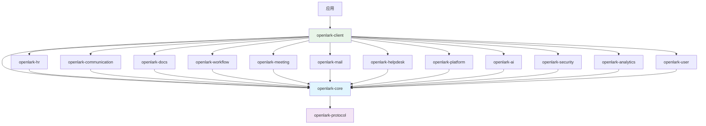

# Open-Lark 架构设计文档

## 项目概览

**Open-Lark** 是为飞书开放平台构建的高覆盖率 Rust SDK，提供对 1,688+ 个 API 的类型安全访问。本文档描述了重构后的模块化架构设计。

## 设计理念

### 核心原则

1. **业务领域驱动**: 按业务功能而非技术层次组织模块
2. **高内聚低耦合**: 相关功能聚合在同一crate中，减少跨模块依赖
3. **可扩展性**: 易于添加新的业务模块和功能
4. **开发者友好**: 符合飞书用户的业务思维模式
5. **类型安全**: 充分利用Rust的类型系统保证安全性

### 架构目标

- **模块化**: 12个主要业务模块，清晰的功能边界
- **可维护性**: 每个模块独立开发、测试和维护
- **性能**: 优化的编译时间和运行时性能
- **易用性**: 简洁直观的API设计

## 整体架构

```
┌─────────────────────────────────────────────────────────────────┐
│                        应用层 (Application Layer)                │
├─────────────────────────────────────────────────────────────────┤
│                        客户端层 (Client Layer)                   │
│                      openlark-client                            │
├─────────────────────────────────────────────────────────────────┤
│                        业务层 (Business Layer)                   │
│ ┌─────────────┬─────────────┬─────────────┬─────────────┐      │
│ │   HR模块     │  通讯协作    │   文档协作    │   任务审批    │      │
│ │openlark-hr  │communication│ openlark-docs│openlark-work│      │
│ │   (484 APIs)│  (153 APIs) │  (254 APIs) │ (134 APIs)  │      │
│ └─────────────┴─────────────┴─────────────┴─────────────┘      │
│ ┌─────────────┬─────────────┬─────────────┬─────────────┐      │
│ │   会议日程    │   邮件服务    │   帮助台     │   应用管理    │      │
│ │openlark-meet│ openlark-mail│openlark-help│openlark-plat│      │
│ │ ing (117 APIs)│  (67 APIs)  │ desk (50)   │ form (86)   │      │
│ └─────────────┴─────────────┴─────────────┴─────────────┘      │
│ ┌─────────────┬─────────────┬─────────────┬─────────────┐      │
│ │   AI智能     │   安全认证    │   数据分析    │   个人设置    │      │
│ │openlark-ai  │openlark-secu│openlark-ana│openlark-user│      │
│ │   (23 APIs) │ rity (44)   │ lytics (38) │  (21 APIs)  │      │
│ └─────────────┴─────────────┴─────────────┴─────────────┘      │
├─────────────────────────────────────────────────────────────────┤
│                       基础设施层 (Core Layer)                   │
│           openlark-core + openlark-protocol                     │
└─────────────────────────────────────────────────────────────────┘
```

## 模块详细设计

### 核心模块 (Core Modules)

#### 1. openlark-core
**职责**: 核心基础设施
- HTTP客户端和传输层
- 配置管理和环境处理
- 错误处理和日志系统
- 令牌自动管理
- WebSocket支持

**错误码对齐与优先级**
- 优先级：`飞书通用 code` > `HTTP status` > `内部业务码`（同一响应仅选一层）。  
- 核心映射：响应体含 `code` 时优先调用 `ErrorCode::from_feishu_code`；未命中再用 `status`；都缺省时使用内部业务码。  
- 观测：`log_id` 写入 `ErrorContext.request_id`，`feishu_code` 写入上下文 `feishu_code` 键，便于链路与告警。  
- 关键通用码（示例）：
  - 99991661：AccessToken 格式/内容无效  
  - 99991671：AccessToken 无效；99991677：AccessToken 过期  
  - 99991663/64：Tenant/App AccessToken 无效；99991670：SSO Token 无效  
  - 99991672：缺少权限；99991676：Token 权限不足  
  - 99991641/42/45：用户会话失效/不存在/超时  
  - 99991669：用户身份解析失败；99991674：用户类型不支持；99991675：身份不匹配  
  - 99992351/52/53：UserID/OpenID/UnionID 非法  
  - 429/5xx：HTTP 优先级次于通用码，用于回退。

#### 2. openlark-client
**职责**: 高级客户端封装
- LarkClient主客户端
- 服务注册和发现
- 异步接口抽象
- 构建器模式API

#### 3. openlark-protocol
**职责**: 协议定义
- WebSocket protobuf定义
- 消息协议和事件处理
- 数据序列化/反序列化

### 业务模块 (Business Modules)

#### HR人力管理模块 (openlark-hr)
**API数量**: 484个
**包含业务**:
- **hire** (182 APIs): 招聘管理、Offer处理、候选人管理
- **corehr** (144 APIs): 核心HR功能、员工管理
- **feishu_people** (105 APIs): 人员信息管理
- **attendance** (39 APIs): 考勤管理
- **payroll** (12 APIs): 薪酬管理
- **ehr** (2 APIs): 电子人力资源

**目录结构**:
```
openlark-hr/src/
├── hire/
│   ├── v1/
│   │   ├── mod.rs
│   │   ├── offer.rs
│   │   ├── candidate.rs
│   │   └── interview.rs
│   └── models/
│       ├── offer.rs
│       └── candidate.rs
├── corehr/
├── attendance/
├── payroll/
├── people/
└── lib.rs
```

#### 通讯协作模块 (openlark-communication)
**API数量**: 153个
**包含业务**:
- **contact** (77 APIs): 联系人管理、通讯录
- **im** (75 APIs): 即时消息、群聊管理
- **moments** (1 API): 动态圈功能

#### 文档协作模块 (openlark-docs)
**API数量**: 254个
**包含业务**:
- **ccm** (174 APIs): 云文档管理
- **base** (49 APIs): 基础服务
- **baike** (27 APIs): 知识库管理
- **minutes** (4 APIs): 会议纪要

#### 任务审批模块 (openlark-workflow)
**API数量**: 134个
**包含业务**:
- **task** (75 APIs): 任务管理
- **approval** (53 APIs): 审批流程
- **board** (6 APIs): 看板管理

#### 其他业务模块

| 模块 | API数量 | 主要功能 |
|------|---------|---------|
| openlark-meeting | 117 | 日历管理、视频会议、会议室 |
| openlark-mail | 67 | 邮件发送和管理 |
| openlark-helpdesk | 50 | 客服和工单系统 |
| openlark-platform | 86 | 应用平台和管理工具 |
| openlark-ai | 23 | AI服务和智能功能 |
| openlark-security | 44 | 认证、安全、合规 |
| openlark-analytics | 38 | 搜索、报表、目录服务 |
| openlark-user | 21 | 个人化设置和用户体验 |

## 依赖关系图



## Feature配置策略

### 功能分组原则

1. **核心功能**: security (认证和基础功能)
2. **默认功能**: communication + docs + security (最常用功能)
3. **完整功能**: 所有业务模块
4. **最小功能**: 仅核心基础设施

### Feature设计

```toml
[features]
# 默认配置 - Phase 1 核心模块
default = ["communication", "docs", "security"]

# 完整配置 - 所有业务功能
full = [
    "communication", "docs", "security", "workflow", "meeting",  # Phase 1
    "hr", "mail", "platform",                             # Phase 2
    "ai", "analytics", "helpdesk", "user"            # Phase 3
]

# 最小配置 - 仅核心基础设施
minimal = ["core", "security"]

# 业务模块独立功能
# Phase 1: 核心协作模块 (P0优先级)
communication = ["openlark-communication"]
docs = ["openlark-docs"]
security = ["openlark-security"]

# Phase 1: 业务流程模块 (P1优先级)
workflow = ["openlark-workflow"]
meeting = ["openlark-meeting"]

# Phase 2: 企业功能模块 (P2优先级)
hr = ["openlark-hr"]
mail = ["openlark-mail"]
platform = ["openlark-platform"]

# Phase 3: 扩展功能模块 (P3优先级)
ai = ["openlark-ai"]
analytics = ["openlark-analytics"]
helpdesk = ["openlark-helpdesk"]
user = ["openlark-user"]
```

## API设计模式

### 统一接口模式

```rust
// 每个业务模块都遵循统一的设计模式
pub struct ModuleService {
    pub config: Config,
}

impl ModuleService {
    pub fn new(config: Config) -> Self {
        Self { config }
    }

    // 按版本提供服务
    pub fn v1(&self) -> V1Service { /* ... */ }
    pub fn v2(&self) -> V2Service { /* ... */ }
    pub fn v3(&self) -> V3Service { /* ... */ }
}

// 版本化服务
impl V3Service {
    // 构建器模式
    pub fn user_create(&self) -> UserCreateBuilder { /* ... */ }
    pub fn message_send(&self) -> MessageSendBuilder { /* ... */ }
}

// 构建器模式
pub struct UserCreateBuilder {
    config: Config,
    request: UserCreateRequest,
}

impl UserCreateBuilder {
    pub fn name(mut self, name: impl Into<String>) -> Self {
        self.request.name = name.into();
        self
    }

    pub fn department_id(mut self, id: impl Into<String>) -> Self {
        self.request.department_id = id.into();
        self
    }

    pub async fn send(self) -> SDKResult<UserCreateResponse> {
        // 实现API调用
    }
}
```

### 错误处理

- 核心错误类型采用 `thiserror` 驱动的 **CoreErrorV3**，所有分类（网络、认证、API、验证、序列化、业务、超时、限流、服务不可用、内部错误）都携带 `ErrorCode` 与 `ErrorContext`，保持单一信息源。
- 观测统一：通过 `ErrorRecord::from(&CoreErrorV3)` 序列化到日志/指标，包含 severity / retryable / request_id / context。
- 便利层：`convenience_v3::*` 提供轻量工厂（如 `api_error_v3(status, endpoint, msg, request_id)`、`validation_error_v3(field, msg)`）。旧入口 `convenience::*` 只是对 V3 的薄包装，后续可删除。
- API 返回建议：`pub type SDKResult<T> = Result<T, CoreErrorV3>;`——调用侧可直接匹配枚举变体或使用 `ErrorTrait` 判别（`is_api_error / is_retryable`）。

```rust
use openlark_core::error::{
    CoreErrorV3, ErrorRecord, ErrorTrait, ErrorCode,
    convenience_v3::{api_error_v3, validation_error_v3},
};

// 在传输层创建错误
fn to_error(status: u16, endpoint: &str, body: &str) -> CoreErrorV3 {
    api_error_v3(status, endpoint, format!("resp={body}"), None)
}

// 在业务层校验
fn validate_email(email: &str) -> Result<(), CoreErrorV3> {
    if !email.contains('@') {
        return Err(validation_error_v3("email", "邮箱格式不合法"));
    }
    Ok(())
}

// 观测导出
let err = to_error(503, "/ping", "down");
let record: ErrorRecord = (&err).into();
assert!(err.is_retryable());
assert_eq!(record.code, ErrorCode::ServiceUnavailable);
```

## 编译优化策略

### 条件编译

```rust
#[cfg(feature = "hr")]
pub mod hr;

#[cfg(feature = "communication")]
pub mod communication;

// 客户端中的条件注册
#[cfg(feature = "hr")]
fn register_hr_services(client: &mut LarkClient) {
    client.register_service("hr", HRService::new(client.config.clone()));
}
```

### 依赖优化

- 最小化外部依赖
- 使用特性标志控制编译大小
- 延迟编译大型模块

## 测试策略

### 分层测试

1. **单元测试**: 每个crate独立测试
2. **集成测试**: 跨模块功能测试
3. **端到端测试**: 完整业务流程测试
4. **性能测试**: 关键API性能验证

### 测试组织

```
crates/
├── openlark-hr/
│   ├── src/
│   └── tests/
│       ├── unit/
│       ├── integration/
│       └── e2e/
└── tests/
    ├── feature_combinations/
    └── compatibility/
```

## 部署和发布

### 语义化版本

- **主版本**: 破坏性变更
- **次版本**: 新功能添加
- **修订版本**: Bug修复和文档更新

### 发布流程

1. **自动化测试**: 所有测试通过
2. **代码审查**: 质量门禁检查
3. **文档更新**: API文档和示例更新
4. **发布包**: 发布到crates.io

## 未来扩展

### 扩展点

1. **新业务模块**: 按现有模式添加新crate
2. **功能增强**: 在现有模块中添加新API
3. **性能优化**: 基于使用数据进行优化
4. **生态集成**: 与其他工具和平台集成

### 架构演进

- 支持更多飞书服务
- 优化编译时间和二进制大小
- 增强开发者体验
- 提供更多高级功能

---

本文档将随着项目发展持续更新，确保架构设计始终与项目目标保持一致。
