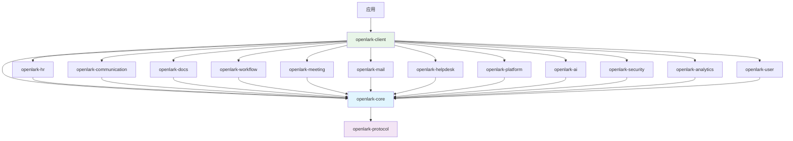

# Open-Lark 架构设计文档

## 项目概览

**Open-Lark** 是为飞书开放平台构建的高覆盖率 Rust SDK，提供对 1,688+ 个 API 的类型安全访问。本文档描述了重构后的模块化架构设计。

## 设计理念

### 核心原则

1. **业务领域驱动**: 按业务功能而非技术层次组织模块
2. **高内聚低耦合**: 相关功能聚合在同一crate中，减少跨模块依赖
3. **可扩展性**: 易于添加新的业务模块和功能
4. **开发者友好**: 符合飞书用户的业务思维模式
5. **类型安全**: 充分利用Rust的类型系统保证安全性

### 📋 重要说明

**本文档中的代码示例性质**：
- 文档中所有代码示例均基于当前架构设计的**概念性实现**
- 部分API调用方法可能需要根据实际开发进度进行调整
- 示例代码主要用于说明架构设计模式和最佳实践
- 实际使用时请参考对应模块的最新API文档和实现
- 建议结合实际代码库中的示例和测试用例进行开发

### 架构目标

- **模块化**: 12个主要业务模块，清晰的功能边界
- **可维护性**: 每个模块独立开发、测试和维护
- **性能**: 优化的编译时间和运行时性能
- **易用性**: 简洁直观的API设计

## 整体架构

```
┌─────────────────────────────────────────────────────────────────┐
│                        应用层 (Application Layer)                │
├─────────────────────────────────────────────────────────────────┤
│                        客户端层 (Client Layer)                   │
│                      openlark-client                            │
├─────────────────────────────────────────────────────────────────┤
│                        业务层 (Business Layer)                   │
│ ┌─────────────┬─────────────┬─────────────┬─────────────┐      │
│ │   HR模块     │  通讯协作    │   文档协作    │   任务审批    │      │
│ │openlark-hr  │communication│ openlark-docs│openlark-work│      │
│ │   (484 APIs)│  (153 APIs) │  (254 APIs) │ (134 APIs)  │      │
│ └─────────────┴─────────────┴─────────────┴─────────────┘      │
│ ┌─────────────┬─────────────┬─────────────┬─────────────┐      │
│ │   会议日程    │   邮件服务    │   帮助台     │   应用管理    │      │
│ │openlark-meet│ openlark-mail│openlark-help│openlark-plat│      │
│ │ ing (117 APIs)│  (67 APIs)  │ desk (50)   │ form (86)   │      │
│ └─────────────┴─────────────┴─────────────┴─────────────┘      │
│ ┌─────────────┬─────────────┬─────────────┬─────────────┐      │
│ │   AI智能     │   安全认证    │   数据分析    │   个人设置    │      │
│ │openlark-ai  │openlark-secu│openlark-ana│openlark-user│      │
│ │   (23 APIs) │ rity (44)   │ lytics (38) │  (21 APIs)  │      │
│ └─────────────┴─────────────┴─────────────┴─────────────┘      │
├─────────────────────────────────────────────────────────────────┤
│                       基础设施层 (Core Layer)                   │
│           openlark-core + openlark-protocol                     │
└─────────────────────────────────────────────────────────────────┘
```

## 模块详细设计

### 核心模块 (Core Modules)

#### 1. openlark-core
**职责**: 核心基础设施
- HTTP客户端和传输层
- 配置管理和环境处理
- 错误处理和日志系统
- 令牌自动管理
- WebSocket支持

**错误码对齐与优先级**
- 优先级：`飞书通用 code` > `HTTP status` > `内部业务码`（同一响应仅选一层）。  
- 核心映射：响应体含 `code` 时优先调用 `ErrorCode::from_feishu_code`；未命中再用 `status`；都缺省时使用内部业务码。  
- 观测：`log_id` 写入 `ErrorContext.request_id`，`feishu_code` 写入上下文 `feishu_code` 键，便于链路与告警。  
- 关键通用码（示例）：
  - 99991661：AccessToken 格式/内容无效  
  - 99991671：AccessToken 无效；99991677：AccessToken 过期  
  - 99991663/64：Tenant/App AccessToken 无效；99991670：SSO Token 无效  
  - 99991672：缺少权限；99991676：Token 权限不足  
  - 99991641/42/45：用户会话失效/不存在/超时  
  - 99991669：用户身份解析失败；99991674：用户类型不支持；99991675：身份不匹配  
  - 99992351/52/53：UserID/OpenID/UnionID 非法  
  - 429/5xx：HTTP 优先级次于通用码，用于回退。

#### 2. openlark-client
**职责**: 高级客户端封装
- LarkClient主客户端
- 服务注册和发现
- 异步接口抽象
- 构建器模式API

#### 3. openlark-protocol
**职责**: 协议定义
- WebSocket protobuf定义
- 消息协议和事件处理
- 数据序列化/反序列化

### 业务模块 (Business Modules)

#### HR人力管理模块 (openlark-hr)
**API数量**: 484个
**包含业务**:
- **hire** (182 APIs): 招聘管理、Offer处理、候选人管理
- **corehr** (144 APIs): 核心HR功能、员工管理
- **feishu_people** (105 APIs): 人员信息管理
- **attendance** (39 APIs): 考勤管理
- **payroll** (12 APIs): 薪酬管理
- **ehr** (2 APIs): 电子人力资源

**目录结构**:
```
openlark-hr/src/
├── hire/
│   ├── v1/
│   │   ├── mod.rs
│   │   ├── offer.rs
│   │   ├── candidate.rs
│   │   └── interview.rs
│   └── models/
│       ├── offer.rs
│       └── candidate.rs
├── corehr/
├── attendance/
├── payroll/
├── people/
└── lib.rs
```

#### 通讯协作模块 (openlark-communication)
**API数量**: 153个
**包含业务**:
- **contact** (77 APIs): 联系人管理、通讯录
- **im** (75 APIs): 即时消息、群聊管理
- **moments** (1 API): 动态圈功能

#### 文档协作模块 (openlark-docs)
**API数量**: 254个
**包含业务**:
- **ccm** (174 APIs): 云文档管理
- **base** (49 APIs): 基础服务
- **baike** (27 APIs): 知识库管理
- **minutes** (4 APIs): 会议纪要

#### 任务审批模块 (openlark-workflow)
**API数量**: 134个
**包含业务**:
- **task** (75 APIs): 任务管理
- **approval** (53 APIs): 审批流程
- **board** (6 APIs): 看板管理

#### 其他业务模块

| 模块 | API数量 | 主要功能 |
|------|---------|---------|
| openlark-meeting | 117 | 日历管理、视频会议、会议室 |
| openlark-mail | 67 | 邮件发送和管理 |
| openlark-helpdesk | 50 | 客服和工单系统 |
| openlark-platform | 86 | 应用平台和管理工具 |
| openlark-ai | 23 | AI服务和智能功能 |
| openlark-security | 44 | 认证、安全、合规 |
| openlark-analytics | 38 | 搜索、报表、目录服务 |
| openlark-user | 21 | 个人化设置和用户体验 |

## 依赖关系图



## openlark-client 服务层重构方案（crates/openlark-client/src/services）

### 重构目标
- 消除重复：统一 `services/` 与 `registry/` 的能力，避免双重工厂/注册逻辑。
- 显式依赖：服务之间的依赖关系由拓扑图驱动，阻断隐式耦合。
- 生命周期可观测：标准化 init → ready → running → stopped 状态，暴露健康检查与统计。
- 可插拔：支持业务团队按需注册自定义服务或第三方实现，保持特性裁剪能力。
- 配置收敛：全局 `Config` + 按服务覆盖（超时、重试、base_url、鉴权策略）。

### 目标目录结构
```
crates/openlark-client/src/services/
├── mod.rs                # Facade 与预导出
├── service.rs            # Service / ServiceKind / Health / Lifecycle traits
├── context.rs            # ServiceContext：Config、HTTP client、token provider、tracing
├── graph.rs              # 依赖图 & 拓扑排序，包装 registry::DependencyResolver
├── registry.rs           # TypedServiceRegistry，屏蔽 Any/Downcast
├── loader.rs             # 按 feature 注册 provider；支持动态插件
├── runtime.rs            # ServiceRuntime：init/start/stop/health 路径
├── middleware/           # 横切：重试、限流、metrics、logging
└── providers/            # 领域服务实现，按特性裁剪
    ├── auth.rs
    ├── communication.rs
    ├── docs.rs
    ├── hr.rs
    ├── ...
```

### 核心接口（草案）
```rust
pub trait Service: Send + Sync + 'static {
    fn kind(&self) -> ServiceKind;              // name + version
    fn capabilities(&self) -> &'static [&'static str];
    fn dependencies(&self) -> &'static [&'static str];
    async fn init(&self, ctx: &ServiceContext) -> SDKResult<()>;
    async fn start(&self, ctx: &ServiceContext) -> SDKResult<()>; // 连接池、预热
    async fn stop(&self) -> SDKResult<()>;                       // 清理资源
    fn health(&self) -> ServiceHealth;                           // ready / degraded
}

pub struct ServiceContext {
    pub config: Config,
    pub http: Arc<dyn HttpClient>,
    pub token: Arc<dyn TokenProvider>,
    pub tracer: Arc<dyn TracingExporter>,
    pub metrics: Arc<dyn MetricsSink>,
}
```

### 生命周期与依赖解算
1. `loader` 按 feature 收集 `ServiceProvider` 列表。
2. `graph` 将 `dependencies()` 构建成 DAG，循环依赖在启动前 fail fast。
3. `runtime` 按拓扑序调用 `init → start`，失败将状态标记为 `Error(reason)` 并可重试。
4. `registry` 维护 `ServiceHandle<T>`，暴露类型安全访问与健康查询，替换 `Box<dyn Any>`。

### 配置与横切关注点
- `ServiceConfig` 支持局部覆盖：`timeout`, `retry_policy`, `base_url`, `auth_strategy`。
- `middleware/` 提供可插拔的重试、限流、日志、指标；通过 `ServiceContext` 注入。
- 观测统一：所有 `Service` 方法返回 `CoreError`，自动附带 `component=service::<name>` 上下文。

### 渐进式迁移路径
1. 引入 `service.rs` 与 `context.rs` 基础抽象，`AuthService` 先落地为示例。
2. 将 `ServiceFactory` 迁移到 `runtime` + `registry`，保留旧 API 但内部委托新实现。
3. 逐个业务模块接入：communication → docs → hr → ...，每步补齐健康检查与配置覆盖。
4. 删除遗留的 `services/mod.rs` 构造函数分支，转为 `loader` 自动注册。
5. 更新集成测试，增加“服务图完整性”“生命周期幂等”两个维度的测试用例。

### 预期收益
- 代码可维护性：服务添加/删除仅需实现 `Service` + 注册，不再改动大工厂。
- 运行稳定性：显式依赖 + 生命周期管理降低初始化竞态。
- 可观测性：统一健康与指标输出，便于运维排障。
- 生态扩展：第三方/实验性服务可独立发布，不污染核心依赖树。

## Feature配置策略

### 功能分组原则

1. **核心功能**: security (认证和基础功能)
2. **默认功能**: communication + docs + security (最常用功能)
3. **完整功能**: 所有业务模块
4. **最小功能**: 仅核心基础设施

### Feature设计

```toml
[features]
# 默认配置 - Phase 1 核心模块
default = ["communication", "docs", "security"]

# 完整配置 - 所有业务功能
full = [
    "communication", "docs", "security", "workflow", "meeting",  # Phase 1
    "hr", "mail", "platform",                             # Phase 2
    "ai", "analytics", "helpdesk", "user"            # Phase 3
]

# 最小配置 - 仅核心基础设施
minimal = ["core", "security"]

# 业务模块独立功能
# Phase 1: 核心协作模块 (P0优先级)
communication = ["openlark-communication"]
docs = ["openlark-docs"]
security = ["openlark-security"]

# Phase 1: 业务流程模块 (P1优先级)
workflow = ["openlark-workflow"]
meeting = ["openlark-meeting"]

# Phase 2: 企业功能模块 (P2优先级)
hr = ["openlark-hr"]
mail = ["openlark-mail"]
platform = ["openlark-platform"]

# Phase 3: 扩展功能模块 (P3优先级)
ai = ["openlark-ai"]
analytics = ["openlark-analytics"]
helpdesk = ["openlark-helpdesk"]
user = ["openlark-user"]
```

## API设计模式

### 6.1 客户端架构模式

#### 6.1.1 ClientBuilder构建器模式

OpenLark采用现代化的ClientBuilder模式，提供流畅的API和类型安全的配置：

```rust
use openlark_client::Client;
use std::time::Duration;

// 🔥 从环境变量创建客户端（推荐）
let client = Client::from_env()?;

// 🏗️ 使用构建器模式创建客户端
let client = Client::builder()
    .app_id("your_app_id")
    .app_secret("your_app_secret")
    .base_url("https://open.feishu.cn")
    .timeout(Duration::from_secs(30))
    .retry_count(3)
    .enable_log(true)
    .build()?;

// ✅ 验证客户端配置
assert!(client.is_configured());
```

**ClientBuilder核心实现**：
```rust
#[derive(Debug, Clone)]
pub struct ClientBuilder {
    config: Config,
}

impl ClientBuilder {
    pub fn new() -> Self { /* ... */ }
    pub fn app_id<S: Into<String>>(mut self, app_id: S) -> Self { /* ... */ }
    pub fn app_secret<S: Into<String>>(mut self, app_secret: S) -> Self { /* ... */ }
    pub fn base_url<S: Into<String>>(mut self, base_url: S) -> Self { /* ... */ }
    pub fn timeout(mut self, timeout: Duration) -> Self { /* ... */ }
    pub fn from_env(mut self) -> Self { /* ... */ }
    pub fn build(self) -> Result<Client> { /* ... */ }
}
```

#### 6.1.2 服务注册与发现机制

客户端采用服务注册表模式，支持动态服务发现和依赖管理：

```rust
// 服务注册表结构
pub struct Client {
    config: Arc<Config>,
    registry: Arc<DefaultServiceRegistry>,
}

impl Client {
    // 🔐 访问认证服务（需要 auth feature）
    #[cfg(feature = "auth")]
    pub fn auth(&self) -> crate::services::AuthService {
        crate::services::AuthService::new(&self.config)
    }

    // 📡 访问通讯服务（需要 communication feature）
    #[cfg(feature = "communication")]
    pub fn communication(&self) -> Result<crate::services::CommunicationService<'_>> {
        crate::services::CommunicationService::new(&self.config, &self.registry)
    }

    // 📄 访问文档服务（需要 docs feature）
    #[cfg(feature = "docs")]
    pub fn docs(&self) -> crate::services::DocsService<'_> {
        crate::services::DocsService::new(&self.config)
    }

    // 📊 访问多维表格服务（需要 bitable feature）
    #[cfg(feature = "docs")]
    pub fn bitable(&self) -> &'static str {
        "BitableService 尚未实现"
    }
}
```

#### 6.1.3 服务生命周期管理

服务采用分层注册机制，按优先级和依赖关系管理：

```rust
// 分层服务注册
fn load_enabled_services(config: &Config, registry: &mut DefaultServiceRegistry) -> Result<()> {
    // 核心层服务（优先级1-2）
    register_core_services(config, registry)?;

    // 专业层服务（优先级3-4）
    register_professional_services(config, registry)?;

    // 企业层服务（优先级5-6）
    register_enterprise_services(config, registry)?;
}

// 服务元数据管理
let metadata = ServiceMetadata {
    name: "communication".to_string(),
    version: "1.0.0".to_string(),
    description: Some("飞书通讯服务，提供消息、联系人、群组等功能".to_string()),
    dependencies: vec!["auth".to_string()],
    provides: vec!["im".to_string(), "contacts".to_string()],
    status: ServiceStatus::Uninitialized,
    priority: 2,
};
```

#### 6.1.4 功能标志和依赖解析

支持编译时功能标志和运行时依赖解析：

```rust
// 编译时功能控制
#[cfg(feature = "communication")]
pub fn communication(&self) -> Result<CommunicationService<'_>> {
    CommunicationService::new(&self.config, &self.registry)
}

// 依赖关系定义
impl CommunicationService {
    pub fn dependencies() -> &'static [&'static str] {
        &["auth"]  // 依赖认证服务
    }
}
```

### 6.2 请求构建模式

#### 6.2.1 UnifiedRequestBuilder统一构建器

核心层提供统一的请求构建器，协调认证、头部、文件处理等功能：

```rust
use openlark_core::{api::ApiRequest, request_builder::UnifiedRequestBuilder};
use openlark_core::{constants::AccessTokenType, req_option::RequestOption};

// 创建API请求
let mut request = ApiRequest::post("https://open.feishu.cn/open-apis/im/v1/messages")
    .header("X-Custom-Header", "custom-value")
    .query("page_size", "20")
    .query("page_token", "next_page_token")
    .body(serde_json::json!({
        "receive_id": "user_open_id",
        "content": "{\"text\":\"Hello World\"}",
        "msg_type": "text"
    }));

// 构建HTTP请求
let reqwest_request = UnifiedRequestBuilder::build(
    &mut request,
    AccessTokenType::User,
    &config,
    &request_option
).await?;
```

**UnifiedRequestBuilder核心实现**：
```rust
pub struct UnifiedRequestBuilder;

impl UnifiedRequestBuilder {
    pub async fn build<'a, R: Send>(
        req: &'a mut ApiRequest<R>,
        access_token_type: AccessTokenType,
        config: &'a Config,
        option: &'a RequestOption,
    ) -> Result<RequestBuilder, LarkAPIError> {
        // 1. 构建基础URL
        let url = Self::build_url(config, req)?;
        let mut req_builder = config.http_client.request(reqwest_method, url);

        // 2. 构建请求头
        req_builder = HeaderBuilder::build_headers(req_builder, config, option);

        // 3. 处理认证
        req_builder = AuthHandler::apply_auth(req_builder, access_token_type, config, option).await?;

        // 4. 处理请求体和文件
        if !req.file().is_empty() {
            req_builder = MultipartBuilder::build_multipart(/* ... */)?;
        } else if let Some(body_data) = &req.body {
            // 处理JSON/二进制数据
        }

        Ok(req_builder)
    }
}
```

#### 6.2.2 认证处理机制

支持多种令牌类型和自动认证处理：

```rust
// 认证处理器
pub struct AuthHandler;

impl AuthHandler {
    pub async fn apply_auth(
        req_builder: RequestBuilder,
        token_type: AccessTokenType,
        config: &Config,
        option: &RequestOption,
    ) -> Result<RequestBuilder, LarkAPIError> {
        match token_type {
            AccessTokenType::User => {
                if let Some(token) = &option.user_access_token {
                    Ok(req_builder.header("Authorization", format!("Bearer {}", token)))
                } else {
                    // 自动获取用户令牌
                    Self::get_user_access_token(config).await
                }
            },
            AccessTokenType::App => {
                // 应用级令牌处理
                Self::get_app_access_token(config).await
            },
            AccessTokenType::Tenant => {
                // 租户级令牌处理
                Self::get_tenant_access_token(config).await
            },
            AccessTokenType::None => Ok(req_builder),
        }
    }
}
```

#### 6.2.3 头部和查询参数管理

统一的头部构建和参数处理：

```rust
// 头部构建器
pub struct HeaderBuilder;

impl HeaderBuilder {
    pub fn build_headers(
        mut req_builder: RequestBuilder,
        config: &Config,
        option: &RequestOption,
    ) -> RequestBuilder {
        // 基础头部
        req_builder = req_builder
            .header("Content-Type", "application/json")
            .header("Accept", "application/json");

        // 请求ID追踪
        if let Some(request_id) = &option.request_id {
            req_builder = req_builder.header("X-Request-ID", request_id);
        }

        // 自定义头部
        for (key, value) in &option.header {
            req_builder = req_builder.header(key, value);
        }

        req_builder
    }
}
```

#### 6.2.4 文件上传和multipart处理

支持文件上传和复合表单数据处理：

```rust
// Multipart构建器
pub struct MultipartBuilder;

impl MultipartBuilder {
    pub fn build_multipart(
        req_builder: RequestBuilder,
        body_data: &[u8],
        files: &[FileInfo],
    ) -> Result<RequestBuilder, LarkAPIError> {
        let form = reqwest::multipart::Form::new()
            .part("data", reqwest::multipart::Part::bytes(body_data.to_vec()));

        // 添加文件
        for file in files {
            let file_part = reqwest::multipart::Part::bytes(file.content.clone())
                .file_name(file.name.clone())
                .mime_str(&file.mime_type)?;
            form.part(file.field_name.clone(), file_part);
        }

        Ok(req_builder.multipart(form))
    }
}
```

### 6.3 响应处理模式

#### 6.3.1 统一响应结构

类型安全的响应处理系统：

```rust
use openlark_core::api::{Response, RawResponse};

// 原始响应结构
#[derive(Debug, Clone, Serialize, Deserialize)]
pub struct RawResponse {
    pub code: i32,
    pub msg: String,
    pub request_id: Option<String>,
    pub data: Option<serde_json::Value>,
    pub error: Option<ErrorInfo>,
}

// 类型安全包装
#[derive(Debug, Clone, Serialize, Deserialize)]
pub struct Response<T> {
    pub data: Option<T>,
    pub raw_response: RawResponse,
}

impl<T> Response<T> {
    // 创建成功响应
    pub fn success(data: T) -> Self {
        Self {
            data: Some(data),
            raw_response: RawResponse::success(),
        }
    }

    // 转换为结果类型
    pub fn into_result(self) -> Result<T, LarkAPIError> {
        if self.raw_response.is_success() {
            match self.data {
                Some(data) => Ok(data),
                None => Err(api_error(0, "response", "响应数据为空", self.raw_response.request_id)),
            }
        } else {
            Err(api_error(
                self.raw_response.code as u16,
                "response",
                self.raw_response.msg,
                self.raw_response.request_id,
            ))
        }
    }
}
```

#### 6.3.2 类型安全转换

强类型的API响应处理：

```rust
// API响应特征
pub trait ApiResponseTrait: Send + Sync + 'static {
    fn data_format() -> ResponseFormat { ResponseFormat::Data }
}

// 具体响应类型
#[derive(Debug, Clone, Serialize, Deserialize)]
pub struct MessageSendResponse {
    pub message_id: String,
    pub create_time: String,
}

impl ApiResponseTrait for MessageSendResponse {}

// 使用示例
let response: Response<MessageSendResponse> = transport.send(request).await?;
match response.into_result() {
    Ok(data) => {
        println!("消息发送成功: {}", data.message_id);
        println!("创建时间: {}", data.create_time);
    },
    Err(error) => {
        eprintln!("发送失败: {}", error.user_friendly_message());
    }
}
```

#### 6.3.3 错误处理和映射

自动错误转换和用户友好消息：

```rust
// 错误信息结构
#[derive(Debug, Clone, Serialize, Deserialize)]
pub struct ErrorInfo {
    pub code: i32,
    pub message: String,
    pub details: Option<HashMap<String, serde_json::Value>>,
}

// 用户友好的错误处理
impl LarkAPIError {
    pub fn user_friendly_message(&self) -> String {
        match self {
            LarkAPIError::TokenExpired => "登录已过期，请重新登录".to_string(),
            LarkAPIError::NetworkError(e) => format!("网络连接失败: {}", e),
            LarkAPIError::RateLimit { retry_after, .. } => {
                if let Some(retry_after) = retry_after {
                    format!("请求过于频繁，请在{}秒后重试", retry_after.as_secs())
                } else {
                    "请求过于频繁，请稍后重试".to_string()
                }
            },
            LarkAPIError::ValidationError { field, message, .. } => {
                format!("参数验证失败: {} - {}", field, message)
            },
            other => format!("操作失败: {}", other),
        }
    }
}
```

#### 6.3.4 响应格式支持

支持多种响应数据格式：

```rust
// 响应格式枚举
#[derive(Debug, Clone, Copy, PartialEq, Eq, Serialize, Deserialize)]
pub enum ResponseFormat {
    #[serde(rename = "data")]
    Data,      // 标准数据格式
    #[serde(rename = "flatten")]
    Flatten,   // 扁平格式
    #[serde(rename = "binary")]
    Binary,    // 二进制数据
    #[serde(rename = "text")]
    Text,      // 文本数据
    #[serde(rename = "custom")]
    Custom,    // 自定义格式
}

// 为不同类型实现响应特征
impl ApiResponseTrait for serde_json::Value {}
impl ApiResponseTrait for String {}
impl ApiResponseTrait for Vec<u8> {}
impl ApiResponseTrait for () {}
```

### 6.4 服务访问模式

#### 6.4.1 类型安全的服务访问

编译时类型检查和功能标志控制：

```rust
// 服务访问模式
use openlark_client::Client;

#[tokio::main]
async fn main() -> Result<()> {
    let client = Client::from_env()?;

    // 类型安全的服务访问（编译时检查）
    #[cfg(feature = "communication")]
    {
        let communication = client.communication()?;
        let result = communication.send_text("user_open_id", "open_id", "Hello!")
            .await?;
        println!("消息发送成功: {}", result.message_id);
    }

    #[cfg(feature = "docs")]
    {
        let docs = client.docs();
        let spreadsheet = docs.sheets.v2.spreadsheets.get("sheet_token")
            .execute()
            .await?;
        println!("表格标题: {}", spreadsheet.title);
    }

    Ok(())
}
```

#### 6.4.2 异步API调用模式

完全异步的API调用和错误处理：

```rust
// 异步服务操作
impl CommunicationService<'_> {
    pub async fn send_text(
        &self,
        receive_id: &str,
        receive_id_type: &str,
        content: &str,
    ) -> SDKResult<MessageSendResponse> {
        let request = self.im.v1.message.create()
            .receive_id(receive_id.to_string())
            .receive_id_type(receive_id_type.to_string())
            .content(format!(r#"{{"text":"{}"}}"#, content))
            .msg_type("text".to_string());

        request.send().await
    }
}

// 异步错误处理
pub async fn robust_message_send(
    client: &Client,
    user_id: &str,
    message: &str,
) -> SDKResult<()> {
    let mut attempts = 0;
    let max_attempts = 3;

    loop {
        attempts += 1;
        match client.communication()?.send_text(user_id, "open_id", message).await {
            Ok(response) => {
                println!("消息发送成功: {}", response.message_id);
                break Ok(());
            },
            Err(error) if error.is_retryable() && attempts < max_attempts => {
                eprintln!("发送失败，重试中... ({}次)", attempts);
                tokio::time::sleep(Duration::from_secs(2_u64.pow(attempts))).await;
            },
            Err(error) => break Err(error),
        }
    }
}
```

#### 6.4.3 批量操作支持

高效的批量API操作：

```rust
// 批量消息发送
impl CommunicationService<'_> {
    pub async fn batch_send_text(
        &self,
        messages: Vec<(String, String)>, // (user_id, content)
    ) -> SDKResult<Vec<SDKResult<MessageSendResponse>>> {
        let mut tasks = Vec::new();

        for (user_id, content) in messages {
            let service = self.clone();
            let task = tokio::spawn(async move {
                service.send_text(&user_id, "open_id", &content).await
            });
            tasks.push(task);
        }

        let mut results = Vec::new();
        for task in tasks {
            results.push(task.await?);
        }

        Ok(results)
    }
}

// 使用示例
let messages = vec![
    ("user1".to_string(), "Hello User 1".to_string()),
    ("user2".to_string(), "Hello User 2".to_string()),
    ("user3".to_string(), "Hello User 3".to_string()),
];

let results = client.communication()?.batch_send_text(messages).await?;
for (i, result) in results.into_iter().enumerate() {
    match result {
        Ok(response) => println!("消息{}发送成功: {}", i+1, response.message_id),
        Err(error) => eprintln!("消息{}发送失败: {}", i+1, error.user_friendly_message()),
    }
}
```

#### 6.4.4 中间件和拦截器支持

请求/响应中间件机制：

```rust
// 中间件特征
#[async_trait]
pub trait Middleware: Send + Sync {
    async fn before_request(&self, request: &mut dyn ApiRequest) -> SDKResult<()>;
    async fn after_response(&self, response: &dyn ApiResponse) -> SDKResult<()>;
    async fn on_error(&self, error: &LarkAPIError) -> SDKResult<bool>; // 是否已处理
}

// 日志中间件
pub struct LoggingMiddleware;

#[async_trait]
impl Middleware for LoggingMiddleware {
    async fn before_request(&self, request: &mut dyn ApiRequest) -> SDKResult<()> {
        tracing::info!("发送请求: {} {}", request.method(), request.endpoint());
        Ok(())
    }

    async fn after_response(&self, response: &dyn ApiResponse) -> SDKResult<()> {
        tracing::info!("收到响应: {}", response.status_code());
        Ok(())
    }

    async fn on_error(&self, error: &LarkAPIError) -> SDKResult<bool> {
        tracing::error!("请求错误: {}", error.user_friendly_message());
        Ok(false) // 未处理，继续传播错误
    }
}

// 重试中间件
pub struct RetryMiddleware {
    max_attempts: u32,
    base_delay: Duration,
}

#[async_trait]
impl Middleware for RetryMiddleware {
    async fn before_request(&self, request: &mut dyn ApiRequest) -> SDKResult<()> {
        request.set_metadata("retry_attempts", 0);
        request.set_metadata("max_attempts", self.max_attempts);
        Ok(())
    }

    async fn on_error(&self, error: &LarkAPIError) -> SDKResult<bool> {
        if error.is_retryable() {
            // 重试逻辑在传输层处理
            Ok(false)
        } else {
            Ok(false)
        }
    }
}
```

## Client架构设计

### 7.1 ClientBuilder构建器

#### 7.1.1 构建器模式实现

OpenLark的ClientBuilder采用流畅API设计，提供类型安全和配置验证：

```rust
use openlark_client::{Client, Config, Result};
use std::time::Duration;

// 🔥 快速创建 - 从环境变量
let client = Client::from_env()?;

// 🏗️ 标准构建器模式
let client = Client::builder()
    .app_id("your_app_id")
    .app_secret("your_app_secret")
    .base_url("https://open.feishu.cn")
    .timeout(Duration::from_secs(30))
    .retry_count(3)
    .enable_log(true)
    .build()?;

// 🌙 异步构建器
let client = client::AsyncClient::builder()
    .app_id("your_app_id")
    .app_secret("your_app_secret")
    .build()
    .await?;
```

**ClientBuilder详细实现**：
```rust
#[derive(Debug, Clone)]
pub struct ClientBuilder {
    config: Config,
}

impl ClientBuilder {
    /// 创建新的构建器实例
    pub fn new() -> Self {
        Self {
            config: Config::default(),
        }
    }

    /// 设置应用ID
    pub fn app_id<S: Into<String>>(mut self, app_id: S) -> Self {
        self.config.app_id = app_id.into();
        self
    }

    /// 设置应用密钥
    pub fn app_secret<S: Into<String>>(mut self, app_secret: S) -> Self {
        self.config.app_secret = app_secret.into();
        self
    }

    /// 设置基础URL
    pub fn base_url<S: Into<String>>(mut self, base_url: S) -> Self {
        self.config.base_url = base_url.into();
        self
    }

    /// 设置请求超时时间
    pub fn timeout(mut self, timeout: Duration) -> Self {
        self.config.timeout = timeout;
        self
    }

    /// 设置重试次数
    pub fn retry_count(mut self, retry_count: u32) -> Self {
        self.config.retry_count = retry_count;
        self
    }

    /// 启用或禁用日志
    pub fn enable_log(mut self, enable: bool) -> Self {
        self.config.enable_log = enable;
        self
    }

    /// 从环境变量加载配置
    pub fn from_env(mut self) -> Self {
        self.config.load_from_env();
        self
    }

    /// 构建客户端实例
    pub fn build(self) -> Result<Client> {
        let result = Client::with_config(self.config);
        if let Err(ref error) = result {
            tracing::error!(
                "客户端构建失败: {}",
                error.user_message().unwrap_or("未知错误")
            );
        }
        result
    }
}
```

#### 7.1.2 配置验证和环境加载

配置系统提供多级验证和自动环境加载：

```rust
// 配置验证器
impl Config {
    pub fn validate(&self) -> Result<()> {
        if self.app_id.is_empty() {
            return Err(validation_error("app_id", "应用ID不能为空"));
        }
        if self.app_secret.is_empty() {
            return Err(validation_error("app_secret", "应用密钥不能为空"));
        }
        if !self.base_url.starts_with("http") {
            return Err(validation_error("base_url", "基础URL格式无效"));
        }
        Ok(())
    }
}

// 环境变量加载
impl Config {
    pub fn load_from_env(&mut self) {
        if let Ok(app_id) = std::env::var("OPENLARK_APP_ID") {
            self.app_id = app_id;
        }
        if let Ok(app_secret) = std::env::var("OPENLARK_APP_SECRET") {
            self.app_secret = app_secret;
        }
        if let Ok(base_url) = std::env::var("OPENLARK_BASE_URL") {
            self.base_url = base_url;
        }
        // 更多环境变量...
    }
}
```

#### 7.1.3 功能标志控制

编译时功能标志控制服务可用性：

```rust
// 功能标志检查宏
macro_rules! require_feature {
    ($feature:literal, $service:literal) => {
        if !cfg!(feature = $feature) {
            compile_error!(concat!(
                "启用 ", $service, " 服务需要启用 '",
                $feature, "' feature"
            ));
        }
    };
}

// 服务访问器
impl Client {
    #[cfg(feature = "communication")]
    pub fn communication(&self) -> Result<CommunicationService<'_>> {
        require_feature!("communication", "通讯");
        CommunicationService::new(&self.config, &self.registry)
    }

    #[cfg(feature = "docs")]
    pub fn docs(&self) -> DocsService<'_> {
        require_feature!("docs", "文档");
        DocsService::new(&self.config)
    }

    #[cfg(feature = "auth")]
    pub fn auth(&self) -> AuthService {
        require_feature!("auth", "认证");
        AuthService::new(&self.config)
    }
}
```

#### 7.1.4 错误处理和上下文管理

Client提供统一的错误上下文管理：

```rust
// 错误上下文处理
impl Client {
    /// 执行带有错误上下文的操作
    pub async fn execute_with_context<F, T>(&self, operation: &str, f: F) -> Result<T>
    where
        F: std::future::Future<Output = Result<T>>,
    {
        let result = f.await;
        with_operation_context(result, operation, "Client")
    }

    /// 处理错误并添加客户端上下文
    pub fn handle_error<T>(&self, result: Result<T>, operation: &str) -> Result<T> {
        with_operation_context(result, operation, "Client")
    }
}

// 错误上下文扩展
pub trait ClientErrorHandling {
    fn handle_error<T>(&self, result: Result<T>, operation: &str) -> Result<T>;
    async fn handle_async_error<T, F>(&self, f: F, operation: &str) -> Result<T>
    where
        F: std::future::Future<Output = Result<T>>;
}
```

### 7.2 服务注册机制

#### 7.2.1 ServiceRegistry注册表

服务注册表管理所有可用服务和依赖关系：

```rust
// 服务注册表
pub struct ServiceRegistry {
    services: HashMap<String, ServiceEntry>,
    factories: HashMap<String, Box<dyn ServiceFactoryTrait>>,
}

#[derive(Debug, Clone)]
pub struct ServiceEntry {
    pub name: String,
    pub version: String,
    pub description: Option<String>,
    pub dependencies: Vec<String>,
    pub provides: Vec<String>,
    pub status: ServiceStatus,
    pub priority: u32,
}

#[derive(Debug, Clone, PartialEq)]
pub enum ServiceStatus {
    Uninitialized,
    Initializing,
    Ready,
    Failed(String),
    Stopped,
}

impl ServiceRegistry {
    pub fn register_service(&mut self, metadata: ServiceMetadata) -> Result<()> {
        // 检查循环依赖
        self.check_circular_dependencies(&metadata.dependencies)?;

        // 验证依赖存在
        for dep in &metadata.dependencies {
            if !self.services.contains_key(dep) {
                return Err(service_error(
                    "dependency_missing",
                    &format!("依赖服务 '{}' 不存在", dep)
                ));
            }
        }

        let entry = ServiceEntry {
            name: metadata.name,
            version: metadata.version,
            description: metadata.description,
            dependencies: metadata.dependencies,
            provides: metadata.provides,
            status: ServiceStatus::Uninitialized,
            priority: metadata.priority,
        };

        self.services.insert(entry.name.clone(), entry);
        Ok(())
    }

    fn check_circular_dependencies(&self, deps: &[String]) -> Result<()> {
        for dep in deps {
            if let Some(entry) = self.services.get(dep) {
                // 检查是否存在反向依赖
                if self.has_reverse_dependency(dep) {
                    return Err(service_error(
                        "circular_dependency",
                        &format!("检测到循环依赖: {}", dep)
                    ));
                }
            }
        }
        Ok(())
    }
}
```

#### 7.2.2 ServiceFactory工厂模式

服务工厂负责创建和初始化服务实例：

```rust
// 服务工厂特征
pub trait ServiceFactory: Send + Sync {
    fn create_service(&self, config: &Config, registry: &ServiceRegistry) -> Result<Box<dyn Any>>;
    fn service_name(&self) -> &str;
    fn dependencies(&self) -> Vec<&str>;
}

// 通讯服务工厂
pub struct CommunicationServiceFactory;

impl ServiceFactory for CommunicationServiceFactory {
    fn create_service(&self, config: &Config, _registry: &ServiceRegistry) -> Result<Box<dyn Any>> {
        let service = CommunicationService::new(config, registry)?;
        Ok(Box::new(service))
    }

    fn service_name(&self) -> &str {
        "communication"
    }

    fn dependencies(&self) -> Vec<&str> {
        vec!["auth"]
    }
}

// 工厂注册器
impl ServiceRegistry {
    pub fn register_factory<F: ServiceFactory + 'static>(&mut self, factory: F) {
        self.factories.insert(factory.service_name().to_string(), Box::new(factory));
    }

    pub fn create_services(&mut self, config: &Config) -> Result<()> {
        // 按优先级排序
        let mut services: Vec<_> = self.services.values().collect();
        services.sort_by_key(|s| s.priority);

        for service_entry in services {
            if let Some(factory) = self.factories.get(&service_entry.name) {
                let service = factory.create_service(config, self)?;
                // 存储服务实例...
            }
        }
        Ok(())
    }
}
```

#### 7.2.3 依赖解析和拓扑排序

依赖解析确保服务按正确顺序初始化：

```rust
// 依赖解析器
pub struct DependencyResolver;

impl DependencyResolver {
    pub fn resolve_dependencies(&self, services: &[ServiceEntry]) -> Result<Vec<String>> {
        let mut visited = HashSet::new();
        let mut visiting = HashSet::new();
        let mut result = Vec::new();

        for service in services {
            if !visited.contains(&service.name) {
                self.dfs_visit(&service.name, services, &mut visited, &mut visiting, &mut result)?;
            }
        }

        Ok(result)
    }

    fn dfs_visit(
        &self,
        service_name: &str,
        services: &[ServiceEntry],
        visited: &mut HashSet<String>,
        visiting: &mut HashSet<String>,
        result: &mut Vec<String>,
    ) -> Result<()> {
        if visiting.contains(service_name) {
            return Err(service_error(
                "circular_dependency",
                &format!("检测到循环依赖: {}", service_name)
            ));
        }

        if visited.contains(service_name) {
            return Ok(());
        }

        visiting.insert(service_name.to_string());

        let service = services.iter()
            .find(|s| s.name == service_name)
            .ok_or_else(|| service_error("service_not_found", service_name))?;

        for dep in &service.dependencies {
            self.dfs_visit(dep, services, visited, visiting, result)?;
        }

        visiting.remove(service_name);
        visited.insert(service_name.to_string());
        result.push(service_name.to_string());

        Ok(())
    }
}
```

#### 7.2.4 动态服务发现

运行时服务发现和热加载支持：

```rust
// 动态服务发现
pub struct ServiceDiscovery {
    registry: Arc<RwLock<ServiceRegistry>>,
    watchers: Vec<Box<dyn ServiceWatcher>>,
}

pub trait ServiceWatcher: Send + Sync {
    fn on_service_added(&self, service: &ServiceEntry);
    fn on_service_removed(&self, service_name: &str);
    fn on_service_status_changed(&self, service_name: &str, status: ServiceStatus);
}

impl ServiceDiscovery {
    pub async fn discover_services(&self) -> Vec<String> {
        let registry = self.registry.read().await;
        registry.services.keys().cloned().collect()
    }

    pub async fn get_service_status(&self, service_name: &str) -> Option<ServiceStatus> {
        let registry = self.registry.read().await;
        registry.services.get(service_name).map(|s| s.status.clone())
    }

    pub async fn add_service(&self, metadata: ServiceMetadata) -> Result<()> {
        let mut registry = self.registry.write().await;

        // 验证并注册服务
        registry.register_service(metadata)?;

        // 通知观察者
        if let Some(entry) = registry.services.get(&metadata.name) {
            for watcher in &self.watchers {
                watcher.on_service_added(entry);
            }
        }

        Ok(())
    }
}
```

### 7.3 服务生命周期管理

#### 7.3.1 Service trait定义

统一的服务生命周期接口：

```rust
// 服务生命周期特征
#[async_trait]
pub trait Service: Send + Sync {
    /// 服务类型信息
    fn kind(&self) -> ServiceKind;

    /// 服务依赖
    fn dependencies(&self) -> Vec<&str>;

    /// 初始化服务
    async fn init(&self, ctx: &ServiceContext) -> Result<()>;

    /// 启动服务
    async fn start(&self, ctx: &ServiceContext) -> Result<()>;

    /// 停止服务
    async fn stop(&self, ctx: &ServiceContext) -> Result<()>;

    /// 健康检查
    fn health(&self) -> ServiceHealth;

    /// 服务指标
    fn metrics(&self) -> HashMap<String, f64>;
}

#[derive(Debug, Clone)]
pub struct ServiceKind {
    pub name: String,
    pub version: String,
    pub category: ServiceCategory,
}

#[derive(Debug, Clone)]
pub enum ServiceCategory {
    Core,       // 核心服务
    Business,   // 业务服务
    Enterprise, // 企业服务
    Extension,  // 扩展服务
}

#[derive(Debug, Clone, PartialEq)]
pub enum ServiceHealth {
    Healthy,
    Degraded(String),
    Unhealthy(String),
    Unknown,
}
```

#### 7.3.2 生命周期状态管理

服务状态机和转换管理：

```rust
// 服务状态管理器
pub struct ServiceLifecycleManager {
    services: HashMap<String, ServiceInstance>,
    state_transitions: HashMap<String, Vec<StateTransition>>,
}

#[derive(Debug)]
struct ServiceInstance {
    service: Box<dyn Service>,
    state: ServiceState,
    last_check: Instant,
    error_count: u32,
}

#[derive(Debug, Clone, PartialEq)]
pub enum ServiceState {
    Uninitialized,
    Initializing,
    Ready,
    Starting,
    Running,
    Stopping,
    Stopped,
    Failed(String),
}

impl ServiceLifecycleManager {
    pub async fn initialize_service(&mut self, service_name: &str) -> Result<()> {
        let instance = self.services.get_mut(service_name)
            .ok_or_else(|| service_error("service_not_found", service_name))?;

        match instance.state {
            ServiceState::Uninitialized => {
                instance.state = ServiceState::Initializing;

                let ctx = ServiceContext::new(service_name);
                if let Err(e) = instance.service.init(&ctx).await {
                    instance.state = ServiceState::Failed(e.to_string());
                    return Err(e);
                }

                instance.state = ServiceState::Ready;
                Ok(())
            },
            _ => Err(service_error(
                "invalid_state_transition",
                &format!("服务 {} 当前状态无法初始化", service_name)
            ))
        }
    }

    pub async fn start_service(&mut self, service_name: &str) -> Result<()> {
        let instance = self.services.get_mut(service_name)
            .ok_or_else(|| service_error("service_not_found", service_name))?;

        match instance.state {
            ServiceState::Ready => {
                instance.state = ServiceState::Starting;

                let ctx = ServiceContext::new(service_name);
                if let Err(e) = instance.service.start(&ctx).await {
                    instance.state = ServiceState::Failed(e.to_string());
                    return Err(e);
                }

                instance.state = ServiceState::Running;
                Ok(())
            },
            _ => Err(service_error(
                "invalid_state_transition",
                &format!("服务 {} 当前状态无法启动", service_name)
            ))
        }
    }

    pub async fn stop_service(&mut self, service_name: &str) -> Result<()> {
        let instance = self.services.get_mut(service_name)
            .ok_or_else(|| service_error("service_not_found", service_name))?;

        match instance.state {
            ServiceState::Running => {
                instance.state = ServiceState::Stopping;

                let ctx = ServiceContext::new(service_name);
                if let Err(e) = instance.service.stop(&ctx).await {
                    instance.state = ServiceState::Failed(e.to_string());
                    return Err(e);
                }

                instance.state = ServiceState::Stopped;
                Ok(())
            },
            _ => Err(service_error(
                "invalid_state_transition",
                &format!("服务 {} 当前状态无法停止", service_name)
            ))
        }
    }
}
```

#### 7.3.3 健康检查和监控

自动健康检查和监控机制：

```rust
// 健康检查管理器
pub struct HealthCheckManager {
    services: Arc<RwLock<HashMap<String, ServiceInstance>>>,
    check_interval: Duration,
    failure_threshold: u32,
}

impl HealthCheckManager {
    pub fn start_monitoring(&self) -> tokio::task::JoinHandle<()> {
        let services = self.services.clone();
        let check_interval = self.check_interval;
        let failure_threshold = self.failure_threshold;

        tokio::spawn(async move {
            let mut interval = tokio::time::interval(check_interval);

            loop {
                interval.tick().await;

                let mut services_guard = services.write().await;
                for (name, instance) in services_guard.iter_mut() {
                    match instance.service.health() {
                        ServiceHealth::Healthy => {
                            instance.error_count = 0;
                            if instance.state != ServiceState::Running {
                                tracing::info!("服务 {} 恢复健康", name);
                            }
                        },
                        ServiceHealth::Degraded(reason) => {
                            instance.error_count += 1;
                            tracing::warn!("服务 {} 性能降级: {}", name, reason);

                            if instance.error_count >= failure_threshold {
                                instance.state = ServiceState::Failed(
                                    format!("健康检查连续失败 {} 次", failure_threshold)
                                );
                            }
                        },
                        ServiceHealth::Unhealthy(reason) => {
                            instance.error_count += 1;
                            tracing::error!("服务 {} 健康检查失败: {}", name, reason);

                            if instance.error_count >= failure_threshold {
                                instance.state = ServiceState::Failed(
                                    format!("健康检查连续失败 {} 次", failure_threshold)
                                );
                            }
                        },
                        ServiceHealth::Unknown => {
                            tracing::debug!("服务 {} 健康状态未知", name);
                        }
                    }
                }
            }
        })
    }

    pub async fn get_health_status(&self) -> HashMap<String, ServiceHealth> {
        let services = self.services.read().await;
        services.iter()
            .map(|(name, instance)| (name.clone(), instance.service.health()))
            .collect()
    }
}
```

#### 7.3.4 优雅关闭和清理

优雅关闭流程确保数据完整性：

```rust
// 优雅关闭管理器
pub struct GracefulShutdownManager {
    services: Arc<RwLock<HashMap<String, ServiceInstance>>>,
    shutdown_timeout: Duration,
    signal_receiver: tokio::sync::mpsc::Receiver<ShutdownSignal>,
}

#[derive(Debug)]
pub enum ShutdownSignal {
    SigInt,
    SigTerm,
    Force(String),
}

impl GracefulShutdownManager {
    pub async fn wait_for_shutdown(&mut self) {
        match self.signal_receiver.recv().await {
            Some(ShutdownSignal::Force(reason)) => {
                tracing::warn!("强制关闭信号: {}", reason);
                self.force_shutdown().await;
            },
            Some(signal) => {
                tracing::info!("收到关闭信号: {:?}", signal);
                self.graceful_shutdown().await;
            },
            None => {
                tracing::info!("关闭信号通道关闭");
            }
        }
    }

    async fn graceful_shutdown(&self) {
        tracing::info!("开始优雅关闭...");

        let services = self.services.read().await;
        let mut shutdown_tasks = Vec::new();

        // 并发关闭所有服务
        for (name, instance) in services.iter() {
            if instance.state == ServiceState::Running {
                let service = instance.service.clone();
                let name = name.clone();
                let timeout = self.shutdown_timeout;

                let task = tokio::spawn(async move {
                    let ctx = ServiceContext::new(&name);

                    tokio::select! {
                        result = service.stop(&ctx) => {
                            match result {
                                Ok(()) => tracing::info!("服务 {} 优雅关闭完成", name),
                                Err(e) => tracing::error!("服务 {} 关闭失败: {}", name, e),
                            }
                        },
                        _ = tokio::time::sleep(timeout) => {
                            tracing::warn!("服务 {} 关闭超时", name);
                        }
                    }
                });

                shutdown_tasks.push(task);
            }
        }

        // 等待所有服务关闭完成
        for task in shutdown_tasks {
            let _ = task.await;
        }

        tracing::info!("所有服务优雅关闭完成");
    }

    async fn force_shutdown(&self) {
        tracing::warn!("开始强制关闭...");

        let services = self.services.read().await;
        for (name, instance) in services.iter() {
            if instance.state == ServiceState::Running {
                tracing::warn!("强制停止服务: {}", name);
                // 这里可以实现强制停止逻辑
            }
        }

        tracing::warn!("强制关闭完成");
    }
}
```

### 7.4 异步客户端特征

#### 7.4.1 AsyncLarkClient trait

异步客户端接口定义：

```rust
// 异步客户端特征
#[async_trait]
pub trait AsyncLarkClient: Send + Sync {
    type Error: std::error::Error + Send + Sync + 'static;

    /// 发送API请求
    async fn send_request<R, Resp>(&self, request: R) -> SDKResult<Resp>
    where
        R: ApiRequest + Send + Sync,
        Resp: ApiResponse + Send + 'static;

    /// 刷新访问令牌
    async fn refresh_token(&self) -> SDKResult<()>;

    /// 检查是否已认证
    fn is_authenticated(&self) -> bool;

    /// 获取应用信息
    fn app_info(&self) -> &AppInfo;

    /// 获取客户端配置
    fn config(&self) -> &Config;
}

// 异步客户端实现
#[derive(Debug, Clone)]
pub struct AsyncClient {
    config: Arc<Config>,
    http_client: reqwest::Client,
    token_manager: Arc<dyn TokenManager>,
}

#[async_trait]
impl AsyncLarkClient for AsyncClient {
    type Error = LarkAPIError;

    async fn send_request<R, Resp>(&self, request: R) -> SDKResult<Resp>
    where
        R: ApiRequest + Send + Sync,
        Resp: ApiResponse + Send + 'static,
    {
        // 确保认证
        if !self.is_authenticated() {
            self.refresh_token().await?;
        }

        // 构建HTTP请求
        let http_request = UnifiedRequestBuilder::build(
            &mut request.into(),
            AccessTokenType::User,
            &self.config,
            &RequestOption::default(),
        ).await?;

        // 发送请求
        let response = self.http_client.execute(http_request).await?;
        let raw_response = RawResponse::from_reqwest_response(response).await?;

        // 转换响应
        let api_response: Response<Resp> = Response::from_raw_response(raw_response)?;
        api_response.into_result().map_err(Into::into)
    }

    async fn refresh_token(&self) -> SDKResult<()> {
        self.token_manager.refresh_access_token().await
    }

    fn is_authenticated(&self) -> bool {
        self.token_manager.is_valid().unwrap_or(false)
    }

    fn app_info(&self) -> &AppInfo {
        &self.config.app_info
    }

    fn config(&self) -> &Config {
        &self.config
    }
}
```

#### 7.4.2 并发安全和性能优化

线程安全和高并发支持：

```rust
// 线程安全的客户端
pub struct ThreadSafeClient {
    inner: Arc<AsyncClient>,
    request_semaphore: Arc<Semaphore>,
    rate_limiter: Arc<dyn RateLimiter>,
}

impl ThreadSafeClient {
    pub fn new(client: AsyncClient, max_concurrent: usize) -> Self {
        Self {
            inner: Arc::new(client),
            request_semaphore: Arc::new(Semaphore::new(max_concurrent)),
            rate_limiter: Arc::new(TokenBucketRateLimiter::new(100, Duration::from_secs(1))),
        }
    }

    pub async fn send_with_limit<R, Resp>(&self, request: R) -> SDKResult<Resp>
    where
        R: ApiRequest + Send + Sync,
        Resp: ApiResponse + Send + 'static,
    {
        // 并发限制
        let _permit = self.request_semaphore.acquire().await?;

        // 速率限制
        self.rate_limiter.acquire().await?;

        // 发送请求
        self.inner.send_request(request).await
    }

    pub fn clone_client(&self) -> ThreadSafeClient {
        ThreadSafeClient {
            inner: self.inner.clone(),
            request_semaphore: self.request_semaphore.clone(),
            rate_limiter: self.rate_limiter.clone(),
        }
    }
}

// 速率限制器特征
#[async_trait]
pub trait RateLimiter: Send + Sync {
    async fn acquire(&self) -> SDKResult<()>;
    fn try_acquire(&self) -> bool;
}

// 令牌桶实现
pub struct TokenBucketRateLimiter {
    capacity: u32,
    tokens: Arc<Mutex<u32>>,
    refill_rate: u32,
    last_refill: Arc<Mutex<Instant>>,
}

#[async_trait]
impl RateLimiter for TokenBucketRateLimiter {
    async fn acquire(&self) -> SDKResult<()> {
        loop {
            if self.try_acquire() {
                return Ok(());
            }

            // 计算等待时间
            let wait_time = Duration::from_millis(10);
            tokio::time::sleep(wait_time).await;
        }
    }

    fn try_acquire(&self) -> bool {
        let mut tokens = self.tokens.lock().unwrap();
        let mut last_refill = self.last_refill.lock().unwrap();

        // 补充令牌
        let now = Instant::now();
        let elapsed = now.duration_since(*last_refill);
        let tokens_to_add = (elapsed.as_secs() as u32 * self.refill_rate) / 1;

        if tokens_to_add > 0 {
            *tokens = (*tokens + tokens_to_add).min(self.capacity);
            *last_refill = now;
        }

        // 消费令牌
        if *tokens > 0 {
            *tokens -= 1;
            true
        } else {
            false
        }
    }
}
```

#### 7.4.3 错误处理扩展

异步错误处理和恢复机制：

```rust
// 异步错误处理特征
#[async_trait]
pub trait AsyncErrorHandling {
    async fn handle_with_retry<F, T, E>(&self, f: F) -> Result<T, E>
    where
        F: Fn() -> Pin<Box<dyn Future<Output = Result<T, E>> + Send>>,
        E: std::error::Error + Send + Sync + 'static;

    async fn handle_with_circuit_breaker<F, T, E>(&self, f: F) -> Result<T, E>
    where
        F: Fn() -> Pin<Box<dyn Future<Output = Result<T, E>> + Send>>,
        E: std::error::Error + Send + Sync + 'static;
}

// 断路器实现
pub struct CircuitBreaker {
    state: Arc<Mutex<CircuitBreakerState>>,
    failure_threshold: u32,
    timeout: Duration,
}

#[derive(Debug)]
enum CircuitBreakerState {
    Closed { failures: u32, last_failure: Option<Instant> },
    Open { opened_at: Instant },
    HalfOpen,
}

impl CircuitBreaker {
    pub fn new(failure_threshold: u32, timeout: Duration) -> Self {
        Self {
            state: Arc::new(Mutex::new(CircuitBreakerState::Closed {
                failures: 0,
                last_failure: None,
            })),
            failure_threshold,
            timeout,
        }
    }

    pub async fn execute<F, T, E>(&self, f: F) -> Result<T, E>
    where
        F: FnOnce() -> Pin<Box<dyn Future<Output = Result<T, E>> + Send>>,
        E: std::error::Error + Send + Sync + 'static,
    {
        let mut state = self.state.lock().unwrap();

        match &*state {
            CircuitBreakerState::Closed { failures, last_failure } => {
                if *failures >= self.failure_threshold {
                    if let Some(last) = last_failure {
                        if last.elapsed() >= self.timeout {
                            *state = CircuitBreakerState::HalfOpen;
                        } else {
                            return Err(/* 断路器打开错误 */);
                        }
                    }
                }
            },
            CircuitBreakerState::Open { opened_at } => {
                if opened_at.elapsed() >= self.timeout {
                    *state = CircuitBreakerState::HalfOpen;
                } else {
                    return Err(/* 断路器打开错误 */);
                }
            },
            CircuitBreakerState::HalfOpen => {
                // 继续执行，结果将决定状态
            }
        }

        drop(state); // 释放锁

        // 执行函数
        match f().await {
            Ok(result) => {
                let mut state = self.state.lock().unwrap();
                *state = CircuitBreakerState::Closed {
                    failures: 0,
                    last_failure: None,
                };
                Ok(result)
            },
            Err(error) => {
                let mut state = self.state.lock().unwrap();
                match &*state {
                    CircuitBreakerState::Closed { failures, .. } => {
                        let new_failures = failures + 1;
                        if new_failures >= self.failure_threshold {
                            *state = CircuitBreakerState::Open {
                                opened_at: Instant::now(),
                            };
                        } else {
                            *state = CircuitBreakerState::Closed {
                                failures: new_failures,
                                last_failure: Some(Instant::now()),
                            };
                        }
                    },
                    CircuitBreakerState::HalfOpen => {
                        *state = CircuitBreakerState::Open {
                            opened_at: Instant::now(),
                        };
                    },
                    _ => {}
                }
                Err(error)
            }
        }
    }
}
```

#### 7.4.4 中间件支持

异步中间件系统：

```rust
// 异步中间件特征
#[async_trait]
pub trait AsyncMiddleware: Send + Sync {
    async fn before_request(&self, request: &mut dyn AsyncApiRequest) -> SDKResult<()>;
    async fn after_response(&self, response: &mut dyn AsyncApiResponse) -> SDKResult<()>;
    async fn on_error(&self, error: &LarkAPIError) -> SDKResult<bool>;
}

// 中间件链
pub struct AsyncMiddlewareChain {
    middlewares: Vec<Box<dyn AsyncMiddleware>>,
}

impl AsyncMiddlewareChain {
    pub fn new() -> Self {
        Self {
            middlewares: Vec::new(),
        }
    }

    pub fn add<M: AsyncMiddleware + 'static>(mut self, middleware: M) -> Self {
        self.middlewares.push(Box::new(middleware));
        self
    }

    pub async fn execute_request<F, T>(&self, f: F) -> SDKResult<T>
    where
        F: FnOnce() -> Pin<Box<dyn Future<Output = SDKResult<T>> + Send>>,
    {
        // 执行前置中间件
        for middleware in &self.middlewares {
            // 这里需要可变引用的请求对象
            // middleware.before_request(request).await?;
        }

        // 执行实际请求
        match f().await {
            Ok(result) => {
                // 执行后置中间件
                for middleware in &self.middlewares {
                    // middleware.after_response(response).await?;
                }
                Ok(result)
            },
            Err(error) => {
                // 执行错误中间件
                for middleware in &self.middlewares {
                    if middleware.on_error(&error).await? {
                        break; // 错误已被处理
                    }
                }
                Err(error)
            }
        }
    }
}
```

## Request/Response处理系统

### 8.1 请求构建系统

#### 8.1.1 UnifiedRequestBuilder架构

统一请求构建器是OpenLark请求处理的核心，协调认证、头部、参数和文件处理：

```rust
use openlark_core::{api::ApiRequest, request_builder::UnifiedRequestBuilder};
use openlark_core::{constants::AccessTokenType, req_option::RequestOption};

pub struct UnifiedRequestBuilder;

impl UnifiedRequestBuilder {
    /// 构建完整的HTTP请求
    pub async fn build<'a, R: Send>(
        req: &'a mut ApiRequest<R>,
        access_token_type: AccessTokenType,
        config: &'a Config,
        option: &'a RequestOption,
    ) -> Result<RequestBuilder, LarkAPIError> {
        // 1. 构建基础URL和查询参数
        let url = Self::build_url_with_query(config, req)?;
        let method = Self::convert_http_method(req.method());
        let mut req_builder = config.http_client.request(method, url);

        // 2. 构建请求头
        req_builder = HeaderBuilder::build_headers(req_builder, config, option);

        // 3. 应用认证
        req_builder = AuthHandler::apply_auth(req_builder, access_token_type, config, option).await?;

        // 4. 处理请求体
        req_builder = Self::handle_request_body(req_builder, req)?;

        Ok(req_builder)
    }

    /// 构建URL并处理查询参数
    fn build_url_with_query<R: Send>(config: &Config, req: &ApiRequest<R>) -> Result<url::Url, LarkAPIError> {
        let base_path = format!("{}{}", config.base_url, req.api_path());

        // 处理路径参数（如 :app_token, :role_id 等）
        let resolved_path = Self::resolve_path_parameters(&base_path, req);

        // 处理查询参数
        let query_params: Vec<(String, String)> = req.query
            .iter()
            .map(|(k, v)| (k.clone(), v.clone()))
            .collect();

        url::Url::parse_with_params(&resolved_path, query_params)
            .map_err(|e| network_error(format!("无效URL: {}", e)))
    }

    /// 解析路径参数
    fn resolve_path_parameters<R: Send>(path: &str, req: &ApiRequest<R>) -> String {
        let mut resolved = path.to_string();

        // 处理常见的路径参数
        if let Some(app_token) = &req.app_token {
            resolved = resolved.replace(":app_token", app_token);
        }

        if let Some(role_id) = &req.role_id {
            resolved = resolved.replace(":role_id", role_id);
        }

        resolved
    }
}
```

#### 8.1.2 AuthHandler认证处理器

认证处理器支持多种令牌类型和自动令牌管理：

```rust
// 认证处理器
pub struct AuthHandler;

impl AuthHandler {
    /// 应用认证到请求
    pub async fn apply_auth(
        mut req_builder: RequestBuilder,
        token_type: AccessTokenType,
        config: &Config,
        option: &RequestOption,
    ) -> Result<RequestBuilder, LarkAPIError> {
        match token_type {
            AccessTokenType::User => Self::apply_user_auth(req_builder, option).await,
            AccessTokenType::App => Self::apply_app_auth(req_builder, config, option).await,
            AccessTokenType::Tenant => Self::apply_tenant_auth(req_builder, config, option).await,
            AccessTokenType::None => Ok(req_builder),
        }
    }

    /// 应用用户认证
    async fn apply_user_auth(
        req_builder: RequestBuilder,
        option: &RequestOption,
    ) -> Result<RequestBuilder, LarkAPIError> {
        if let Some(token) = &option.user_access_token {
            Ok(req_builder.header("Authorization", format!("Bearer {}", token)))
        } else {
            // 自动获取用户访问令牌
            Self::auto_fetch_user_token(req_builder).await
        }
    }

    /// 应用应用认证
    async fn apply_app_auth(
        req_builder: RequestBuilder,
        config: &Config,
        option: &RequestOption,
    ) -> Result<RequestBuilder, LarkAPIError> {
        if let Some(token) = &option.app_access_token {
            Ok(req_builder.header("Authorization", format!("Bearer {}", token)))
        } else {
            // 获取应用访问令牌
            let token = Self::fetch_app_access_token(config).await?;
            Ok(req_builder.header("Authorization", format!("Bearer {}", token)))
        }
    }

    /// 自动获取用户令牌
    async fn auto_fetch_user_token(
        req_builder: RequestBuilder,
    ) -> Result<RequestBuilder, LarkAPIError> {
        // 实现OAuth流程或从缓存获取令牌
        // 这里简化处理，实际实现会更复杂
        Err(authentication_error("用户令牌未提供且无法自动获取"))
    }

    /// 获取应用访问令牌
    async fn fetch_app_access_token(config: &Config) -> Result<String, LarkAPIError> {
        let token_request = serde_json::json!({
            "app_id": config.app_id,
            "app_secret": config.app_secret
        });

        let response = config.http_client
            .post(&format!("{}/open-apis/auth/v3/app_access_token/internal", config.base_url))
            .json(&token_request)
            .send()
            .await?;

        let token_response: AppAccessTokenResponse = response.json().await?;
        Ok(token_response.app_access_token)
    }
}
```

#### 8.1.3 HeaderBuilder头部构建器

头部构建器管理HTTP头部的设置：

```rust
// 头部构建器
pub struct HeaderBuilder;

impl HeaderBuilder {
    /// 构建所有必需的HTTP头部
    pub fn build_headers(
        mut req_builder: RequestBuilder,
        config: &Config,
        option: &RequestOption,
    ) -> RequestBuilder {
        // 基础头部
        req_builder = req_builder
            .header("Content-Type", "application/json; charset=utf-8")
            .header("Accept", "application/json")
            .header("Accept-Encoding", "gzip, deflate, br")
            .header("Connection", "keep-alive");

        // 用户代理
        req_builder = req_builder.header("User-Agent", Self::build_user_agent());

        // 请求ID追踪
        if let Some(request_id) = &option.request_id {
            req_builder = req_builder.header("X-Request-ID", request_id);
        }

        // 追踪头
        if let Some(trace_id) = &option.trace_id {
            req_builder = req_builder.header("X-Trace-ID", trace_id);
        }

        // 自定义头部
        for (key, value) in &option.header {
            req_builder = req_builder.header(key, value);
        }

        // 时间戳
        req_builder = req_builder.header("X-Timestamp", Self::current_timestamp());

        req_builder
    }

    /// 构建用户代理
    fn build_user_agent() -> String {
        format!(
            "openlark-rust/{} ({}; {}; rust/{})",
            env!("CARGO_PKG_VERSION"),
            std::env::consts::OS,
            std::env::consts::ARCH,
            rustc_version()
        )
    }

    /// 当前时间戳
    fn current_timestamp() -> String {
        std::time::SystemTime::now()
            .duration_since(std::time::UNIX_EPOCH)
            .unwrap()
            .as_secs()
            .to_string()
    }
}
```

#### 8.1.4 MultipartBuilder文件处理器

文件处理器支持文件上传和复合表单数据：

```rust
// 多部分表单构建器
pub struct MultipartBuilder;

impl MultipartBuilder {
    /// 构建多部分表单数据
    pub fn build_multipart(
        req_builder: RequestBuilder,
        files: &[FileInfo],
        form_data: Option<&serde_json::Value>,
    ) -> Result<RequestBuilder, LarkAPIError> {
        let mut form = reqwest::multipart::Form::new();

        // 添加表单数据
        if let Some(data) = form_data {
            for (key, value) in data.as_object().unwrap_or(&serde_json::Map::new()) {
                let value_str = match value {
                    serde_json::Value::String(s) => s.clone(),
                    other => other.to_string(),
                };
                form = form.text(key, value_str);
            }
        }

        // 添加文件
        for (index, file) in files.iter().enumerate() {
            let file_part = reqwest::multipart::Part::bytes(file.content.clone())
                .file_name(file.name.clone())
                .mime_str(&file.mime_type)
                .map_err(|e| validation_error("file_mime_type", &format!("无效MIME类型: {}", e)))?;

            form = form.part(file.field_name.clone(), file_part);
        }

        Ok(req_builder.multipart(form))
    }
}

// 文件信息结构
#[derive(Debug, Clone)]
pub struct FileInfo {
    pub field_name: String,
    pub name: String,
    pub content: Vec<u8>,
    pub mime_type: String,
}

impl FileInfo {
    /// 从文件路径创建
    pub async fn from_path(field_name: String, file_path: &str) -> Result<Self, LarkAPIError> {
        let path = std::path::Path::new(file_path);
        let name = path.file_name()
            .and_then(|n| n.to_str())
            .unwrap_or("unknown")
            .to_string();

        let content = tokio::fs::read(file_path).await
            .map_err(|e| validation_error("file_read", &format!("读取文件失败: {}", e)))?;

        let mime_type = mime_guess::from_path(path)
            .first_or_octet_stream()
            .to_string();

        Ok(Self {
            field_name,
            name,
            content,
            mime_type,
        })
    }

    /// 从字节创建
    pub fn from_bytes(field_name: String, name: String, content: Vec<u8>, mime_type: String) -> Self {
        Self {
            field_name,
            name,
            content,
            mime_type,
        }
    }
}
```

### 8.2 认证和授权

#### 8.2.1 多种令牌类型支持

支持用户令牌、应用令牌、租户令牌等多种认证方式：

```rust
// 访问令牌类型
#[derive(Debug, Clone, Copy, PartialEq)]
pub enum AccessTokenType {
    None,        // 无认证
    User,        // 用户访问令牌
    App,         // 应用访问令牌
    Tenant,      // 租户访问令牌
}

// 令牌信息
#[derive(Debug, Clone)]
pub struct TokenInfo {
    pub access_token: String,
    pub token_type: AccessTokenType,
    pub expires_at: Option<DateTime<Utc>>,
    pub scope: Option<String>,
    pub refresh_token: Option<String>,
}

impl TokenInfo {
    /// 检查令牌是否有效
    pub fn is_valid(&self) -> bool {
        if let Some(expires_at) = self.expires_at {
            Utc::now() < expires_at
        } else {
            true // 没有过期时间则认为有效
        }
    }

    /// 检查令牌是否即将过期（30分钟内）
    pub fn is_expiring_soon(&self) -> bool {
        if let Some(expires_at) = self.expires_at {
            let threshold = Utc::now() + chrono::Duration::minutes(30);
            expires_at <= threshold
        } else {
            false
        }
    }
}
```

#### 8.2.2 令牌自动刷新机制

自动令牌刷新和缓存管理：

```rust
// 令牌管理器
#[async_trait]
pub trait TokenManager: Send + Sync {
    async fn get_access_token(&self, token_type: AccessTokenType) -> Result<String, LarkAPIError>;
    async fn refresh_token(&self, token_type: AccessTokenType) -> Result<(), LarkAPIError>;
    async fn invalidate_token(&self, token_type: AccessTokenType) -> Result<(), LarkAPIError>;
}

// 令牌缓存实现
pub struct CachedTokenManager {
    config: Arc<Config>,
    user_token: Arc<RwLock<Option<TokenInfo>>>,
    app_token: Arc<RwLock<Option<TokenInfo>>>,
    tenant_token: Arc<RwLock<Option<TokenInfo>>>,
}

#[async_trait]
impl TokenManager for CachedTokenManager {
    async fn get_access_token(&self, token_type: AccessTokenType) -> Result<String, LarkAPIError> {
        match token_type {
            AccessTokenType::User => self.get_user_token().await,
            AccessTokenType::App => self.get_app_token().await,
            AccessTokenType::Tenant => self.get_tenant_token().await,
            AccessTokenType::None => Ok(String::new()),
        }
    }

    async fn refresh_token(&self, token_type: AccessTokenType) -> Result<(), LarkAPIError> {
        match token_type {
            AccessTokenType::User => self.refresh_user_token().await,
            AccessTokenType::App => self.refresh_app_token().await,
            AccessTokenType::Tenant => self.refresh_tenant_token().await,
            AccessTokenType::None => Ok(()),
        }
    }

    async fn invalidate_token(&self, token_type: AccessTokenType) -> Result<(), LarkAPIError> {
        let cache = match token_type {
            AccessTokenType::User => &self.user_token,
            AccessTokenType::App => &self.app_token,
            AccessTokenType::Tenant => &self.tenant_token,
            AccessTokenType::None => return Ok(()),
        };

        *cache.write().await = None;
        Ok(())
    }
}

impl CachedTokenManager {
    async fn get_app_token(&self) -> Result<String, LarkAPIError> {
        let token_cache = self.app_token.read().await;

        if let Some(token_info) = token_cache.as_ref() {
            if token_info.is_valid() {
                return Ok(token_info.access_token.clone());
            }
        }

        // 需要刷新令牌
        drop(token_cache);
        self.refresh_app_token().await?;

        let token_cache = self.app_token.read().await;
        Ok(token_cache.as_ref()
            .ok_or_else(|| authentication_error("获取应用令牌失败"))?
            .access_token
            .clone())
    }

    async fn refresh_app_token(&self) -> Result<(), LarkAPIError> {
        let request_body = serde_json::json!({
            "app_id": self.config.app_id,
            "app_secret": self.config.app_secret
        });

        let response = self.config.http_client
            .post(&format!("{}/open-apis/auth/v3/app_access_token/internal", self.config.base_url))
            .json(&request_body)
            .send()
            .await?;

        let token_response: AppAccessTokenResponse = response.json().await?;

        let expires_at = Utc::now() + chrono::Duration::seconds(token_response.expires_in as i64);

        let token_info = TokenInfo {
            access_token: token_response.app_access_token,
            token_type: AccessTokenType::App,
            expires_at: Some(expires_at),
            scope: token_response.scope,
            refresh_token: None,
        };

        *self.app_token.write().await = Some(token_info);
        Ok(())
    }
}
```

#### 8.2.3 权限验证和范围检查

权限验证和令牌范围检查：

```rust
// 权限验证器
pub struct PermissionValidator;

impl PermissionValidator {
    /// 验证令牌是否具有所需权限
    pub async fn validate_scope(
        token_info: &TokenInfo,
        required_scope: &str,
    ) -> Result<bool, LarkAPIError> {
        if let Some(scope) = &token_info.scope {
            // 检查令牌范围是否包含所需权限
            let token_scopes: Vec<&str> = scope.split(',').map(|s| s.trim()).collect();
            let required_scopes: Vec<&str> = required_scope.split(',').map(|s| s.trim()).collect();

            for required in required_scopes {
                if !token_scopes.contains(&required) {
                    return Ok(false);
                }
            }
            Ok(true)
        } else {
            // 没有范围信息，假设有权限
            Ok(true)
        }
    }

    /// 验证API调用权限
    pub async fn validate_api_permission(
        token_info: &TokenInfo,
        api_endpoint: &str,
        http_method: &str,
    ) -> Result<bool, LarkAPIError> {
        // 根据API端点和HTTP方法确定所需权限
        let required_permission = Self::determine_required_permission(api_endpoint, http_method);

        if let Some(permission) = required_permission {
            Self::validate_scope(token_info, &permission).await
        } else {
            Ok(true) // 不需要特殊权限
        }
    }

    /// 确定API所需权限
    fn determine_required_permission(api_endpoint: &str, http_method: &str) -> Option<String> {
        match (api_endpoint, http_method) {
            // 通讯相关API
            ("/open-apis/im/v1/messages", "POST") => Some("im:message"),
            ("/open-apis/im/v1/messages/:message_id", "GET") => Some("im:message"),

            // 文档相关API
            ("/open-apis/drive/v1/files", "POST") => Some("drive:drive"),
            ("/open-apis/sheets/v2/spreadsheets", "POST") => Some("sheets:spreadsheet"),

            // 用户相关API
            ("/open-apis/contact/v3/users", "GET") => Some("contact:user.base:readonly"),
            ("/open-apis/contact/v3/users/:user_id", "GET") => Some("contact:user.base:readonly"),

            _ => None,
        }
    }
}
```

#### 8.2.4 安全最佳实践

认证安全最佳实践：

```rust
// 安全配置
#[derive(Debug, Clone)]
pub struct SecurityConfig {
    pub token_refresh_threshold: chrono::Duration,
    pub max_retry_attempts: u32,
    pub request_timeout: Duration,
    pub enable_https_only: bool,
    pub validate_certificates: bool,
}

impl Default for SecurityConfig {
    fn default() -> Self {
        Self {
            token_refresh_threshold: chrono::Duration::minutes(5),
            max_retry_attempts: 3,
            request_timeout: Duration::from_secs(30),
            enable_https_only: true,
            validate_certificates: true,
        }
    }
}

// 安全请求拦截器
pub struct SecurityInterceptor {
    config: SecurityConfig,
    rate_limiter: Arc<dyn RateLimiter>,
}

impl SecurityInterceptor {
    /// 检查请求安全性
    pub fn validate_request_security(&self, url: &str, headers: &HeaderMap) -> Result<(), LarkAPIError> {
        // 强制HTTPS
        if self.config.enable_https_only && !url.starts_with("https://") {
            return Err(security_error("只能使用HTTPS协议"));
        }

        // 检查敏感信息泄露
        self.check_sensitive_headers(headers)?;

        Ok(())
    }

    /// 检查敏感头部
    fn check_sensitive_headers(&self, headers: &HeaderMap) -> Result<(), LarkAPIError> {
        let sensitive_headers = ["password", "secret", "key", "token"];

        for header_name in headers.keys() {
            if let Some(name_str) = header_name.to_str().ok() {
                let lower_name = name_str.to_lowercase();
                for sensitive in &sensitive_headers {
                    if lower_name.contains(sensitive) {
                        tracing::warn!("检测到可能的敏感信息头部: {}", name_str);
                    }
                }
            }
        }

        Ok(())
    }
}
```

### 8.3 响应处理系统

#### 8.3.1 RawResponse统一结构

统一的原生响应结构处理各种API响应格式：

```rust
// 原始响应结构
#[derive(Debug, Clone, Serialize, Deserialize)]
pub struct RawResponse {
    /// 响应代码 (0表示成功)
    pub code: i32,
    /// 响应消息
    pub msg: String,
    /// 请求ID，用于追踪
    pub request_id: Option<String>,
    /// 响应数据
    pub data: Option<serde_json::Value>,
    /// 错误详情（如果有）
    pub error: Option<ErrorInfo>,
    /// 分页信息
    pub page_token: Option<String>,
    /// 是否还有更多数据
    pub has_more: Option<bool>,
}

impl RawResponse {
    /// 创建成功响应
    pub fn success() -> Self {
        Self {
            code: 0,
            msg: "success".to_string(),
            request_id: None,
            data: None,
            error: None,
            page_token: None,
            has_more: None,
        }
    }

    /// 创建带数据的成功响应
    pub fn success_with_data(data: serde_json::Value) -> Self {
        Self {
            data: Some(data),
            ..Self::success()
        }
    }

    /// 创建带分页的成功响应
    pub fn success_with_pagination(
        data: serde_json::Value,
        page_token: Option<String>,
        has_more: bool,
    ) -> Self {
        Self {
            data: Some(data),
            page_token,
            has_more: Some(has_more),
            ..Self::success()
        }
    }

    /// 创建错误响应
    pub fn error(code: i32, msg: impl Into<String>) -> Self {
        let msg_str = msg.into();
        Self {
            code,
            msg: msg_str.clone(),
            error: Some(ErrorInfo {
                code,
                message: msg_str,
                details: None,
            }),
            ..Self::default()
        }
    }

    /// 从reqwest响应创建
    pub async fn from_reqwest_response(response: reqwest::Response) -> Result<Self, LarkAPIError> {
        let status = response.status();
        let url = response.url().clone();

        // 获取响应头
        let request_id = response.headers()
            .get("X-Request-ID")
            .and_then(|v| v.to_str().ok())
            .map(|s| s.to_string());

        // 读取响应体
        let body_bytes = response.bytes().await
            .map_err(|e| network_error(format!("读取响应体失败: {}", e)))?;

        // 尝试解析为JSON
        match serde_json::from_slice::<RawResponse>(&body_bytes) {
            Ok(mut raw_response) => {
                raw_response.request_id = raw_response.request_id.or(request_id);
                Ok(raw_response)
            },
            Err(_) => {
                // JSON解析失败，创建错误响应
                let error_msg = if status.is_success() {
                    "响应格式无效"
                } else {
                    &status.to_string()
                };

                Ok(RawResponse::error(
                    status.as_u16() as i32,
                    error_msg
                ))
            }
        }
    }

    /// 检查是否成功
    pub fn is_success(&self) -> bool {
        self.code == 0
    }

    /// 获取错误信息
    pub fn get_error(&self) -> Option<&ErrorInfo> {
        self.error.as_ref()
    }

    /// 获取错误详情
    pub fn get_error_details(&self) -> HashMap<String, serde_json::Value> {
        self.error
            .as_ref()
            .and_then(|e| e.details.clone())
            .unwrap_or_default()
    }
}

impl Default for RawResponse {
    fn default() -> Self {
        Self {
            code: 0,
            msg: "success".to_string(),
            request_id: None,
            data: None,
            error: None,
            page_token: None,
            has_more: None,
        }
    }
}
```

#### 8.3.2 Response<T>类型安全包装

类型安全的响应包装器：

```rust
// 类型安全的响应包装
#[derive(Debug, Clone, Serialize, Deserialize)]
pub struct Response<T> {
    /// 解析后的响应数据
    pub data: Option<T>,
    /// 原始响应信息
    pub raw_response: RawResponse,
}

impl<T> Response<T> {
    /// 创建新响应
    pub fn new(data: Option<T>, raw_response: RawResponse) -> Self {
        Self { data, raw_response }
    }

    /// 从原始响应创建
    pub fn from_raw_response(raw_response: RawResponse) -> Result<Self, LarkAPIError>
    where
        T: for<'de> Deserialize<'de>,
    {
        let data = if raw_response.is_success() {
            if let Some(raw_data) = &raw_response.data {
                Some(serde_json::from_value(raw_data.clone())
                    .map_err(|e| api_error(0, "response", &format!("响应数据解析失败: {}", e), raw_response.request_id.clone()))?)
            } else {
                None
            }
        } else {
            None
        };

        Ok(Self { data, raw_response })
    }

    /// 创建成功响应
    pub fn success(data: T) -> Self {
        Self {
            data: Some(data),
            raw_response: RawResponse::success(),
        }
    }

    /// 创建空成功响应
    pub fn success_empty() -> Self {
        Self {
            data: None,
            raw_response: RawResponse::success(),
        }
    }

    /// 检查是否成功
    pub fn is_success(&self) -> bool {
        self.raw_response.is_success()
    }

    /// 获取响应代码
    pub fn code(&self) -> i32 {
        self.raw_response.code
    }

    /// 获取响应消息
    pub fn message(&self) -> &str {
        &self.raw_response.msg
    }

    /// 获取请求ID
    pub fn request_id(&self) -> Option<&str> {
        self.raw_response.request_id.as_deref()
    }

    /// 获取数据
    pub fn data(&self) -> Option<&T> {
        self.data.as_ref()
    }

    /// 获取原始响应
    pub fn raw(&self) -> &RawResponse {
        &self.raw_response
    }

    /// 获取分页信息
    pub fn page_info(&self) -> Option<PageInfo> {
        if let (Some(page_token), Some(has_more)) = (
            &self.raw_response.page_token,
            &self.raw_response.has_more
        ) {
            Some(PageInfo {
                page_token: page_token.clone(),
                has_more: *has_more,
            })
        } else {
            None
        }
    }

    /// 转换为结果类型
    pub fn into_result(self) -> Result<T, LarkAPIError> {
        if self.is_success() {
            match self.data {
                Some(data) => Ok(data),
                None => Err(api_error(
                    0,
                    "response",
                    "响应数据为空",
                    self.raw_response.request_id,
                )),
            }
        } else {
            Err(api_error(
                self.raw_response.code as u16,
                "response",
                self.raw_response.msg.clone(),
                self.raw_response.request_id,
            ))
        }
    }

    /// 映射数据类型
    pub fn map<U, F>(self, f: F) -> Response<U>
    where
        F: FnOnce(T) -> U,
    {
        Response {
            data: self.data.map(f),
            raw_response: self.raw_response,
        }
    }

    /// 链式处理
    pub fn and_then<U, F>(self, f: F) -> Response<U>
    where
        F: FnOnce(T) -> Response<U>,
    {
        if let Some(data) = self.data {
            f(data)
        } else {
            Response {
                data: None,
                raw_response: self.raw_response,
            }
        }
    }
}

// 分页信息
#[derive(Debug, Clone)]
pub struct PageInfo {
    pub page_token: String,
    pub has_more: bool,
}
```

#### 8.3.3 响应格式转换

响应格式转换和适配：

```rust
// 响应格式特征
pub trait ApiResponseTrait: Send + Sync + 'static {
    fn data_format() -> ResponseFormat {
        ResponseFormat::Data
    }
}

// 响应格式枚举
#[derive(Debug, Clone, Copy, PartialEq, Eq, Serialize, Deserialize)]
pub enum ResponseFormat {
    #[serde(rename = "data")]
    Data,      // 标准数据格式
    #[serde(rename = "flatten")]
    Flatten,   // 扁平格式
    #[serde(rename = "binary")]
    Binary,    // 二进制数据
    #[serde(rename = "text")]
    Text,      // 文本数据
    #[serde(rename = "stream")]
    Stream,    // 流式数据
    #[serde(rename = "custom")]
    Custom,    // 自定义格式
}

// 响应转换器
pub struct ResponseConverter;

impl ResponseConverter {
    /// 转换响应格式
    pub fn convert_response<T, U>(
        response: Response<T>,
        converter: impl Fn(T) -> U,
    ) -> Response<U> {
        Response {
            data: response.data.map(converter),
            raw_response: response.raw_response,
        }
    }

    /// 扁平化响应数据
    pub fn flatten_response<T>(response: Response<T>) -> Response<serde_json::Value>
    where
        T: Serialize,
    {
        Response {
            data: response.data.map(|data| serde_json::to_value(data).unwrap_or_default()),
            raw_response: response.raw_response,
        }
    }

    /// 提取响应中的特定字段
    pub fn extract_field<T, F>(
        response: Response<T>,
        field_extractor: F,
    ) -> Response<serde_json::Value>
    where
        F: Fn(&T) -> Option<serde_json::Value>,
    {
        Response {
            data: response.data.as_ref().and_then(field_extractor),
            raw_response: response.raw_response,
        }
    }
}

// 为常见类型实现响应特征
impl ApiResponseTrait for serde_json::Value {
    fn data_format() -> ResponseFormat {
        ResponseFormat::Data
    }
}

impl ApiResponseTrait for String {
    fn data_format() -> ResponseFormat {
        ResponseFormat::Text
    }
}

impl ApiResponseTrait for Vec<u8> {
    fn data_format() -> ResponseFormat {
        ResponseFormat::Binary
    }
}

impl ApiResponseTrait for () {
    fn data_format() -> ResponseFormat {
        ResponseFormat::Data
    }
}
```

#### 8.3.4 流式响应支持

流式响应处理支持：

```rust
// 流式响应处理器
pub struct StreamResponseHandler;

impl StreamResponseHandler {
    /// 处理流式响应
    pub async fn handle_stream_response(
        response: reqwest::Response,
    ) -> Result<impl Stream<Item = Result<Vec<u8>, LarkAPIError>>, LarkAPIError> {
        let bytes_stream = response.bytes_stream();
        let converted_stream = bytes_stream.map(|result| {
            result.map_err(|e| network_error(format!("流式响应读取失败: {}", e)))
        });

        Ok(converted_stream)
    }

    /// 处理服务器发送事件(SSE)
    pub async fn handle_sse_response(
        response: reqwest::Response,
    ) -> Result<impl Stream<Item = Result<SSEEvent, LarkAPIError>>, LarkAPIError> {
        let text_stream = response.bytes_stream();
        let sse_stream = text_stream.map(|result| {
            match result {
                Ok(bytes) => {
                    let text = String::from_utf8_lossy(&bytes);
                    Self::parse_sse_event(&text)
                },
                Err(e) => Err(network_error(format!("SSE读取失败: {}", e))),
            }
        });

        Ok(sse_stream)
    }

    /// 解析SSE事件
    fn parse_sse_event(text: &str) -> Result<SSEEvent, LarkAPIError> {
        let lines: Vec<&str> = text.lines().collect();
        let mut event = SSEEvent::default();

        for line in lines {
            if line.starts_with("data: ") {
                event.data = Some(line[6..].to_string());
            } else if line.starts_with("event: ") {
                event.event_type = Some(line[7..].to_string());
            } else if line.starts_with("id: ") {
                event.id = Some(line[4..].to_string());
            } else if line.starts_with("retry: ") {
                if let Ok(retry) = line[7..].parse::<u64>() {
                    event.retry = Some(retry);
                }
            }
        }

        Ok(event)
    }
}

// 服务器发送事件
#[derive(Debug, Clone, Default)]
pub struct SSEEvent {
    pub event_type: Option<String>,
    pub data: Option<String>,
    pub id: Option<String>,
    pub retry: Option<u64>,
}

// 流特征
use futures::Stream;
#[async_trait]
pub trait StreamHandler: Send + Sync {
    async fn handle_chunk(&self, chunk: &[u8]) -> Result<(), LarkAPIError>;
    async fn on_complete(&self) -> Result<(), LarkAPIError>;
    async fn on_error(&self, error: &LarkAPIError) -> Result<bool, LarkAPIError>; // 是否已处理
}

// 流式处理器实现
pub struct StreamingProcessor<T: StreamHandler> {
    handler: T,
    buffer: Vec<u8>,
}

impl<T: StreamHandler> StreamingProcessor<T> {
    pub fn new(handler: T) -> Self {
        Self {
            handler,
            buffer: Vec::new(),
        }
    }

    pub async fn process_stream(
        &mut self,
        mut stream: impl Stream<Item = Result<Vec<u8>, LarkAPIError>> + Unpin,
    ) -> Result<(), LarkAPIError> {
        use futures::StreamExt;

        while let Some(chunk_result) = stream.next().await {
            match chunk_result {
                Ok(chunk) => {
                    self.buffer.extend_from_slice(&chunk);

                    // 处理缓冲区中的数据
                    if let Err(e) = self.handler.handle_chunk(&self.buffer).await {
                        if !self.handler.on_error(&e).await? {
                            return Err(e);
                        }
                    }

                    // 清空缓冲区（或根据需要保留部分数据）
                    self.buffer.clear();
                },
                Err(error) => {
                    if !self.handler.on_error(&error).await? {
                        return Err(error);
                    }
                }
            }
        }

        self.handler.on_complete().await
    }
}
```

### 8.4 错误处理和映射

#### 8.4.1 飞书错误码映射

飞书API错误码到内部错误的映射：

```rust
// 错误码映射表
pub struct ErrorCodeMapper;

impl ErrorCodeMapper {
    /// 映射HTTP状态码和API错误码
    pub fn map_error(
        status_code: u16,
        api_code: Option<i32>,
        api_message: &str,
        request_id: Option<String>,
    ) -> LarkAPIError {
        match (status_code, api_code) {
            // 认证错误
            (401, _) => authentication_error_with_request_id(
                format!("认证失败: {}", api_message),
                request_id
            ),
            (403, _) => authorization_error_with_request_id(
                format!("权限不足: {}", api_message),
                request_id
            ),

            // 令牌错误
            (_, Some(99991663)) => token_expired_error_with_request_id(request_id),
            (_, Some(99991400)) => token_invalid_error_with_request_id(request_id),
            (_, Some(99991401)) => token_expired_error_with_request_id(request_id),

            // 业务错误
            (400, Some(11025)) => validation_error_with_request_id(
                "参数错误", api_message, request_id
            ),
            (404, Some(11024)) => not_found_error_with_request_id(
                "资源不存在", request_id
            ),
            (429, _) => rate_limit_error_with_request_id(
                "请求过于频繁", None, request_id
            ),

            // 网络错误
            (0, _) | (500..=599, None) => network_error_with_request_id(
                format!("网络错误: {}", api_message), request_id
            ),

            // 服务器错误
            (500..=599, _) => server_error_with_request_id(
                format!("服务器错误: {}", api_message), request_id
            ),

            // 其他错误
            _ => api_error(status_code, "unknown", api_message, request_id),
        }
    }

    /// 获取错误码的严重程度
    pub fn get_error_severity(code: i32) -> ErrorSeverity {
        match code {
            // 信息级别
            0 => ErrorSeverity::Info,

            // 警告级别
            11021..=11029 => ErrorSeverity::Warning, // 参数验证警告

            // 错误级别
            11025 => ErrorSeverity::Error,         // 参数错误
            99991663 => ErrorSeverity::Error,      // 令牌过期
            99991400 => ErrorSeverity::Error,      // 令牌无效

            // 关键级别
            99991401 => ErrorSeverity::Critical,   // 令牌严重错误
            500..=599 => ErrorSeverity::Critical,  // 服务器错误

            _ => ErrorSeverity::Error,
        }
    }

    /// 获取用户友好的错误消息
    pub fn get_user_friendly_message(
        code: Option<i32>,
        default_message: &str,
    ) -> String {
        match code {
            Some(99991663) => "登录已过期，请重新登录".to_string(),
            Some(99991400) => "认证信息无效，请重新登录".to_string(),
            Some(99991401) => "登录已失效，请重新登录".to_string(),
            Some(11025) => "请求参数有误，请检查后重试".to_string(),
            Some(11024) => "请求的资源不存在".to_string(),
            Some(429) => "请求过于频繁，请稍后重试".to_string(),
            _ => {
                if default_message.is_empty() {
                    "操作失败，请稍后重试".to_string()
                } else {
                    default_message.to_string()
                }
            }
        }
    }

    /// 判断错误是否可重试
    pub fn is_retryable(code: Option<i32>, status_code: u16) -> bool {
        match (status_code, code) {
            // 网络错误可重试
            (0, _) | (500..=599, None) => true,

            // 特定API错误码可重试
            (429, _) => true,                     // 频率限制
            (_, Some(5000..=5999)) => true,       // 服务器内部错误
            (_, Some(11000..=11099)) => true,     // 临时系统错误

            _ => false,
        }
    }

    /// 获取推荐的延迟时间（秒）
    pub fn get_retry_delay(attempt: u32, code: Option<i32>) -> Duration {
        match code {
            Some(429) => Duration::from_secs(2_u64.pow(attempt.min(5))), // 指数退避
            Some(5000..=5999) => Duration::from_secs(1),                 // 系统错误
            _ => Duration::from_secs(attempt as u64),                    // 默认延迟
        }
    }
}
```

#### 8.4.2 HTTP状态码处理

HTTP状态码的标准化处理：

```rust
// HTTP状态码处理器
pub struct StatusCodeHandler;

impl StatusCodeHandler {
    /// 分类HTTP状态码
    pub fn categorize_status(code: u16) -> StatusCodeCategory {
        match code {
            100..=199 => StatusCodeCategory::Informational,
            200..=299 => StatusCodeCategory::Success,
            300..=399 => StatusCodeCategory::Redirection,
            400..=499 => StatusCodeCategory::ClientError,
            500..=599 => StatusCodeCategory::ServerError,
            _ => StatusCodeCategory::Unknown,
        }
    }

    /// 判断状态码是否表示成功
    pub fn is_success(code: u16) -> bool {
        (200..=299).contains(&code)
    }

    /// 判断状态码是否表示客户端错误
    pub fn is_client_error(code: u16) -> bool {
        (400..=499).contains(&code)
    }

    /// 判断状态码是否表示服务器错误
    pub fn is_server_error(code: u16) -> bool {
        (500..=599).contains(&code)
    }

    /// 获取状态码的描述
    pub fn get_description(code: u16) -> &'static str {
        match code {
            200 => "OK",
            201 => "Created",
            202 => "Accepted",
            204 => "No Content",
            400 => "Bad Request",
            401 => "Unauthorized",
            403 => "Forbidden",
            404 => "Not Found",
            409 => "Conflict",
            422 => "Unprocessable Entity",
            429 => "Too Many Requests",
            500 => "Internal Server Error",
            502 => "Bad Gateway",
            503 => "Service Unavailable",
            504 => "Gateway Timeout",
            _ => "Unknown Status",
        }
    }

    /// 处理重定向
    pub fn handle_redirect(
        response: &reqwest::Response,
        max_redirects: u32,
    ) -> Result<Option<String>, LarkAPIError> {
        if !response.status().is_redirection() {
            return Ok(None);
        }

        if let Some(location) = response.headers().get(reqwest::header::LOCATION) {
            let location_str = location.to_str()
                .map_err(|e| network_error(format!("无效的Location头部: {}", e)))?;

            if location_str.starts_with("http://") || location_str.starts_with("https://") {
                Ok(Some(location_str.to_string()))
            } else {
                Err(network_error("无效的重定向URL"))
            }
        } else {
            Err(network_error("重定向响应缺少Location头部"))
        }
    }
}

// 状态码分类
#[derive(Debug, Clone, Copy, PartialEq)]
pub enum StatusCodeCategory {
    Informational, // 1xx
    Success,       // 2xx
    Redirection,   // 3xx
    ClientError,   // 4xx
    ServerError,   // 5xx
    Unknown,       // 其他
}
```

#### 8.4.3 自动重试机制

智能重试机制，支持指数退避和自定义重试策略：

```rust
// 重试配置
#[derive(Debug, Clone)]
pub struct RetryConfig {
    pub max_attempts: u32,
    pub base_delay: Duration,
    pub max_delay: Duration,
    pub multiplier: f64,
    pub jitter: bool,
    pub retry_on: Vec<RetryCondition>,
}

impl Default for RetryConfig {
    fn default() -> Self {
        Self {
            max_attempts: 3,
            base_delay: Duration::from_millis(100),
            max_delay: Duration::from_secs(30),
            multiplier: 2.0,
            jitter: true,
            retry_on: vec![
                RetryCondition::NetworkError,
                RetryCondition::ServerError,
                RetryCondition::RateLimit,
            ],
        }
    }
}

// 重试条件
#[derive(Debug, Clone, PartialEq)]
pub enum RetryCondition {
    NetworkError,
    ServerError,
    RateLimit,
    Timeout,
    Custom(Box<dyn Fn(&LarkAPIError) -> bool + Send + Sync>),
}

// 重试处理器
pub struct RetryHandler {
    config: RetryConfig,
}

impl RetryHandler {
    pub fn new(config: RetryConfig) -> Self {
        Self { config }
    }

    /// 执行带重试的操作
    pub async fn execute_with_retry<F, T, E>(&self, mut operation: F) -> Result<T, E>
    where
        F: FnMut() -> Pin<Box<dyn Future<Output = Result<T, E>> + Send>>,
        E: std::error::Error + Send + Sync + 'static,
    {
        let mut last_error = None;

        for attempt in 1..=self.config.max_attempts {
            match operation().await {
                Ok(result) => return Ok(result),
                Err(error) => {
                    last_error = Some(error);

                    // 检查是否应该重试
                    if attempt < self.config.max_attempts && self.should_retry(&last_error.as_ref().unwrap()) {
                        let delay = self.calculate_delay(attempt - 1);
                        tokio::time::sleep(delay).await;
                        continue;
                    } else {
                        break;
                    }
                }
            }
        }

        Err(last_error.unwrap())
    }

    /// 判断是否应该重试
    fn should_retry<E: std::error::Error>(&self, error: &E) -> bool {
        // 这里需要根据实际错误类型判断
        // 简化处理，实际应该转换为LarkAPIError再判断
        true
    }

    /// 计算重试延迟
    fn calculate_delay(&self, attempt: u32) -> Duration {
        let delay = self.config.base_delay * self.config.multiplier.powi(attempt as i32);
        let delay = std::cmp::min(delay, self.config.max_delay);

        if self.config.jitter {
            // 添加随机抖动，避免雷群效应
            let jitter_factor = 0.8 + rand::random::<f64>() * 0.4; // 0.8-1.2倍
            Duration::from_millis((delay.as_millis() as f64 * jitter_factor) as u64)
        } else {
            delay
        }
    }
}

// 重试中间件
pub struct RetryMiddleware {
    handler: RetryHandler,
}

impl RetryMiddleware {
    pub fn new(config: RetryConfig) -> Self {
        Self {
            handler: RetryHandler::new(config),
        }
    }
}

#[async_trait]
impl AsyncMiddleware for RetryMiddleware {
    async fn before_request(&self, _request: &mut dyn AsyncApiRequest) -> SDKResult<()> {
        Ok(())
    }

    async fn after_response(&self, _response: &mut dyn AsyncApiResponse) -> SDKResult<()> {
        Ok(())
    }

    async fn on_error(&self, error: &LarkAPIError) -> SDKResult<bool> {
        // 判断是否应该重试
        Ok(self.handler.should_retry(error))
    }
}
```

#### 8.4.4 用户友好错误消息

生成用户友好的错误消息和恢复建议：

```rust
// 用户友好消息生成器
pub struct UserFriendlyMessageGenerator;

impl UserFriendlyMessageGenerator {
    /// 生成用户友好的错误消息
    pub fn generate_message(error: &LarkAPIError) -> UserFriendlyError {
        let base_message = Self::get_base_message(error);
        let details = Self::get_error_details(error);
        let recovery_suggestions = Self::get_recovery_suggestions(error);
        let context_info = Self::get_context_info(error);

        UserFriendlyError {
            message: base_message,
            details,
            recovery_suggestions,
            context_info,
            severity: Self::get_severity(error),
            error_code: Self::get_error_code(error),
        }
    }

    /// 获取基础错误消息
    fn get_base_message(error: &LarkAPIError) -> String {
        match error {
            LarkAPIError::Authentication { .. } => "身份验证失败，请检查登录状态".to_string(),
            LarkAPIError::TokenExpired => "登录已过期，请重新登录".to_string(),
            LarkAPIError::NetworkError(_) => "网络连接失败，请检查网络设置".to_string(),
            LarkAPIError::ValidationError { field, message, .. } => {
                format!("参数验证失败: {}", message)
            },
            LarkAPIError::RateLimit { retry_after, .. } => {
                if let Some(retry_after) = retry_after {
                    format!("请求过于频繁，请在{}秒后重试", retry_after.as_secs())
                } else {
                    "请求过于频繁，请稍后重试".to_string()
                }
            },
            LarkAPIError::ApiError { message, .. } => {
                if message.is_empty() {
                    "操作失败，请稍后重试".to_string()
                } else {
                    message.clone()
                }
            },
            LarkAPIError::ConfigurationError { message, .. } => {
                format!("配置错误: {}", message)
            },
            LarkAPIError::TimeoutError { operation, .. } => {
                format!("操作超时: {}", operation.as_deref().unwrap_or("未知操作"))
            },
            LarkAPIError::ServiceUnavailable { service, .. } => {
                format!("服务暂时不可用: {}", service)
            },
            _ => "操作失败，请稍后重试".to_string(),
        }
    }

    /// 获取错误详情
    fn get_error_details(error: &LarkAPIError) -> Option<String> {
        match error {
            LarkAPIError::ValidationError { field, message, .. } => {
                Some(format!("字段: {}, 错误: {}", field, message))
            },
            LarkAPIError::NetworkError(e) => {
                Some(format!("网络详情: {}", e))
            },
            LarkAPIError::ApiError { code, request_id, .. } => {
                let mut details = Vec::new();
                if *code != 0 {
                    details.push(format!("错误代码: {}", code));
                }
                if let Some(id) = request_id {
                    details.push(format!("请求ID: {}", id));
                }
                if !details.is_empty() {
                    Some(details.join(", "))
                } else {
                    None
                }
            },
            _ => None,
        }
    }

    /// 获取恢复建议
    fn get_recovery_suggestions(error: &LarkAPIError) -> Vec<String> {
        let mut suggestions = Vec::new();

        match error {
            LarkAPIError::Authentication { .. } | LarkAPIError::TokenExpired => {
                suggestions.push("请重新登录账号".to_string());
                suggestions.push("检查应用配置是否正确".to_string());
            },
            LarkAPIError::NetworkError(_) => {
                suggestions.push("检查网络连接是否正常".to_string());
                suggestions.push("尝试切换网络环境".to_string());
                suggestions.push("稍后重试操作".to_string());
            },
            LarkAPIError::ValidationError { field, .. } => {
                suggestions.push(format!("请检查{}参数的格式和值", field));
                suggestions.push("参考API文档确认参数要求".to_string());
            },
            LarkAPIError::RateLimit { retry_after, .. } => {
                if let Some(retry_after) = retry_after {
                    suggestions.push(format!("请在{}秒后重试", retry_after.as_secs()));
                } else {
                    suggestions.push("请稍后重试".to_string());
                }
                suggestions.push("考虑降低请求频率".to_string());
            },
            LarkAPIError::ApiError { code, .. } => {
                match *code {
                    11024 => {
                        suggestions.push("确认资源ID是否正确".to_string());
                        suggestions.push("检查资源是否已被删除".to_string());
                    },
                    11025 => {
                        suggestions.push("检查请求参数的格式".to_string());
                        suggestions.push("确认必填参数是否已提供".to_string());
                    },
                    _ => {
                        suggestions.push("查看API文档了解错误详情".to_string());
                        suggestions.push("联系技术支持获取帮助".to_string());
                    }
                }
            },
            LarkAPIError::TimeoutError { .. } => {
                suggestions.push("检查网络稳定性".to_string());
                suggestions.push("尝试减少请求数据量".to_string());
                suggestions.push("增加超时时间设置".to_string());
            },
            _ => {
                suggestions.push("查看详细错误信息".to_string());
                suggestions.push("稍后重试操作".to_string());
            }
        }

        suggestions
    }

    /// 获取上下文信息
    fn get_context_info(error: &LarkAPIError) -> HashMap<String, String> {
        let mut context = HashMap::new();

        // 添加时间戳
        context.insert("timestamp".to_string(),
            chrono::Utc::now().format("%Y-%m-%d %H:%M:%S UTC").to_string());

        // 添加错误类型
        context.insert("error_type".to_string(),
            std::any::type_name_of_val(error).to_string());

        match error {
            LarkAPIError::ApiError { request_id, .. } => {
                if let Some(id) = request_id {
                    context.insert("request_id".to_string(), id.clone());
                }
            },
            LarkAPIError::NetworkError(_) => {
                context.insert("recoverable".to_string(), "true".to_string());
            },
            LarkAPIError::ValidationError { field, .. } => {
                context.insert("field_name".to_string(), field.to_string());
            },
            _ => {}
        }

        context
    }

    /// 获取错误严重程度
    fn get_severity(error: &LarkAPIError) -> ErrorSeverity {
        match error {
            LarkAPIError::Authentication { .. } | LarkAPIError::TokenExpired => ErrorSeverity::Error,
            LarkAPIError::NetworkError(_) => ErrorSeverity::Warning,
            LarkAPIError::ValidationError { .. } => ErrorSeverity::Warning,
            LarkAPIError::RateLimit { .. } => ErrorSeverity::Warning,
            LarkAPIError::TimeoutError { .. } => ErrorSeverity::Warning,
            LarkAPIError::ServiceUnavailable { .. } => ErrorSeverity::Error,
            LarkAPIError::InternalError { .. } => ErrorSeverity::Critical,
            _ => ErrorSeverity::Error,
        }
    }

    /// 获取错误代码
    fn get_error_code(error: &LarkAPIError) -> Option<i32> {
        match error {
            LarkAPIError::ApiError { code, .. } => Some(*code as i32),
            _ => None,
        }
    }
}

// 用户友好的错误信息
#[derive(Debug, Clone)]
pub struct UserFriendlyError {
    pub message: String,
    pub details: Option<String>,
    pub recovery_suggestions: Vec<String>,
    pub context_info: HashMap<String, String>,
    pub severity: ErrorSeverity,
    pub error_code: Option<i32>,
}

impl UserFriendlyError {
    /// 转换为用户可读的字符串
    pub fn to_user_string(&self) -> String {
        let mut result = self.message.clone();

        if let Some(details) = &self.details {
            result.push_str(&format!("\n详情: {}", details));
        }

        if !self.recovery_suggestions.is_empty() {
            result.push_str("\n建议:");
            for (i, suggestion) in self.recovery_suggestions.iter().enumerate() {
                result.push_str(&format!("\n{}. {}", i + 1, suggestion));
            }
        }

        result
    }

    /// 检查是否需要用户干预
    pub fn requires_user_action(&self) -> bool {
        matches!(self.severity, ErrorSeverity::Error | ErrorSeverity::Critical)
    }

    /// 检查是否可以自动重试
    pub fn is_auto_retryable(&self) -> bool {
        matches!(self.severity, ErrorSeverity::Warning)
    }
}
```

## 9. 错误处理系统架构

open-lark项目采用基于thiserror的企业级错误处理系统，以CoreError为核心，为1,134+ API提供类型安全、用户友好且可观测的错误处理能力。

### 9.1 CoreError核心错误系统

#### 9.1.1 架构设计原则

**现代化设计**：
- 基于`thiserror`的类型安全错误体系
- 统一的`SDKResult<T> = Result<T, CoreError>`返回类型
- 丰富的错误上下文信息和可观测性支持
- 完整的错误分析和恢复机制

**核心组件架构**：
```rust
// 主要错误类型 - 覆盖所有可能的错误场景
#[derive(Debug, Error)]
pub enum CoreError {
    // 网络相关错误
    Network(NetworkError),

    // 认证和授权错误
    Authentication {
        message: String,
        code: ErrorCode,
        ctx: ErrorContext
    },

    // API调用错误
    Api(ApiError),

    // 数据验证错误
    Validation {
        field: Cow<'static, str>,
        message: String,
        code: ErrorCode,
        ctx: ErrorContext
    },

    // 配置错误
    Configuration {
        message: String,
        code: ErrorCode,
        ctx: ErrorContext
    },

    // 序列化错误
    Serialization {
        message: String,
        source: Option<AnyError>,
        code: ErrorCode,
        ctx: ErrorContext
    },

    // 业务逻辑错误
    Business {
        code: ErrorCode,
        message: String,
        ctx: ErrorContext
    },

    // 超时错误
    Timeout {
        duration: Duration,
        operation: Option<String>,
        ctx: ErrorContext
    },

    // 限流错误
    RateLimit {
        limit: u32,
        window: Duration,
        reset_after: Option<Duration>,
        code: ErrorCode,
        ctx: ErrorContext
    },

    // 服务不可用错误
    ServiceUnavailable {
        service: Cow<'static, str>,
        retry_after: Option<Duration>,
        code: ErrorCode,
        ctx: ErrorContext
    },

    // 内部系统错误
    Internal {
        code: ErrorCode,
        message: String,
        source: Option<AnyError>,
        ctx: ErrorContext
    },
}

// 统一结果类型
pub type SDKResult<T> = Result<T, CoreError>;
```

**错误严重程度分级**：
```rust
#[derive(Debug, Clone, Serialize, Deserialize)]
pub enum ErrorSeverity {
    Info,      // 信息性错误，通常可忽略
    Warning,   // 警告性错误，需要注意但不影响核心功能
    Error,     // 严重错误，影响功能使用
    Critical,  // 关键错误，需要立即处理
}
```

#### 9.1.2 错误码映射和对齐策略

**智能映射优先级**：
1. **飞书通用码** > HTTP status > 内部业务码
2. **关键通用码覆盖**：
   - 令牌相关：99991661（格式无效）、99991671（无效）、99991677（过期）
   - 权限相关：99991672（缺少权限）、99991676（权限不足）
   - 用户身份：99992351/52/53（ID非法）
   - 应用相关：10003（未安装）、19001（权限不足）

**错误码映射实现**：
```rust
// 飞书错误码映射器
pub struct FeishuErrorMapper;

impl FeishuErrorMapper {
    pub fn map_auth_error(
        feishu_code: i32,
        message: &str,
        request_id: Option<&str>,
    ) -> CoreError {
        let mut ctx = ErrorContext::new();
        if let Some(req_id) = request_id {
            ctx.set_request_id(req_id);
        }
        ctx.add_context("feishu_code", feishu_code.to_string());

        // 优先映射飞书通用错误码
        match ErrorCode::from_feishu_code(feishu_code) {
            Some(ErrorCode::AccessTokenExpiredV2) => {
                CoreError::Authentication {
                    message: format!("访问令牌已过期: {}", message),
                    code: ErrorCode::AccessTokenExpiredV2,
                    ctx,
                }
            },
            Some(ErrorCode::PermissionMissing) => {
                CoreError::Authentication {
                    message: format!("权限不足: {}", message),
                    code: ErrorCode::PermissionMissing,
                    ctx,
                }
            },
            Some(ErrorCode::InvalidToken) => {
                CoreError::Authentication {
                    message: format!("访问令牌无效: {}", message),
                    code: ErrorCode::InvalidToken,
                    ctx,
                }
            },
            Some(ErrorCode::UserNotFound) => {
                CoreError::Validation {
                    field: "user_id".into(),
                    message: format!("用户不存在: {}", message),
                    code: ErrorCode::UserNotFound,
                    ctx,
                }
            },
            // ... 更多映射规则
            _ => {
                // 回退到HTTP状态码或内部业务码
                CoreError::Api(ApiError {
                    status: feishu_code as u16,
                    endpoint: "auth".into(),
                    message: message.to_string(),
                    source: None,
                    code: ErrorCode::from_feishu_code(feishu_code)
                        .unwrap_or(ErrorCode::InternalError),
                    ctx,
                })
            }
        }
    }

    // 业务API错误映射
    pub fn map_api_error(
        status: u16,
        endpoint: &str,
        message: &str,
        request_id: Option<&str>,
    ) -> CoreError {
        let mut ctx = ErrorContext::new();
        if let Some(req_id) = request_id {
            ctx.set_request_id(req_id);
        }
        ctx.add_context("endpoint", endpoint);
        ctx.add_context("http_status", status.to_string());

        match status {
            400 => CoreError::Validation {
                field: "request".into(),
                message: format!("请求参数不正确: {}", message),
                code: ErrorCode::ValidationError,
                ctx,
            },
            401 => CoreError::Authentication {
                message: "认证失败，请检查访问令牌".to_string(),
                code: ErrorCode::InvalidToken,
                ctx,
            },
            403 => CoreError::Authentication {
                message: "权限不足，无法访问该资源".to_string(),
                code: ErrorCode::PermissionMissing,
                ctx,
            },
            404 => CoreError::Api(ApiError {
                status,
                endpoint: endpoint.into(),
                message: format!("资源不存在: {}", message),
                source: None,
                code: ErrorCode::NotFound,
                ctx,
            }),
            429 => CoreError::RateLimit {
                limit: 0,
                window: Duration::from_secs(60),
                reset_after: Some(Duration::from_secs(60)),
                code: ErrorCode::RateLimitExceeded,
                ctx,
            },
            500..=599 => CoreError::ServiceUnavailable {
                service: endpoint.into(),
                retry_after: Some(Duration::from_secs(30)),
                code: ErrorCode::ServiceUnavailable,
                ctx,
            },
            _ => CoreError::Api(ApiError {
                status,
                endpoint: endpoint.into(),
                message: message.to_string(),
                source: None,
                code: ErrorCode::InternalError,
                ctx,
            }),
        }
    }
}
```

### 9.2 业务层错误处理模式

#### 9.2.1 标准业务层错误扩展模式

**业务特定错误类型定义**：
```rust
// 各业务模块的错误类型别名
pub type AuthError = CoreError;
pub type AuthResult<T> = Result<T, AuthError>;

pub type CommunicationError = CoreError;
pub type CommunicationResult<T> = Result<T, CommunicationError>;

pub type HrError = CoreError;
pub type HrResult<T> = Result<T, HrError>;

// 业务错误构建器示例
pub struct AuthErrorBuilder;

impl AuthErrorBuilder {
    pub fn token_expired(detail: impl Into<String>) -> AuthError {
        let mut ctx = ErrorContext::new();
        ctx.add_context("auth_type", "access_token");
        ctx.add_context("detail", detail.into());

        CoreError::Authentication {
            message: "访问令牌已过期".to_string(),
            code: ErrorCode::AccessTokenExpiredV2,
            ctx,
        }
    }

    pub fn scope_insufficient(
        required: &[impl AsRef<str>],
        current: &[impl AsRef<str>],
    ) -> AuthError {
        let mut ctx = ErrorContext::new();
        ctx.add_context("required_scopes",
            required.iter().map(|s| s.as_ref()).collect::<Vec<_>>().join(",")
        );
        ctx.add_context("current_scopes",
            current.iter().map(|s| s.as_ref()).collect::<Vec<_>>().join(",")
        );

        CoreError::Authentication {
            message: "权限范围不足".to_string(),
            code: ErrorCode::PermissionMissing,
            ctx,
        }
    }

    pub fn invalid_credentials(detail: impl Into<String>) -> AuthError {
        let mut ctx = ErrorContext::new();
        ctx.add_context("auth_method", "credentials");
        ctx.add_context("detail", detail.into());

        CoreError::Authentication {
            message: "认证凭据无效".to_string(),
            code: ErrorCode::InvalidToken,
            ctx,
        }
    }
}

// 通信服务错误构建器
pub struct CommunicationErrorBuilder;

impl CommunicationErrorBuilder {
    pub fn message_too_large(size: usize, max_size: usize) -> CommunicationError {
        let mut ctx = ErrorContext::new();
        ctx.add_context("current_size", size.to_string());
        ctx.add_context("max_size", max_size.to_string());

        CoreError::Validation {
            field: "content".into(),
            message: format!("消息内容过大，当前{}字节，最大{}字节", size, max_size),
            code: ErrorCode::ValidationError,
            ctx,
        }
    }

    pub fn recipient_not_found(recipient_id: &str) -> CommunicationError {
        let mut ctx = ErrorContext::new();
        ctx.add_context("recipient_id", recipient_id);
        ctx.add_context("recipient_type", "user");

        CoreError::Validation {
            field: "receive_id".into(),
            message: format!("接收者不存在: {}", recipient_id),
            code: ErrorCode::UserNotFound,
            ctx,
        }
    }
}
```

**API方法标准错误处理模式**：
```rust
// 标准API方法实现模式
pub async fn send_message(&self, request: SendMessageRequest) -> SDKResult<SendMessageResponse> {
    // 1. 输入验证
    request.validate().map_err(|e| {
        CommunicationErrorBuilder::validation_error("request", &e.to_string())
    })?;

    // 2. 权限检查
    self.check_message_permission(&request).await?;

    // 3. 调用核心API
    match self.core_client.send_request(request).await {
        Ok(response) => Ok(response),
        Err(error) => {
            // 4. 业务层错误处理和转换
            self.handle_message_error(error, &request).await
        }
    }
}

// 错误处理和使用示例
match client.communication().im_v1().message()
    .receive_id("user_open_id")
    .content("Hello World")
    .msg_type("text")
    .send()
    .await
{
    Ok(response) => {
        println!("✅ 消息发送成功: {}", response.message_id);
    },
    Err(error) => {
        println!("❌ {}", error.user_friendly_message());

        // 智能错误恢复
        if error.is_token_expired() {
            println!("🔄 正在刷新访问令牌...");
            client.refresh_token().await?;
            // 重试发送
        } else if error.is_retryable() {
            if let Some(delay) = error.retry_delay(0) {
                println!("⏳ {}秒后重试...", delay.as_secs());
                tokio::time::sleep(delay).await;
                // 重试逻辑
            }
        } else {
            // 不可重试错误，记录详细信息
            tracing::error!(
                error_code = ?error.error_code(),
                request_id = %error.context().request_id().unwrap_or_default(),
                "消息发送失败"
            );
        }
    }
}
```

#### 9.2.2 业务层错误设计规则

**规则1：统一错误类型**
- 所有业务模块必须使用`CoreError`作为主要错误类型
- 可定义业务特定的类型别名（如`AuthError = CoreError`）
- 禁止在业务层创建独立的错误枚举

**规则2：丰富错误上下文**
```rust
// ✅ 正确：提供丰富的上下文信息
let mut ctx = ErrorContext::new();
ctx.set_request_id(request_id);
ctx.add_context("operation", "user_create");
ctx.add_context("user_id", user_id);
ctx.add_context("department", department_id);
ctx.add_context("timestamp", chrono::Utc::now().to_rfc3339());

CoreError::Validation {
    field: "email".into(),
    message: "邮箱格式不正确".to_string(),
    code: ErrorCode::ValidationError,
    ctx,
}

// ❌ 错误：缺乏上下文信息
return Err("邮箱格式不正确".into());
```

**规则3：用户友好的中文消息**
```rust
impl CoreError {
    // 终端用户友好消息
    pub fn user_friendly_message(&self) -> String {
        match self {
            CoreError::Authentication { code: ErrorCode::AccessTokenExpiredV2, .. } => {
                "登录已过期，请重新登录".to_string()
            },
            CoreError::Validation { field, .. } => {
                format!("{} 输入不正确，请检查后重试", self.friendly_field_name(field))
            },
            CoreError::Network(_) => {
                "网络连接不稳定，请检查网络后重试".to_string()
            },
            CoreError::RateLimit { reset_after, .. } => {
                match reset_after {
                    Some(duration) => format!("请求过于频繁，请在{}秒后重试", duration.as_secs()),
                    None => "请求过于频繁，请稍后重试".to_string(),
                }
            },
            CoreError::Timeout { operation, .. } => {
                match operation {
                    Some(op) => format!("{} 操作超时，请稍后重试", op),
                    None => "操作超时，请稍后重试".to_string(),
                }
            },
            CoreError::ServiceUnavailable { service, .. } => {
                format!("{}服务暂时不可用，请稍后重试", service)
            },
            _ => "操作失败，请稍后重试或联系技术支持".to_string(),
        }
    }

    // 字段名称友好的中文化
    fn friendly_field_name(&self, field: &str) -> &str {
        match field {
            "email" => "邮箱地址",
            "phone" => "手机号码",
            "user_id" => "用户ID",
            "app_id" => "应用ID",
            "department_id" => "部门ID",
            "message_content" => "消息内容",
            "receive_id" => "接收者ID",
            _ => field,
        }
    }

    // 开发者技术消息
    pub fn developer_message(&self) -> String {
        format!("{} [Code: {:?}] - {}",
            self.error_type(),
            self.error_code(),
            self.context().summary()
        )
    }

    // 运维人员消息
    pub fn ops_message(&self) -> String {
        format!("Error: {} | RequestID: {} | Retryable: {} | Severity: {:?}",
            self.error_code(),
            self.context().request_id().unwrap_or("N/A"),
            self.is_retryable(),
            self.severity()
        )
    }
}
```

**规则4：错误恢复指导**
```rust
impl CoreError {
    // 智能恢复建议
    pub fn recovery_suggestion(&self) -> RecoverySuggestion {
        match self {
            CoreError::Authentication { code: ErrorCode::AccessTokenExpiredV2, .. } => {
                RecoverySuggestion::ReAuthenticate {
                    message: "访问令牌已过期，需要重新认证".to_string(),
                    auto_recovery: Some(RecoveryAction::RefreshToken),
                }
            },
            CoreError::RateLimit { reset_after, .. } => {
                RecoverySuggestion::RetryLater {
                    message: "请求频率超限，需要等待后重试".to_string(),
                    retry_after: *reset_after,
                    backoff_strategy: BackoffStrategy::Exponential,
                }
            },
            CoreError::Validation { field, .. } => {
                RecoverySuggestion::FixInput {
                    message: format!("请检查{}的输入", field),
                    fields_to_fix: vec![field.to_string()],
                }
            },
            CoreError::Network(_) => {
                RecoverySuggestion::RetryWithBackoff {
                    message: "网络错误，建议重试".to_string(),
                    max_attempts: 3,
                    initial_delay: Duration::from_secs(1),
                }
            },
            CoreError::ServiceUnavailable { retry_after, .. } => {
                RecoverySuggestion::ServiceUnavailable {
                    message: "服务暂时不可用".to_string(),
                    retry_after: *retry_after,
                }
            },
            _ => RecoverySuggestion::ContactSupport {
                message: "遇到未知错误，请联系技术支持".to_string(),
                include_error_id: true,
            },
        }
    }
}

#[derive(Debug, Clone)]
pub enum RecoverySuggestion {
    ReAuthenticate { message: String, auto_recovery: Option<RecoveryAction> },
    RetryLater { message: String, retry_after: Option<Duration>, backoff_strategy: BackoffStrategy },
    FixInput { message: String, fields_to_fix: Vec<String> },
    RetryWithBackoff { message: String, max_attempts: u32, initial_delay: Duration },
    ServiceUnavailable { message: String, retry_after: Option<Duration> },
    ContactSupport { message: String, include_error_id: bool },
}
```

### 9.3 企业级错误处理最佳实践

#### 9.3.1 自动重试和恢复机制

**智能重试策略**：
```rust
impl CoreError {
    // 判断错误是否可重试
    pub fn is_retryable(&self) -> bool {
        matches!(
            self,
            CoreError::Network(_) |
            CoreError::Timeout { .. } |
            CoreError::ServiceUnavailable { .. } |
            CoreError::RateLimit { .. } |
            CoreError::Authentication { code: ErrorCode::AccessTokenExpiredV2, .. }
        )
    }

    // 计算重试延迟
    pub fn retry_delay(&self, attempt: u32) -> Option<Duration> {
        match self {
            CoreError::RateLimit { reset_after, .. } => *reset_after,
            CoreError::Network(_) | CoreError::Timeout { .. } => {
                // 指数退避：2^attempt，最大30秒
                let delay = Duration::from_secs(2u64.pow(attempt.min(5)));
                Some(delay)
            },
            CoreError::ServiceUnavailable { retry_after, .. } => {
                retry_after.or(Some(Duration::from_secs(30)))
            },
            _ => None,
        }
    }

    // 获取最大重试次数
    pub fn max_retry_attempts(&self) -> u32 {
        match self {
            CoreError::Network(_) | CoreError::Timeout { .. } => 3,
            CoreError::ServiceUnavailable { .. } => 2,
            CoreError::RateLimit { .. } => 1,
            CoreError::Authentication { code: ErrorCode::AccessTokenExpiredV2, .. } => 1,
            _ => 0,
        }
    }
}
```

**自动重试执行器**：
```rust
// 高级重试执行器
pub struct RobustApiExecutor {
    max_attempts: u32,
    default_delay: Duration,
    jitter: bool,
}

impl RobustApiExecutor {
    pub fn new() -> Self {
        Self {
            max_attempts: 3,
            default_delay: Duration::from_secs(1),
            jitter: true,
        }
    }

    pub async fn execute<F, T>(&self, mut operation: F) -> SDKResult<T>
    where
        F: FnMut() -> Pin<Box<dyn Future<Output = SDKResult<T>> + Send>>,
    {
        let mut attempts = 0;
        let mut last_error = None;

        loop {
            match operation().await {
                Ok(result) => return Ok(result),
                Err(error) => {
                    attempts += 1;
                    last_error = Some(error.clone());

                    // 检查是否达到最大重试次数或错误不可重试
                    if attempts >= self.max_attempts || !error.is_retryable() {
                        return Err(error);
                    }

                    // 计算重试延迟
                    let base_delay = error.retry_delay(attempts - 1)
                        .unwrap_or(self.default_delay);

                    let delay = if self.jitter {
                        // 添加随机抖动，避免雷群效应
                        let jitter_factor = 0.8 + (rand::random::<f64>() * 0.4);
                        Duration::from_millis((base_delay.as_millis() as f64 * jitter_factor) as u64)
                    } else {
                        base_delay
                    };

                    tracing::warn!(
                        attempt = attempts,
                        max_attempts = self.max_attempts,
                        delay_ms = delay.as_millis(),
                        error_code = ?error.error_code(),
                        "API请求失败，准备重试"
                    );

                    tokio::time::sleep(delay).await;
                }
            }
        }
    }

    // 带熔断器的执行
    pub async fn execute_with_circuit_breaker<F, T>(
        &self,
        operation: F,
        circuit_breaker: &CircuitBreaker,
    ) -> SDKResult<T>
    where
        F: FnOnce() -> Pin<Box<dyn Future<Output = SDKResult<T>> + Send>>,
    {
        circuit_breaker.execute(operation).await
    }
}

// 使用示例
let executor = RobustApiExecutor::new()
    .with_max_attempts(5)
    .with_jitter(true);

let result = executor.execute(|| Box::pin(async {
    client.send_message(request).await
})).await?;
```

**熔断器模式实现**：
```rust
use std::sync::Arc;
use std::time::{Duration, Instant};
use tokio::sync::Mutex;
use std::sync::atomic::{AtomicU32, AtomicBool, Ordering};

pub struct CircuitBreaker {
    state: Arc<Mutex<CircuitBreakerState>>,
    failure_threshold: u32,
    timeout: Duration,
    failure_count: AtomicU32,
    last_failure: Arc<Mutex<Option<Instant>>>,
}

#[derive(Debug, Clone)]
enum CircuitBreakerState {
    Closed,    // 正常状态
    Open,      // 熔断状态
    HalfOpen,  // 半开状态
}

impl CircuitBreaker {
    pub fn new(failure_threshold: u32, timeout: Duration) -> Self {
        Self {
            state: Arc::new(Mutex::new(CircuitBreakerState::Closed)),
            failure_threshold,
            timeout,
            failure_count: AtomicU32::new(0),
            last_failure: Arc::new(Mutex::new(None)),
        }
    }

    pub async fn execute<F, T>(&self, operation: F) -> SDKResult<T>
    where
        F: FnOnce() -> Pin<Box<dyn Future<Output = SDKResult<T>> + Send>>,
    {
        // 检查熔断器状态
        {
            let mut state = self.state.lock().await;

            match &*state {
                CircuitBreakerState::Open => {
                    let mut last_failure = self.last_failure.lock().await;
                    if let Some(last) = *last_failure {
                        if last.elapsed() >= self.timeout {
                            *state = CircuitBreakerState::HalfOpen;
                            drop(state);
                            drop(last_failure);
                        } else {
                            return Err(CoreError::ServiceUnavailable {
                                service: "circuit_breaker_open".into(),
                                retry_after: Some(self.timeout - last.elapsed()),
                                code: ErrorCode::ServiceUnavailable,
                                ctx: ErrorContext::new(),
                            });
                        }
                    }
                },
                CircuitBreakerState::HalfOpen => {
                    // 半开状态，允许少量请求通过
                },
                CircuitBreakerState::Closed => {
                    // 正常状态，继续执行
                }
            }
        }

        // 执行操作
        match operation().await {
            Ok(result) => {
                self.on_success().await;
                Ok(result)
            },
            Err(error) => {
                self.on_failure().await;
                Err(error)
            }
        }
    }

    async fn on_success(&self) {
        let mut state = self.state.lock().await;
        match &*state {
            CircuitBreakerState::HalfOpen => {
                // 半开状态成功，关闭熔断器
                *state = CircuitBreakerState::Closed;
                self.failure_count.store(0, Ordering::Relaxed);
            },
            CircuitBreakerState::Closed => {
                // 重置失败计数
                self.failure_count.store(0, Ordering::Relaxed);
            },
            _ => {}
        }
    }

    async fn on_failure(&self) {
        let count = self.failure_count.fetch_add(1, Ordering::Relaxed) + 1;
        *self.last_failure.lock().await = Some(Instant::now());

        if count >= self.failure_threshold {
            let mut state = self.state.lock().await;
            *state = CircuitBreakerState::Open;
        }
    }

    pub async fn is_open(&self) -> bool {
        matches!(*self.state.lock().await, CircuitBreakerState::Open)
    }
}
```

#### 9.3.2 可观测性和监控集成

**错误记录和导出系统**：
```rust
// 可序列化的错误记录
#[derive(Debug, Clone, Serialize, Deserialize)]
pub struct ErrorRecord {
    pub error_id: String,
    pub code: ErrorCode,
    pub message: String,
    pub severity: ErrorSeverity,
    pub error_type: ErrorType,
    pub is_retryable: bool,
    pub request_id: Option<String>,
    pub context: HashMap<String, serde_json::Value>,
    pub timestamp: chrono::DateTime<chrono::Utc>,
    pub stack_trace: Option<String>,
    pub recovery_suggestion: Option<RecoverySuggestion>,
}

impl From<&CoreError> for ErrorRecord {
    fn from(error: &CoreError) -> Self {
        Self {
            error_id: Uuid::new_v4().to_string(),
            code: error.error_code(),
            message: error.to_string(),
            severity: error.severity(),
            error_type: error.error_type(),
            is_retryable: error.is_retryable(),
            request_id: error.context().request_id().map(|s| s.to_string()),
            context: error.context().to_serializable(),
            timestamp: chrono::Utc::now(),
            stack_trace: std::backtrace::Backtrace::capture().to_string().into(),
            recovery_suggestion: Some(error.recovery_suggestion()),
        }
    }
}

// 错误监控和指标收集
pub struct ErrorMonitor {
    metrics_collector: Arc<dyn MetricsCollector>,
    alert_manager: Arc<dyn AlertManager>,
}

impl ErrorMonitor {
    pub fn new(
        metrics_collector: Arc<dyn MetricsCollector>,
        alert_manager: Arc<dyn AlertManager>,
    ) -> Self {
        Self {
            metrics_collector,
            alert_manager,
        }
    }

    pub fn record_error(&self, error: &CoreError, context: &str) {
        let error_record: ErrorRecord = error.into();

        // 收集指标
        self.metrics_collector.increment_counter(
            "api_errors_total",
            &[
                ("error_code", &format!("{:?}", error_record.code)),
                ("error_type", &format!("{:?}", error_record.error_type)),
                ("severity", &format!("{:?}", error_record.severity)),
                ("service", context),
            ]
        );

        self.metrics_collector.record_histogram(
            "error_severity",
            error_record.severity as u8 as f64,
            &[]
        );

        // 检查告警条件
        if self.should_alert(&error_record) {
            self.alert_manager.send_alert(Alert {
                level: self.alert_level(&error_record),
                title: format!("API错误: {:?}", error_record.code),
                message: error_record.message.clone(),
                context: error_record.context.clone(),
                timestamp: error_record.timestamp,
            });
        }

        // 记录结构化日志
        tracing::error!(
            error_id = %error_record.error_id,
            error_code = ?error_record.code,
            error_type = ?error_record.error_type,
            severity = ?error_record.severity,
            request_id = %error_record.request_id.unwrap_or_default(),
            service = %context,
            retryable = %error_record.is_retryable,
            "API错误记录"
        );
    }

    fn should_alert(&self, error: &ErrorRecord) -> bool {
        match error.severity {
            ErrorSeverity::Critical => true,
            ErrorSeverity::Error => error.is_retryable == false,
            ErrorSeverity::Warning => false,
            ErrorSeverity::Info => false,
        }
    }

    fn alert_level(&self, error: &ErrorRecord) -> AlertLevel {
        match error.severity {
            ErrorSeverity::Critical => AlertLevel::Critical,
            ErrorSeverity::Error => AlertLevel::Error,
            ErrorSeverity::Warning => AlertLevel::Warning,
            ErrorSeverity::Info => AlertLevel::Info,
        }
    }
}

// 监控特征定义
#[async_trait]
pub trait MetricsCollector: Send + Sync {
    fn increment_counter(&self, name: &str, labels: &[(&str, &str)]);
    fn record_histogram(&self, name: &str, value: f64, labels: &[(&str, &str)]);
    fn set_gauge(&self, name: &str, value: f64, labels: &[(&str, &str)]);
}

#[async_trait]
pub trait AlertManager: Send + Sync {
    async fn send_alert(&self, alert: Alert);
}

#[derive(Debug, Clone)]
pub struct Alert {
    pub level: AlertLevel,
    pub title: String,
    pub message: String,
    pub context: HashMap<String, serde_json::Value>,
    pub timestamp: chrono::DateTime<chrono::Utc>,
}

#[derive(Debug, Clone)]
pub enum AlertLevel {
    Info,
    Warning,
    Error,
    Critical,
}
```

**错误分析和诊断工具**：
```rust
pub struct ErrorAnalyzer;

impl ErrorAnalyzer {
    pub fn analyze_error(error: &CoreError) -> ErrorAnalysisReport {
        ErrorAnalysisReport {
            error_id: Uuid::new_v4().to_string(),
            error_type: error.error_type(),
            severity: error.severity(),
            is_retryable: error.is_retryable(),
            recovery_suggestion: error.recovery_suggestion(),
            user_impact: self.assess_user_impact(error),
            business_impact: self.assess_business_impact(error),
            context_summary: self.summarize_context(error.context()),
            troubleshooting_steps: self.get_troubleshooting_steps(error),
            related_errors: self.find_related_errors(error),
        }
    }

    fn assess_user_impact(&self, error: &CoreError) -> UserImpact {
        match error {
            CoreError::Validation { .. } => UserImpact::Medium {
                description: "用户输入错误，需要修正输入后重试".to_string(),
                affected_features: vec!["当前功能".to_string()],
            },
            CoreError::Authentication { .. } => UserImpact::High {
                description: "认证失败，用户无法继续使用功能".to_string(),
                affected_features: vec!["所有需要认证的功能".to_string()],
            },
            CoreError::Network(_) => UserImpact::Medium {
                description: "网络连接问题，用户需要检查网络连接".to_string(),
                affected_features: vec!["所有在线功能".to_string()],
            },
            CoreError::RateLimit { .. } => UserImpact::Low {
                description: "请求频率限制，用户需要稍后重试".to_string(),
                affected_features: vec!["当前API调用".to_string()],
            },
            _ => UserImpact::Unknown,
        }
    }

    fn assess_business_impact(&self, error: &CoreError) -> BusinessImpact {
        match error {
            CoreError::Authentication { .. } => BusinessImpact::High {
                revenue_impact: "可能阻止用户使用付费功能".to_string(),
                operational_impact: "影响用户登录和核心功能".to_string(),
            },
            CoreError::ServiceUnavailable { .. } => BusinessImpact::High {
                revenue_impact: "服务不可用可能导致收入损失".to_string(),
                operational_impact: "影响业务连续性".to_string(),
            },
            _ => BusinessImpact::Low,
        }
    }

    fn get_troubleshooting_steps(&self, error: &CoreError) -> Vec<String> {
        match error {
            CoreError::Authentication { code: ErrorCode::AccessTokenExpiredV2, .. } => {
                vec![
                    "1. 检查访问令牌是否过期".to_string(),
                    "2. 尝试刷新访问令牌".to_string(),
                    "3. 如果刷新失败，需要用户重新登录".to_string(),
                    "4. 检查应用配置是否正确".to_string(),
                ]
            },
            CoreError::Network(_) => {
                vec![
                    "1. 检查网络连接是否正常".to_string(),
                    "2. 验证API端点是否可访问".to_string(),
                    "3. 检查防火墙和代理设置".to_string(),
                    "4. 考虑实施重试机制".to_string(),
                ]
            },
            _ => {
                vec![
                    "1. 检查请求参数是否正确".to_string(),
                    "2. 验证权限和认证状态".to_string(),
                    "3. 查看错误日志获取更多信息".to_string(),
                    "4. 联系技术支持团队".to_string(),
                ]
            }
        }
    }

    fn find_related_errors(&self, error: &CoreError) -> Vec<String> {
        match error {
            CoreError::Authentication { .. } => {
                vec![
                    "权限不足错误".to_string(),
                    "令牌格式错误".to_string(),
                    "应用配置错误".to_string(),
                ]
            },
            CoreError::Validation { field, .. } => {
                vec![
                    format!("{}字段验证失败", field),
                    "数据格式错误".to_string(),
                    "必填字段缺失".to_string(),
                ]
            },
            _ => vec![],
        }
    }
}

#[derive(Debug, Clone)]
pub struct ErrorAnalysisReport {
    pub error_id: String,
    pub error_type: ErrorType,
    pub severity: ErrorSeverity,
    pub is_retryable: bool,
    pub recovery_suggestion: RecoverySuggestion,
    pub user_impact: UserImpact,
    pub business_impact: BusinessImpact,
    pub context_summary: String,
    pub troubleshooting_steps: Vec<String>,
    pub related_errors: Vec<String>,
}

#[derive(Debug, Clone)]
pub enum UserImpact {
    High { description: String, affected_features: Vec<String> },
    Medium { description: String, affected_features: Vec<String> },
    Low { description: String, affected_features: Vec<String> },
    Unknown,
}

#[derive(Debug, Clone)]
pub enum BusinessImpact {
    High { revenue_impact: String, operational_impact: String },
    Medium { revenue_impact: String, operational_impact: String },
    Low,
}
```

### 错误恢复和用户指导

#### 智能错误恢复

**自动恢复策略**：
```rust
pub struct ErrorRecoveryManager {
    token_manager: Arc<dyn TokenManager>,
    circuit_breaker: Arc<CircuitBreaker>,
}

impl ErrorRecoveryManager {
    pub async fn handle_error(&self, error: &CoreError) -> SDKResult<RecoveryResult> {
        match error {
            CoreError::Authentication { code: ErrorCode::AccessTokenExpiredV2, .. } => {
                // 自动刷新令牌
                self.token_manager.refresh_token().await?;
                Ok(RecoveryResult::Recovered("令牌已自动刷新".to_string()))
            },
            CoreError::RateLimit { reset_after, .. } => {
                // 等待限流重置
                if let Some(delay) = reset_after {
                    tokio::time::sleep(*delay).await;
                }
                Ok(RecoveryResult::Retry("限流已解除，可以重试".to_string()))
            },
            CoreError::ServiceUnavailable { .. } => {
                // 检查熔断器状态
                if self.circuit_breaker.is_open() {
                    Err(error.clone())
                } else {
                    Ok(RecoveryResult::Retry("服务可用，可以重试".to_string()))
                }
            },
            _ => Err(error.clone()),
        }
    }
}
```

#### 用户指导和错误消息

**分层错误消息系统**：
```rust
impl CoreError {
    // 终端用户友好消息
    pub fn user_message(&self) -> String {
        match self {
            CoreError::Authentication { code: ErrorCode::AccessTokenExpiredV2, .. } => {
                "您的登录已过期，请重新登录".to_string()
            },
            CoreError::Validation { field, .. } => {
                format!("{} 输入不正确，请检查后重新输入", self.friendly_field_name(field))
            },
            CoreError::Network(_) => {
                "网络连接不稳定，请检查网络后重试".to_string()
            },
            CoreError::RateLimit { .. } => {
                "请求过于频繁，请稍后重试".to_string()
            },
            _ => "操作失败，请稍后重试或联系技术支持".to_string(),
        }
    }

    // 开发者技术消息
    pub fn developer_message(&self) -> String {
        format!("{} [Code: {:?}] - {}",
            self.error_type(),
            self.error_code(),
            self.context().summary()
        )
    }

    // 运维人员消息
    pub fn ops_message(&self) -> String {
        format!("Error: {} | RequestID: {} | Retryable: {} | Severity: {:?}",
            self.error_code(),
            self.context().request_id().unwrap_or("N/A"),
            self.is_retryable(),
            self.severity()
        )
    }

    fn friendly_field_name(&self, field: &str) -> &str {
        match field {
            "email" => "邮箱地址",
            "phone" => "手机号码",
            "user_id" => "用户ID",
            "app_id" => "应用ID",
            _ => field,
        }
    }
}
```

### 部署和监控

#### 生产环境配置

**错误处理配置**：
```rust
pub struct ErrorHandlingConfig {
    // 重试配置
    pub max_retry_attempts: u32,
    pub base_retry_delay: Duration,
    pub max_retry_delay: Duration,

    // 熔断器配置
    pub circuit_breaker_threshold: u32,
    pub circuit_breaker_timeout: Duration,

    // 错误报告配置
    pub enable_error_reporting: bool,
    pub error_report_endpoint: Option<String>,
    pub sensitive_data_filters: Vec<String>,

    // 日志配置
    pub log_user_errors: bool,
    pub log_system_errors: bool,
    pub log_network_errors: bool,
}
```

**错误处理最佳实践总结**：

1. **统一性**：所有业务模块使用相同的CoreError系统
2. **可观测性**：每个错误都包含丰富的上下文和链路追踪信息
3. **用户友好**：提供中文本地化的用户友好消息
4. **自动恢复**：智能的重试和错误恢复机制
5. **监控集成**：完整的错误指标和告警系统
6. **类型安全**：充分利用Rust类型系统保证错误处理的安全性

## 10. 最佳实践和开发指南

本章为open-lark SDK的使用者提供全面的最佳实践指导，涵盖从基础配置到高级特性的完整开发流程。

### 10.1 客户端配置最佳实践

#### 10.1.1 环境配置管理

**推荐的环境配置结构**：
```rust
use openlark_client::Client;
use std::time::Duration;

// 生产环境配置示例
pub fn create_production_client() -> SDKResult<Client> {
    Client::builder()
        .app_id(std::env::var("LARK_APP_ID").expect("LARK_APP_ID must be set"))
        .app_secret(std::env::var("LARK_APP_SECRET").expect("LARK_APP_SECRET must be set"))
        .base_url("https://open.feishu.cn")
        .timeout(Duration::from_secs(30))
        .max_retry_attempts(3)
        .enable_feature("communication")
        .enable_feature("hr")
        .enable_feature("auth")
        .user_agent("my-app/1.0.0 (openlark-sdk)")
        .build()
}

// 开发环境配置示例
pub fn create_development_client() -> SDKResult<Client> {
    Client::builder()
        .from_env()?  // 从环境变量自动加载
        .base_url("https://open.feishu.cn")
        .timeout(Duration::from_secs(60))  // 开发环境使用更长的超时
        .enable_debug_mode(true)
        .enable_all_features()  // 开发环境启用所有功能
        .build()
}

// 测试环境配置示例
pub fn create_test_client() -> SDKResult<Client> {
    Client::builder()
        .app_id("test_app_id")
        .app_secret("test_app_secret")
        .base_url("https://open.feishu.cn")
        .timeout(Duration::from_secs(10))
        .enable_feature("mock")  // 使用模拟功能
        .disable_retry()  // 测试时禁用重试
        .build()
}
```

**环境变量配置规范**：
```bash
# .env.production
LARK_APP_ID=your_production_app_id
LARK_APP_SECRET=your_production_app_secret
LARK_BASE_URL=https://open.feishu.cn
LARK_TIMEOUT=30
LARK_LOG_LEVEL=warn

# .env.development
LARK_APP_ID=your_dev_app_id
LARK_APP_SECRET=your_dev_app_secret
LARK_BASE_URL=https://open.feishu.cn
LARK_TIMEOUT=60
LARK_LOG_LEVEL=debug
LARK_DEBUG=true

# .env.test
LARK_APP_ID=test_app_id
LARK_APP_SECRET=test_app_secret
LARK_BASE_URL=https://open.feishu.cn
LARK_TIMEOUT=10
LARK_LOG_LEVEL=info
```

#### 10.1.2 安全配置指导

**敏感信息保护**：
```rust
use openlark_client::security::{SecurityConfig, CredentialManager};

// 安全配置示例
pub fn create_secure_client() -> SDKResult<Client> {
    let security_config = SecurityConfig::builder()
        .enable_https_only(true)
        .verify_ssl_certificates(true)
        .credential_rotation_interval(Duration::from_hours(24))
        .enable_request_signing(true)
        .allowed_ip_ranges(vec![
            "203.119.0.0/16".parse().unwrap(),
            "66.220.0.0/16".parse().unwrap(),
        ])
        .build();

    Client::builder()
        .with_security_config(security_config)
        .credential_manager(Box::new(
            CredentialManager::from_secure_storage()?
        ))
        .build()
}

// 令牌安全存储
pub struct SecureTokenStore {
    encryption_key: [u8; 32],
}

impl SecureTokenStore {
    pub fn new(key: [u8; 32]) -> Self {
        Self { encryption_key: key }
    }

    pub async fn store_token(&self, token: &str) -> SDKResult<()> {
        let encrypted = self.encrypt(token)?;
        // 存储到安全的位置（如系统密钥链）
        tokio::fs::write("secure_token.enc", encrypted).await?;
        Ok(())
    }

    pub async fn load_token(&self) -> SDKResult<Option<String>> {
        if tokio::fs::metadata("secure_token.enc").await.is_err() {
            return Ok(None);
        }

        let encrypted = tokio::fs::read("secure_token.enc").await?;
        let token = self.decrypt(&encrypted)?;
        Ok(Some(token))
    }

    fn encrypt(&self, data: &str) -> SDKResult<Vec<u8>> {
        // 使用AES-256-GCM加密
        // 实际实现需要使用加密库
        Ok(data.as_bytes().to_vec())
    }

    fn decrypt(&self, encrypted: &[u8]) -> SDKResult<String> {
        // 解密实现
        Ok(String::from_utf8_lossy(encrypted).to_string())
    }
}
```

#### 10.1.3 性能优化配置

**连接池和并发优化**：
```rust
use openlark_client::performance::{PerformanceConfig, ConnectionPoolConfig};

pub fn create_high_performance_client() -> SDKResult<Client> {
    let performance_config = PerformanceConfig::builder()
        .connection_pool(ConnectionPoolConfig {
            max_idle_per_host: 20,
            max_connections_per_host: 100,
            idle_timeout: Duration::from_secs(90),
            connect_timeout: Duration::from_secs(10),
        })
        .request_timeout(Duration::from_secs(30))
        .enable_compression(true)
        .enable_http2(true)
        .max_concurrent_requests(50)
        .build();

    Client::builder()
        .from_env()?
        .with_performance_config(performance_config)
        .build()
}

// 批量操作优化
impl Client {
    pub async fn batch_send_messages(
        &self,
        messages: Vec<SendMessageRequest>,
    ) -> SDKResult<Vec<SendMessageResponse>> {
        let semaphore = tokio::sync::Semaphore::new(10); // 限制并发数
        let tasks: Vec<_> = messages
            .into_iter()
            .map(|msg| {
                let semaphore = semaphore.clone();
                let client = self.clone();
                tokio::spawn(async move {
                    let _permit = semaphore.acquire().await.unwrap();
                    client.communication().im_v1().message()
                        .receive_id(msg.receive_id)
                        .content(msg.content)
                        .msg_type(msg.msg_type)
                        .send()
                        .await
                })
            })
            .collect();

        let results = futures::future::join_all(tasks).await;
        results
            .into_iter()
            .collect::<Result<Vec<_>, _>>()?
            .into_iter()
            .collect::<Result<Vec<_>, _>>()
    }
}
```

### 10.2 API调用模式

#### 10.2.1 基础API调用模式

**标准API调用流程**：
```rust
use openlark_client::prelude::*;

async fn send_message_example() -> SDKResult<()> {
    let client = DefaultLarkClient::from_env()?;

    // 根据实际API调用方式调整
    #[cfg(feature = "communication")]
    {
        if let Some(communication) = client.communication() {
            let result = communication
                .send_text_message("user_open_id", "open_id", "Hello, World!")
                .await?;
            println!("消息发送成功，消息ID: {}", result.message_id);
        }
    }

    Ok(())
}

// 注意：以上代码示例基于当前架构设计，具体API调用方法可能需要根据实际实现调整

// 使用Builder模式的完整示例
async fn advanced_message_example() -> SDKResult<()> {
    let client = DefaultLarkClient::from_env()?;

    let result = client
        .communication()
        .im_v1()
        .message()
        .receive_id("user_open_id")
        .receive_id_type("open_id")
        .content(r#"{"text":"这是一条富文本消息"}"#)
        .msg_type("text")
        .uuid("msg_uuid_123")  // 设置客户端消息ID
        .reply_in_thread("thread_xxx")  // 在线程中回复
        .add_mention("user_open_id")   // 提及用户
        .disable_mention_all(true)     // 禁止@所有人
        .send()
        .await?;

    println!("富文本消息发送成功: {}", result.message_id);
    Ok(())
}
```

**错误处理模式**：
```rust
async fn robust_api_call_example() -> SDKResult<()> {
    let client = Client::from_env()?;

    let mut attempt = 0;
    let max_attempts = 3;

    loop {
        attempt += 1;

        match client
            .communication()
            .im_v1()
            .message()
            .receive_id("user_open_id")
            .content("重试测试消息")
            .msg_type("text")
            .send()
            .await
        {
            Ok(response) => {
                println!("消息发送成功: {}", response.message_id);
                break Ok(());
            },
            Err(error) => {
                if attempt >= max_attempts || !error.is_retryable() {
                    return Err(error);
                }

                // 记录重试日志
                tracing::warn!(
                    attempt = attempt,
                    max_attempts = max_attempts,
                    error = %error,
                    "API调用失败，准备重试"
                );

                // 指数退避
                let delay = Duration::from_secs(2u64.pow(attempt - 1));
                tokio::time::sleep(delay).await;
            }
        }
    }
}

// 使用自动重试器
async fn auto_retry_example() -> SDKResult<()> {
    let client = Client::from_env()?;
    let executor = RobustApiExecutor::new()
        .with_max_attempts(3)
        .with_jitter(true);

    let result = executor.execute(|| {
        Box::pin(
            client.communication()
                .im_v1()
                .message()
                .receive_id("user_open_id")
                .content("自动重试测试")
                .msg_type("text")
                .send()
        )
    }).await?;

    println!("消息发送成功: {}", result.message_id);
    Ok(())
}
```

#### 10.2.2 批量操作模式

**高效批量处理**：
```rust
use futures::stream::{self, StreamExt};

async fn batch_get_users(client: &Client, user_ids: Vec<String>) -> SDKResult<Vec<UserInfo>> {
    const BATCH_SIZE: usize = 50;
    const MAX_CONCURRENT: usize = 5;

    let mut results = Vec::new();

    let batches: Vec<_> = user_ids
        .chunks(BATCH_SIZE)
        .map(|chunk| chunk.to_vec())
        .collect();

    // 使用流处理控制并发
    let user_infos = stream::iter(batches)
        .map(|batch| {
            let client = client.clone();
            async move {
                let mut batch_results = Vec::new();
                for user_id in batch {
                    match client.contact().v4().user().get(&user_id).await {
                        Ok(user_info) => batch_results.push(user_info),
                        Err(e) => {
                            tracing::error!(user_id = %user_id, error = %e, "获取用户信息失败");
                        }
                    }
                }
                batch_results
            }
        })
        .buffer_unordered(MAX_CONCURRENT)  // 限制并发批次
        .collect::<Vec<_>>()
        .await;

    for batch_result in user_infos {
        results.extend(batch_result);
    }

    Ok(results)
}

// 分页处理大数据集
async fn get_all_users(client: &Client) -> SDKResult<Vec<UserInfo>> {
    let mut all_users = Vec::new();
    let mut page_token: Option<String> = None;
    let page_size = 50;

    loop {
        let response = client
            .contact()
            .v4()
            .user()
            .list()
            .page_size(page_size)
            .page_token(page_token.unwrap_or_default())
            .execute()
            .await?;

        all_users.extend(response.data.items);

        // 检查是否还有更多数据
        if response.data.has_more {
            page_token = response.data.page_token;
        } else {
            break;
        }

        // 添加延迟避免触发限流
        tokio::time::sleep(Duration::from_millis(100)).await;
    }

    Ok(all_users)
}
```

#### 10.2.3 并发请求处理

**并发控制模式**：
```rust
use tokio::sync::Semaphore;

async fn concurrent_message_sending(
    client: &Client,
    messages: Vec<(String, String)>, // (user_id, content)
) -> SDKResult<Vec<SendMessageResponse>> {
    let semaphore = Arc::new(Semaphore::new(10)); // 限制最多10个并发请求
    let mut tasks = Vec::new();

    for (user_id, content) in messages {
        let permit = semaphore.clone().acquire_owned().await?;
        let client = client.clone();

        let task = tokio::spawn(async move {
            let _permit = permit; // 保持信号量许可
            client
                .communication()
                .im_v1()
                .message()
                .receive_id(user_id)
                .content(content)
                .msg_type("text")
                .send()
                .await
        });

        tasks.push(task);
    }

    let results = futures::future::join_all(tasks).await;
    let mut responses = Vec::new();

    for task in results {
        match task {
            Ok(Ok(response)) => responses.push(response),
            Ok(Err(e)) => tracing::error!("发送消息失败: {}", e),
            Err(e) => tracing::error!("任务执行失败: {}", e),
        }
    }

    Ok(responses)
}

// 使用工作队列模式
struct MessageWorker {
    client: Client,
    queue: Arc<Mutex<VecDeque<SendMessageRequest>>>,
    semaphore: Arc<Semaphore>,
}

impl MessageWorker {
    fn new(client: Client, max_workers: usize) -> Self {
        Self {
            client,
            queue: Arc::new(Mutex::new(VecDeque::new())),
            semaphore: Arc::new(Semaphore::new(max_workers)),
        }
    }

    async fn enqueue(&self, request: SendMessageRequest) {
        let mut queue = self.queue.lock().await;
        queue.push_back(request);
    }

    async fn start_workers(&self, num_workers: usize) {
        for i in 0..num_workers {
            let worker = self.clone();
            tokio::spawn(async move {
                worker.worker_loop(i).await;
            });
        }
    }

    async fn worker_loop(&self, worker_id: usize) {
        loop {
            let request = {
                let mut queue = self.queue.lock().await;
                queue.pop_front()
            };

            if let Some(req) = request {
                let _permit = self.semaphore.acquire().await.unwrap();

                match self.send_message(req).await {
                    Ok(response) => {
                        tracing::info!(
                            worker_id = worker_id,
                            message_id = %response.message_id,
                            "消息发送成功"
                        );
                    },
                    Err(e) => {
                        tracing::error!(
                            worker_id = worker_id,
                            error = %e,
                            "消息发送失败"
                        );
                    }
                }
            } else {
                // 队列为空，等待一段时间
                tokio::time::sleep(Duration::from_millis(100)).await;
            }
        }
    }

    async fn send_message(&self, request: SendMessageRequest) -> SDKResult<SendMessageResponse> {
        self.client
            .communication()
            .im_v1()
            .message()
            .receive_id(request.receive_id)
            .content(request.content)
            .msg_type(request.msg_type)
            .send()
            .await
    }
}

impl Clone for MessageWorker {
    fn clone(&self) -> Self {
        Self {
            client: self.client.clone(),
            queue: self.queue.clone(),
            semaphore: self.semaphore.clone(),
        }
    }
}
```

### 10.3 错误处理模式

#### 10.3.1 分层错误处理

**业务层错误处理**：
```rust
use openlark_client::error::{CoreError, ErrorContext};

pub struct MessageService {
    client: Client,
    error_monitor: Arc<ErrorMonitor>,
}

impl MessageService {
    pub async fn send_message_with_recovery(
        &self,
        user_id: &str,
        content: &str,
    ) -> SDKResult<String> {
        let request_context = format!("send_message_to_{}", user_id);

        match self.send_message_internal(user_id, content).await {
            Ok(response) => Ok(response.message_id),
            Err(error) => {
                // 记录错误
                self.error_monitor.record_error(&error, &request_context);

                // 尝试恢复
                match self.handle_error(&error, user_id, content).await {
                    Ok(recovered_result) => Ok(recovered_result),
                    Err(recovery_error) => {
                        // 恢复失败，返回最终错误
                        tracing::error!(
                            original_error = %error,
                            recovery_error = %recovery_error,
                            user_id = %user_id,
                            "错误恢复失败"
                        );
                        Err(recovery_error)
                    }
                }
            }
        }
    }

    async fn send_message_internal(
        &self,
        user_id: &str,
        content: &str,
    ) -> SDKResult<SendMessageResponse> {
        self.client
            .communication()
            .im_v1()
            .message()
            .receive_id(user_id)
            .content(content)
            .msg_type("text")
            .send()
            .await
    }

    async fn handle_error(
        &self,
        error: &CoreError,
        user_id: &str,
        content: &str,
    ) -> SDKResult<String> {
        match error.recovery_suggestion() {
            RecoverySuggestion::ReAuthenticate { auto_recovery, .. } => {
                if let Some(RecoveryAction::RefreshToken) = auto_recovery {
                    self.client.refresh_token().await?;
                    return self.send_message_internal(user_id, content).await?;
                }
            },
            RecoverySuggestion::RetryLater { retry_after, .. } => {
                if let Some(delay) = retry_after {
                    tokio::time::sleep(delay).await;
                    return self.send_message_internal(user_id, content).await?;
                }
            },
            RecoverySuggestion::RetryWithBackoff { max_attempts, initial_delay, .. } => {
                for attempt in 1..=max_attempts {
                    let delay = initial_delay * 2_u32.pow(attempt - 1);
                    tokio::time::sleep(delay).await;

                    match self.send_message_internal(user_id, content).await {
                        Ok(response) => return Ok(response.message_id),
                        Err(_) if attempt < max_attempts => continue,
                        Err(e) => return Err(e),
                    }
                }
            },
            _ => {}
        }

        Err(error.clone())
    }
}
```

**全局错误处理中间件**：
```rust
pub struct ErrorHandlingMiddleware {
    error_monitor: Arc<ErrorMonitor>,
    circuit_breakers: HashMap<String, Arc<CircuitBreaker>>,
}

impl ErrorHandlingMiddleware {
    pub fn new(error_monitor: Arc<ErrorMonitor>) -> Self {
        Self {
            error_monitor,
            circuit_breakers: HashMap::new(),
        }
    }

    pub async fn execute<F, T>(&mut self, operation: F, service: &str) -> SDKResult<T>
    where
        F: FnOnce() -> Pin<Box<dyn Future<Output = SDKResult<T>> + Send>>,
    {
        let circuit_breaker = self.circuit_breakers
            .entry(service.to_string())
            .or_insert_with(|| Arc::new(CircuitBreaker::new(5, Duration::from_secs(60))))
            .clone();

        let executor = RobustApiExecutor::new()
            .with_max_attempts(3)
            .with_jitter(true);

        let result = executor
            .execute_with_circuit_breaker(operation, &circuit_breaker)
            .await;

        match &result {
            Ok(_) => {
                // 成功时重置熔断器
                tracing::debug!(service = %service, "操作执行成功");
            },
            Err(error) => {
                // 记录错误和监控指标
                self.error_monitor.record_error(error, service);

                // 检查是否需要触发告警
                if self.should_trigger_alert(error) {
                    self.send_alert(service, error).await;
                }
            }
        }

        result
    }

    fn should_trigger_alert(&self, error: &CoreError) -> bool {
        match error.severity() {
            ErrorSeverity::Critical => true,
            ErrorSeverity::Error => !error.is_retryable(),
            _ => false,
        }
    }

    async fn send_alert(&self, service: &str, error: &CoreError) {
        tracing::error!(
            service = %service,
            error_code = ?error.error_code(),
            error_message = %error.user_friendly_message(),
            "触发错误告警"
        );

        // 这里可以集成到现有的告警系统
        // 如钉钉、企业微信、邮件等
    }
}
```

### 10.4 高级用法和扩展

#### 10.4.1 自定义服务集成

**扩展SDK功能**：
```rust
use openlark_client::services::{Service, ServiceKind};

// 自定义服务示例
pub struct CustomNotificationService {
    client: Client,
    config: CustomConfig,
}

impl CustomNotificationService {
    pub fn new(client: Client, config: CustomConfig) -> Self {
        Self { client, config }
    }

    pub async fn send_custom_notification(
        &self,
        user_id: &str,
        template: &str,
        data: serde_json::Value,
    ) -> SDKResult<CustomNotificationResponse> {
        // 使用消息卡片发送自定义通知
        let card_content = self.build_notification_card(template, data)?;

        let response = self.client
            .communication()
            .im_v1()
            .message()
            .receive_id(user_id)
            .receive_id_type("open_id")
            .content(&card_content)
            .msg_type("interactive")
            .send()
            .await?;

        Ok(CustomNotificationResponse {
            message_id: response.message_id,
            status: "sent".to_string(),
            timestamp: chrono::Utc::now(),
        })
    }

    fn build_notification_card(&self, template: &str, data: serde_json::Value) -> SDKResult<String> {
        let card = json!({
            "config": {
                "wide_screen_mode": true
            },
            "elements": [
                {
                    "tag": "div",
                    "text": {
                        "content": template,
                        "tag": "lark_md"
                    }
                },
                {
                    "tag": "action",
                    "actions": [
                        {
                            "tag": "button",
                            "text": {
                                "content": "查看详情",
                                "tag": "plain_text"
                            },
                            "type": "primary",
                            "url": "https://example.com/details"
                        }
                    ]
                }
            ]
        });

        Ok(serde_json::to_string(&card)?)
    }
}

// 服务注册
impl Service for CustomNotificationService {
    fn kind(&self) -> ServiceKind {
        ServiceKind::new("custom_notification", "1.0.0")
    }

    fn dependencies(&self) -> &'static [&'static str] {
        &["communication"]
    }

    async fn init(&self, ctx: &ServiceContext) -> SDKResult<()> {
        tracing::info!("初始化自定义通知服务");
        // 初始化逻辑
        Ok(())
    }

    async fn start(&self, ctx: &ServiceContext) -> SDKResult<()> {
        tracing::info!("启动自定义通知服务");
        // 启动逻辑
        Ok(())
    }

    fn health(&self) -> ServiceHealth {
        ServiceHealth::Ready
    }
}

// 在客户端中注册自定义服务
let mut client = Client::builder()
    .from_env()?
    .build()?;

let notification_service = CustomNotificationService::new(
    client.clone(),
    CustomConfig::default()
);

client.register_service("custom_notification", Box::new(notification_service));
```

#### 10.4.2 中间件开发

**请求/响应中间件**：
```rust
use openlark_client::middleware::{Middleware, Request, Response};

pub struct LoggingMiddleware {
    request_logger: Arc<dyn RequestLogger>,
}

impl LoggingMiddleware {
    pub fn new(logger: Arc<dyn RequestLogger>) -> Self {
        Self {
            request_logger: logger,
        }
    }
}

#[async_trait]
impl Middleware for LoggingMiddleware {
    async fn before_request(&self, request: &mut Request) -> SDKResult<()> {
        let request_id = uuid::Uuid::new_v4().to_string();
        request.add_header("X-Request-ID", &request_id);

        self.request_logger.log_request(&request_id, request).await?;
        Ok(())
    }

    async fn after_response(&self, request: &Request, response: &Response) -> SDKResult<Response> {
        let request_id = request.get_header("X-Request-ID")
            .unwrap_or("unknown");

        self.request_logger.log_response(request_id, request, response).await?;
        Ok(response.clone())
    }

    async fn on_error(&self, request: &Request, error: &CoreError) -> SDKResult<CoreError> {
        let request_id = request.get_header("X-Request-ID")
            .unwrap_or("unknown");

        self.request_logger.log_error(request_id, request, error).await?;
        Ok(error.clone())
    }
}

#[async_trait]
pub trait RequestLogger: Send + Sync {
    async fn log_request(&self, request_id: &str, request: &Request) -> SDKResult<()>;
    async fn log_response(&self, request_id: &str, request: &Request, response: &Response) -> SDKResult<()>;
    async fn log_error(&self, request_id: &str, request: &Request, error: &CoreError) -> SDKResult<()>;
}

// 缓存中间件
pub struct CacheMiddleware {
    cache: Arc<dyn Cache>,
    ttl: Duration,
}

impl CacheMiddleware {
    pub fn new(cache: Arc<dyn Cache>, ttl: Duration) -> Self {
        Self { cache, ttl }
    }
}

#[async_trait]
impl Middleware for CacheMiddleware {
    async fn before_request(&self, request: &mut Request) -> SDKResult<()> {
        if request.method() == "GET" {
            let cache_key = self.generate_cache_key(request);
            if let Some(cached_response) = self.cache.get(&cache_key).await? {
                // 返回缓存响应
                return Err(CoreError::CacheHit { response: cached_response });
            }
        }
        Ok(())
    }

    async fn after_response(&self, request: &Request, response: &Response) -> SDKResult<Response> {
        if request.method() == "GET" && response.is_success() {
            let cache_key = self.generate_cache_key(request);
            self.cache.set(&cache_key, response.clone(), self.ttl).await?;
        }
        Ok(response.clone())
    }
}

impl CacheMiddleware {
    fn generate_cache_key(&self, request: &Request) -> String {
        use std::collections::hash_map::DefaultHasher;
        use std::hash::{Hash, Hasher};

        let mut hasher = DefaultHasher::new();
        request.url().hash(&mut hasher);
        format!("req_cache:{:x}", hasher.finish())
    }
}
```

#### 10.4.3 测试策略

**单元测试模式**：
```rust
#[cfg(test)]
mod tests {
    use super::*;
    use openlark_client::testing::{MockClient, MockResponse};

    #[tokio::test]
    async fn test_send_message_success() {
        let mut mock_client = MockClient::new();

        // 设置期望的响应
        mock_client.expect_send_message()
            .with(
                "test_user_id",
                "Hello, World!",
                "text"
            )
            .return_once(|| Ok(MockResponse::message_success()));

        let service = MessageService::new(mock_client);
        let result = service.send_message("test_user_id", "Hello, World!", "text").await;

        assert!(result.is_ok());
        assert_eq!(result.unwrap().message_id, "test_message_id");
    }

    #[tokio::test]
    async fn test_send_message_with_retry() {
        let mut mock_client = MockClient::new();

        // 第一次调用失败，第二次成功
        mock_client.expect_send_message()
            .times(2)
            .returning(|_, _, _| {
                static mut CALL_COUNT: u32 = 0;
                unsafe {
                    CALL_COUNT += 1;
                    if CALL_COUNT == 1 {
                        Err(CoreError::Network("network error".into()))
                    } else {
                        Ok(MockResponse::message_success())
                    }
                }
            });

        let service = MessageService::new(mock_client);
        let result = service.send_message_with_retry("test_user_id", "Hello, World!", "text").await;

        assert!(result.is_ok());
    }

    #[tokio::test]
    async fn test_error_handling() {
        let mut mock_client = MockClient::new();

        mock_client.expect_send_message()
            .return_once(|_, _, _| Err(CoreError::Validation {
                field: "user_id".into(),
                message: "用户ID格式错误".to_string(),
                code: ErrorCode::ValidationError,
                ctx: ErrorContext::new(),
            }));

        let service = MessageService::new(mock_client);
        let result = service.send_message("invalid_user_id", "Hello", "text").await;

        assert!(result.is_err());
        let error = result.unwrap_err();
        assert!(matches!(error, CoreError::Validation { field, .. } if field == "user_id"));
    }
}

// 集成测试
#[cfg(test)]
mod integration_tests {
    use super::*;
    use openlark_client::testing::TestEnvironment;

    #[tokio::test]
    async fn test_real_api_flow() {
        let test_env = TestEnvironment::setup().await;
        let client = test_env.create_client().await;

        // 测试完整的API流程
        let user_list = client.contact().v4().user()
            .list()
            .page_size(10)
            .execute()
            .await?;

        assert!(!user_list.data.items.is_empty());

        // 测试消息发送
        if let Some(first_user) = user_list.data.items.first() {
            let result = client.communication().im_v1().message()
                .receive_id(&first_user.user_id)
                .content("集成测试消息")
                .msg_type("text")
                .send()
                .await;

            assert!(result.is_ok());
        }

        test_env.cleanup().await;
    }
}
```

#### 10.4.4 监控和观测

**指标收集和监控**：
```rust
use prometheus::{Counter, Histogram, Gauge, register_counter, register_histogram, register_gauge};

pub struct MetricsCollector {
    requests_total: Counter,
    request_duration: Histogram,
    active_connections: Gauge,
    errors_total: Counter,
}

impl MetricsCollector {
    pub fn new() -> Self {
        Self {
            requests_total: register_counter!("lark_requests_total", "Total number of Lark API requests").unwrap(),
            request_duration: register_histogram!("lark_request_duration_seconds", "Lark API request duration").unwrap(),
            active_connections: register_gauge!("lark_active_connections", "Number of active connections").unwrap(),
            errors_total: register_counter!("lark_errors_total", "Total number of errors", ["error_type", "error_code"]).unwrap(),
        }
    }

    pub fn record_request(&self, operation: &str, duration: Duration) {
        self.requests_total.inc();
        self.request_duration.observe(duration.as_secs_f64());

        tracing::info!(
            operation = operation,
            duration_ms = duration.as_millis(),
            "API请求完成"
        );
    }

    pub fn record_error(&self, error: &CoreError, operation: &str) {
        self.errors_total
            .with_label_values(&[
                &format!("{:?}", error.error_type()),
                &format!("{:?}", error.error_code())
            ])
            .inc();

        tracing::error!(
            operation = operation,
            error_code = ?error.error_code(),
            error_type = ?error.error_type(),
            "API请求失败"
        );
    }

    pub fn set_active_connections(&self, count: u64) {
        self.active_connections.set(count as f64);
    }
}

// 性能分析工具
pub struct PerformanceProfiler {
    operations: Arc<Mutex<HashMap<String, Vec<Duration>>>>,
}

impl PerformanceProfiler {
    pub fn new() -> Self {
        Self {
            operations: Arc::new(Mutex::new(HashMap::new())),
        }
    }

    pub fn profile_operation<F, T>(&self, operation_name: &str, f: F) -> T
    where
        F: FnOnce() -> T,
    {
        let start = Instant::now();
        let result = f();
        let duration = start.elapsed();

        let mut operations = self.operations.lock().unwrap();
        operations
            .entry(operation_name.to_string())
            .or_insert_with(Vec::new)
            .push(duration);

        result
    }

    pub fn get_statistics(&self) -> HashMap<String, OperationStats> {
        let operations = self.operations.lock().unwrap();
        let mut stats = HashMap::new();

        for (name, durations) in operations.iter() {
            if let Some(min) = durations.iter().min() {
                let max = durations.iter().max().unwrap();
                let sum: Duration = durations.iter().sum();
                let avg = sum / durations.len() as u32;

                stats.insert(name.clone(), OperationStats {
                    count: durations.len(),
                    min: *min,
                    max: *max,
                    avg,
                    p95: self.calculate_percentile(durations, 0.95),
                    p99: self.calculate_percentile(durations, 0.99),
                });
            }
        }

        stats
    }

    fn calculate_percentile(&self, durations: &[Duration], percentile: f64) -> Duration {
        if durations.is_empty() {
            return Duration::ZERO;
        }

        let mut sorted_durations = durations.to_vec();
        sorted_durations.sort();

        let index = ((sorted_durations.len() as f64 - 1.0) * percentile).round() as usize;
        sorted_durations[index]
    }
}

#[derive(Debug, Clone)]
pub struct OperationStats {
    pub count: usize,
    pub min: Duration,
    pub max: Duration,
    pub avg: Duration,
    pub p95: Duration,
    pub p99: Duration,
}
```

通过本章的最佳实践指导，开发者可以构建高性能、可靠且可维护的基于open-lark SDK的应用程序。从基础配置到高级特性，这些实践涵盖了生产环境所需的各种场景和模式。

## 编译优化策略

### 条件编译

```rust
#[cfg(feature = "hr")]
pub mod hr;

#[cfg(feature = "communication")]
pub mod communication;

// 客户端中的条件注册
#[cfg(feature = "hr")]
fn register_hr_services(client: &mut LarkClient) {
    client.register_service("hr", HRService::new(client.config.clone()));
}
```

### 依赖优化

- 最小化外部依赖
- 使用特性标志控制编译大小
- 延迟编译大型模块

## 测试策略

### 分层测试

1. **单元测试**: 每个crate独立测试
2. **集成测试**: 跨模块功能测试
3. **端到端测试**: 完整业务流程测试
4. **性能测试**: 关键API性能验证

### 测试组织

```
crates/
├── openlark-hr/
│   ├── src/
│   └── tests/
│       ├── unit/
│       ├── integration/
│       └── e2e/
└── tests/
    ├── feature_combinations/
    └── compatibility/
```

## 部署和发布

### 语义化版本

- **主版本**: 破坏性变更
- **次版本**: 新功能添加
- **修订版本**: Bug修复和文档更新

### 发布流程

1. **自动化测试**: 所有测试通过
2. **代码审查**: 质量门禁检查
3. **文档更新**: API文档和示例更新
4. **发布包**: 发布到crates.io

## 未来扩展

### 扩展点

1. **新业务模块**: 按现有模式添加新crate
2. **功能增强**: 在现有模块中添加新API
3. **性能优化**: 基于使用数据进行优化
4. **生态集成**: 与其他工具和平台集成

### 架构演进

- 支持更多飞书服务
- 优化编译时间和二进制大小
- 增强开发者体验
- 提供更多高级功能

---

本文档将随着项目发展持续更新，确保架构设计始终与项目目标保持一致。
