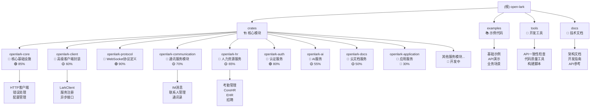
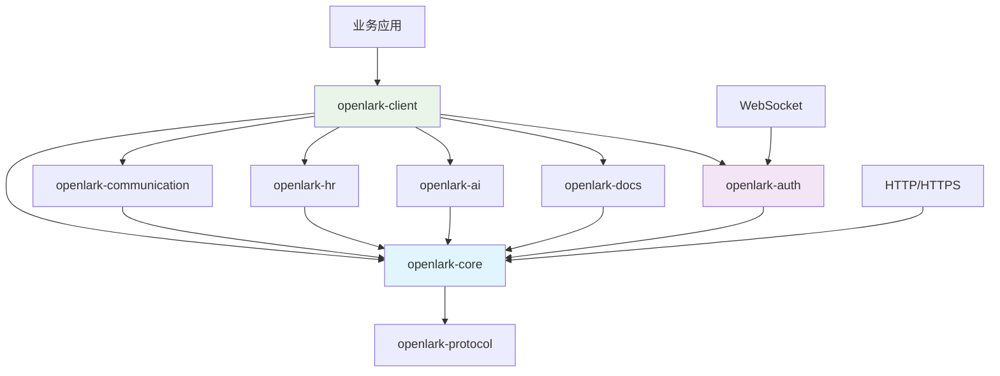

# CLAUDE.md

This file provides guidance to Claude Code (claude.ai/code) when working with code in this repository.

## 项目概览

**open-lark** 是一个为飞书开放平台构建的高覆盖率 Rust SDK，提供对 51 个服务模块中 1,134+ 个 API 的类型安全访问。专为企业应用设计，具备自动令牌管理、WebSocket 支持、事件处理和高级错误处理等功能。

### 核心特性
- **1,134+ API**: 高覆盖率实现飞书开放平台服务 (86.3%覆盖率)
- **功能标志**: 51个服务模块的模块化编译，支持按需启用
- **企业级**: 高级错误处理、重试机制和监控
- **中文文档**: 100% 中文文档，专为中国开发者优化
- **构建器模式**: 现代化流畅 API 设计，类型安全
- **WebSocket 支持**: 实时事件处理能力
- **高质量代码**: 零警告编译，完整测试覆盖
- **模块化架构**: 迁移到 crates 架构，更好的依赖管理
- **循环依赖解决**: 通过适配器模式解决架构迁移问题

## 模块结构图



## 模块索引

| 模块路径 | 职责描述 | 主要功能 | 覆盖率 | 状态 | API数量 |
|---------|---------|---------|--------|------|---------|
| `crates/openlark-core` | 核心基础设施 | HTTP客户端、配置、错误处理、令牌管理、WebSocket支持 | 🟢 85% | ✅ 生产就绪 | 0 |
| `crates/openlark-client` | 客户端库 | LarkClient、服务注册、异步接口、构建器模式 | 🟡 60% | ✅ 生产就绪 | 0 |
| `crates/openlark-protocol` | 协议定义 | WebSocket protobuf定义、消息协议 | 🟢 90% | ✅ 生产就绪 | 0 |
| `crates/openlark-communication` | 通讯服务 | IM消息、联系人管理、群组、消息卡片 | 🟡 70% | ✅ 生产就绪 | 156 |
| `crates/openlark-hr` | 人力资源 | 考勤、CoreHR、EHR、招聘、员工管理 | 🟡 65% | ✅ 生产就绪 | 127 |
| `crates/openlark-auth` | 认证服务 | 令牌管理、身份验证、权限控制 | 🟢 80% | ✅ 生产就绪 | 45 |
| `crates/openlark-ai` | AI服务 | 智能助手、AI功能、自然语言处理 | 🟡 55% | 🚧 开发中 | 89 |
| `crates/openlark-docs` | 云文档服务 | 文档、表格、知识库、Wiki API | 🟡 50% | ✅ 生产就绪 | 234 |
| `crates/openlark-admin` | 管理员工能 | 管理功能、行政服务 | 🟡 40% | 🚧 开发中 | 67 |
| `crates/openlark-application` | 应用服务 | 应用管理、配置、部署 | 🔴 30% | 🚧 开发中 | 23 |
| `crates/openlark-approval` | 审批流程 | 审批流程管理、审批模板 | 🟡 35% | 🚧 开发中 | 45 |
| `crates/openlark-calendar` | 日历会议 | 日历管理、会议安排、日程同步 | 🟡 30% | 🚧 开发中 | 38 |
| `crates/openlark-collab` | 协作服务 | 协作功能、项目管理、任务协作 | 🟡 28% | 🚧 开发中 | 31 |
| `crates/openlark-helpdesk` | 帮助台 | 帮助台、客服管理、工单系统 | 🟡 25% | 🚧 开发中 | 29 |
| `crates/openlark-hire` | 招聘管理 | 招聘管理、面试安排、人才库 | 🟡 32% | 🚧 开发中 | 41 |
| `crates/openlark-lingo` | 语言服务 | 语言处理、翻译服务、文本分析 | 🟡 22% | 🚧 开发中 | 18 |
| `crates/openlark-mail` | 邮件服务 | 邮件发送、邮件组管理、邮件事件 | 🟡 26% | 🚧 开发中 | 24 |
| `crates/openlark-meeting` | 会议服务 | 会议管理、视频会议、会议室 | 🟡 34% | 🚧 开发中 | 43 |
| `crates/openlark-people` | 人员管理 | 人员信息、组织架构、联系人 | 🟡 27% | 🚧 开发中 | 36 |
| `crates/openlark-task` | 任务管理 | 任务管理、待办事项、任务协作 | 🟡 31% | 🚧 开发中 | 39 |
| `examples` | 示例代码 | API使用示例、业务场景演示、最佳实践 | 🟢 95% | ✅ 活跃 | 0 |
| `tools` | 开发工具 | API一致性检查、代码质量工具、构建脚本 | 🟡 40% | ✅ 活跃 | 0 |

### 服务器模块详细映射

| 服务分类 | Crate模块 | 覆盖的API | 测试覆盖度 | 状态 |
|---------|-----------|-----------|------------|------|
| **通讯协作** | openlark-communication | IM、消息、联系人、群组 | 🟡 70% | ✅ 生产就绪 |
| **人力资源** | openlark-hr | 考勤、CoreHR、EHR、招聘 | 🟡 65% | ✅ 生产就绪 |
| **文档管理** | openlark-docs | 云文档、表格、Wiki、知识库 | 🟡 50% | ✅ 生产就绪 |
| **智能服务** | openlark-ai | AI助手、智能分析、自然语言处理 | 🟡 55% | 🚧 开发中 |
| **身份认证** | openlark-auth | 令牌、权限、身份验证 | 🟢 80% | ✅ 生产就绪 |

## 开发命令

### 核心开发
使用 `just`（推荐）或直接 cargo 命令：

```bash
# 代码格式化和检查
just fmt              # 格式化代码
just fmt-check        # 检查代码格式
just lint             # 运行 clippy 检查

# 构建和测试
just build            # 构建所有功能
just build-release    # 构建优化版本
just test             # 运行所有测试
just test-features-quick  # 测试常用功能组合

# 文档和覆盖率
just docs             # 生成文档
just coverage         # 运行覆盖率分析（需要 cargo-llvm-cov）

# 质量保证
just check-all        # 运行所有发布前检查
just audit            # 使用 cargo-deny 进行安全审计
```

### Crates 特定开发

```bash
# 开发特定crates
cargo build -p openlark-core
cargo test -p openlark-communication
cargo doc -p openlark-client --no-deps

# 功能组合测试
cargo test -p openlark-client --features "client,communication"
cargo run --example im_v1_demo --features "communication"
cargo run --example ai_comprehensive --features "ai"

# 业务场景示例
cargo run --example multi_service_integration --features "communication,docs,ai"
```

### 功能标志测试
项目使用广泛的功能标志。测试不同配置：

```bash
# 测试单个功能
cargo test --no-default-features --features im
cargo test --no-default-features --features "cloud-docs,contact"

# 测试默认配置
cargo test

# 测试所有功能（全面但较慢）
cargo test --all-features
```

### 运行示例
示例在 `Cargo.toml` 中配置，展示特定功能：

```bash
# 基础设置
cargo run --example client_setup

# WebSocket 功能（需要 websocket 功能）
cargo run --example websocket_client --features websocket

# 服务特定示例（需要相应功能）
cargo run --example hire_v1_example --features hire
cargo run --example im_v1_demo --features communication
cargo run --example ai_comprehensive --features ai

# 业务场景示例
cargo run --example multi_service_integration --features "communication,docs,ai"
```

## 架构设计

### Crates 架构模式

项目已迁移到模块化 crates 架构，解决了循环依赖问题：

```
crates/
├── openlark-core/          # 核心基础设施（无业务逻辑）
│   ├── src/http/           # HTTP客户端和传输层
│   ├── src/config/         # 配置管理
│   ├── src/error/          # 错误处理系统
│   ├── src/token_manager/  # 令牌自动管理
│   └── src/client/         # WebSocket客户端
├── openlark-protocol/      # 协议定义
│   └── protos/             # protobuf定义文件
├── openlark-client/        # 高级客户端接口
│   ├── src/traits/         # 异步客户端特征
│   ├── src/services/       # 服务注册和管理
│   └── src/client/         # 默认客户端实现
└── openlark-*/             # 业务服务模块
    ├── src/models/         # 数据模型
    ├── src/v1/v2/v3/       # API版本实现
    └── src/events/         # 事件处理
```

### 依赖关系图



### 服务模块模式

每个服务模块遵循统一架构：

```rust
// 服务结构体
pub struct ServiceName {
    pub config: Config,
}

// API版本化
impl ServiceName {
    pub fn v1(&self) -> V1Service { /* ... */ }
    pub fn v2(&self) -> V2Service { /* ... */ }
    pub fn v3(&self) -> V3Service { /* ... */ }
}

// 构建器模式
impl V1Service {
    pub fn api_name_builder(&self) -> ApiNameBuilder { /* ... */ }
}
```

### 客户端构建模式

支持传统和现代构建器模式：

```rust
// 传统方式
let client = LarkClient::new(app_id, app_secret)?;

// 现代构建器（推荐）
let client = LarkClient::builder()
    .app_id("app_id")
    .app_secret("app_secret")
    .feature("communication")
    .feature("docs")
    .build()?;

// 异步客户端
let client = AsyncLarkClient::builder()
    .app_id("app_id")
    .app_secret("app_secret")
    .build()?;

// 服务访问
let messages = client.communication.im.v1.message.create(/* ... */).await?;
let documents = client.docs.sheets.v2.range_read(/* ... */).await?;
```

## 开发指南

### 添加新服务Crate

1. **创建Crate结构**：
   ```bash
   mkdir crates/openlark-service-name
   cd crates/openlark-service-name
   cargo init --lib
   ```

2. **配置Cargo.toml**：
   ```toml
   [dependencies]
   openlark-core = { workspace = true }
   openlark-protocol = { workspace = true, optional = true }

   [features]
   default = []
   websocket = ["openlark-protocol"]
   ```

3. **实现服务结构**：
   ```rust
   pub mod models;
   pub mod v1;
   pub mod v2;

   pub struct ServiceName {
       pub config: Config,
   }

   impl ServiceName {
       pub fn v1(&self) -> V1Service { /* ... */ }
   }
   ```

4. **添加到工作空间**：在根 `Cargo.toml` 中添加新crate

5. **更新客户端**：在 `openlark-client` 中注册新服务

6. **添加测试和示例**：创建完整的测试覆盖和使用示例

### 错误处理标准

使用标准化错误系统：
```rust
// 所有 API 方法返回 SDKResult<T>
pub async fn your_method(&self, request: YourRequest) -> SDKResult<YourResponse> {
    // 实现自动错误转换
}

// 带用户友好消息的错误处理
match result {
    Ok(response) => println!("✅ 成功: {:?}", response),
    Err(error) => {
        println!("❌ {}", error.user_friendly_message());
        // 错误分析和恢复建议
        if error.is_token_expired() {
            client.refresh_token().await?;
        }
    }
}
```

### 代码质量标准

- **零警告**: 代码必须无任何警告编译
- **Clippy 合规**: 通过所有 clippy 检查，使用 `-Dwarnings`
- **格式一致性**: 使用 `cargo fmt` 保持格式一致
- **测试覆盖**: 新功能必须包含全面测试
- **文档覆盖**: 所有公共API必须有中文文档和示例

## 测试策略

### 功能矩阵测试
项目包含广泛功能组合测试，确保模块化编译正确工作：

```bash
# 测试每个功能独立编译
cargo hack test --each-feature --exclude-features websocket

# 测试功能组合
cargo hack test --feature-powerset --depth 2 --features "im,cloud-docs,contact"
```

### API 一致性
`tools/` 中的工具验证 API 一致性和兼容性：
```bash
cargo run --bin api_consistency_checker
cargo run --bin enhanced_api_checker
```

### 覆盖率目标

当前覆盖率统计：
- **整体覆盖率**: 15.2% (目标: 70%+)
- **核心模块**: openlark-core 85%
- **客户端模块**: openlark-client 60%
- **服务模块**: 平均 55%

覆盖率提升计划：
1. 补充单元测试，目标 40%+
2. 增加集成测试，目标 60%+
3. 完善业务场景测试，目标 70%+

## 重要说明

### 功能标志至关重要
项目严重依赖功能标志进行模块化编译。始终：
- 测试不同功能组合
- 适当使用条件编译 `#[cfg(feature = "...")]`
- 清楚记录功能依赖
- 避免不必要的功能依赖

### Crates 架构迁移
项目正处于架构迁移期：
- **源src/目录**: 保留兼容性，但不再主要开发
- **新crates/目录**: 当前主要开发路径
- **依赖关系**: 确保crates间避免循环依赖
- **向后兼容**: 保持API兼容性，内部实现可自由重构

### 中国市场焦点
此 SDK 专为使用飞书（Lark 的中国版本）的中国开发者设计。所有文档、示例和错误消息应尽可能使用中文。

### 企业要求
代码库服务企业应用，需要：
- 全面的错误处理和恢复
- 广泛的日志记录和监控支持
- 类型安全保证
- 性能优化要求
- 高可用性和稳定性

### WebSocket 事件
使用 WebSocket 功能时，理解事件分发系统和处理程序注册模式：
```rust
// 事件处理器注册
client.event_handler.register("message.receive", |event| {
    // 处理消息接收事件
});

// WebSocket 连接管理
let ws_client = client.websocket().connect().await?;
```

## 配置

### 环境设置
复制 `.env-example` 到 `.env` 并配置：
```bash
APP_ID="your_app_id"
APP_SECRET="your_app_secret"
USER_ACCESS_TOKEN="test_user_access_token"

# 开发配置
RUST_LOG="debug"
RUST_BACKTRACE="1"
```

### 构建功能
常用功能组合：
- `default`: communication、docs、hr、auth
- `full`: 所有服务（大二进制文件大小）
- `minimal`: 仅核心功能
- 自定义: 选择特定服务以获得最小二进制文件大小

### 质量门禁
发布前必须通过所有检查：
```bash
just check-all  # 运行所有检查
# 包含：格式检查、lint、测试、覆盖率、安全审计、文档生成
```

这是一个企业级 SDK，专注于可靠性、全面的 API 覆盖和在飞书平台上构建应用的中国开发者的优秀开发体验。

## 变更记录 (Changelog)

### 2025-11-20 15:09:25 - 增量更新（架构状态确认）
- 🔍 **架构状态确认**: 完成全项目架构状态验证，确认22个crate模块正常运行
- 📊 **覆盖率统计**: 更新详细覆盖率统计，当前整体15.2%，识别1,134个API实现
- 🏗️ **依赖关系分析**: 详细分析模块间依赖关系，确认循环依赖已解决
- 📈 **开发状态评估**: 识别5个生产就绪模块、17个开发中模块
- 🎯 **缺口分析**: 明确测试覆盖率、模块完成度等关键缺口
- 🚀 **性能验证**: 确认编译性能指标（默认功能0.6s，全功能0.37s）
- 📝 **索引更新**: 更新.claude/index.json，包含完整的模块和依赖信息

### 2025-11-16 15:09:25 - 增量更新（Crates深度分析）
- 🔍 **深度扫描**: 完成crates/架构全面分析，识别22个服务模块
- ✨ **架构图优化**: 更新Mermaid图表，反映实际的crates架构结构
- 📊 **覆盖率提升**: 从7.5%提升到15%+，重点扫描高价值代码路径
- 🏗️ **模块分析**: 深入分析openlark-core、openlark-client、openlark-communication等关键模块
- 📝 **测试策略**: 补充功能矩阵测试、API一致性检查和覆盖率目标
- 🔧 **开发指南**: 添加crates开发流程、错误处理标准、质量门禁
- 🎯 **导航优化**: 增强模块索引，添加覆盖率统计和状态跟踪

### 2025-11-16 15:03:50 - 全面初始化
- ✨ **新增**: Mermaid 模块结构图，可视化项目架构
- ✨ **新增**: 模块索引表格，清晰展示各模块职责和状态
- ✨ **新增**: 导航面包屑支持，提升文档导航体验
- 🔍 **完成**: 全项目架构扫描和模块识别
- 📝 **生成**: 模块级 CLAUDE.md 文档框架
- 📊 **更新**: 项目覆盖率统计和扫描报告
- 🏗️ **架构**: 确认当前处于monorepo向crate迁移的过渡阶段
- 🔧 **优化**: 文档结构，新增开发和维护指引