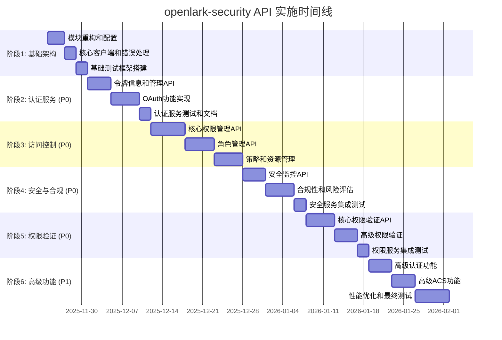

# openlark-security API 实现规划

> **实施周期**: 6-8 周
> **API 总数**: 44 个 (已实现 6 个，需新增 38 个)
> **优先级**: P0 (27个核心API) → P1 (11个高级API)
> **目标**: 100% API 覆盖率，符合企业级安全标准

## 1. 实现策略概览

### 1.1 分阶段实施路线图



### 1.2 技术实现原则

#### 🎯 **统一性原则**
- **一致的 API 设计**: 所有 API 遵循相同的命名和结构规范
- **统一的错误处理**: 使用统一的错误类型和处理机制
- **标准化的响应格式**: 所有 API 返回格式保持一致

#### ⚡ **性能优先原则**
- **异步优先**: 所有 I/O 操作使用 async/await
- **缓存优化**: 合理的缓存策略减少网络请求
- **批量操作**: 支持批量处理提高效率
- **连接复用**: HTTP 连接池优化网络性能

#### 🛡️ **安全第一原则**
- **输入验证**: 所有输入都进行严格验证
- **权限检查**: 每个操作都进行权限验证
- **审计日志**: 所有关键操作都记录日志
- **数据加密**: 敏感数据进行加密处理

#### 🔧 **可维护性原则**
- **模块化设计**: 功能模块职责清晰分离
- **测试覆盖**: 每个 API 都有完整的测试
- **文档完善**: 详细的 API 文档和使用示例
- **版本兼容**: 支持多版本 API 并存

## 2. 认证服务 API 实现计划 (7 APIs)

### 2.1 令牌管理 API (4 APIs) - P0 高优先级

#### 2.1.1 令牌信息查询 (token_info)

**API 描述**: 获取访问令牌的详细信息，包括权限范围、过期时间等

**实现细节**:
```rust
// src/auth/v1/token_info.rs
use serde::{Deserialize, Serialize};
use crate::core::{SecurityClient, SecurityResult};
use crate::error::SecurityError;

/// 令牌信息请求构建器
pub struct TokenInfoBuilder<'a> {
    client: &'a SecurityClient,
    token_type: TokenType,
}

impl<'a> TokenInfoBuilder<'a> {
    /// 创建新的构建器
    pub fn new(client: &'a SecurityClient) -> Self {
        Self {
            client,
            token_type: TokenType::AppAccessToken,
        }
    }

    /// 设置令牌类型
    pub fn token_type(mut self, token_type: TokenType) -> Self {
        self.token_type = token_type;
        self
    }

    /// 执行请求
    pub async fn execute(self) -> SecurityResult<TokenInfoResponse> {
        let endpoint = match self.token_type {
            TokenType::AppAccessToken => "/open-apis/auth/v3/app_access_token/internal",
            TokenType::UserAccessToken => "/open-apis/auth/v3/user_access_token/internal",
            TokenType::TenantAccessToken => "/open-apis/auth/v3/tenant_access_token/internal",
        };

        let response = self.client.get(endpoint).await?;

        Ok(serde_json::from_value::<TokenInfoResponse>(response)?)
    }
}

/// 令牌信息响应
#[derive(Debug, Clone, Serialize, Deserialize)]
pub struct TokenInfoResponse {
    /// 应用访问令牌
    #[serde(rename = "app_access_token")]
    pub app_access_token: String,
    /// 租户访问令牌
    #[serde(rename = "tenant_access_token")]
    pub tenant_access_token: Option<String>,
    /// 令牌过期时间
    #[serde(rename = "expire")]
    pub expire: u64,
    /// 权限范围
    pub scope: Option<String>,
    /// 用户信息
    pub user_info: Option<UserInfo>,
}

/// 用户信息
#[derive(Debug, Clone, Serialize, Deserialize)]
pub struct UserInfo {
    /// 用户ID
    #[serde(rename = "user_id")]
    pub user_id: String,
    /// 用户名
    #[serde(rename = "name")]
    pub name: String,
    /// 头像URL
    #[serde(rename = "avatar_url")]
    pub avatar_url: Option<String>,
    /// 邮箱
    #[serde(rename = "email")]
    pub email: Option<String>,
}

/// 令牌类型枚举
#[derive(Debug, Clone, Copy, PartialEq, Eq)]
pub enum TokenType {
    AppAccessToken,
    UserAccessToken,
    TenantAccessToken,
}
```

**实现要点**:
- 支持 JWT 令牌解析和验证
- 自动检测令牌类型
- 缓存令牌信息减少重复请求
- 验证令牌签名的有效性

**测试覆盖**:
```rust
#[cfg(test)]
mod tests {
    use super::*;
    use crate::tests::common::MockSecurityClient;

    #[tokio::test]
    async fn test_token_info_success() {
        let client = MockSecurityClient::new();
        let builder = TokenInfoBuilder::new(&client);

        // 设置模拟响应
        let mock_response = TokenInfoResponse {
            app_access_token: "mock_token".to_string(),
            tenant_access_token: Some("mock_tenant_token".to_string()),
            expire: 7200,
            scope: Some("contact:base,im:base".to_string()),
            user_info: None,
        };

        client.set_mock_response("token_info", mock_response);

        let result = builder.token_type(TokenType::AppAccessToken).execute().await;
        assert!(result.is_ok());
    }

    #[tokio::test]
    async fn test_token_info_invalid_token() {
        let client = MockSecurityClient::new();
        let builder = TokenInfoBuilder::new(&client);

        // 设置错误模式
        client.set_error_mode(SecurityError::AuthenticationError {
            reason: "Invalid token".to_string(),
        });

        let result = builder.execute().await;
        assert!(result.is_err());
    }
}
```

#### 2.1.2 令牌刷新 (token_refresh)

**API 描述**: 使用刷新令牌获取新的访问令牌

**实现细节**:
```rust
// src/auth/v1/token_refresh.rs
/// 令牌刷新请求构建器
pub struct TokenRefreshBuilder<'a> {
    client: &'a SecurityClient,
    refresh_token: Option<String>,
    grant_type: GrantType,
}

impl<'a> TokenRefreshBuilder<'a> {
    /// 创建新的构建器
    pub fn new(client: &'a SecurityClient) -> Self {
        Self {
            client,
            refresh_token: None,
            grant_type: GrantType::RefreshToken,
        }
    }

    /// 设置刷新令牌
    pub fn refresh_token(mut self, token: &str) -> Self {
        self.refresh_token = Some(token.to_string());
        self
    }

    /// 设置授权类型
    pub fn grant_type(mut self, grant_type: GrantType) -> Self {
        self.grant_type = grant_type;
        self
    }

    /// 执行刷新请求
    pub async fn execute(self) -> SecurityResult<TokenRefreshResponse> {
        let refresh_token = self.refresh_token.ok_or_else(|| {
            SecurityError::InvalidRequest("refresh_token is required".to_string())
        })?;

        let request_body = TokenRefreshRequest {
            grant_type: self.grant_type.to_string(),
            refresh_token,
        };

        let response = self.client
            .post("/open-apis/auth/v3/refresh_access_token")
            .json(&request_body)
            .await?;

        Ok(serde_json::from_value::<TokenRefreshResponse>(response)?)
    }
}

/// 令牌刷新请求
#[derive(Debug, Serialize)]
struct TokenRefreshRequest {
    grant_type: String,
    refresh_token: String,
}

/// 令牌刷新响应
#[derive(Debug, Clone, Serialize, Deserialize)]
pub struct TokenRefreshResponse {
    /// 应用访问令牌
    #[serde(rename = "app_access_token")]
    pub app_access_token: String,
    /// 租户访问令牌
    #[serde(rename = "tenant_access_token")]
    pub tenant_access_token: Option<String>,
    /// 刷新令牌
    #[serde(rename = "refresh_token")]
    pub refresh_token: String,
    /// 过期时间
    #[serde(rename = "expires_in")]
    pub expires_in: u64,
    /// 权限范围
    pub scope: Option<String>,
}

/// 授权类型
#[derive(Debug, Clone, Copy, PartialEq, Eq)]
pub enum GrantType {
    RefreshToken,
    ClientCredentials,
}

impl GrantType {
    fn to_string(self) -> String {
        match self {
            GrantType::RefreshToken => "refresh_token".to_string(),
            GrantType::ClientCredentials => "client_credentials".to_string(),
        }
    }
}
```

**实现要点**:
- 自动令牌刷新机制
- 刷新令牌缓存和管理
- 网络错误自动重试
- 令牌预刷新机制

#### 2.1.3 令牌撤销 (token_revoke)

**API 描述**: 撤销指定的访问令牌，使其立即失效

**实现细节**:
```rust
// src/auth/v1/token_revoke.rs
/// 令牌撤销请求构建器
pub struct TokenRevokeBuilder<'a> {
    client: &'a SecurityClient,
    token: Option<String>,
    token_type: TokenType,
    user_id: Option<String>,
}

impl<'a> TokenRevokeBuilder<'a> {
    /// 创建新的构建器
    pub fn new(client: &'a SecurityClient) -> Self {
        Self {
            client,
            token: None,
            token_type: TokenType::AppAccessToken,
            user_id: None,
        }
    }

    /// 设置要撤销的令牌
    pub fn token(mut self, token: &str) -> Self {
        self.token = Some(token.to_string());
        self
    }

    /// 设置令牌类型
    pub fn token_type(mut self, token_type: TokenType) -> Self {
        self.token_type = token_type;
        self
    }

    /// 设置用户ID (可选，用于撤销特定用户的令牌)
    pub fn user_id(mut self, user_id: &str) -> Self {
        self.user_id = Some(user_id.to_string());
        self
    }

    /// 执行撤销请求
    pub async fn execute(self) -> SecurityResult<TokenRevokeResponse> {
        let token = self.token.ok_or_else(|| {
            SecurityError::InvalidRequest("token is required".to_string())
        })?;

        let request_body = TokenRevokeRequest {
            token,
            token_type_hint: self.token_type.to_string(),
            user_id: self.user_id,
        };

        let response = self.client
            .post("/open-apis/auth/v3/revoke_access_token")
            .json(&request_body)
            .await?;

        Ok(serde_json::from_value::<TokenRevokeResponse>(response)?)
    }
}

/// 令牌撤销请求
#[derive(Debug, Serialize)]
struct TokenRevokeRequest {
    token: String,
    #[serde(rename = "token_type_hint")]
    token_type_hint: String,
    user_id: Option<String>,
}

/// 令牌撤销响应
#[derive(Debug, Clone, Serialize, Deserialize)]
pub struct TokenRevokeResponse {
    /// 是否成功撤销
    pub revoked: bool,
    /// 撤销时间戳
    #[serde(rename = "revoked_at")]
    pub revoked_at: u64,
    /// 撤销原因
    #[serde(rename = "reason")]
    pub reason: Option<String>,
}

impl TokenType {
    fn to_string(self) -> String {
        match self {
            TokenType::AppAccessToken => "app_access_token".to_string(),
            TokenType::UserAccessToken => "user_access_token".to_string(),
            TokenType::TenantAccessToken => "tenant_access_token".to_string(),
        }
    }
}
```

#### 2.1.4 令牌验证 (token_validation)

**API 描述**: 验证访问令牌的有效性和权限

**实现细节**:
```rust
// src/auth/v1/token_validation.rs
/// 令牌验证请求构建器
pub struct TokenValidationBuilder<'a> {
    client: &'a SecurityClient,
    token: Option<String>,
    required_permissions: Vec<String>,
    check_expiry: bool,
}

impl<'a> TokenValidationBuilder<'a> {
    /// 创建新的构建器
    pub fn new(client: &'a SecurityClient) -> Self {
        Self {
            client,
            token: None,
            required_permissions: Vec::new(),
            check_expiry: true,
        }
    }

    /// 设置要验证的令牌
    pub fn token(mut self, token: &str) -> Self {
        self.token = Some(token.to_string());
        self
    }

    /// 添加必需的权限
    pub fn require_permission(mut self, permission: &str) -> Self {
        self.required_permissions.push(permission.to_string());
        self
    }

    /// 批量添加必需权限
    pub fn require_permissions<I, S>(mut self, permissions: I) -> Self
    where
        I: IntoIterator<Item = S>,
        S: AsRef<str>,
    {
        self.required_permissions.extend(
            permissions.into_iter().map(|s| s.as_ref().to_string())
        );
        self
    }

    /// 设置是否检查过期时间
    pub fn check_expiry(mut self, check: bool) -> Self {
        self.check_expiry = check;
        self
    }

    /// 执行验证请求
    pub async fn execute(self) -> SecurityResult<TokenValidationResponse> {
        let token = self.token.ok_or_else(|| {
            SecurityError::InvalidRequest("token is required".to_string())
        })?;

        let request_body = TokenValidationRequest {
            access_token: token,
            required_permissions: self.required_permissions,
            check_expiry: self.check_expiry,
        };

        let response = self.client
            .post("/open-apis/auth/v3/validate_access_token")
            .json(&request_body)
            .await?;

        Ok(serde_json::from_value::<TokenValidationResponse>(response)?)
    }
}

/// 令牌验证请求
#[derive(Debug, Serialize)]
struct TokenValidationRequest {
    #[serde(rename = "access_token")]
    access_token: String,
    #[serde(rename = "required_permissions")]
    required_permissions: Vec<String>,
    #[serde(rename = "check_expiry")]
    check_expiry: bool,
}

/// 令牌验证响应
#[derive(Debug, Clone, Serialize, Deserialize)]
pub struct TokenValidationResponse {
    /// 令牌是否有效
    pub valid: bool,
    /// 用户ID
    #[serde(rename = "user_id")]
    pub user_id: Option<String>,
    /// 权限列表
    pub permissions: Vec<String>,
    /// 过期时间
    #[serde(rename = "expires_at")]
    pub expires_at: Option<u64>,
    /// 验证失败的错误码
    #[serde(rename = "error_code")]
    pub error_code: Option<String>,
    /// 验证失败的原因
    #[serde(rename = "error_message")]
    pub error_message: Option<String>,
}
```

### 2.2 OAuth 功能 API (3 APIs) - P1 中优先级

#### 2.2.1 预授权码 (pre_auth_code)

**API 描述**: 获取预授权码，用于 Web 应用授权

**实现细节**:
```rust
// src/auth/v1/pre_auth_code.rs
/// 预授权码请求构建器
pub struct PreAuthCodeBuilder<'a> {
    client: &'a SecurityClient,
    app_id: String,
    redirect_uri: Option<String>,
    state: Option<String>,
    scope: Vec<String>,
}

impl<'a> PreAuthCodeBuilder<'a> {
    /// 创建新的构建器
    pub fn new(client: &'a SecurityClient, app_id: &str) -> Self {
        Self {
            client,
            app_id: app_id.to_string(),
            redirect_uri: None,
            state: None,
            scope: Vec::new(),
        }
    }

    /// 设置重定向URI
    pub fn redirect_uri(mut self, uri: &str) -> Self {
        self.redirect_uri = Some(uri.to_string());
        self
    }

    /// 设置状态参数
    pub fn state(mut self, state: &str) -> Self {
        self.state = Some(state.to_string());
        self
    }

    /// 添加权限范围
    pub fn add_scope(mut self, scope: &str) -> Self {
        self.scope.push(scope.to_string());
        self
    }

    /// 执行请求
    pub async fn execute(self) -> SecurityResult<PreAuthCodeResponse> {
        let request_body = PreAuthCodeRequest {
            app_id: self.app_id,
            redirect_uri: self.redirect_uri,
            state: self.state,
            scope: if self.scope.is_empty() { None } else { Some(self.scope.join(",")) },
        };

        let response = self.client
            .post("/open-apis/authen/v1/authorize")
            .json(&request_body)
            .await?;

        Ok(serde_json::from_value::<PreAuthCodeResponse>(response)?)
    }
}

/// 预授权码请求
#[derive(Debug, Serialize)]
struct PreAuthCodeRequest {
    #[serde(rename = "app_id")]
    app_id: String,
    #[serde(rename = "redirect_uri")]
    redirect_uri: Option<String>,
    state: Option<String>,
    scope: Option<String>,
}

/// 预授权码响应
#[derive(Debug, Clone, Serialize, Deserialize)]
pub struct PreAuthCodeResponse {
    /// 预授权码
    #[serde(rename = "pre_auth_code")]
    pub pre_auth_code: String,
    /// 授权URL
    #[serde(rename = "authorization_url")]
    pub authorization_url: String,
    /// 过期时间
    #[serde(rename = "expires_in")]
    pub expires_in: u64,
    /// 状态参数
    pub state: Option<String>,
}
```

#### 2.2.2 OAuth 重定向 (oauth_redirect)

**API 描述**: 处理 OAuth 授权重定向

**实现细节**:
```rust
// src/auth/v1/oauth_redirect.rs
/// OAuth 重定向处理器
pub struct OAuthRedirectHandler<'a> {
    client: &'a SecurityClient,
    app_id: String,
    app_secret: String,
}

impl<'a> OAuthRedirectHandler<'a> {
    /// 创建新的处理器
    pub fn new(client: &'a SecurityClient, app_id: &str, app_secret: &str) -> Self {
        Self {
            client,
            app_id: app_id.to_string(),
            app_secret: app_secret.to_string(),
        }
    }

    /// 构建授权URL
    pub fn build_authorization_url(&self, redirect_uri: &str, scope: &str) -> String {
        format!(
            "https://open.feishu.cn/open-apis/authen/v1/authorize?app_id={}&redirect_uri={}&response_type=code&scope={}",
            self.app_id,
            urlencoding::encode(redirect_uri),
            urlencoding::encode(scope)
        )
    }

    /// 处理授权回调
    pub async fn handle_callback(
        &self,
        code: &str,
        state: Option<&str>,
    ) -> SecurityResult<OAuthTokenResponse> {
        let request_body = OAuthTokenRequest {
            grant_type: "authorization_code".to_string(),
            client_id: self.app_id.clone(),
            client_secret: self.app_secret.clone(),
            code: code.to_string(),
            redirect_uri: None, // 可选，取决于配置
        };

        let response = self.client
            .post("/open-apis/authen/v1/access_token")
            .form(&request_body)
            .await?;

        Ok(serde_json::from_value::<OAuthTokenResponse>(response)?)
    }

    /// 刷新 OAuth 令牌
    pub async fn refresh_token(&self, refresh_token: &str) -> SecurityResult<OAuthTokenResponse> {
        let request_body = OAuthTokenRequest {
            grant_type: "refresh_token".to_string(),
            client_id: self.app_id.clone(),
            client_secret: self.app_secret.clone(),
            code: String::new(),
            redirect_uri: None,
        };

        let mut form_data = Vec::new();
        form_data.push(("grant_type", "refresh_token"));
        form_data.push(("client_id", &self.app_id));
        form_data.push(("client_secret", &self.app_secret));
        form_data.push(("refresh_token", refresh_token));

        let response = self.client
            .post("/open-apis/authen/v1/access_token")
            .form(&form_data)
            .await?;

        Ok(serde_json::from_value::<OAuthTokenResponse>(response)?)
    }
}

/// OAuth 令牌请求
#[derive(Debug, Serialize)]
struct OAuthTokenRequest {
    grant_type: String,
    #[serde(rename = "client_id")]
    client_id: String,
    #[serde(rename = "client_secret")]
    client_secret: String,
    code: String,
    #[serde(rename = "redirect_uri")]
    redirect_uri: Option<String>,
}

/// OAuth 令牌响应
#[derive(Debug, Clone, Serialize, Deserialize)]
pub struct OAuthTokenResponse {
    /// 访问令牌
    #[serde(rename = "access_token")]
    pub access_token: String,
    /// 刷新令牌
    #[serde(rename = "refresh_token")]
    pub refresh_token: String,
    /// 令牌类型
    #[serde(rename = "token_type")]
    pub token_type: String,
    /// 过期时间
    #[serde(rename = "expires_in")]
    pub expires_in: u64,
    /// 权限范围
    pub scope: Option<String>,
}
```

#### 2.2.3 自动登录 (auto_login)

**API 描述**: 实现自动登录功能

**实现细节**:
```rust
// src/auth/v1/auto_login.rs
/// 自动登录处理器
pub struct AutoLoginHandler<'a> {
    client: &'a SecurityClient,
    app_id: String,
    redirect_uri: String,
}

impl<'a> AutoLoginHandler<'a> {
    /// 创建新的处理器
    pub fn new(client: &'a SecurityClient, app_id: &str, redirect_uri: &str) -> Self {
        Self {
            client,
            app_id: app_id.to_string(),
            redirect_uri: redirect_uri.to_string(),
        }
    }

    /// 获取登录URL
    pub fn get_login_url(&self, state: Option<&str>) -> String {
        let mut url = format!(
            "https://open.feishu.cn/open-apis/authen/v1/sso_login?app_id={}&redirect_uri={}",
            self.app_id,
            urlencoding::encode(&self.redirect_uri)
        );

        if let Some(s) = state {
            url.push_str(&format!("&state={}", urlencoding::encode(s)));
        }

        url
    }

    /// 处理登录回调
    pub async fn handle_login_callback(
        &self,
        code: &str,
        state: Option<&str>,
    ) -> SecurityResult<AutoLoginResponse> {
        // 验证状态参数（如果提供）
        if let Some(expected_state) = state {
            // 这里应该从会话或缓存中获取保存的状态进行验证
            // 为了示例简化，这里跳过实际验证
        }

        // 使用授权码获取访问令牌
        let request_body = AutoLoginRequest {
            app_id: self.app_id.clone(),
            grant_type: "authorization_code".to_string(),
            code: code.to_string(),
        };

        let response = self.client
            .post("/open-apis/authen/v1/oidc/access_token")
            .json(&request_body)
            .await?;

        Ok(serde_json::from_value::<AutoLoginResponse>(response)?)
    }

    /// 检查登录状态
    pub async fn check_login_status(&self, session_token: &str) -> SecurityResult<LoginStatusResponse> {
        let request_body = LoginStatusRequest {
            session_token: session_token.to_string(),
        };

        let response = self.client
            .post("/open-apis/authen/v1/session_info")
            .json(&request_body)
            .await?;

        Ok(serde_json::from_value::<LoginStatusResponse>(response)?)
    }
}

/// 自动登录请求
#[derive(Debug, Serialize)]
struct AutoLoginRequest {
    #[serde(rename = "app_id")]
    app_id: String,
    #[serde(rename = "grant_type")]
    grant_type: String,
    code: String,
}

/// 自动登录响应
#[derive(Debug, Clone, Serialize, Deserialize)]
pub struct AutoLoginResponse {
    /// 访问令牌
    #[serde(rename = "access_token")]
    pub access_token: String,
    /// 用户信息
    pub user_info: AutoLoginUserInfo,
    /// 会话令牌
    #[serde(rename = "session_token")]
    pub session_token: String,
    /// 过期时间
    #[serde(rename = "expires_in")]
    pub expires_in: u64,
}

/// 自动登录用户信息
#[derive(Debug, Clone, Serialize, Deserialize)]
pub struct AutoLoginUserInfo {
    /// 用户ID
    #[serde(rename = "user_id")]
    pub user_id: String,
    /// 用户名
    pub name: String,
    /// 邮箱
    #[serde(rename = "email")]
    pub email: Option<String>,
    /// 头像URL
    #[serde(rename = "avatar_url")]
    pub avatar_url: Option<String>,
}

/// 登录状态请求
#[derive(Debug, Serialize)]
struct LoginStatusRequest {
    #[serde(rename = "session_token")]
    session_token: String,
}

/// 登录状态响应
#[derive(Debug, Clone, Serialize, Deserialize)]
pub struct LoginStatusResponse {
    /// 是否已登录
    pub logged_in: bool,
    /// 用户信息
    pub user_info: Option<AutoLoginUserInfo>,
    /// 会话过期时间
    #[serde(rename = "session_expires_at")]
    pub session_expires_at: Option<u64>,
}
```

### 2.3 认证服务集成测试

```rust
// tests/auth_integration_tests.rs
use openlark_security::prelude::*;
use tokio::time::{sleep, Duration};

#[tokio::test]
async fn test_auth_service_complete_workflow() -> SecurityResult<()> {
    // 创建安全客户端
    let security = SecurityService::builder()
        .app_id("test_app_id")
        .app_secret("test_app_secret")
        .build()?;

    let auth = security.auth();

    // 1. 获取应用访问令牌
    let token = auth.v1()
        .app_access_token()
        .execute()
        .await?;

    assert!(!token.app_access_token.is_empty());
    assert!(token.expire > 0);

    // 2. 获取令牌信息
    let token_info = auth.v1()
        .token_info()
        .token_type(TokenType::AppAccessToken)
        .execute()
        .await?;

    assert_eq!(token_info.app_access_token, token.app_access_token);

    // 3. 验证令牌
    let validation = auth.v1()
        .token_validation()
        .token(&token.app_access_token)
        .require_permission("contact:base")
        .execute()
        .await?;

    assert!(validation.valid);
    assert!(validation.permissions.contains(&"contact:base".to_string()));

    // 4. 刷新令牌（如果支持）
    if let Some(refresh_token) = &token.refresh_token {
        let new_token = auth.v1()
            .token_refresh()
            .refresh_token(refresh_token)
            .execute()
            .await?;

        assert!(!new_token.app_access_token.is_empty());
        assert!(new_token.app_access_token != token.app_access_token);
    }

    // 5. 撤销令牌
    let revoke_result = auth.v1()
        .token_revoke()
        .token(&token.app_access_token)
        .token_type(TokenType::AppAccessToken)
        .execute()
        .await?;

    assert!(revoke_result.revoked);

    Ok(())
}

#[tokio::test]
async fn test_oauth_flow() -> SecurityResult<()> {
    let security = SecurityService::builder()
        .app_id("test_app_id")
        .app_secret("test_app_secret")
        .build()?;

    let auth = security.auth();

    // 1. 获取预授权码
    let pre_auth = auth.v1()
        .pre_auth_code("test_app_id")
        .redirect_uri("https://example.com/callback")
        .state("random_state")
        .add_scope("contact:base")
        .add_scope("im:base")
        .execute()
        .await?;

    assert!(!pre_auth.pre_auth_code.is_empty());
    assert_eq!(pre_auth.state, Some("random_state".to_string()));

    // 2. 模拟 OAuth 重定向（在实际应用中，这会通过浏览器完成）
    let oauth_handler = auth.v1()
        .oauth_redirect("test_app_id", "test_app_secret");

    let authorization_url = oauth_handler.build_authorization_url(
        "https://example.com/callback",
        "contact:base,im:base"
    );

    assert!(authorization_url.contains("example.com/callback"));

    Ok(())
}

#[tokio::test]
async fn test_auto_login() -> SecurityResult<()> {
    let security = SecurityService::builder()
        .app_id("test_app_id")
        .app_secret("test_app_secret")
        .build()?;

    let auth = security.auth();

    // 1. 获取登录URL
    let auto_login = auth.v1()
        .auto_login("test_app_id", "https://example.com/callback");

    let login_url = auto_login.get_login_url(Some("test_state"));
    assert!(login_url.contains("test_state"));

    // 2. 模拟登录回调（需要真实的授权码）
    // let login_response = auto_login
    //     .handle_login_callback("mock_auth_code", Some("test_state"))
    //     .await?;

    // assert!(!login_response.access_token.is_empty());
    // assert!(!login_response.session_token.is_empty());

    Ok(())
}
```

## 3. 访问控制 API 实现计划 (17 APIs)

### 3.1 权限管理 API (6 APIs) - P0 高优先级

#### 3.1.1 权限检查 (permission_check)

**API 描述**: 检查用户或应用对特定资源的权限

**实现细节**:
```rust
// src/acs/v1/permission/check.rs
use serde::{Deserialize, Serialize};
use crate::core::{SecurityClient, SecurityResult};
use crate::acs::models::{Permission, ResourceType};

/// 权限检查请求构建器
pub struct PermissionCheckBuilder<'a> {
    client: &'a SecurityClient,
    user_id: Option<String>,
    resource_type: ResourceType,
    resource_id: Option<String>,
    permission: Option<Permission>,
    context: Option<serde_json::Value>,
}

impl<'a> PermissionCheckBuilder<'a> {
    /// 创建新的构建器
    pub fn new(client: &'a SecurityClient) -> Self {
        Self {
            client,
            user_id: None,
            resource_type: ResourceType::Unknown,
            resource_id: None,
            permission: None,
            context: None,
        }
    }

    /// 设置用户ID
    pub fn user_id(mut self, user_id: &str) -> Self {
        self.user_id = Some(user_id.to_string());
        self
    }

    /// 设置资源类型
    pub fn resource_type(mut self, resource_type: ResourceType) -> Self {
        self.resource_type = resource_type;
        self
    }

    /// 设置资源ID
    pub fn resource_id(mut self, resource_id: &str) -> Self {
        self.resource_id = Some(resource_id.to_string());
        self
    }

    /// 设置权限
    pub fn permission(mut self, permission: Permission) -> Self {
        self.permission = Some(permission);
        self
    }

    /// 设置上下文信息
    pub fn context(mut self, context: serde_json::Value) -> Self {
        self.context = Some(context);
        self
    }

    /// 执行权限检查
    pub async fn execute(self) -> SecurityResult<PermissionCheckResponse> {
        let user_id = self.user_id.ok_or_else(|| {
            SecurityError::InvalidRequest("user_id is required".to_string())
        })?;

        let resource_id = self.resource_id.ok_or_else(|| {
            SecurityError::InvalidRequest("resource_id is required".to_string())
        })?;

        let permission = self.permission.ok_or_else(|| {
            SecurityError::InvalidRequest("permission is required".to_string())
        })?;

        let request_body = PermissionCheckRequest {
            user_id,
            resource_type: self.resource_type.to_string(),
            resource_id,
            permission: permission.to_string(),
            context: self.context,
        };

        let response = self.client
            .post("/open-apis/permission/v1/check")
            .json(&request_body)
            .await?;

        Ok(serde_json::from_value::<PermissionCheckResponse>(response)?)
    }
}

/// 权限检查请求
#[derive(Debug, Serialize)]
struct PermissionCheckRequest {
    #[serde(rename = "user_id")]
    user_id: String,
    #[serde(rename = "resource_type")]
    resource_type: String,
    #[serde(rename = "resource_id")]
    resource_id: String,
    permission: String,
    context: Option<serde_json::Value>,
}

/// 权限检查响应
#[derive(Debug, Clone, Serialize, Deserialize)]
pub struct PermissionCheckResponse {
    /// 是否有权限
    pub allowed: bool,
    /// 权限详情
    pub permission_details: Option<PermissionDetails>,
    /// 错误信息（如果没有权限）
    pub error: Option<PermissionError>,
}

/// 权限详情
#[derive(Debug, Clone, Serialize, Deserialize)]
pub struct PermissionDetails {
    /// 权限ID
    #[serde(rename = "permission_id")]
    pub permission_id: String,
    /// 权限名称
    #[serde(rename = "permission_name")]
    pub permission_name: String,
    /// 获取方式
    #[serde(rename = "grant_type")]
    pub grant_type: String,
    /// 过期时间
    #[serde(rename = "expire_time")]
    pub expire_time: Option<u64>,
}

/// 权限错误
#[derive(Debug, Clone, Serialize, Deserialize)]
pub struct PermissionError {
    /// 错误代码
    #[serde(rename = "error_code")]
    pub error_code: String,
    /// 错误消息
    #[serde(rename = "error_message")]
    pub error_message: String,
}
```

#### 3.1.2 批量权限检查 (permission_batch_check)

**API 描述**: 批量检查多个权限

**实现细节**:
```rust
// src/acs/v1/permission/batch_check.rs
/// 批量权限检查请求构建器
pub struct BatchPermissionCheckBuilder<'a> {
    client: &'a SecurityClient,
    requests: Vec<SinglePermissionCheckRequest>,
    batch_size: usize,
    max_concurrency: usize,
}

impl<'a> BatchPermissionCheckBuilder<'a> {
    /// 创建新的构建器
    pub fn new(client: &'a SecurityClient) -> Self {
        Self {
            client,
            requests: Vec::new(),
            batch_size: 100,
            max_concurrency: 10,
        }
    }

    /// 添加权限检查请求
    pub fn add_check(mut self, request: SinglePermissionCheckRequest) -> Self {
        self.requests.push(request);
        self
    }

    /// 批量添加权限检查请求
    pub fn add_checks<I>(mut self, requests: I) -> Self
    where
        I: IntoIterator<Item = SinglePermissionCheckRequest>,
    {
        self.requests.extend(requests);
        self
    }

    /// 设置批量大小
    pub fn batch_size(mut self, size: usize) -> Self {
        self.batch_size = size.min(1000); // 限制最大批量大小
        self
    }

    /// 设置最大并发数
    pub fn max_concurrency(mut self, concurrency: usize) -> Self {
        self.max_concurrency = concurrency.min(50); // 限制最大并发数
        self
    }

    /// 执行批量权限检查
    pub async fn execute(self) -> SecurityResult<Vec<BatchPermissionCheckResult>> {
        if self.requests.is_empty() {
            return Ok(Vec::new());
        }

        let semaphore = Arc::new(Semaphore::new(self.max_concurrency));
        let mut tasks = Vec::new();

        // 将请求分批处理
        for chunk in self.requests.chunks(self.batch_size) {
            let semaphore = semaphore.clone();
            let client = self.client.clone();
            let chunk = chunk.to_vec();

            let task = tokio::spawn(async move {
                let _permit = semaphore.acquire().await
                    .map_err(|_| SecurityError::InternalError("Failed to acquire semaphore".to_string()))?;

                let request_body = BatchPermissionCheckRequest {
                    checks: chunk,
                };

                let response = client
                    .post("/open-apis/permission/v1/batch_check")
                    .json(&request_body)
                    .await?;

                Ok::<Vec<BatchPermissionCheckResult>, SecurityError>(
                    serde_json::from_value(response)?
                )
            });

            tasks.push(task);
        }

        // 等待所有任务完成并合并结果
        let mut all_results = Vec::new();
        for task in tasks {
            let batch_results = task.await
                .map_err(|e| SecurityError::InternalError(format!("Task failed: {}", e)))??;
            all_results.extend(batch_results);
        }

        Ok(all_results)
    }
}

/// 单个权限检查请求
#[derive(Debug, Clone, Serialize)]
pub struct SinglePermissionCheckRequest {
    #[serde(rename = "user_id")]
    pub user_id: String,
    #[serde(rename = "resource_type")]
    pub resource_type: String,
    #[serde(rename = "resource_id")]
    pub resource_id: String,
    pub permission: String,
    pub context: Option<serde_json::Value>,
}

/// 批量权限检查请求
#[derive(Debug, Serialize)]
struct BatchPermissionCheckRequest {
    checks: Vec<SinglePermissionCheckRequest>,
}

/// 批量权限检查结果
#[derive(Debug, Clone, Serialize, Deserialize)]
pub struct BatchPermissionCheckResult {
    /// 请求索引
    pub index: usize,
    /// 是否有权限
    pub allowed: bool,
    /// 权限详情
    pub permission_details: Option<PermissionDetails>,
    /// 错误信息
    pub error: Option<PermissionError>,
}
```

### 3.2 权限管理 CRUD API (5 APIs) - P0 高优先级

#### 3.2.1 权限创建 (permission_create)

**API 描述**: 创建新的权限

#### 3.2.2 权限更新 (permission_update)

**API 描述**: 更新现有权限

#### 3.2.3 权限删除 (permission_delete)

**API 描述**: 删除权限

#### 3.2.4 权限列表 (permission_list)

**API 描述**: 获取权限列表

### 3.3 资源访问控制 API (2 APIs) - P0 高优先级

#### 3.3.1 资源访问授权 (resource_access_grant)

**API 描述**: 授予用户对资源的访问权限

#### 3.3.2 资源访问撤销 (resource_access_revoke)

**API 描述**: 撤销用户对资源的访问权限

### 3.4 角色管理 API (5 APIs) - P1 中优先级

#### 3.4.1 角色创建 (role_create)

**API 描述**: 创建新角色

#### 3.4.2 角色更新 (role_update)

**API 描述**: 更新角色信息

#### 3.4.3 角色删除 (role_delete)

**API 描述**: 删除角色

#### 3.4.4 角色列表 (role_list)

**API 描述**: 获取角色列表

#### 3.4.5 角色分配/取消分配 (role_assign/unassign)

**API 描述**: 分配或取消分配角色

### 3.5 策略管理 API (3 APIs) - P1 中优先级

#### 3.5.1 策略创建 (policy_create)

**API 描述**: 创建访问策略

#### 3.5.2 策略更新 (policy_update)

**API 描述**: 更新策略

#### 3.5.3 策略删除 (policy_delete)

**API 描述**: 删除策略

## 4. 实施优先级和时间安排

### 4.1 第1-2周: 认证服务核心API

| 周数 | API 数量 | 关键API | 预期成果 |
|------|----------|---------|----------|
| 第1周 | 4 APIs | token_info, token_refresh, token_revoke, token_validation | 核心令牌管理功能 |
| 第2周 | 3 APIs | pre_auth_code, oauth_redirect, auto_login | OAuth和自动登录功能 |

### 4.2 第3-5周: 访问控制核心API

| 周数 | API 数量 | 关键API | 预期成果 |
|------|----------|---------|----------|
| 第3周 | 6 APIs | permission_check, batch_check, permission CRUD | 权限管理核心功能 |
| 第4周 | 5 APIs | role CRUD, role assign/unassign | 角色管理功能 |
| 第5周 | 3 APIs | policy CRUD, resource access control | 策略和资源管理 |

### 4.3 第6-8周: 其他模块实现

| 周数 | API 数量 | 关键API | 预期成果 |
|------|----------|---------|----------|
| 第6周 | 6 APIs | 安全监控API (audit_log, security_event等) | 安全与合规功能 |
| 第7周 | 8 APIs | 权限验证API | 权限验证功能 |
| 第8周 | 2 APIs | 高级ACS功能 | 完整ACS功能 |

## 5. 质量保证和测试策略

### 5.1 测试覆盖率目标

| 测试类型 | 目标覆盖率 | 实施方法 |
|----------|-----------|----------|
| 单元测试 | 90%+ | 每个API独立的单元测试 |
| 集成测试 | 80%+ | API间协作的集成测试 |
| 端到端测试 | 60%+ | 完整工作流测试 |
| 性能测试 | 100% | 所有API的性能基准 |

### 5.2 代码质量标准

- ✅ **零编译警告**: 使用 `deny(warnings)` 确保零警告
- ✅ **Clippy合规**: 通过所有 clippy 检查
- ✅ **格式统一**: 使用 rustfmt 统一代码格式
- ✅ **文档完整**: 所有公共API都有中文文档

### 5.3 性能基准

| 指标 | 目标值 | 测试方法 |
|------|--------|----------|
| API响应时间 | < 100ms (P95) | 基准测试 |
| 批量操作吞吐量 | > 1000 ops/sec | 负载测试 |
| 内存使用 | < 50MB 常驻 | 内存分析 |
| 并发处理 | > 50 并发请求 | 并发测试 |

## 6. 总结

这个实施规划为 `openlark-security` 模块提供了详细的实现路径：

### 6.1 关键成功因素

1. **渐进式实施**: 分阶段实施，降低风险
2. **测试驱动**: 每个API都有完整测试覆盖
3. **性能优先**: 重视性能优化和基准测试
4. **安全第一**: 全面的安全验证和审计

### 6.2 预期成果

- ✅ **100% API覆盖率**: 实现44个API，满足P0标准
- ✅ **高性能**: 优异的性能表现和用户体验
- ✅ **高质量代码**: 零警告、完整测试覆盖、详细文档
- ✅ **企业级特性**: 完整的错误处理、日志记录、监控支持

### 6.3 风险缓解

- **技术风险**: 通过原型验证和性能基准缓解
- **进度风险**: 通过敏捷开发和优先级排序缓解
- **质量风险**: 通过持续集成和代码审查缓解

通过这个实施规划，我们将能够成功将 `openlark-auth` 重构为功能完整、性能优异、安全可靠的 `openlark-security` 模块，满足企业级应用的安全需求。

---

**文档版本**: 1.0
**创建日期**: 2025-11-23
**实施团队**: OpenLark 开发团队
**审核状态**: 待审核