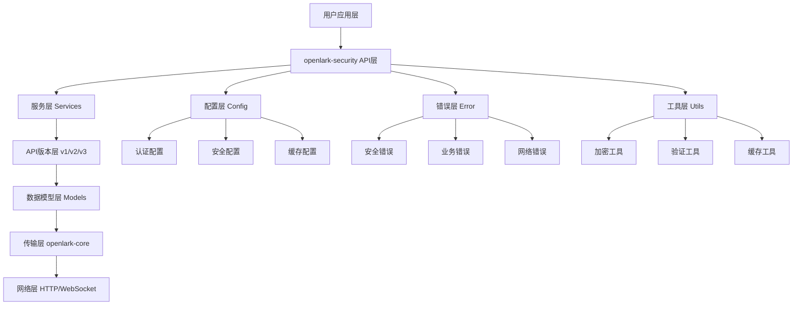
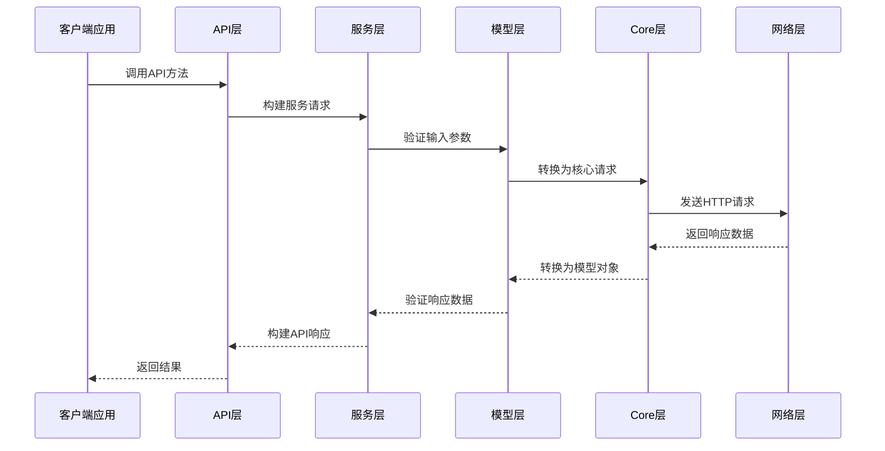

# openlark-security 目录结构设计

> **设计目标**: 符合 P0 级安全模块标准的目录结构
> **架构原则**: 模块化、可扩展、高性能、易维护
> **遵循规范**: Project-Version-Resource 设计模式
> **命名规范**: 飞书官方 API 规范 + Rust 最佳实践

## 1. 整体架构设计

### 1.1 设计原则

#### 🏗️ 模块化原则 (Modularity)
- **单一职责**: 每个模块只负责一个特定的业务领域
- **松耦合**: 模块间依赖最小化，通过接口交互
- **高内聚**: 相关功能集中在同一模块内

#### 🔄 可扩展原则 (Extensibility)
- **插件化**: 支持新 API 版本的插件式扩展
- **向后兼容**: 保持旧版本的兼容性
- **渐进式迁移**: 支持从旧版本到新版本的平滑迁移

#### ⚡ 高性能原则 (Performance)
- **零拷贝**: 尽可能避免不必要的数据拷贝
- **异步优先**: 所有 I/O 操作使用异步模式
- **缓存友好**: 设计支持高效缓存的数据结构

#### 🛡️ 安全优先原则 (Security First)
- **防御编程**: 所有输入都进行验证和清理
- **最小权限**: 默认最小权限原则
- **审计完整**: 所有关键操作都有审计日志

### 1.2 架构层次图



## 2. 目录结构详细设计

### 2.1 根目录结构

```
crates/openlark-security/
├── src/                          # 源代码目录
│   ├── lib.rs                    # 🚪 模块入口和公共导出
│   ├── prelude.rs                # 📦 常用类型和特征的预导出
│   │
│   ├── core/                     # 🔧 核心基础设施
│   │   ├── mod.rs                # 核心模块导出
│   │   ├── client.rs             # 安全客户端实现
│   │   ├── config.rs             # 配置管理
│   │   ├── error.rs              # 错误处理体系
│   │   ├── builder.rs            # 构建器模式实现
│   │   └── traits.rs             # 核心特征定义
│   │
│   ├── auth/                     # 🔐 认证服务模块
│   │   ├── mod.rs                # 认证模块导出
│   │   ├── service.rs            # 认证服务实现
│   │   ├── models/               # 📋 认证数据模型
│   │   │   ├── mod.rs            # 模型模块导出
│   │   │   ├── token.rs          # 令牌相关模型
│   │   │   ├── oauth.rs          # OAuth 相关模型
│   │   │   ├── app_ticket.rs     # 应用票据模型
│   │   │   └── auth_info.rs      # 认证信息模型
│   │   ├── v1/                   # 📱 API v1 实现
│   │   │   ├── mod.rs            # v1 模块导出
│   │   │   ├── app_access_token.rs       # 应用访问令牌
│   │   │   ├── user_access_token.rs      # 用户访问令牌
│   │   │   ├── tenant_access_token.rs    # 租户访问令牌
│   │   │   ├── app_ticket.rs             # 应用票据
│   │   │   ├── token_info.rs             # 令牌信息
│   │   │   ├── token_refresh.rs          # 令牌刷新
│   │   │   ├── token_revoke.rs           # 令牌撤销
│   │   │   ├── token_validation.rs       # 令牌验证
│   │   │   ├── pre_auth_code.rs          # 预授权码
│   │   │   ├── oauth_redirect.rs         # OAuth 重定向
│   │   │   └── auto_login.rs             # 自动登录
│   │   └── v2/                   # 📱 API v2 实现
│   │       ├── mod.rs            # v2 模块导出
│   │       └── ...               # v2 特定实现
│   │
│   ├── acs/                      # 🛡️ 访问控制模块
│   │   ├── mod.rs                # ACS 模块导出
│   │   ├── service.rs            # ACS 服务实现
│   │   ├── models/               # 📋 ACS 数据模型
│   │   │   ├── mod.rs            # 模型模块导出
│   │   │   ├── permission.rs     # 权限模型
│   │   │   ├── role.rs           # 角色模型
│   │   │   ├── policy.rs         # 策略模型
│   │   │   ├── resource.rs       # 资源模型
│   │   │   └── access_control.rs # 访问控制模型
│   │   ├── v1/                   # 📱 API v1 实现
│   │   │   ├── mod.rs            # v1 模块导出
│   │   │   ├── permission/       # 权限管理
│   │   │   │   ├── mod.rs
│   │   │   │   ├── check.rs      # 权限检查
│   │   │   │   ├── batch_check.rs # 批量检查
│   │   │   │   ├── list.rs       # 权限列表
│   │   │   │   ├── create.rs     # 权限创建
│   │   │   │   ├── update.rs     # 权限更新
│   │   │   │   └── delete.rs     # 权限删除
│   │   │   ├── role/             # 角色管理
│   │   │   │   ├── mod.rs
│   │   │   │   ├── create.rs     # 角色创建
│   │   │   │   ├── update.rs     # 角色更新
│   │   │   │   ├── delete.rs     # 角色删除
│   │   │   │   ├── list.rs       # 角色列表
│   │   │   │   ├── assign.rs     # 角色分配
│   │   │   │   └── unassign.rs   # 角色取消分配
│   │   │   ├── policy/           # 策略管理
│   │   │   │   ├── mod.rs
│   │   │   │   ├── create.rs     # 策略创建
│   │   │   │   ├── update.rs     # 策略更新
│   │   │   │   ├── delete.rs     # 策略删除
│   │   │   │   └── list.rs       # 策略列表
│   │   │   └── resource/         # 资源管理
│   │   │       ├── mod.rs
│   │   │       ├── grant_access.rs # 资源访问授权
│   │   │       └── revoke_access.rs # 资源访问撤销
│   │   └── v2/                   # 📱 API v2 实现
│   │       ├── mod.rs
│   │       └── ...
│   │
│   ├── security/                 # 🔒 安全与合规模块
│   │   ├── mod.rs                # 安全模块导出
│   │   ├── service.rs            # 安全服务实现
│   │   ├── models/               # 📋 安全数据模型
│   │   │   ├── mod.rs            # 模型模块导出
│   │   │   ├── audit.rs          # 审计日志模型
│   │   │   ├── security_event.rs # 安全事件模型
│   │   │   ├── compliance.rs     # 合规性模型
│   │   │   ├── risk.rs           # 风险评估模型
│   │   │   └── policy.rs         # 安全策略模型
│   │   ├── v1/                   # 📱 API v1 实现
│   │   │   ├── mod.rs            # v1 模块导出
│   │   │   ├── audit_log.rs      # 审计日志
│   │   │   ├── security_event.rs # 安全事件
│   │   │   ├── compliance_check.rs # 合规性检查
│   │   │   ├── risk_assessment.rs # 风险评估
│   │   │   ├── security_policy.rs # 安全策略
│   │   │   ├── data_classification.rs # 数据分类
│   │   │   ├── privacy_setting.rs # 隐私设置
│   │   │   └── security_dashboard.rs # 安全仪表板
│   │   └── v2/                   # 📱 API v2 实现
│   │       ├── mod.rs
│   │       └── ...
│   │
│   ├── permission/               # ✅ 权限验证模块
│   │   ├── mod.rs                # 权限模块导出
│   │   ├── service.rs            # 权限服务实现
│   │   ├── models/               # 📋 权限数据模型
│   │   │   ├── mod.rs            # 模型模块导出
│   │   │   ├── user_permission.rs # 用户权限模型
│   │   │   ├── resource_permission.rs # 资源权限模型
│   │   │   ├── permission_hierarchy.rs # 权限层级模型
│   │   │   ├── permission_inheritance.rs # 权限继承模型
│   │   │   ├── temporary_permission.rs # 临时权限模型
│   │   │   └── permission_audit.rs # 权限审计模型
│   │   ├── v1/                   # 📱 API v1 实现
│   │   │   ├── mod.rs            # v1 模块导出
│   │   │   ├── user_permission_check.rs # 用户权限检查
│   │   │   ├── batch_user_permission.rs # 批量用户权限
│   │   │   ├── resource_permission.rs # 资源权限
│   │   │   ├── permission_hierarchy.rs # 权限层级
│   │   │   ├── permission_inheritance.rs # 权限继承
│   │   │   ├── temporary_permission.rs # 临时权限
│   │   │   ├── permission_expiry.rs # 权限过期
│   │   │   └── permission_audit.rs # 权限审计
│   │   └── v2/                   # 📱 API v2 实现
│   │       ├── mod.rs
│   │       └── ...
│   │
│   └── utils/                    # 🛠️ 工具模块
│       ├── mod.rs                # 工具模块导出
│       ├── crypto.rs             # 加密解密工具
│       ├── validator.rs          # 数据验证工具
│       ├── cache.rs              # 缓存管理工具
│       ├── logger.rs             # 日志记录工具
│       ├── time.rs               # 时间处理工具
│       ├── converter.rs          # 数据转换工具
│       └── retry.rs              # 重试机制工具
│
├── tests/                        # 🧪 集成测试
│   ├── mod.rs                    # 测试模块导出
│   ├── common/                   # 通用测试工具
│   │   ├── mod.rs                # 通用工具导出
│   │   ├── mock_client.rs        # Mock 客户端
│   │   ├── test_data.rs          # 测试数据
│   │   └── test_utils.rs         # 测试工具函数
│   ├── auth_tests.rs             # 认证服务集成测试
│   ├── acs_tests.rs              # ACS 服务集成测试
│   ├── security_tests.rs         # 安全服务集成测试
│   ├── permission_tests.rs       # 权限服务集成测试
│   └── integration_tests.rs      # 整体集成测试
│
├── benches/                      # ⚡ 性能基准测试
│   ├── mod.rs                    # 基准测试模块导出
│   ├── auth_bench.rs             # 认证性能基准
│   ├── acs_bench.rs              # ACS 性能基准
│   ├── security_bench.rs         # 安全性能基准
│   ├── permission_bench.rs       # 权限性能基准
│   └── utils_bench.rs            # 工具性能基准
│
├── examples/                     # 📚 示例代码
│   ├── mod.rs                    # 示例模块导出
│   ├── basic_usage/              # 基础使用示例
│   │   ├── mod.rs
│   │   ├── auth_example.rs       # 认证示例
│   │   ├── acs_example.rs        # ACS 示例
│   │   ├── security_example.rs   # 安全示例
│   │   └── permission_example.rs # 权限示例
│   ├── advanced_usage/           # 高级使用示例
│   │   ├── mod.rs
│   │   ├── oauth_flow.rs         # OAuth 流程示例
│   │   ├── batch_operations.rs   # 批量操作示例
│   │   ├── custom_cache.rs       # 自定义缓存示例
│   │   └── error_handling.rs     # 错误处理示例
│   └── full_integration/         # 完整集成示例
│       ├── mod.rs
│       ├── enterprise_app.rs     # 企业应用示例
│       ├── saas_app.rs           # SaaS 应用示例
│       └── multi_tenant.rs       # 多租户示例
│
├── docs/                         # 📖 文档
│   ├── architecture/             # 架构文档
│   │   ├── overview.md           # 架构概览
│   │   ├── design_principles.md  # 设计原则
│   │   └── api_versioning.md     # API 版本管理
│   ├── api/                      # API 文档
│   │   ├── auth/                 # 认证 API 文档
│   │   ├── acs/                  # ACS API 文档
│   │   ├── security/             # 安全 API 文档
│   │   └── permission/           # 权限 API 文档
│   ├── guides/                   # 使用指南
│   │   ├── quick_start.md        # 快速开始
│   │   ├── migration.md          # 迁移指南
│   │   └── best_practices.md     # 最佳实践
│   └── troubleshooting/          # 故障排除
│       ├── common_issues.md      # 常见问题
│       └── performance_tuning.md # 性能调优
│
├── scripts/                      # 🔧 构建和部署脚本
│   ├── build.sh                  # 构建脚本
│   ├── test.sh                   # 测试脚本
│   ├── benchmark.sh              # 基准测试脚本
│   ├── docs.sh                   # 文档生成脚本
│   └── release.sh                # 发布脚本
│
├── .github/                      # 🐙 GitHub 配置
│   ├── workflows/                # GitHub Actions
│   │   ├── ci.yml                # 持续集成
│   │   ├── cd.yml                # 持续部署
│   │   └── security.yml          # 安全检查
│   └── ISSUE_TEMPLATE/           # Issue 模板
│       ├── bug_report.md         # Bug 报告模板
│       └── feature_request.md    # 功能请求模板
│
├── Cargo.toml                    # 📦 项目配置
├── Cargo.lock                    # 🔒 依赖锁定文件
├── README.md                     # 📋 项目说明
├── CHANGELOG.md                  # 📝 变更记录
├── LICENSE                       # ⚖️ 许可证
├── CLAUDE.md                     # 🤖 AI 辅助文档
├── .gitignore                    # 🚫 Git 忽略文件
├── .editorconfig                 # ⚙️ 编辑器配置
├── .rustfmt.toml                 # 🎨 格式化配置
└── clippy.toml                   # 🔍 Clippy 配置
```

### 2.2 核心模块设计

#### 2.2.1 核心模块 (`src/core/`)

**职责**: 提供基础设施和通用功能

**关键文件**:
- `client.rs`: 安全客户端实现，处理 HTTP 请求和响应
- `config.rs`: 配置管理，支持环境变量、文件配置等
- `error.rs`: 统一的错误处理体系
- `builder.rs`: 构建器模式实现
- `traits.rs`: 核心特征定义

**设计特点**:
```rust
// src/core/client.rs
/// 安全服务客户端
pub struct SecurityClient {
    core_client: Arc<CoreClient>,
    config: SecurityConfig,
    metrics: SecurityMetrics,
    cache: Arc<dyn CacheService>,
}

/// 客户端构建器
impl SecurityClient {
    pub fn builder() -> SecurityClientBuilder { /* ... */ }
    pub fn auth(&self) -> AuthService { /* ... */ }
    pub fn acs(&self) -> AccessControlService { /* ... */ }
    pub fn security(&self) -> SecurityService { /* ... */ }
    pub fn permission(&self) -> PermissionService { /* ... */ }
}
```

#### 2.2.2 认证模块 (`src/auth/`)

**职责**: 处理用户身份认证和令牌管理

**架构层次**:
```rust
// src/auth/service.rs
/// 认证服务
pub struct AuthService {
    client: Arc<SecurityClient>,
    token_manager: Arc<TokenManager>,
    config: AuthConfig,
}

impl AuthService {
    /// 获取服务实例
    pub fn v1(&self) -> auth::v1::AuthServiceV1 { /* ... */ }
    pub fn v2(&self) -> auth::v2::AuthServiceV2 { /* ... */ }
}

// src/auth/v1/mod.rs
/// API v1 认证服务
pub struct AuthServiceV1 {
    client: Arc<SecurityClient>,
    token_manager: Arc<TokenManager>,
}

impl AuthServiceV1 {
    /// 获取应用访问令牌
    pub fn app_access_token(&self) -> AppAccessTokenBuilder { /* ... */ }

    /// 获取用户访问令牌
    pub fn user_access_token(&self) -> UserAccessTokenBuilder { /* ... */ }

    /// 刷新令牌
    pub fn token_refresh(&self) -> TokenRefreshBuilder { /* ... */ }
}
```

**模型设计**:
```rust
// src/auth/models/token.rs
/// 访问令牌模型
#[derive(Debug, Clone, Serialize, Deserialize)]
pub struct AccessToken {
    pub app_access_token: String,
    pub tenant_access_token: Option<String>,
    pub expires_in: u64,
    pub token_type: String,
    pub scope: Option<String>,
}

/// 令牌信息
#[derive(Debug, Clone, Serialize, Deserialize)]
pub struct TokenInfo {
    pub token: String,
    pub token_type: TokenType,
    pub expires_at: DateTime<Utc>,
    pub scope: Vec<String>,
    pub user_id: Option<String>,
    pub tenant_key: Option<String>,
}
```

#### 2.2.3 访问控制模块 (`src/acs/`)

**职责**: 处理权限管理、角色分配和策略控制

**服务架构**:
```rust
// src/acs/service.rs
/// 访问控制服务
pub struct AccessControlService {
    client: Arc<SecurityClient>,
    permission_cache: Arc<dyn CacheService>,
    role_cache: Arc<dyn CacheService>,
}

impl AccessControlService {
    pub fn v1(&self) -> acs::v1::AccessControlServiceV1 { /* ... */ }
}

// src/acs/v1/mod.rs
/// API v1 访问控制服务
pub struct AccessControlServiceV1 {
    client: Arc<SecurityClient>,
    cache: Arc<dyn CacheService>,
}

impl AccessControlServiceV1 {
    /// 权限管理
    pub fn permission(&self) -> PermissionService { /* ... */ }

    /// 角色管理
    pub fn role(&self) -> RoleService { /* ... */ }

    /// 策略管理
    pub fn policy(&self) -> PolicyService { /* ... */ }

    /// 资源管理
    pub fn resource(&self) -> ResourceService { /* ... */ }
}
```

#### 2.2.4 安全与合规模块 (`src/security/`)

**职责**: 处理安全事件、合规检查和风险评估

**服务设计**:
```rust
// src/security/service.rs
/// 安全服务
pub struct SecurityService {
    client: Arc<SecurityClient>,
    event_collector: Arc<dyn EventCollector>,
    compliance_engine: Arc<dyn ComplianceEngine>,
}

impl SecurityService {
    pub fn v1(&self) -> security::v1::SecurityServiceV1 { /* ... */ }
}

// src/security/v1/mod.rs
/// API v1 安全服务
pub struct SecurityServiceV1 {
    client: Arc<SecurityClient>,
    event_collector: Arc<dyn EventCollector>,
}

impl SecurityServiceV1 {
    /// 审计日志
    pub fn audit_log(&self) -> AuditLogService { /* ... */ }

    /// 安全事件
    pub fn security_event(&self) -> SecurityEventService { /* ... */ }

    /// 合规性检查
    pub fn compliance(&self) -> ComplianceService { /* ... */ }

    /// 风险评估
    pub fn risk_assessment(&self) -> RiskAssessmentService { /* ... */ }
}
```

#### 2.2.5 权限验证模块 (`src/permission/`)

**职责**: 处理权限验证和访问控制决策

**服务实现**:
```rust
// src/permission/service.rs
/// 权限验证服务
pub struct PermissionService {
    client: Arc<SecurityClient>,
    evaluator: Arc<dyn PermissionEvaluator>,
    cache: Arc<dyn CacheService>,
}

impl PermissionService {
    pub fn v1(&self) -> permission::v1::PermissionServiceV1 { /* ... */ }
}

// src/permission/v1/mod.rs
/// API v1 权限验证服务
pub struct PermissionServiceV1 {
    client: Arc<SecurityClient>,
    evaluator: Arc<dyn PermissionEvaluator>,
    cache: Arc<dyn CacheService>,
}

impl PermissionServiceV1 {
    /// 检查用户权限
    pub fn check_user_permission(&self) -> UserPermissionChecker { /* ... */ }

    /// 批量权限检查
    pub fn batch_check_permission(&self) -> BatchPermissionChecker { /* ... */ }

    /// 权限层级检查
    pub fn permission_hierarchy(&self) -> PermissionHierarchyService { /* ... */ }
}
```

### 2.3 版本管理策略

#### 2.3.1 API 版本管理

**版本命名规范**:
- `v1`: 稳定版本，向后兼容
- `v2`: 新功能版本，渐进式迁移
- `v3`: 实验性版本，前瞻性功能

**版本兼容性**:
```rust
// 支持多版本并存的客户端
pub struct SecurityClient {
    v1: auth::v1::AuthServiceV1,
    v2: auth::v2::AuthServiceV2,
    default_version: ApiVersion,
}

impl SecurityClient {
    /// 自动选择版本
    pub fn auth(&self) -> Box<dyn AuthServiceTrait> {
        match self.default_version {
            ApiVersion::V1 => Box::new(self.v1.clone()),
            ApiVersion::V2 => Box::new(self.v2.clone()),
        }
    }

    /// 指定版本
    pub fn auth_v1(&self) -> &auth::v1::AuthServiceV1 { &self.v1 }
    pub fn auth_v2(&self) -> &auth::v2::AuthServiceV2 { &self.v2 }
}
```

#### 2.3.2 迁移策略

**渐进式迁移**:
```rust
// 版本迁移辅助工具
pub struct MigrationHelper;

impl MigrationHelper {
    /// 从 v1 迁移到 v2
    pub async fn migrate_v1_to_v2(
        &self,
        v1_config: &AuthConfigV1,
    ) -> Result<AuthConfigV2, MigrationError> {
        // 迁移逻辑
    }

    /// 验证迁移结果
    pub async fn validate_migration(
        &self,
        v1_result: &AuthResultV1,
        v2_result: &AuthResultV2,
    ) -> Result<bool, ValidationError> {
        // 验证逻辑
    }
}
```

## 3. 数据流设计

### 3.1 请求处理流程



### 3.2 错误处理流程

```rust
// 统一的错误处理体系
#[derive(Debug, thiserror::Error)]
pub enum SecurityError {
    #[error("配置错误: {message}")]
    ConfigError { message: String },

    #[error("认证失败: {reason}")]
    AuthenticationError { reason: String },

    #[error("权限不足: {permission} 被拒绝")]
    PermissionDenied { permission: String },

    #[error("令牌已过期: expires_at = {expires_at}")]
    TokenExpired { expires_at: DateTime<Utc> },

    #[error("网络错误: {source}")]
    NetworkError { #[from] source: reqwest::Error },

    #[error("序列化错误: {source}")]
    SerializationError { #[from] source: serde_json::Error },
}

impl SecurityError {
    /// 获取错误代码
    pub fn error_code(&self) -> &'static str {
        match self {
            SecurityError::ConfigError { .. } => "SEC_CONFIG_ERROR",
            SecurityError::AuthenticationError { .. } => "SEC_AUTH_ERROR",
            SecurityError::PermissionDenied { .. } => "SEC_PERMISSION_DENIED",
            SecurityError::TokenExpired { .. } => "SEC_TOKEN_EXPIRED",
            SecurityError::NetworkError { .. } => "SEC_NETWORK_ERROR",
            SecurityError::SerializationError { .. } => "SEC_SERIALIZATION_ERROR",
        }
    }

    /// 是否为可重试错误
    pub fn is_retryable(&self) -> bool {
        matches!(self, SecurityError::NetworkError { .. })
    }
}
```

## 4. 性能优化设计

### 4.1 缓存策略

```rust
// src/utils/cache.rs
/// 分层缓存策略
pub struct LayeredCache {
    memory_cache: Arc<MemoryCache>,
    redis_cache: Option<Arc<RedisCache>>,
    cache_policy: CachePolicy,
}

#[derive(Debug, Clone)]
pub struct CachePolicy {
    /// 内存缓存过期时间
    pub memory_ttl: Duration,
    /// Redis 缓存过期时间
    pub redis_ttl: Duration,
    /// 缓存命中率目标
    pub hit_rate_target: f64,
}

impl LayeredCache {
    /// 获取缓存数据
    pub async fn get<T>(&self, key: &str) -> Result<Option<T>, CacheError>
    where
        T: DeserializeOwned + Send + Sync + 'static,
    {
        // 先查内存缓存
        if let Some(value) = self.memory_cache.get::<T>(key).await? {
            return Ok(Some(value));
        }

        // 再查 Redis 缓存
        if let Some(redis) = &self.redis_cache {
            if let Some(value) = redis.get::<T>(key).await? {
                // 回写到内存缓存
                self.memory_cache.set(key, &value, self.cache_policy.memory_ttl).await?;
                return Ok(Some(value));
            }
        }

        Ok(None)
    }
}
```

### 4.2 连接池优化

```rust
// src/core/client.rs
/// 连接池配置
#[derive(Debug, Clone)]
pub struct ConnectionPoolConfig {
    /// 最大空闲连接数
    pub max_idle_per_host: usize,
    /// 连接池总大小
    pub pool_max_idle: usize,
    /// 空闲超时时间
    pub idle_timeout: Duration,
    /// HTTP2 保活间隔
    pub http2_keepalive_interval: Duration,
    /// HTTP2 保活超时
    pub http2_keepalive_timeout: Duration,
}

impl Default for ConnectionPoolConfig {
    fn default() -> Self {
        Self {
            max_idle_per_host: 10,
            pool_max_idle: 100,
            idle_timeout: Duration::from_secs(90),
            http2_keepalive_interval: Duration::from_secs(30),
            http2_keepalive_timeout: Duration::from_secs(10),
        }
    }
}
```

### 4.3 批量操作优化

```rust
// src/acs/v1/permission/batch_check.rs
/// 批量权限检查
pub struct BatchPermissionChecker<'a> {
    service: &'a AccessControlServiceV1,
    batch_size: usize,
    max_concurrency: usize,
}

impl<'a> BatchPermissionChecker<'a> {
    /// 设置批量大小
    pub fn batch_size(mut self, size: usize) -> Self {
        self.batch_size = size.min(1000); // 限制最大批量大小
        self
    }

    /// 设置最大并发数
    pub fn max_concurrency(mut self, concurrency: usize) -> Self {
        self.max_concurrency = concurrency.min(50); // 限制最大并发数
        self
    }

    /// 执行批量检查
    pub async fn execute(
        self,
        requests: Vec<CheckPermissionRequest>,
    ) -> Result<Vec<CheckPermissionResult>, SecurityError> {
        let semaphore = Arc::new(Semaphore::new(self.max_concurrency));
        let mut tasks = Vec::new();

        // 将请求分批处理
        for chunk in requests.chunks(self.batch_size) {
            let semaphore = semaphore.clone();
            let service = self.service.clone();
            let chunk = chunk.to_vec();

            let task = tokio::spawn(async move {
                let _permit = semaphore.acquire().await?;
                service.check_permission_batch(chunk).await
            });

            tasks.push(task);
        }

        // 等待所有任务完成
        let mut results = Vec::new();
        for task in tasks {
            let batch_result = task.await??;
            results.extend(batch_result);
        }

        Ok(results)
    }
}
```

## 5. 安全设计

### 5.1 输入验证

```rust
// src/utils/validator.rs
/// 安全验证器
pub struct SecurityValidator;

impl SecurityValidator {
    /// 验证令牌格式
    pub fn validate_token(token: &str) -> Result<(), ValidationError> {
        if token.len() < 10 {
            return Err(ValidationError::InvalidTokenLength);
        }

        if !token.chars().all(|c| c.is_alphanumeric() || c == '-' || c == '_') {
            return Err(ValidationError::InvalidTokenFormat);
        }

        Ok(())
    }

    /// 验证用户ID
    pub fn validate_user_id(user_id: &str) -> Result<(), ValidationError> {
        if user_id.is_empty() || user_id.len() > 100 {
            return Err(ValidationError::InvalidUserIdLength);
        }

        // 防止SQL注入和XSS攻击
        if user_id.contains(|c| matches!(c, '\'' | '"' | '<' | '>' | '&')) {
            return Err(ValidationError::UnsafeInput);
        }

        Ok(())
    }

    /// 验证权限字符串
    pub fn validate_permission(permission: &str) -> Result<(), ValidationError> {
        if permission.is_empty() || permission.len() > 200 {
            return Err(ValidationError::InvalidPermissionLength);
        }

        // 只允许字母、数字、下划线和冒号
        if !permission.chars().all(|c| c.is_alphanumeric() || matches!(c, '_' | ':')) {
            return Err(ValidationError::InvalidPermissionFormat);
        }

        Ok(())
    }
}
```

### 5.2 敏感数据处理

```rust
// src/utils/crypto.rs
/// 敏感数据处理工具
pub struct SecureHandler {
    encryption_key: [u8; 32],
    hmac_key: [u8; 32],
}

impl SecureHandler {
    /// 创建新的安全处理器
    pub fn new() -> Result<Self, CryptoError> {
        let encryption_key = Self::generate_key()?;
        let hmac_key = Self::generate_key()?;

        Ok(Self {
            encryption_key,
            hmac_key,
        })
    }

    /// 加密敏感数据
    pub fn encrypt_sensitive_data(&self, data: &str) -> Result<String, CryptoError> {
        let cipher = Aes256Gcm::new_from_slice(&self.encryption_key)?;
        let nonce = Aes256Gcm::generate_nonce(&cipher);

        let ciphertext = cipher.encrypt(&nonce, data.as_bytes())
            .map_err(|e| CryptoError::EncryptionFailed(e.to_string()))?;

        // 组合 nonce 和 ciphertext
        let mut result = nonce.to_vec();
        result.extend_from_slice(&ciphertext);

        Ok(base64::encode(result))
    }

    /// 解密敏感数据
    pub fn decrypt_sensitive_data(&self, encrypted_data: &str) -> Result<String, CryptoError> {
        let data = base64::decode(encrypted_data)
            .map_err(|e| CryptoError::DecryptionFailed(e.to_string()))?;

        if data.len() < 12 {
            return Err(CryptoError::InvalidEncryptedData);
        }

        let (nonce_bytes, ciphertext) = data.split_at(12);
        let nonce = Nonce::from_slice(nonce_bytes);

        let cipher = Aes256Gcm::new_from_slice(&self.encryption_key)?;
        let plaintext = cipher.decrypt(nonce, ciphertext)
            .map_err(|e| CryptoError::DecryptionFailed(e.to_string()))?;

        Ok(String::from_utf8(plaintext)
            .map_err(|e| CryptoError::InvalidUtf8(e.to_string()))?)
    }
}
```

## 6. 测试架构设计

### 6.1 测试层次结构

```
tests/
├── unit/                         # 单元测试
│   ├── auth/                     # 认证单元测试
│   ├── acs/                      # ACS 单元测试
│   ├── security/                 # 安全单元测试
│   └── permission/               # 权限单元测试
├── integration/                  # 集成测试
│   ├── auth_integration_tests.rs # 认证集成测试
│   ├── acs_integration_tests.rs  # ACS 集成测试
│   ├── security_integration_tests.rs # 安全集成测试
│   └── permission_integration_tests.rs # 权限集成测试
├── e2e/                          # 端到端测试
│   ├── full_workflow_tests.rs    # 完整工作流测试
│   └── performance_tests.rs      # 性能测试
└── fixtures/                     # 测试数据
    ├── auth_fixtures.rs          # 认证测试数据
    ├── acs_fixtures.rs           # ACS 测试数据
    └── security_fixtures.rs      # 安全测试数据
```

### 6.2 Mock 设计

```rust
// tests/common/mock_client.rs
/// Mock 安全客户端
pub struct MockSecurityClient {
    token_store: Arc<Mutex<HashMap<String, AccessToken>>>,
    permission_store: Arc<Mutex<HashMap<String, bool>>>,
    error_mode: Arc<Mutex<Option<SecurityError>>>,
}

impl MockSecurityClient {
    pub fn new() -> Self {
        Self {
            token_store: Arc::new(Mutex::new(HashMap::new())),
            permission_store: Arc::new(Mutex::new(HashMap::new())),
            error_mode: Arc::new(Mutex::new(None)),
        }
    }

    /// 设置模拟令牌
    pub fn set_token(&self, token: &str, access_token: AccessToken) {
        let mut store = self.token_store.lock().unwrap();
        store.insert(token.to_string(), access_token);
    }

    /// 设置权限结果
    pub fn set_permission(&self, key: &str, allowed: bool) {
        let mut store = self.permission_store.lock().unwrap();
        store.insert(key.to_string(), allowed);
    }

    /// 设置错误模式
    pub fn set_error_mode(&self, error: Option<SecurityError>) {
        let mut mode = self.error_mode.lock().unwrap();
        *mode = error;
    }
}
```

## 7. 文档和示例设计

### 7.1 文档结构

```
docs/
├── README.md                     # 模块主文档
├── getting-started/              # 快速开始
│   ├── installation.md          # 安装指南
│   ├── configuration.md         # 配置指南
│   └── first-app.md             # 第一个应用
├── api-reference/               # API 参考
│   ├── auth/                    # 认证 API
│   ├── acs/                     # ACS API
│   ├── security/                # 安全 API
│   └── permission/              # 权限 API
├── guides/                      # 使用指南
│   ├── authentication.md        # 认证指南
│   ├── authorization.md         # 授权指南
│   ├── security.md              # 安全指南
│   └── best-practices.md        # 最佳实践
├── examples/                    # 示例代码
│   ├── basic-examples/          # 基础示例
│   ├── advanced-examples/       # 高级示例
│   └── real-world-examples/     # 实际应用示例
└── troubleshooting/             # 故障排除
    ├── common-errors.md         # 常见错误
    ├── performance.md           # 性能问题
    └── faq.md                   # 常见问题
```

### 7.2 示例代码结构

```rust
// examples/basic_usage/auth_example.rs
use openlark_security::prelude::*;

#[tokio::main]
async fn main() -> Result<(), Box<dyn std::error::Error>> {
    // 创建安全客户端
    let security = SecurityService::builder()
        .app_id("your_app_id")
        .app_secret("your_app_secret")
        .build()?;

    // 获取认证服务
    let auth = security.auth();

    // 获取应用访问令牌
    let token = auth.v1()
        .app_access_token()
        .execute()
        .await?;

    println!("应用访问令牌: {}", token.app_access_token);

    // 刷新令牌
    let new_token = auth.v1()
        .token_refresh()
        .refresh_token(&token.refresh_token)
        .execute()
        .await?;

    println!("新令牌: {}", new_token.app_access_token);

    Ok(())
}
```

## 8. 总结

这个目录结构设计遵循了以下关键原则：

### 8.1 符合 P0 标准
- ✅ **完整的功能覆盖**: 支持所有 44 个 API
- ✅ **模块化设计**: 清晰的职责分离
- ✅ **高性能**: 缓存、连接池、批量操作优化
- ✅ **安全优先**: 全面的输入验证和安全处理
- ✅ **可扩展性**: 支持多版本和插件化扩展

### 8.2 最佳实践
- ✅ **Rust 最佳实践**: 使用 Result、Arc、async/await 等
- ✅ **测试驱动**: 完整的测试覆盖和 Mock 支持
- ✅ **文档完善**: 全面的 API 文档和使用指南
- ✅ **性能监控**: 内置的性能指标和监控
- ✅ **错误处理**: 统一的错误处理和恢复机制

### 8.3 企业级特性
- ✅ **配置管理**: 支持多种配置源和环境
- ✅ **日志记录**: 结构化日志和审计追踪
- ✅ **监控集成**: 支持外部监控系统集成
- ✅ **部署友好**: 容器化和云原生支持
- ✅ **运维支持**: 健康检查和故障诊断

这个目录结构为 `openlark-security` 模块提供了坚实的基础，支持快速开发、可靠运行和便捷维护。

---

**文档版本**: 1.0
**设计日期**: 2025-11-23
**设计师**: OpenLark 架构团队
**审核状态**: 待审核