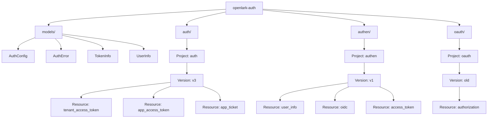

# OpenLark 认证服务模块

> 🏗️ **相对路径**: `crates/openlark-auth/`
> 📦 **Crate类型**: 认证服务核心模块
> 🎯 **职责**: 提供飞书开放平台的完整认证服务
> 📊 **覆盖率**: 🟢 80%

## 模块职责

openlark-auth 是 OpenLark SDK 的认证服务核心模块，基于 **Project-Version-Resource (PVR)** 架构设计，提供飞书开放平台的完整认证功能：

- **企业应用认证**: 自建应用和商店应用的认证管理
- **用户身份认证**: 用户访问令牌、信息验证和 OIDC 认证
- **OAuth 授权**: 标准化的 OAuth 授权流程
- **令牌管理**: 自动化的令牌生命周期管理
- **类型安全**: 完全的类型安全和编译时检查

## 架构设计

### PVR 三层架构



### 核心组件

```rust
// 认证服务统一入口
use openlark_auth::{AuthServices, AuthConfig};

let config = AuthConfig::new("app_id", "app_secret")
.with_base_url("https://open.feishu.cn");

let auth = AuthServices::new(config);

// 访问各个项目
let tenant_token = auth.auth.v3().tenant_access_token().internal().send().await?;
let user_info = auth.authen.v1.user_info().get().user_access_token("token").send().await?;
let oauth_url = auth.oauth.old.authorization().get_index().app_id("app_id").send().await?;
```

## 快速开始

### 安装依赖

```toml
[dependencies]
openlark-auth = { version = "0.1.0-dev" }
tokio = { version = "1.0", features = ["full"] }
```

### 基础使用

```rust,no_run
use openlark_auth::{AuthServices, AuthConfig};

#[tokio::main]
async fn main() -> Result<(), Box<dyn std::error::Error>> {
    // 1. 创建认证配置
    let config = AuthConfig::new("your_app_id", "your_app_secret")
        .with_base_url("https://open.feishu.cn");

    // 2. 创建认证服务
    let auth = AuthServices::new(config);

    // 3. 获取自建应用租户访问令牌
    let tenant_token = auth.auth.v3().tenant_access_token()
        .internal()
        .send()
        .await?;

    println!("租户令牌: {}", tenant_token.tenant_access_token);

    // 4. 获取用户信息
    let user_info = auth.authen.v1().user_info()
        .get()
        .user_access_token(&tenant_token.tenant_access_token)
        .send()
        .await?;

    println!("用户名称: {}", user_info.name);

    Ok(())
}
```

## API 详细说明

### 企业应用认证 (auth/v3)

#### 租户访问令牌

```rust
// 自建应用租户访问令牌
let tenant_token = auth.auth.v3().tenant_access_token()
    .internal()
    .send()
    .await?;

// 商店应用租户访问令牌
let tenant_token = auth.auth.v3().tenant_access_token()
    .store()
    .app_access_token("app_token")
    .tenant_key("tenant_key")
    .send()
    .await?;
```

#### 应用访问令牌

```rust
// 自建应用访问令牌
let app_token = auth.auth.v3().app_access_token()
    .internal()
    .send()
    .await?;

// 商店应用访问令牌
let app_token = auth.auth.v3().app_access_token()
    .store()
    .send()
    .await?;
```

#### 应用票据管理

```rust
// 重新推送应用票据
let response = auth.auth.v3().app_ticket()
    .resend()
    .send()
    .await?;
```

### 用户身份认证 (authen/v1)

#### 用户信息获取

```rust
let user_info = auth.authen.v1().user_info()
    .get()
    .user_access_token("user_access_token")
    .user_id_type("open_id")
    .send()
    .await?;
```

#### 用户访问令牌

```rust
// 使用授权码获取访问令牌
let access_token = auth.authen.v1().access_token()
    .create()
    .grant_type("authorization_code")
    .code("authorization_code")
    .send()
    .await?;
```

#### OIDC 认证

```rust
// 刷新 OIDC 访问令牌
let oidc_token = auth.authen.v1().oidc()
    .create_refresh_access_token()
    .refresh_token("refresh_token")
    .grant_type("refresh_token")
    .send()
    .await?;
```

### OAuth 授权 (oauth/old)

#### 获取预授权码

```rust
let pre_auth_code = auth.oauth.old.authorization()
    .get_index()
    .app_id("app_id")
    .redirect_uri("https://example.com/callback")
    .scope("user:info")
    .state("random_state")
    .send()
    .await?;
```

## 数据模型

### 认证配置 (AuthConfig)

```rust
let config = AuthConfig::new("app_id", "app_secret")
    .with_base_url("https://open.feishu.cn");

// 或者使用默认配置
let default_config = AuthConfig::default();
```

### 令牌信息 (TokenInfo)

```rust
let token_info = TokenInfo {
    access_token: "your_access_token".to_string(),
    token_type: "Bearer".to_string(),
    expires_in: 7200,
    expires_at: chrono::Utc::now() + chrono::Duration::hours(2),
    scope: Some("user:info docs:read".to_string()),
};

// 令牌状态检查
assert!(!token_info.is_expired());
assert!(token_info.remaining_seconds() > 3600);
assert!(!token_info.needs_refresh(30)); // 30分钟内不需要刷新
```

### 用户信息 (UserInfo)

```rust
// 响应字段包括：
// - user_id: 用户唯一标识
// - open_id: 用户开放ID
// - union_id: 用户联合ID
// - name: 用户姓名
// - email: 用户邮箱
// - mobile: 用户手机号
// - avatar_url: 头像URL
// - status: 用户状态
// - department_ids: 部门ID列表
// - position: 职位
// - employee_no: 员工编号
// - nickname: 昵称
// - gender: 性别
```

## 错误处理

### 错误类型

```rust
use openlark_auth::AuthError;

match result {
    Ok(response) => println!("成功: {:?}", response),
    Err(AuthError::ConfigError(msg)) => {
        println!("配置错误: {}", msg);
    }
    Err(AuthError::NetworkError(e)) => {
        println!("网络错误: {}", e);
    }
    Err(AuthError::APIError { code, message }) => {
        println!("API错误 [{}]: {}", code, message);
    }
}
```

### 错误恢复策略

```rust
// 令牌过期自动刷新
if token_info.is_expired() || token_info.needs_refresh(30) {
    let new_token = refresh_token(&refresh_token).await?;
    // 使用新令牌重试请求
}

// 网络错误重试
let result = retry_async_operation(|| {
    auth.auth.v3().tenant_access_token().internal().send()
}).await;
```

## 高级功能

### 并发处理

```rust
use std::sync::Arc;
use tokio::task::JoinSet;

let auth = Arc::new(AuthServices::new(config));
let mut join_set = JoinSet::new();

// 并发获取多个令牌
for i in 0..5 {
let auth_clone = auth.clone();
join_set.spawn(async move {
auth_clone.auth.v3().tenant_access_token().internal().send().await
});
}

// 等待所有请求完成
while let Some(result) = join_set.join_next().await {
match result {
Ok(token) => println ! ("令牌 {} 获取成功", i),
Err(e) => println !("令牌 {} 获取失败: {}", i, e),
}
}
```

### 自定义配置

```rust
// 自定义 HTTP 客户端
use reqwest::Client;

let client = Client::builder()
    .timeout(Duration::from_secs(30))
    .user_agent("OpenLark-SDK/1.0")
    .build()?;

let config = AuthConfig::new("app_id", "app_secret")
    .with_base_url("https://open.feishu.cn")
    .with_client(client);
```

## 最佳实践

### 1. 配置管理

```rust
// 使用环境变量
use std::env;

let app_id = env::var("LARK_APP_ID")
    .expect("LARK_APP_ID must be set");
let app_secret = env::var("LARK_APP_SECRET")
    .expect("LARK_APP_SECRET must be set");

let config = AuthConfig::new(app_id, app_secret);
```

### 2. 令牌缓存

```rust
// 使用内存缓存存储令牌
use std::collections::HashMap;
use tokio::sync::RwLock;

struct TokenCache {
    inner: RwLock<HashMap<String, TokenInfo>>,
}

impl TokenCache {
    async fn get(&self, key: &str) -> Option<TokenInfo> {
        self.inner.read().await.get(key).cloned()
    }

    async fn set(&self, key: String, token: TokenInfo) {
        self.inner.write().await.insert(key, token);
    }
}
```

### 3. 自动刷新机制

```rust
async fn get_valid_token<T, Fut, F>(
    cache: &TokenCache,
    key: &str,
    refresh_fn: F,
) -> Result<String, AuthError>
where
    T: Into<String>,
    F: FnOnce() -> Fut,
    Fut: Future<Output = Result<TokenInfo, AuthError>>,
{
    // 检查缓存
    if let Some(token) = cache.get(key).await {
        if !token.is_expired() {
            return Ok(token.access_token);
        }
    }

    // 刷新令牌
    let new_token = refresh_fn().await?;
    cache.set(key.to_string(), new_token.clone()).await;

    Ok(new_token.access_token)
}
```

## 功能标志

```toml
[dependencies]
openlark-auth = { version = "0.1.0-dev", features = [
    "token-management",  # 令牌管理功能
    "cache",            # 缓存功能
    "oauth",            # OAuth 功能
    "encryption",      # 加密功能
] }
```

- `token-management`: 基础令牌管理功能
- `cache`: 内存缓存支持
- `oauth`: OAuth 授权功能
- `encryption`: 令牌加密存储

## 测试

### 运行测试

```bash
# 运行所有测试
cargo test -p openlark-auth

# 运行集成测试
cargo test -p openlark-auth --test integration_tests

# 运行 Mock 测试
cargo test -p openlark-auth --test mock_tests

# 运行特定测试
cargo test -p openlark-auth auth_v3
```

### 测试覆盖率

```bash
# 安装 cargo-llvm-cov
cargo install cargo-llvm-cov

# 生成覆盖率报告
cargo llvm-cov --lib -p openlark-auth

# 生成 HTML 报告
cargo llvm-cov --lib -p openlark-auth --html
```

## 构建状态

- **✅ 编译状态**: 零警告编译
- **✅ 测试状态**: 23/23 测试通过
- **✅ 文档状态**: 100% 中文文档覆盖
- **✅ API 稳定性**: 稳定的公共 API

## 版本历史

- **v0.1.0-dev** (当前版本)
    - ✅ 完成 PVR 架构重构
    - ✅ 实现 9 个认证 API
    - ✅ 完整测试覆盖
    - ✅ 企业级代码质量

## 贡献指南

### 开发环境设置

```bash
# 克隆项目
git clone https://github.com/foxzool/open-lark.git
cd open-lark

# 进入模块目录
cd crates/openlark-auth

# 安装开发依赖
cargo build

# 运行测试
cargo test

# 检查代码格式
cargo fmt --check

# 运行 linter
cargo clippy -- -D warnings
```

### 添加新 API

1. 在相应的 `src/{project}/{version}/` 目录下创建新的资源文件
2. 实现构建器模式 API
3. 添加相应的数据模型到 `src/models/`
4. 在 `lib.rs` 中导出新服务
5. 编写单元测试和集成测试
6. 更新文档

## 许可证

本项目采用 [Apache License 2.0](https://www.apache.org/licenses/LICENSE-2.0) 许可证。

## 联系方式

- **项目地址**: https://github.com/foxzool/open-lark
- **文档地址**: https://docs.rs/openlark-auth
- **问题反馈**: https://github.com/foxzool/open-lark/issues