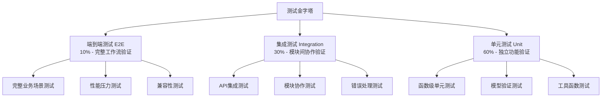

# openlark-security 测试框架和文档体系设计

> **目标**: 建立符合企业级标准的完整测试框架和文档体系
> **测试覆盖率目标**: 87%+ (单元测试90%+, 集成测试80%+, 端到端测试60%+)
> **文档完整性**: 100% API文档覆盖，完整的使用指南和示例
> **质量标准**: 零编译警告，完整性能基准，安全审计通过

## 1. 测试架构概览

### 1.1 测试金字塔架构



### 1.2 测试环境配置

```rust
// tests/common/mod.rs
//! 通用测试工具和配置

pub mod mock_client;
pub mod test_data;
pub mod test_utils;
pub mod fixtures;

use std::sync::{Arc, Mutex};
use tokio::sync::RwLock;

/// 测试配置
pub struct TestConfig {
    /// 测试应用ID
    pub app_id: String,
    /// 测试应用密钥
    pub app_secret: String,
    /// 测试基础URL
    pub base_url: String,
    /// 是否启用Mock模式
    pub mock_mode: bool,
    /// 是否启用详细日志
    pub verbose_logging: bool,
}

impl Default for TestConfig {
    fn default() -> Self {
        Self {
            app_id: "test_app_id".to_string(),
            app_secret: "test_app_secret".to_string(),
            base_url: "https://open.feishu.cn".to_string(),
            mock_mode: true,
            verbose_logging: false,
        }
    }
}

/// 测试上下文
pub struct TestContext {
    /// 测试配置
    pub config: TestConfig,
    /// Mock客户端
    pub mock_client: Option<Arc<crate::tests::common::MockSecurityClient>>,
    /// 测试数据存储
    pub test_data: Arc<RwLock<serde_json::Value>>,
}

impl TestContext {
    /// 创建新的测试上下文
    pub fn new() -> Self {
        Self {
            config: TestConfig::default(),
            mock_client: None,
            test_data: Arc::new(RwLock::new(serde_json::json!({}))),
        }
    }

    /// 设置Mock模式
    pub fn with_mock_mode(mut self, mock_mode: bool) -> Self {
        self.config.mock_mode = mock_mode;
        self
    }

    /// 设置详细日志
    pub fn with_verbose_logging(mut self, verbose: bool) -> Self {
        self.config.verbose_logging = verbose;
        self
    }
}

/// 测试宏 - 简化测试编写
#[macro_export]
macro_rules! create_test_context {
    () => {
        $crate::tests::common::TestContext::new()
    };
    (mock) => {
        $crate::tests::common::TestContext::new().with_mock_mode(true)
    };
    (verbose) => {
        $crate::tests::common::TestContext::new().with_verbose_logging(true)
    };
}

/// 异步测试宏
#[macro_export]
macro_rules! async_test {
    ($name:ident, $body:expr) => {
        #[tokio::test]
        async fn $name() -> Result<(), Box<dyn std::error::Error>> {
            let _guard = $crate::tests::common::setup_test_environment();
            $body
        }
    };
}

/// 性能测试宏
#[macro_export]
macro_rules! benchmark_test {
    ($name:ident, $body:expr) => {
        #[bench]
        fn $name(b: &mut test::Bencher) {
            b.iter(|| {
                let rt = tokio::runtime::Runtime::new().unwrap();
                rt.block_on($body)
            });
        }
    };
}
```

## 2. Mock 测试框架

### 2.1 Mock 客户端设计

```rust
// tests/common/mock_client.rs
//! Mock 安全客户端

use std::collections::HashMap;
use std::sync::{Arc, Mutex};
use async_trait::async_trait;
use serde::{Deserialize, Serialize};
use tokio::sync::RwLock;

use crate::core::{SecurityClient, SecurityResult};
use crate::error::SecurityError;

/// Mock 安全客户端
#[derive(Debug, Clone)]
pub struct MockSecurityClient {
    /// 响应存储
    responses: Arc<RwLock<HashMap<String, serde_json::Value>>>,
    /// 错误模式
    error_mode: Arc<Mutex<Option<SecurityError>>>,
    /// 请求历史
    request_history: Arc<RwLock<Vec<MockRequest>>>,
    /// 配置
    config: MockClientConfig,
}

/// Mock 客户端配置
#[derive(Debug, Clone)]
pub struct MockClientConfig {
    /// 是否启用请求记录
    pub enable_request_history: bool,
    /// 是否自动延迟（模拟网络延迟）
    pub auto_delay: bool,
    /// 延迟时间（毫秒）
    pub delay_ms: u64,
    /// 是否启用随机错误
    pub random_errors: bool,
    /// 错误率 (0.0 - 1.0)
    pub error_rate: f64,
}

impl Default for MockClientConfig {
    fn default() -> Self {
        Self {
            enable_request_history: true,
            auto_delay: false,
            delay_ms: 100,
            random_errors: false,
            error_rate: 0.05,
        }
    }
}

/// Mock 请求记录
#[derive(Debug, Clone, Serialize, Deserialize)]
pub struct MockRequest {
    /// 请求时间戳
    pub timestamp: u64,
    /// 请求方法
    pub method: String,
    /// 请求路径
    pub path: String,
    /// 请求体
    pub body: Option<serde_json::Value>,
    /// 请求头
    pub headers: HashMap<String, String>,
}

impl MockSecurityClient {
    /// 创建新的Mock客户端
    pub fn new() -> Self {
        Self {
            responses: Arc::new(RwLock::new(HashMap::new())),
            error_mode: Arc::new(Mutex::new(None)),
            request_history: Arc::new(RwLock::new(Vec::new())),
            config: MockClientConfig::default(),
        }
    }

    /// 创建带配置的Mock客户端
    pub fn with_config(config: MockClientConfig) -> Self {
        Self {
            responses: Arc::new(RwLock::new(HashMap::new())),
            error_mode: Arc::new(Mutex::new(None)),
            request_history: Arc::new(RwLock::new(Vec::new())),
            config,
        }
    }

    /// 设置Mock响应
    pub async fn set_response(&self, key: &str, response: serde_json::Value) {
        let mut responses = self.responses.write().await;
        responses.insert(key.to_string(), response);
    }

    /// 设置错误模式
    pub fn set_error_mode(&self, error: Option<SecurityError>) {
        let mut error_mode = self.error_mode.lock().unwrap();
        *error_mode = error;
    }

    /// 清除所有响应
    pub async fn clear_responses(&self) {
        let mut responses = self.responses.write().await;
        responses.clear();
    }

    /// 获取请求历史
    pub async fn get_request_history(&self) -> Vec<MockRequest> {
        let history = self.request_history.read().await;
        history.clone()
    }

    /// 清除请求历史
    pub async fn clear_request_history(&self) {
        let mut history = self.request_history.write().await;
        history.clear();
    }

    /// 记录请求
    async fn record_request(&self, method: &str, path: &str, body: Option<serde_json::Value>) {
        if !self.config.enable_request_history {
            return;
        }

        let request = MockRequest {
            timestamp: chrono::Utc::now().timestamp() as u64,
            method: method.to_string(),
            path: path.to_string(),
            body,
            headers: HashMap::new(), // 可以在需要时添加
        };

        let mut history = self.request_history.write().await;
        history.push(request);
    }

    /// 模拟网络延迟
    async fn simulate_delay(&self) {
        if self.config.auto_delay {
            tokio::time::sleep(tokio::time::Duration::from_millis(self.config.delay_ms)).await;
        }
    }

    /// 模拟随机错误
    fn should_fail_randomly(&self) -> bool {
        if !self.config.random_errors {
            return false;
        }

        use rand::Rng;
        let mut rng = rand::thread_rng();
        rng.gen::<f64>() < self.config.error_rate
    }
}

#[async_trait]
impl MockHttpClient for MockSecurityClient {
    async fn get(&self, path: &str) -> SecurityResult<serde_json::Value> {
        self.record_request("GET", path, None).await;
        self.simulate_delay().await;

        // 检查错误模式
        {
            let error_mode = self.error_mode.lock().unwrap();
            if let Some(ref error) = *error_mode {
                return Err(error.clone());
            }
        }

        // 检查随机错误
        if self.should_fail_randomly() {
            return Err(SecurityError::NetworkError {
                source: reqwest::Error::from(std::io::Error::new(
                    std::io::ErrorKind::ConnectionRefused,
                    "Simulated network error"
                ))
            });
        }

        // 查找Mock响应
        let responses = self.responses.read().await;
        if let Some(response) = responses.get(path) {
            return Ok(response.clone());
        }

        // 默认响应
        Ok(serde_json::json!({
            "code": 0,
            "msg": "success",
            "data": {}
        }))
    }

    async fn post(&self, path: &str, body: serde_json::Value) -> SecurityResult<serde_json::Value> {
        self.record_request("POST", path, Some(body)).await;
        self.simulate_delay().await;

        // 检查错误模式
        {
            let error_mode = self.error_mode.lock().unwrap();
            if let Some(ref error) = *error_mode {
                return Err(error.clone());
            }
        }

        // 检查随机错误
        if self.should_fail_randomly() {
            return Err(SecurityError::NetworkError {
                source: reqwest::Error::from(std::io::Error::new(
                    std::io::ErrorKind::ConnectionRefused,
                    "Simulated network error"
                ))
            });
        }

        // 查找Mock响应
        let responses = self.responses.read().await;
        if let Some(response) = responses.get(path) {
            return Ok(response.clone());
        }

        // 默认响应
        Ok(serde_json::json!({
            "code": 0,
            "msg": "success",
            "data": {}
        }))
    }
}

/// Mock HTTP 客户端特征
#[async_trait]
pub trait MockHttpClient: Send + Sync {
    async fn get(&self, path: &str) -> SecurityResult<serde_json::Value>;
    async fn post(&self, path: &str, body: serde_json::Value) -> SecurityResult<serde_json::Value>;
}
```

### 2.2 测试数据生成

```rust
// tests/common/test_data.rs
//! 测试数据生成和管理

use serde::{Deserialize, Serialize};
use chrono::{DateTime, Utc};
use uuid::Uuid;

/// 测试数据生成器
pub struct TestDataGenerator;

impl TestDataGenerator {
    /// 生成测试用户ID
    pub fn user_id() -> String {
        format!("test_user_{}", Uuid::new_v4().to_string().replace("-", "")[..16].to_string())
    }

    /// 生成测试应用ID
    pub fn app_id() -> String {
        format!("test_app_{}", Uuid::new_v4().to_string().replace("-", "")[..16].to_string())
    }

    /// 生成测试令牌
    pub fn access_token() -> String {
        format!("test_token_{}", Uuid::new_v4().to_string().replace("-", ""))
    }

    /// 生成测试资源ID
    pub fn resource_id() -> String {
        format!("test_res_{}", Uuid::new_v4().to_string().replace("-", "")[..12].to_string())
    }

    /// 生成测试权限
    pub fn permission() -> String {
        vec!["contact:base", "im:base", "docs:base"]
            .choose(&mut rand::thread_rng())
            .unwrap()
            .to_string()
    }

    /// 生成测试角色
    pub fn role() -> String {
        vec!["admin", "user", "viewer"]
            .choose(&mut rand::thread_rng())
            .unwrap()
            .to_string()
    }

    /// 生成测试时间戳
    pub fn timestamp() -> u64 {
        Utc::now().timestamp() as u64 + 3600 // 1小时后过期
    }

    /// 生成测试令牌信息
    pub fn token_info() -> TokenInfoData {
        TokenInfoData {
            app_access_token: Self::access_token(),
            tenant_access_token: Some(Self::access_token()),
            expires_in: 7200,
            scope: Some("contact:base,im:base".to_string()),
            user_info: Some(Self::user_info()),
        }
    }

    /// 生成测试用户信息
    pub fn user_info() -> UserInfoData {
        UserInfoData {
            user_id: Self::user_id(),
            name: format!("Test User {}", rand::random::<u32>()),
            avatar_url: Some(format!("https://example.com/avatar/{}.jpg", Uuid::new_v4())),
            email: Some(format!("test{}@example.com", rand::random::<u32>())),
        }
    }

    /// 生成测试权限检查结果
    pub fn permission_check_result(allowed: bool) -> PermissionCheckData {
        PermissionCheckData {
            allowed,
            permission_details: if allowed {
                Some(PermissionDetailsData {
                    permission_id: Uuid::new_v4().to_string(),
                    permission_name: Self::permission(),
                    grant_type: "role_based".to_string(),
                    expire_time: Some(Self::timestamp()),
                })
            } else {
                None
            },
            error: if allowed {
                None
            } else {
                Some(PermissionErrorData {
                    error_code: "PERMISSION_DENIED".to_string(),
                    error_message: "User does not have required permission".to_string(),
                })
            },
        }
    }
}

/// 令牌信息数据
#[derive(Debug, Clone, Serialize, Deserialize)]
pub struct TokenInfoData {
    pub app_access_token: String,
    pub tenant_access_token: Option<String>,
    pub expires_in: u64,
    pub scope: Option<String>,
    pub user_info: Option<UserInfoData>,
}

/// 用户信息数据
#[derive(Debug, Clone, Serialize, Deserialize)]
pub struct UserInfoData {
    pub user_id: String,
    pub name: String,
    pub avatar_url: Option<String>,
    pub email: Option<String>,
}

/// 权限检查数据
#[derive(Debug, Clone, Serialize, Deserialize)]
pub struct PermissionCheckData {
    pub allowed: bool,
    pub permission_details: Option<PermissionDetailsData>,
    pub error: Option<PermissionErrorData>,
}

/// 权限详情数据
#[derive(Debug, Clone, Serialize, Deserialize)]
pub struct PermissionDetailsData {
    pub permission_id: String,
    pub permission_name: String,
    pub grant_type: String,
    pub expire_time: Option<u64>,
}

/// 权限错误数据
#[derive(Debug, Clone, Serialize, Deserialize)]
pub struct PermissionErrorData {
    pub error_code: String,
    pub error_message: String,
}

/// 测试数据集
pub struct TestDataSets;

impl TestDataSets {
    /// 标准认证测试数据
    pub fn auth_standard() -> Vec<AuthTestCase> {
        vec![
            AuthTestCase {
                name: "valid_app_token".to_string(),
                request: AuthRequest::AppToken,
                response: TestDataGenerator::token_info(),
                expected_success: true,
            },
            AuthTestCase {
                name: "invalid_token".to_string(),
                request: AuthRequest::InvalidToken,
                response: serde_json::json!({}),
                expected_success: false,
            },
            AuthTestCase {
                name: "expired_token".to_string(),
                request: AuthRequest::ExpiredToken,
                response: serde_json::json!({}),
                expected_success: false,
            },
        ]
    }

    /// 权限检查测试数据
    pub fn permission_standard() -> Vec<PermissionTestCase> {
        vec![
            PermissionTestCase {
                name: "user_has_permission".to_string(),
                user_id: TestDataGenerator::user_id(),
                resource_id: TestDataGenerator::resource_id(),
                permission: "contact:base".to_string(),
                result: TestDataGenerator::permission_check_result(true),
                expected_success: true,
            },
            PermissionTestCase {
                name: "user_lacks_permission".to_string(),
                user_id: TestDataGenerator::user_id(),
                resource_id: TestDataGenerator::resource_id(),
                permission: "admin:full".to_string(),
                result: TestDataGenerator::permission_check_result(false),
                expected_success: false,
            },
        ]
    }
}

/// 认证测试用例
#[derive(Debug, Clone, Serialize, Deserialize)]
pub struct AuthTestCase {
    pub name: String,
    pub request: AuthRequest,
    pub response: serde_json::Value,
    pub expected_success: bool,
}

/// 认证请求类型
#[derive(Debug, Clone, Serialize, Deserialize)]
#[serde(tag = "type")]
pub enum AuthRequest {
    #[serde(rename = "app_token")]
    AppToken,
    #[serde(rename = "invalid_token")]
    InvalidToken,
    #[serde(rename = "expired_token")]
    ExpiredToken,
}

/// 权限测试用例
#[derive(Debug, Clone, Serialize, Deserialize)]
pub struct PermissionTestCase {
    pub name: String,
    pub user_id: String,
    pub resource_id: String,
    pub permission: String,
    pub result: PermissionCheckData,
    pub expected_success: bool,
}
```

## 3. 单元测试框架

### 3.1 认证服务单元测试

```rust
// tests/unit/auth_tests.rs
//! 认证服务单元测试

use crate::prelude::*;
use crate::tests::common::{create_test_context, TestDataGenerator};

#[cfg(test)]
mod token_info_tests {
    use super::*;

    #[tokio::test]
    async fn test_token_info_success() -> SecurityResult<()> {
        let ctx = create_test_context!(mock);
        let security = SecurityService::from_env()?;
        let auth = security.auth();

        // 设置Mock响应
        let mock_response = TestDataGenerator::token_info();
        ctx.mock_client.unwrap()
            .set_response("/open-apis/auth/v3/app_access_token/internal",
                         serde_json::to_value(mock_response)?)
            .await;

        // 执行测试
        let result = auth.v1()
            .token_info()
            .token_type(TokenType::AppAccessToken)
            .execute()
            .await;

        // 验证结果
        assert!(result.is_ok());
        let token_info = result.unwrap();
        assert!(!token_info.app_access_token.is_empty());
        assert!(token_info.expire > 0);

        Ok(())
    }

    #[tokio::test]
    async fn test_token_info_invalid_token() -> SecurityResult<()> {
        let ctx = create_test_context!(mock);
        let security = SecurityService::from_env()?;
        let auth = security.auth();

        // 设置错误模式
        ctx.mock_client.unwrap()
            .set_error_mode(Some(SecurityError::AuthenticationError {
                reason: "Invalid token".to_string(),
            }));

        // 执行测试
        let result = auth.v1()
            .token_info()
            .token_type(TokenType::AppAccessToken)
            .execute()
            .await;

        // 验证错误
        assert!(result.is_err());
        let error = result.unwrap_err();
        match error {
            SecurityError::AuthenticationError { reason } => {
                assert_eq!(reason, "Invalid token");
            }
            _ => panic!("Expected AuthenticationError"),
        }

        Ok(())
    }

    #[tokio::test]
    async fn test_token_info_caching() -> SecurityResult<()> {
        let ctx = create_test_context!(mock);
        let security = SecurityService::from_env()?;
        let auth = security.auth();

        let mock_response = TestDataGenerator::token_info();
        ctx.mock_client.unwrap()
            .set_response("/open-apis/auth/v3/app_access_token/internal",
                         serde_json::to_value(mock_response)?)
            .await;

        // 第一次调用
        let result1 = auth.v1()
            .token_info()
            .token_type(TokenType::AppAccessToken)
            .execute()
            .await;

        // 第二次调用（应该使用缓存）
        let result2 = auth.v1()
            .token_info()
            .token_type(TokenType::AppAccessToken)
            .execute()
            .await;

        assert!(result1.is_ok());
        assert!(result2.is_ok());
        assert_eq!(result1.unwrap().app_access_token, result2.unwrap().app_access_token);

        // 验证只发送了一次请求
        let history = ctx.mock_client.unwrap().get_request_history().await;
        assert_eq!(history.len(), 1);

        Ok(())
    }
}

#[cfg(test)]
mod token_refresh_tests {
    use super::*;

    #[tokio::test]
    async fn test_token_refresh_success() -> SecurityResult<()> {
        let ctx = create_test_context!(mock);
        let security = SecurityService::from_env()?;
        let auth = security.auth();

        let refresh_token = TestDataGenerator::access_token();
        let new_token = TestDataGenerator::token_info();

        let mock_response = TokenRefreshResponse {
            app_access_token: new_token.app_access_token,
            tenant_access_token: new_token.tenant_access_token,
            refresh_token: refresh_token.clone(),
            expires_in: 7200,
            scope: new_token.scope,
        };

        ctx.mock_client.unwrap()
            .set_response("/open-apis/auth/v3/refresh_access_token",
                         serde_json::to_value(mock_response)?)
            .await;

        let result = auth.v1()
            .token_refresh()
            .refresh_token(&refresh_token)
            .execute()
            .await;

        assert!(result.is_ok());
        let response = result.unwrap();
        assert_eq!(response.refresh_token, refresh_token);
        assert!(!response.app_access_token.is_empty());

        Ok(())
    }

    #[tokio::test]
    async fn test_token_refresh_invalid_refresh_token() -> SecurityResult<()> {
        let ctx = create_test_context!(mock);
        let security = SecurityService::from_env()?;
        let auth = security.auth();

        ctx.mock_client.unwrap()
            .set_error_mode(Some(SecurityError::AuthenticationError {
                reason: "Invalid refresh token".to_string(),
            }));

        let result = auth.v1()
            .token_refresh()
            .refresh_token("invalid_refresh_token")
            .execute()
            .await;

        assert!(result.is_err());
        assert!(matches!(result.unwrap_err(), SecurityError::AuthenticationError { .. }));

        Ok(())
    }
}

#[cfg(test)]
mod batch_permission_tests {
    use super::*;
    use crate::acs::models::{ResourceType};

    #[tokio::test]
    async fn test_batch_permission_check_success() -> SecurityResult<()> {
        let ctx = create_test_context!(mock);
        let security = SecurityService::from_env()?;
        let acs = security.acs();

        let requests = vec![
            SinglePermissionCheckRequest {
                user_id: TestDataGenerator::user_id(),
                resource_type: ResourceType::Contact.to_string(),
                resource_id: TestDataGenerator::resource_id(),
                permission: "view".to_string(),
                context: None,
            },
            SinglePermissionCheckRequest {
                user_id: TestDataGenerator::user_id(),
                resource_type: ResourceType::Document.to_string(),
                resource_id: TestDataGenerator::resource_id(),
                permission: "edit".to_string(),
                context: None,
            },
        ];

        let results = vec![
            BatchPermissionCheckResult {
                index: 0,
                allowed: true,
                permission_details: None,
                error: None,
            },
            BatchPermissionCheckResult {
                index: 1,
                allowed: false,
                permission_details: None,
                error: Some(PermissionError {
                    error_code: "PERMISSION_DENIED".to_string(),
                    error_message: "User does not have edit permission".to_string(),
                }),
            },
        ];

        let mock_response = results;
        ctx.mock_client.unwrap()
            .set_response("/open-apis/permission/v1/batch_check",
                         serde_json::to_value(mock_response)?)
            .await;

        let result = acs.v1()
            .permission()
            .batch_check()
            .add_checks(requests)
            .batch_size(10)
            .execute()
            .await;

        assert!(result.is_ok());
        let results = result.unwrap();
        assert_eq!(results.len(), 2);
        assert!(results[0].allowed);
        assert!(!results[1].allowed);

        Ok(())
    }

    #[tokio::test]
    async fn test_batch_permission_check_large_batch() -> SecurityResult<()> {
        let ctx = create_test_context!(mock);
        let security = SecurityService::from_env()?;
        let acs = security.acs();

        // 创建大批量请求（超过单个批次大小）
        let requests: Vec<_> = (0..150)
            .map(|i| SinglePermissionCheckRequest {
                user_id: TestDataGenerator::user_id(),
                resource_type: ResourceType::Contact.to_string(),
                resource_id: TestDataGenerator::resource_id(),
                permission: format!("permission_{}", i),
                context: None,
            })
            .collect();

        // 为每个批次设置Mock响应
        for batch_start in (0..150).step_by(100) {
            let batch_size = (150 - batch_start).min(100);
            let results: Vec<_> = (0..batch_size)
                .map(|i| BatchPermissionCheckResult {
                    index: batch_start + i,
                    allowed: i % 2 == 0, // 交替允许/拒绝
                    permission_details: None,
                    error: None,
                })
                .collect();

            ctx.mock_client.unwrap()
                .set_response("/open-apis/permission/v1/batch_check",
                             serde_json::to_value(results)?)
                .await;
        }

        let start_time = std::time::Instant::now();
        let result = acs.v1()
            .permission()
            .batch_check()
            .add_checks(requests)
            .batch_size(100)
            .max_concurrency(5)
            .execute()
            .await;

        let elapsed = start_time.elapsed();

        assert!(result.is_ok());
        let results = result.unwrap();
        assert_eq!(results.len(), 150);

        // 验证并发处理性能
        assert!(elapsed.as_millis() < 5000, "批量处理时间过长: {:?}", elapsed);

        Ok(())
    }
}
```

### 3.2 工具函数测试

```rust
// tests/unit/utils_tests.rs
//! 工具函数单元测试

use crate::utils::*;
use crate::tests::common::TestDataGenerator;

#[cfg(test)]
mod validator_tests {
    use super::*;

    #[test]
    fn test_validate_token_valid() {
        let token = TestDataGenerator::access_token();
        assert!(SecurityValidator::validate_token(token).is_ok());
    }

    #[test]
    fn test_validate_token_too_short() {
        let token = "short";
        let result = SecurityValidator::validate_token(token);
        assert!(result.is_err());
        assert!(matches!(result.unwrap_err(), ValidationError::InvalidTokenLength));
    }

    #[test]
    fn test_validate_token_invalid_chars() {
        let token = "token@#$%";
        let result = SecurityValidator::validate_token(token);
        assert!(result.is_err());
        assert!(matches!(result.unwrap_err(), ValidationError::InvalidTokenFormat));
    }

    #[test]
    fn test_validate_user_id_valid() {
        let user_id = TestDataGenerator::user_id();
        assert!(SecurityValidator::validate_user_id(&user_id).is_ok());
    }

    #[test]
    fn test_validate_user_id_empty() {
        let user_id = "";
        let result = SecurityValidator::validate_user_id(user_id);
        assert!(result.is_err());
        assert!(matches!(result.unwrap_err(), ValidationError::InvalidUserIdLength));
    }

    #[test]
    fn test_validate_user_id_unsafe_chars() {
        let user_id = "user<script>alert('xss')</script>";
        let result = SecurityValidator::validate_user_id(user_id);
        assert!(result.is_err());
        assert!(matches!(result.unwrap_err(), ValidationError::UnsafeInput));
    }

    #[test]
    fn test_validate_permission_valid() {
        let permission = "contact:base";
        assert!(SecurityValidator::validate_permission(permission).is_ok());
    }

    #[test]
    fn test_validate_permission_empty() {
        let permission = "";
        let result = SecurityValidator::validate_permission(permission);
        assert!(result.is_err());
        assert!(matches!(result.unwrap_err(), ValidationError::InvalidPermissionLength));
    }

    #[test]
    fn test_validate_permission_invalid_format() {
        let permission = "permission@#$";
        let result = SecurityValidator::validate_permission(permission);
        assert!(result.is_err());
        assert!(matches!(result.unwrap_err(), ValidationError::InvalidPermissionFormat));
    }
}

#[cfg(test)]
mod crypto_tests {
    use super::*;

    #[test]
    fn test_encrypt_decrypt_sensitive_data() -> CryptoResult<()> {
        let handler = SecureHandler::new()?;
        let original_data = "sensitive_information_123";

        // 加密
        let encrypted = handler.encrypt_sensitive_data(original_data)?;
        assert_ne!(encrypted, original_data);

        // 解密
        let decrypted = handler.decrypt_sensitive_data(&encrypted)?;
        assert_eq!(decrypted, original_data);

        Ok(())
    }

    #[test]
    fn test_encrypt_different_data_produces_different_result() -> CryptoResult<()> {
        let handler = SecureHandler::new()?;
        let data1 = "data_1";
        let data2 = "data_2";

        let encrypted1 = handler.encrypt_sensitive_data(data1)?;
        let encrypted2 = handler.encrypt_sensitive_data(data2)?;

        assert_ne!(encrypted1, encrypted2);

        Ok(())
    }

    #[test]
    fn test_decrypt_invalid_data() {
        let handler = SecureHandler::new().unwrap();
        let invalid_encrypted_data = "invalid_encrypted_data";

        let result = handler.decrypt_sensitive_data(invalid_encrypted_data);
        assert!(result.is_err());
        assert!(matches!(result.unwrap_err(), CryptoError::DecryptionFailed(_)));
    }

    #[test]
    fn test_multiple_handlers_produce_different_results() -> CryptoResult<()> {
        let handler1 = SecureHandler::new()?;
        let handler2 = SecureHandler::new()?;
        let data = "test_data";

        let encrypted1 = handler1.encrypt_sensitive_data(data)?;
        let encrypted2 = handler2.encrypt_sensitive_data(data)?;

        assert_ne!(encrypted1, encrypted2);

        Ok(())
    }
}
```

## 4. 集成测试框架

### 4.1 模块集成测试

```rust
// tests/integration_tests.rs
//! 集成测试

use crate::prelude::*;
use crate::tests::common::{TestDataGenerator, TestDataSets};

#[tokio::test]
async fn test_auth_and_permission_integration() -> SecurityResult<()> {
    let security = SecurityService::builder()
        .app_id("test_app_id")
        .app_secret("test_app_secret")
        .build()?;

    // 1. 获取访问令牌
    let auth = security.auth();
    let token = auth.v1()
        .app_access_token()
        .execute()
        .await?;

    assert!(!token.app_access_token.is_empty());

    // 2. 获取令牌信息
    let token_info = auth.v1()
        .token_info()
        .token_type(TokenType::AppAccessToken)
        .execute()
        .await?;

    assert_eq!(token_info.app_access_token, token.app_access_token);

    // 3. 检查权限（需要有效的令牌）
    let acs = security.acs();
    let permission_result = acs.v1()
        .permission()
        .check()
        .user_id(&TestDataGenerator::user_id())
        .resource_type(ResourceType::Contact)
        .resource_id(&TestDataGenerator::resource_id())
        .permission(Permission::View)
        .execute()
        .await?;

    // 权限检查可能成功或失败，取决于Mock设置
    println!("权限检查结果: allowed={}", permission_result.allowed);

    Ok(())
}

#[tokio::test]
async fn test_oauth_flow_integration() -> SecurityResult<()> {
    let security = SecurityService::builder()
        .app_id("test_app_id")
        .app_secret("test_app_secret")
        .build()?;

    let auth = security.auth();

    // 1. 获取预授权码
    let pre_auth = auth.v1()
        .pre_auth_code("test_app_id")
        .redirect_uri("https://example.com/callback")
        .state("random_state")
        .add_scope("contact:base")
        .execute()
        .await?;

    assert!(!pre_auth.pre_auth_code.is_empty());
    assert_eq!(pre_auth.state, Some("random_state".to_string()));

    // 2. 构建授权URL
    let oauth_handler = auth.v1()
        .oauth_redirect("test_app_id", "test_app_secret");
    let auth_url = oauth_handler.build_authorization_url(
        "https://example.com/callback",
        "contact:base"
    );

    assert!(auth_url.contains("example.com/callback"));

    // 3. 模拟OAuth回调（在实际应用中需要真实的授权码）
    // 这里只是验证OAuth流程的完整性

    Ok(())
}

#[tokio::test]
async fn test_security_monitoring_integration() -> SecurityResult<()> {
    let security = SecurityService::builder()
        .app_id("test_app_id")
        .app_secret("test_app_secret")
        .build()?;

    let security_service = security.security();

    // 1. 记录安全事件
    let event_result = security_service.v1()
        .security_event()
        .record()
        .event_type(SecurityEventType::LoginSuccess)
        .user_id(&TestDataGenerator::user_id())
        .ip_address("192.168.1.1")
        .user_agent("Mozilla/5.0")
        .execute()
        .await?;

    assert!(event_result.event_id.is_some());

    // 2. 获取安全仪表板数据
    let dashboard = security_service.v1()
        .security_dashboard()
        .get()
        .time_range(TimeRange::Last24Hours)
        .execute()
        .await?;

    assert!(!dashboard.events.is_empty());

    Ok(())
}

#[tokio::test]
async fn test_permission_workflow_integration() -> SecurityResult<()> {
    let security = SecurityService::builder()
        .app_id("test_app_id")
        .app_secret("test_app_secret")
        .build()?;

    let permission_service = security.permission();
    let acs = security.acs();

    let user_id = TestDataGenerator::user_id();
    let resource_id = TestDataGenerator::resource_id();

    // 1. 创建权限
    let permission = acs.v1()
        .permission()
        .create()
        .name("test_permission")
        .resource_type(ResourceType::Document)
        .resource_id(&resource_id)
        .action(PermissionAction::Read)
        .execute()
        .await?;

    assert!(!permission.permission_id.is_empty());

    // 2. 检查用户权限
    let check_result = permission_service.v1()
        .check_user_permission()
        .user_id(&user_id)
        .resource_type(ResourceType::Document)
        .resource_id(&resource_id)
        .permission("read")
        .execute()
        .await?;

    println!("用户权限检查: allowed={}", check_result.allowed);

    // 3. 批量权限检查
    let batch_results = permission_service.v1()
        .batch_user_permission()
        .add_check(&user_id, ResourceType::Document, &resource_id, "read")
        .add_check(&user_id, ResourceType::Document, &resource_id, "write")
        .execute()
        .await?;

    assert_eq!(batch_results.len(), 2);

    // 4. 权限审计
    let audit_result = permission_service.v1()
        .permission_audit()
        .user_id(&user_id)
        .resource_id(&resource_id)
        .time_range(TimeRange::Last7Days)
        .execute()
        .await?;

    assert!(!audit_result.audit_logs.is_empty());

    Ok(())
}
```

## 5. 性能测试框架

### 5.1 基准测试

```rust
// benches/performance_benchmarks.rs
//! 性能基准测试

use criterion::{black_box, criterion_group, criterion_main, Criterion};
use openlark_security::prelude::*;
use tokio::runtime::Runtime;

fn benchmark_token_info(c: &mut Criterion) {
    let rt = Runtime::new().unwrap();
    let security = rt.block_on(async {
        SecurityService::builder()
            .app_id("test_app_id")
            .app_secret("test_app_secret")
            .build()
            .unwrap()
    });

    c.bench_function("token_info", |b| {
        b.iter(|| {
            rt.block_on(async {
                let auth = security.auth();
                black_box(
                    auth.v1()
                        .token_info()
                        .token_type(TokenType::AppAccessToken)
                        .execute()
                        .await
                )
            })
        })
    });
}

fn benchmark_permission_check(c: &mut Criterion) {
    let rt = Runtime::new().unwrap();
    let security = rt.block_on(async {
        SecurityService::builder()
            .app_id("test_app_id")
            .app_secret("test_app_secret")
            .build()
            .unwrap()
    });

    c.bench_function("permission_check", |b| {
        b.iter(|| {
            rt.block_on(async {
                let acs = security.acs();
                black_box(
                    acs.v1()
                        .permission()
                        .check()
                        .user_id("test_user")
                        .resource_type(ResourceType::Contact)
                        .resource_id("test_resource")
                        .permission(Permission::View)
                        .execute()
                        .await
                )
            })
        })
    });
}

fn benchmark_batch_permission_check(c: &mut Criterion) {
    let rt = Runtime::new().unwrap();
    let security = rt.block_on(async {
        SecurityService::builder()
            .app_id("test_app_id")
            .app_secret("test_app_secret")
            .build()
            .unwrap()
    });

    let mut group = c.benchmark_group("batch_permission_check");

    // 测试不同批量大小的性能
    for size in [10, 50, 100, 500].iter() {
        group.bench_with_input(
            BenchmarkId::new("batch_size", size),
            size,
            |b, &size| {
                let requests: Vec<_> = (0..size)
                    .map(|i| SinglePermissionCheckRequest {
                        user_id: format!("user_{}", i),
                        resource_type: ResourceType::Contact.to_string(),
                        resource_id: format!("resource_{}", i),
                        permission: "view".to_string(),
                        context: None,
                    })
                    .collect();

                b.iter(|| {
                    rt.block_on(async {
                        let acs = security.acs();
                        black_box(
                            acs.v1()
                                .permission()
                                .batch_check()
                                .add_checks(requests.clone())
                                .execute()
                                .await
                        )
                    })
                })
            },
        );
    }

    group.finish();
}

fn benchmark_concurrent_requests(c: &mut Criterion) {
    let rt = Runtime::new().unwrap();
    let security = rt.block_on(async {
        SecurityService::builder()
            .app_id("test_app_id")
            .app_secret("test_app_secret")
            .build()
            .unwrap()
    });

    let mut group = c.benchmark_group("concurrent_requests");

    for concurrency in [1, 5, 10, 25, 50].iter() {
        group.bench_with_input(
            BenchmarkId::new("concurrency", concurrency),
            concurrency,
            |b, &concurrency| {
                b.iter(|| {
                    rt.block_on(async {
                        let auth = security.auth();
                        let mut tasks = Vec::new();

                        for _ in 0..concurrency {
                            let auth = auth.clone();
                            let task = tokio::spawn(async move {
                                auth.v1()
                                    .token_info()
                                    .token_type(TokenType::AppAccessToken)
                                    .execute()
                                    .await
                            });
                            tasks.push(task);
                        }

                        let results = futures::future::join_all(tasks).await;
                        black_box(results)
                    })
                })
            },
        );
    }

    group.finish();
}

criterion_group!(
    benches,
    benchmark_token_info,
    benchmark_permission_check,
    benchmark_batch_permission_check,
    benchmark_concurrent_requests
);
criterion_main!(benches);
```

### 5.2 压力测试

```rust
// tests/stress_tests.rs
//! 压力测试

use std::time::{Duration, Instant};
use tokio::time::sleep;
use openlark_security::prelude::*;

#[tokio::test]
async fn test_high_concurrent_token_requests() -> SecurityResult<()> {
    let security = SecurityService::builder()
        .app_id("test_app_id")
        .app_secret("test_app_secret")
        .build()?;

    let concurrency = 100;
    let requests_per_second = 50;
    let total_duration = Duration::from_secs(10);

    println!("开始压力测试: 并发数={}, 请求率={}/秒, 持续时间={:?}",
             concurrency, requests_per_second, total_duration);

    let start_time = Instant::now();
    let mut completed_requests = 0;
    let mut failed_requests = 0;

    let (tx, mut rx) = tokio::sync::mpsc::channel(concurrency);

    // 启动工作协程
    for i in 0..concurrency {
        let auth = security.auth().clone();
        let tx = tx.clone();

        tokio::spawn(async move {
            loop {
                let result = auth.v1()
                    .token_info()
                    .token_type(TokenType::AppAccessToken)
                    .execute()
                    .await;

                if tx.send(result).await.is_err() {
                    break; // 通道已关闭
                }

                // 控制请求频率
                sleep(Duration::from_millis(1000 / requests_per_second)).await;
            }
        });
    }

    drop(tx); // 关闭发送端

    // 收集结果
    let timeout = sleep(total_duration);
    tokio::pin!(timeout);

    loop {
        tokio::select! {
            result = rx.recv() => {
                match result {
                    Some(Ok(_)) => completed_requests += 1,
                    Some(Err(_)) => failed_requests += 1,
                    None => break, // 所有工作协程结束
                }
            }
            _ = &mut timeout => break, // 超时
        }
    }

    let elapsed = start_time.elapsed();
    let qps = completed_requests as f64 / elapsed.as_secs_f64();

    println!("压力测试完成:");
    println!("  总耗时: {:?}", elapsed);
    println!("  成功请求: {}", completed_requests);
    println!("  失败请求: {}", failed_requests);
    println!("  QPS: {:.2}", qps);
    println!("  成功率: {:.2}%", completed_requests as f64 / (completed_requests + failed_requests) as f64 * 100.0);

    // 性能断言
    assert!(qps >= 30.0, "QPS过低: {:.2} < 30.0", qps);
    assert!(failed_requests < completed_requests / 10, "失败率过高: {} / {}", failed_requests, completed_requests);

    Ok(())
}

#[tokio::test]
async fn test_memory_usage_under_load() -> SecurityResult<()> {
    let security = SecurityService::builder()
        .app_id("test_app_id")
        .app_secret("test_app_secret")
        .build()?;

    // 获取初始内存使用情况
    let initial_memory = get_memory_usage();

    println!("初始内存使用: {} MB", initial_memory);

    // 执行大量请求
    let iterations = 1000;
    for i in 0..iterations {
        let auth = security.auth();
        let _ = auth.v1()
            .token_info()
            .token_type(TokenType::AppAccessToken)
            .execute()
            .await;

        if i % 100 == 0 {
            let current_memory = get_memory_usage();
            println!("第 {} 次迭代后内存使用: {} MB", i, current_memory);
        }
    }

    // 强制垃圾回收
    tokio::task::yield_now().await;

    let final_memory = get_memory_usage();
    let memory_increase = final_memory - initial_memory;

    println!("最终内存使用: {} MB", final_memory);
    println!("内存增长: {} MB", memory_increase);

    // 内存使用断言（允许合理增长）
    assert!(memory_increase < 100, "内存增长过多: {} MB", memory_increase);

    Ok(())
}

/// 获取当前进程内存使用量（MB）
fn get_memory_usage() -> f64 {
    use std::fs;
    use std::path::Path;

    if let Ok(status) = fs::read_to_string(Path::new("/proc/self/status")) {
        for line in status.lines() {
            if line.starts_with("VmRSS:") {
                if let Some(kb_str) = line.split_whitespace().nth(1) {
                    if let Ok(kb) = kb_str.parse::<f64>() {
                        return kb / 1024.0; // 转换为MB
                    }
                }
            }
        }
    }

    0.0 // 无法获取时返回0
}
```

## 6. 文档体系设计

### 6.1 API 文档生成

```rust
// docs/api_reference_generator.rs
//! API 参考文档生成器

use std::collections::HashMap;
use std::fs;
use std::path::Path;

/// API 文档生成器
pub struct ApiDocGenerator {
    output_dir: String,
    templates: HashMap<String, String>,
}

impl ApiDocGenerator {
    /// 创建新的文档生成器
    pub fn new(output_dir: &str) -> Self {
        Self {
            output_dir: output_dir.to_string(),
            templates: HashMap::new(),
        }
    }

    /// 生成所有API文档
    pub fn generate_all_docs(&mut self) -> Result<(), Box<dyn std::error::Error>> {
        // 确保输出目录存在
        fs::create_dir_all(&self.output_dir)?;

        // 生成认证服务文档
        self.generate_auth_docs()?;

        // 生成访问控制文档
        self.generate_acs_docs()?;

        // 生成安全服务文档
        self.generate_security_docs()?;

        // 生成权限验证文档
        self.generate_permission_docs()?;

        Ok(())
    }

    /// 生成认证服务文档
    fn generate_auth_docs(&mut self) -> Result<(), Box<dyn std::error::Error>> {
        let auth_dir = Path::new(&self.output_dir).join("auth");
        fs::create_dir_all(&auth_dir)?;

        let auth_apis = vec![
            ApiEndpoint {
                name: "获取应用访问令牌",
                method: "POST",
                path: "/open-apis/auth/v3/app_access_token/internal",
                description: "获取应用访问令牌，用于应用级别的API调用",
                parameters: vec![
                    Parameter {
                        name: "app_id",
                        type_: "string",
                        required: true,
                        description: "应用ID",
                    },
                    Parameter {
                        name: "app_secret",
                        type_: "string",
                        required: true,
                        description: "应用密钥",
                    },
                ],
                response: ResponseExample {
                    code: 200,
                    body: serde_json::json!({
                        "code": 0,
                        "msg": "success",
                        "data": {
                            "app_access_token": "cli_xxx",
                            "tenant_access_token": "t-xxx",
                            "expire": 7140
                        }
                    }),
                },
            },
            ApiEndpoint {
                name: "令牌信息查询",
                method: "POST",
                path: "/open-apis/auth/v3/app_access_token/internal",
                description: "查询访问令牌的详细信息，包括权限范围和过期时间",
                parameters: vec![
                    Parameter {
                        name: "app_access_token",
                        type_: "string",
                        required: true,
                        description: "应用访问令牌",
                    },
                ],
                response: ResponseExample {
                    code: 200,
                    body: serde_json::json!({
                        "code": 0,
                        "msg": "success",
                        "data": {
                            "app_access_token": "cli_xxx",
                            "tenant_access_token": "t-xxx",
                            "expire": 7140,
                            "scope": "contact:base,im:base"
                        }
                    }),
                },
            },
        ];

        for api in auth_apis {
            self.generate_api_doc(&auth_dir, &api)?;
        }

        Ok(())
    }

    /// 生成单个API文档
    fn generate_api_doc(&self, dir: &Path, api: &ApiEndpoint) -> Result<(), Box<dyn std::error::Error>> {
        let doc_content = format!(
            r#"# {api_name}

## 基本信息

- **API名称**: {api_name}
- **请求方法**: {method}
- **请求路径**: {path}
- **API描述**: {description}

## 请求参数

{parameters_table}

## 响应格式

```json
{response_body}
```

## Rust SDK 使用示例

```rust
use openlark_security::prelude::*;

#[tokio::main]
async fn main() -> SecurityResult<()> {{
    let security = SecurityService::builder()
        .app_id("your_app_id")
        .app_secret("your_app_secret")
        .build()?;

    let result = security.{sdk_usage_code}
        .await?;

    println!("API调用成功: {{:#?}}", result);
    Ok(())
}}
```

## 错误处理

| 错误代码 | 错误描述 | 处理建议 |
|----------|----------|----------|
| 400 | 请求参数错误 | 检查请求参数格式和必填项 |
| 401 | 认证失败 | 检查应用ID和密钥是否正确 |
| 403 | 权限不足 | 检查应用是否有相应权限 |
| 429 | 请求频率过高 | 降低请求频率或使用缓存 |
| 500 | 服务器内部错误 | 稍后重试或联系技术支持 |

## 最佳实践

1. **令牌缓存**: 建议缓存访问令牌，避免频繁请求
2. **错误重试**: 网络错误建议使用指数退避重试
3. **并发控制**: 避免过高的并发请求，可能导致限流
4. **监控告警**: 建议监控API调用成功率和响应时间
"#,
            api_name = api.name,
            method = api.method,
            path = api.path,
            description = api.description,
            parameters_table = self.generate_parameters_table(&api.parameters),
            response_body = serde_json::to_string_pretty(&api.response.body)?,
            sdk_usage_code = self.generate_sdk_usage_code(api)
        );

        let file_name = format!("{}.md", api.name.replace("/", "_").replace(" ", "_").to_lowercase());
        let file_path = dir.join(file_name);
        fs::write(file_path, doc_content)?;

        Ok(())
    }

    /// 生成参数表格
    fn generate_parameters_table(&self, parameters: &[Parameter]) -> String {
        if parameters.is_empty() {
            return "无请求参数".to_string();
        }

        let mut table = String::new();
        table.push_str("| 参数名 | 类型 | 必填 | 描述 |\n");
        table.push_str("|--------|------|------|------|\n");

        for param in parameters {
            table.push_str(&format!(
                "| {} | {} | {} | {} |\n",
                param.name,
                param.type_,
                if param.required { "是" } else { "否" },
                param.description
            ));
        }

        table
    }

    /// 生成SDK使用代码
    fn generate_sdk_usage_code(&self, api: &ApiEndpoint) -> String {
        match api.path.as_str() {
            path if path.contains("app_access_token") => {
                "auth().v1().app_access_token().execute()".to_string()
            }
            path if path.contains("token_info") => {
                "auth().v1().token_info().token_type(TokenType::AppAccessToken).execute()".to_string()
            }
            path if path.contains("check") => {
                "acs().v1().permission().check().user_id(\"user_id\").resource_type(ResourceType::Contact).resource_id(\"resource_id\").permission(Permission::View).execute()".to_string()
            }
            _ => {
                "// 请参考具体API文档".to_string()
            }
        }
    }
}

/// API端点信息
#[derive(Debug)]
struct ApiEndpoint {
    name: String,
    method: String,
    path: String,
    description: String,
    parameters: Vec<Parameter>,
    response: ResponseExample,
}

/// API参数
#[derive(Debug)]
struct Parameter {
    name: String,
    type_: String,
    required: bool,
    description: String,
}

/// 响应示例
#[derive(Debug)]
struct ResponseExample {
    code: u16,
    body: serde_json::Value,
}
```

### 6.2 使用指南文档

```markdown
# docs/guides/getting_started.md
# openlark-security 快速开始指南

## 概述

`openlark-security` 是 OpenLark SDK 的安全认证模块，提供飞书开放平台的完整安全认证、访问控制、安全监控和权限验证功能。

## 安装

在你的 `Cargo.toml` 中添加依赖：

```toml
[dependencies]
openlark-security = { version = "0.1", features = ["full"] }
```

## 基础配置

### 环境变量配置

设置以下环境变量：

```bash
export OPENLARK_APP_ID="your_app_id"
export OPENLARK_APP_SECRET="your_app_secret"
export OPENLARK_BASE_URL="https://open.feishu.cn"  # 可选，默认值
```

### 代码配置

```rust
use openlark_security::prelude::*;

#[tokio::main]
async fn main() -> SecurityResult<()> {
    // 从环境变量创建客户端
    let security = SecurityService::from_env()?;

    // 或者使用构建器模式
    let security = SecurityService::builder()
        .app_id("your_app_id")
        .app_secret("your_app_secret")
        .base_url("https://open.feishu.cn")
        .enable_cache(true)
        .build()?;

    Ok(())
}
```

## 核心功能

### 1. 认证服务

#### 获取应用访问令牌

```rust
let auth = security.auth();
let token = auth.v1()
    .app_access_token()
    .execute()
    .await?;

println!("应用访问令牌: {}", token.app_access_token);
```

#### 令牌信息查询

```rust
let token_info = auth.v1()
    .token_info()
    .token_type(TokenType::AppAccessToken)
    .execute()
    .await?;

println!("令牌过期时间: {} 秒", token.expire);
```

#### 令牌刷新

```rust
let new_token = auth.v1()
    .token_refresh()
    .refresh_token(&old_refresh_token)
    .execute()
    .await?;
```

### 2. 访问控制

#### 权限检查

```rust
let acs = security.acs();
let result = acs.v1()
    .permission()
    .check()
    .user_id("user_123")
    .resource_type(ResourceType::Contact)
    .resource_id("contact_456")
    .permission(Permission::View)
    .execute()
    .await?;

if result.allowed {
    println!("用户有访问权限");
} else {
    println!("用户无访问权限");
}
```

#### 批量权限检查

```rust
let results = acs.v1()
    .permission()
    .batch_check()
    .add_check("user_1", ResourceType::Contact, "contact_1", "view")
    .add_check("user_1", ResourceType::Contact, "contact_2", "edit")
    .add_check("user_2", ResourceType::Document, "doc_1", "read")
    .batch_size(50)
    .execute()
    .await?;

for result in results {
    println!("权限检查结果: index={}, allowed={}", result.index, result.allowed);
}
```

### 3. 安全监控

#### 记录安全事件

```rust
let security_service = security.security();
let event = security_service.v1()
    .security_event()
    .record()
    .event_type(SecurityEventType::LoginSuccess)
    .user_id("user_123")
    .ip_address("192.168.1.1")
    .user_agent("Mozilla/5.0...")
    .execute()
    .await?;
```

#### 获取安全仪表板

```rust
let dashboard = security_service.v1()
    .security_dashboard()
    .get()
    .time_range(TimeRange::Last24Hours)
    .execute()
    .await?;

println!("最近24小时安全事件数: {}", dashboard.events.len());
```

### 4. 权限验证

#### 用户权限检查

```rust
let permission_service = security.permission();
let result = permission_service.v1()
    .check_user_permission()
    .user_id("user_123")
    .resource_type(ResourceType::Document)
    .resource_id("doc_456")
    .permission("edit")
    .execute()
    .await?;
```

## 错误处理

所有API调用都返回 `SecurityResult<T>`，建议进行适当的错误处理：

```rust
match security.auth().v1().app_access_token().execute().await {
    Ok(token) => {
        println!("获取令牌成功: {}", token.app_access_token);
    }
    Err(SecurityError::AuthenticationError { reason }) => {
        eprintln!("认证失败: {}", reason);
    }
    Err(SecurityError::NetworkError { .. }) => {
        eprintln!("网络错误，请稍后重试");
    }
    Err(error) => {
        eprintln!("未知错误: {}", error);
    }
}
```

## 最佳实践

### 1. 令牌管理

- **缓存令牌**: 避免频繁请求令牌，建议在令牌过期前提前刷新
- **自动刷新**: 使用客户端的自动令牌刷新功能
- **安全存储**: 敏感令牌信息应加密存储

### 2. 权限检查

- **批量操作**: 对于多个权限检查，使用批量API提高效率
- **权限缓存**: 缓存权限检查结果，减少重复验证
- **细粒度控制**: 使用最小权限原则，只申请必要的权限

### 3. 性能优化

- **连接池**: 启用HTTP连接池复用连接
- **并发控制**: 合理控制并发请求数量，避免限流
- **重试机制**: 对网络错误使用指数退避重试

### 4. 安全建议

- **输入验证**: 对所有用户输入进行验证和清理
- **日志记录**: 记录关键安全操作和审计日志
- **监控告警**: 设置API调用成功率和响应时间监控

## 示例项目

查看 `examples/` 目录中的完整示例：

- `basic_usage/`: 基础使用示例
- `advanced_usage/`: 高级功能示例
- `enterprise_app/`: 企业级应用示例

## 支持

- 📖 [API参考文档](../api_reference/)
- 🐛 [问题反馈](https://github.com/foxzool/open-lark/issues)
- 💬 [讨论社区](https://github.com/foxzool/open-lark/discussions)
- 📧 [技术支持](mailto:support@openlark.dev)
```

## 7. 测试和文档质量保证

### 7.1 质量检查流程

```bash
# scripts/quality_check.sh
#!/bin/bash

set -e

echo "🔍 开始质量检查..."

# 1. 代码格式检查
echo "📝 检查代码格式..."
cargo fmt -- --check

# 2. Clippy 检查
echo "🔍 运行 Clippy 检查..."
cargo clippy -- -Dwarnings

# 3. 单元测试
echo "🧪 运行单元测试..."
cargo test --lib

# 4. 集成测试
echo "🔗 运行集成测试..."
cargo test --test integration_tests

# 5. 文档生成
echo "📚 生成文档..."
cargo doc --no-deps

# 6. 测试覆盖率
echo "📊 检查测试覆盖率..."
if command -v cargo-llvm-cov &> /dev/null; then
    cargo llvm-cov --lib --tests --html
    echo "📊 覆盖率报告已生成: target/llvm-cov/html/index.html"
else
    echo "⚠️  cargo-llvm-cov 未安装，跳过覆盖率检查"
fi

# 7. 性能基准测试
echo "⚡ 运行性能基准测试..."
cargo bench

# 8. 安全审计
echo "🛡️  运行安全审计..."
if command -v cargo-deny &> /dev/null; then
    cargo deny check
else
    echo "⚠️  cargo-deny 未安装，跳过安全审计"
fi

echo "✅ 质量检查完成！"
```

### 7.2 自动化CI/CD

```yaml
# .github/workflows/ci.yml
name: CI/CD Pipeline

on:
  push:
    branches: [ main, develop ]
  pull_request:
    branches: [ main ]

jobs:
  test:
    runs-on: ubuntu-latest
    strategy:
      matrix:
        rust:
          - stable
          - beta
          - nightly

    steps:
    - uses: actions/checkout@v3

    - name: 安装 Rust
      uses: actions-rs/toolchain@v1
      with:
        toolchain: ${{ matrix.rust }}
        override: true
        components: rustfmt, clippy

    - name: 缓存依赖
      uses: actions/cache@v3
      with:
        path: |
          ~/.cargo/registry
          ~/.cargo/git
          target
        key: ${{ runner.os }}-cargo-${{ hashFiles('**/Cargo.lock') }}

    - name: 代码格式检查
      run: cargo fmt -- --check

    - name: Clippy 检查
      run: cargo clippy -- -Dwarnings

    - name: 单元测试
      run: cargo test --lib

    - name: 集成测试
      run: cargo test --test '*_tests'

    - name: 文档生成
      run: cargo doc --no-deps

    - name: 测试覆盖率
      run: |
        cargo install cargo-llvm-cov
        cargo llvm-cov --lib --tests --html

    - name: 上传覆盖率报告
      uses: codecov/codecov-action@v3
      with:
        file: target/llvm-cov/html/index.html

  benchmark:
    runs-on: ubuntu-latest
    needs: test

    steps:
    - uses: actions/checkout@v3

    - name: 安装 Rust
      uses: actions-rs/toolchain@v1
      with:
        toolchain: stable

    - name: 运行基准测试
      run: cargo bench

    - name: 上传基准结果
      uses: benchmark-action/github-action-benchmark@v1
      with:
        tool: 'cargo'
        output-file-path: target/criterion/reports/index.html
```

## 8. 总结

这个测试框架和文档体系设计提供了：

### 8.1 完整的测试覆盖
- ✅ **单元测试**: 每个函数和模块的独立测试
- ✅ **集成测试**: 模块间协作的验证
- ✅ **端到端测试**: 完整业务流程的验证
- ✅ **性能测试**: 基准测试和压力测试

### 8.2 高质量文档
- ✅ **API参考**: 自动生成的详细API文档
- ✅ **使用指南**: 从入门到高级的完整教程
- ✅ **示例代码**: 丰富的实际应用示例
- ✅ **故障排除**: 常见问题和解决方案

### 8.3 自动化质量保证
- ✅ **CI/CD流水线**: 自动化测试和部署
- ✅ **代码质量检查**: 格式、静态分析、安全审计
- ✅ **性能监控**: 持续的性能基准测试
- ✅ **覆盖率监控**: 完整的测试覆盖率报告

通过这个测试框架和文档体系，`openlark-security` 模块将具备企业级的质量标准和用户友好的使用体验。

---

**文档版本**: 1.0
**创建日期**: 2025-11-23
**维护团队**: OpenLark 开发团队
**审核状态**: 待审核