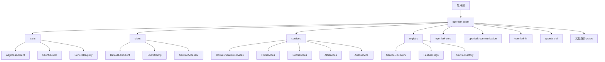

[根目录](../../../CLAUDE.md) > [crates](../) > **openlark-client**

# openlark-client 客户端库

> 🧩 **相对路径**: `crates/openlark-client/`
> 📦 **Crate类型**: 高级客户端封装
> 🎯 **职责**: 提供统一的客户端接口和服务管理
> 📊 **覆盖率**: 🟡 60%

## 模块职责

openlark-client 是OpenLark SDK的高级客户端库，提供以下核心功能：

- **统一接口**: 面向用户的高级API接口
- **服务注册**: 动态服务发现和注册机制
- **异步支持**: 完全异步的客户端实现
- **构建器模式**: 现代化的客户端构建方式
- **服务聚合**: 将多个服务模块整合到统一接口

## 架构概览



## 核心模块

### 1. 异步客户端特征 (`src/traits/`)

定义统一的异步客户端接口：

```rust
// 异步客户端特征
#[async_trait]
pub trait AsyncLarkClient: Send + Sync {
    type Error: std::error::Error + Send + Sync + 'static;

    async fn send_request<R, Resp>(&self, request: R) -> SDKResult<Resp>
    where
        R: ApiRequest + Send + Sync,
        Resp: ApiResponse + Send + 'static;

    async fn refresh_token(&self) -> SDKResult<()>;

    fn is_authenticated(&self) -> bool;
    fn app_info(&self) -> &AppInfo;
}

// 客户端构建器特征
pub trait ClientBuilder: Sized {
    type Output: AsyncLarkClient;

    fn app_id<S: Into<String>>(self, app_id: S) -> Self;
    fn app_secret<S: Into<String>>(self, app_secret: S) -> Self;
    fn base_url<S: Into<String>>(self, base_url: S) -> Self;
    fn timeout(self, timeout: Duration) -> Self;
    fn enable_feature(self, feature: &str) -> Self;
    fn build(self) -> SDKResult<Self::Output>;
}

// 服务注册特征
pub trait ServiceRegistry: Send + Sync {
    fn register_service<S>(&mut self, name: &str, service: S)
    where
        S: Send + Sync + 'static;

    fn get_service<T>(&self, name: &str) -> Option<&T>;
    fn list_services(&self) -> Vec<&str>;
    fn has_service(&self, name: &str) -> bool;
}
```

### 2. 默认客户端实现 (`src/client/`)

主要的客户端实现：

```rust
// 默认Lark客户端
pub struct DefaultLarkClient {
    config: ClientConfig,
    core_client: Arc<CoreClient>,
    services: HashMap<String, Box<dyn Any + Send + Sync>>,
    feature_flags: FeatureFlags,
}

// 客户端配置
#[derive(Debug, Clone)]
pub struct ClientConfig {
    pub app_info: AppInfo,
    pub base_url: String,
    pub timeout: Duration,
    pub retry_config: RetryConfig,
    pub feature_flags: HashMap<String, bool>,
    pub service_config: HashMap<String, ServiceConfig>,
}

// 服务访问器
impl DefaultLarkClient {
    pub fn communication(&self) -> Option<&CommunicationService> {
        self.get_service("communication")
    }

    pub fn hr(&self) -> Option<&HRService> {
        self.get_service("hr")
    }

    pub fn docs(&self) -> Option<&DocsService> {
        self.get_service("docs")
    }

    pub fn ai(&self) -> Option<&AIService> {
        self.get_service("ai")
    }
}
```

### 3. 服务管理 (`src/services/`)

动态服务发现和管理：

```rust
// 服务工厂
pub struct ServiceFactory {
    core_client: Arc<CoreClient>,
    feature_flags: FeatureFlags,
}

impl ServiceFactory {
    pub fn create_communication_service(&self) -> Option<CommunicationService> {
        if self.feature_flags.is_enabled("communication") {
            Some(CommunicationService::new(self.core_client.clone()))
        } else {
            None
        }
    }

    pub fn create_hr_service(&self) -> Option<HRService> {
        if self.feature_flags.is_enabled("hr") {
            Some(HRService::new(self.core_client.clone()))
        } else {
            None
        }
    }
}

// 服务模块定义
pub struct CommunicationServices {
    pub im: IMServices,
    pub contact: ContactServices,
    pub groups: GroupServices,
}

pub struct IMServices {
    pub v1: IMV1Service,
    pub v2: IMV2Service,
    pub v3: IMV3Service,
}

pub struct HRServices {
    pub attendance: AttendanceService,
    pub corehr: CoreHRService,
    pub ehr: EHRService,
    pub hire: HireService,
}
```

### 4. 服务注册器 (`src/registry/`)

服务注册和发现机制：

```rust
// 服务注册器
pub struct ServiceRegistryImpl {
    services: HashMap<String, ServiceEntry>,
    factories: HashMap<String, Box<dyn ServiceFactoryTrait>>,
}

// 服务条目
struct ServiceEntry {
    name: String,
    service: Box<dyn Any + Send + Sync>,
    dependencies: Vec<String>,
    enabled: bool,
}

// 服务工厂特征
pub trait ServiceFactoryTrait: Send + Sync {
    fn create_service(&self, config: &ClientConfig) -> SDKResult<Box<dyn Any + Send + Sync>>;
    fn service_name(&self) -> &str;
    fn dependencies(&self) -> Vec<&str>;
}
```

## 使用示例

### 基础客户端创建和使用

```rust
use openlark_client::prelude::*;

// 使用构建器模式创建客户端
let client = DefaultLarkClient::builder()
    .app_id("your_app_id")
    .app_secret("your_app_secret")
    .base_url("https://open.feishu.cn")
    .timeout(Duration::from_secs(30))
    .enable_feature("communication")
    .enable_feature("hr")
    .enable_feature("docs")
    .build()?;

// 检查服务可用性
if client.has_service("communication") {
    println!("通讯服务可用");
}

// 访问具体服务
if let Some(communication) = client.communication() {
    // 发送消息
    let message = communication.im.v1.message.create_message_builder()
        .receive_id("user_open_id")
        .receive_id_type("open_id")
        .content(r#"{"text":"Hello World"}"#)
        .msg_type("text")
        .execute(communication.im.v1.message)
        .await?;

    println!("消息发送成功: {}", message.message_id);
}
```

### 动态服务注册

```rust
use openlark_client::prelude::*;

// 创建客户端
let mut client = DefaultLarkClient::builder()
    .app_id("your_app_id")
    .app_secret("your_app_secret")
    .build()?;

// 动态注册服务
let custom_service = MyCustomService::new(/* 参数 */);
client.register_service("custom", custom_service);

// 使用自定义服务
if let Some(service) = client.get_service::<MyCustomService>("custom") {
    let result = service.do_something().await?;
}
```

### 异步客户端使用

```rust
use openlark_client::traits::AsyncLarkClient;

async fn process_messages(client: &dyn AsyncLarkClient) -> SDKResult<()> {
    // 创建请求
    let request = ListMessagesRequest {
        container_id_type: "chat".to_string(),
        container_id: "chat_id".to_string(),
        page_size: Some(20),
        ..Default::default()
    };

    // 发送请求
    let response = client.send_request(request).await?;

    // 处理响应
    for message in response.items.unwrap_or_default() {
        println!("消息: {}", message.content);
    }

    Ok(())
}
```

### 功能标志管理

```rust
use openlark_client::prelude::*;

let client = DefaultLarkClient::builder()
    .app_id("your_app_id")
    .app_secret("your_app_secret")
    .feature_config(FeatureConfig {
        communication: true,
        hr: false,
        docs: true,
        ai: false,
        ..Default::default()
    })
    .build()?;

// 运行时检查功能
if client.is_feature_enabled("communication") {
    // 使用通讯服务
}

// 动态启用功能
client.enable_feature("hr")?;

// 动态禁用功能
client.disable_feature("ai")?;
```

## 高级用法

### 1. 自定义服务集成

```rust
// 定义自定义服务
pub struct MyCustomService {
    client: Arc<CoreClient>,
    config: ServiceConfig,
}

impl MyCustomService {
    pub async fn custom_api_call(&self, param: &str) -> SDKResult<CustomResponse> {
        let request = CustomRequest { param: param.to_string() };
        self.client.send_request(request).await
    }
}

// 注册到客户端
let custom_service = MyCustomService::new(client.core_client().clone());
client.register_service("my_service", custom_service);
```

### 2. 中间件支持

```rust
// 请求中间件
pub struct LoggingMiddleware;

impl Middleware for LoggingMiddleware {
    async fn before_request(&self, request: &dyn ApiRequest) -> SDKResult<()> {
        tracing::info!("发送请求: {}", request.endpoint());
        Ok(())
    }

    async fn after_response(&self, response: &dyn ApiResponse) -> SDKResult<()> {
        tracing::info!("收到响应: {}", response.status_code());
        Ok(())
    }
}

// 添加中间件
let client = DefaultLarkClient::builder()
    .app_id("app_id")
    .app_secret("app_secret")
    .add_middleware(Box::new(LoggingMiddleware))
    .build()?;
```

### 3. 批量操作支持

```rust
use openlark_client::prelude::*;

// 批量发送消息
let messages = vec![
    ("user1", "Hello User 1"),
    ("user2", "Hello User 2"),
    ("user3", "Hello User 3"),
];

let communication = client.communication().unwrap();
let results = communication.im.v1.message.batch_send()
    .messages(messages.into_iter().map(|(id, text)| {
        BatchMessageBuilder::new()
            .receive_id(id)
            .content(format!(r#"{{"text":"{}"}}"#, text))
            .msg_type("text")
            .build()
    }))
    .execute(communication.im.v1.message)
    .await?;

for result in results {
    match result {
        Ok(message_id) => println!("发送成功: {}", message_id),
        Err(error) => println!("发送失败: {}", error),
    }
}
```

## 错误处理

```rust
use openlark_client::prelude::*;

async fn robust_api_call() -> SDKResult<()> {
    let client = DefaultLarkClient::builder()
        .app_id("app_id")
        .app_secret("app_secret")
        .retry_config(RetryConfig {
            max_attempts: 3,
            backoff_factor: 2.0,
            max_delay: Duration::from_secs(30),
        })
        .build()?;

    match client.communication().unwrap().im.v1.message.send(/*...*/).await {
        Ok(response) => {
            println!("消息发送成功: {}", response.message_id);
            Ok(())
        },
        Err(error) => {
            // 自动重试已由客户端处理
            tracing::error!("消息发送失败: {}", error);
            Err(error)
        }
    }
}
```

## 性能优化

### 1. 连接复用

```rust
let client = DefaultLarkClient::builder()
    .app_id("app_id")
    .app_secret("app_secret")
    .connection_config(ConnectionConfig {
        pool_max_idle_per_host: 10,
        pool_idle_timeout: Duration::from_secs(30),
        http2_keepalive_interval: Duration::from_secs(30),
        ..Default::default()
    })
    .build()?;
```

### 2. 缓存配置

```rust
let client = DefaultLarkClient::builder()
    .app_id("app_id")
    .app_secret("app_secret")
    .cache_config(CacheConfig {
        token_cache_ttl: Duration::from_secs(3600),
        api_cache_ttl: Duration::from_secs(300),
        enable_memory_cache: true,
        enable_redis_cache: true,
        redis_url: "redis://localhost:6379".to_string(),
    })
    .build()?;
```

### 3. 并发控制

```rust
use tokio::sync::Semaphore;

let semaphore = Arc::new(Semaphore::new(10)); // 最多10个并发请求

async fn concurrent_requests(client: &DefaultLarkClient, user_ids: Vec<String>) {
    let mut tasks = Vec::new();

    for user_id in user_ids {
        let semaphore = semaphore.clone();
        let client = client.clone();

        let task = tokio::spawn(async move {
            let _permit = semaphore.acquire().await.unwrap();

            if let Some(communication) = client.communication() {
                communication.im.v1.message.send_to_user(&user_id, "Hello").await
            } else {
                Err(LarkAPIError::ServiceNotAvailable("communication".to_string()))
            }
        });

        tasks.push(task);
    }

    // 等待所有请求完成
    for task in tasks {
        match task.await.unwrap() {
            Ok(result) => println!("请求成功: {:?}", result),
            Err(error) => println!("请求失败: {}", error),
        }
    }
}
```

## 测试策略

### 1. 单元测试

```rust
#[cfg(test)]
mod tests {
    use super::*;

    #[tokio::test]
    async fn test_client_builder() {
        let client = DefaultLarkClient::builder()
            .app_id("test_app_id")
            .app_secret("test_app_secret")
            .build();

        assert!(client.is_ok());
    }

    #[tokio::test]
    async fn test_service_registration() {
        let mut client = DefaultLarkClient::builder()
            .app_id("test_app_id")
            .app_secret("test_app_secret")
            .build()
            .unwrap();

        let service = TestService::new();
        client.register_service("test", service);

        assert!(client.has_service("test"));
    }
}
```

### 2. 集成测试

```rust
#[cfg(test)]
mod integration_tests {
    use super::*;

    #[tokio::test]
    async fn test_full_workflow() {
        let client = DefaultLarkClient::from_env().expect("环境配置错误");

        // 测试通讯服务
        if let Some(communication) = client.communication() {
            let result = communication.im.v1.message.send_test_message().await;
            assert!(result.is_ok());
        }
    }
}
```

## 常见问题 (FAQ)

### Q: 如何处理服务不可用的情况？

A: 客户端提供了优雅的服务不可用处理：

```rust
if let Some(service) = client.communication() {
    // 服务可用，正常使用
    let result = service.do_something().await;
} else {
    // 服务不可用，提供降级方案
    println!("通讯服务当前不可用");
    // 执行降级逻辑
}
```

### Q: 如何优化客户端性能？

A: 可以通过以下方式优化：
- 启用连接池
- 配置缓存策略
- 使用批量操作
- 设置合理的超时时间
- 启用并发控制

### Q: 如何扩展客户端功能？

A: 客户端支持多种扩展方式：
- 注册自定义服务
- 添加中间件
- 实现自定义构建器
- 扩展功能标志系统

## 相关文件清单

### 核心文件
- `src/lib.rs` - 库入口点
- `src/traits/` - 客户端特征定义
- `src/client/` - 默认客户端实现
- `src/services/` - 服务管理
- `src/registry/` - 服务注册器

### 配置和工具
- `Cargo.toml` - 依赖配置
- `src/prelude.rs` - 常用导出

### 示例和测试
- `examples/` - 使用示例
- `tests/` - 集成测试

## 变更记录 (Changelog)

### 2025-11-16 15:09:25 - 初始化文档
- ✨ **新增**: 完整的客户端架构文档
- 📝 **详细**: 异步特征和构建器模式说明
- 🔧 **优化**: 服务注册和发现机制
- 🧪 **测试**: 单元测试和集成测试示例
- 📚 **文档**: 性能优化和常见问题解答