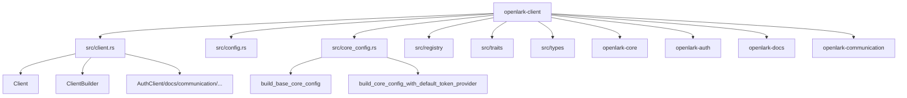

[根目录](../../../CLAUDE.md) > [crates](../) > **openlark-client**

# openlark-client 客户端库

> 🧩 **相对路径**: `crates/openlark-client/`
> 📦 **Crate类型**: 高级客户端封装（meta 单入口）
> 🎯 **职责**: 统一配置与入口、挂载各业务 crate 的 meta 链式调用

## 现状说明（重要）

openlark-client 已收敛为“meta 单入口”模型：

- **不在 openlark-client 内重复实现业务服务包装层**（历史上的 `src/services/` 已移除）
- **业务 API 由各业务 crate 提供**（如 `openlark-docs` / `openlark-communication` / `openlark-auth`）
- openlark-client 负责：
  - 统一 `Config`（环境变量/校验/默认值）
  - 统一构建 `openlark-core::config::Config`（包含默认 TokenProvider 注入）
  - 将业务 crate 的 “Client/Service” 入口挂载到 `Client` 字段上（按 feature 裁剪）

## 架构概览



## 关键文件

- `crates/openlark-client/src/client.rs`：`Client`（meta 单入口字段挂载）、`ClientBuilder`
- `crates/openlark-client/src/config.rs`：对外配置（from_env/validate/builder）
- `crates/openlark-client/src/core_config.rs`：`openlark-client::Config` → `openlark-core::config::Config` 的唯一转换入口（DRY）
- `crates/openlark-client/src/registry/mod.rs`：服务元数据注册表（用于可观测/依赖信息；非业务 API 包装层）

## 使用示例

### 1) 创建客户端

```rust
use openlark_client::prelude::*;

fn main() -> Result<()> {
    let _client = Client::from_env()?;
    Ok(())
}
```

### 2) meta 链式入口（按 feature 裁剪）

```rust
use openlark_client::prelude::*;

fn main() -> Result<()> {
    let client = Client::from_env()?;

    #[cfg(feature = "docs")]
    let _ = client.docs.config();

    #[cfg(feature = "communication")]
    let _ = &client.communication;

    #[cfg(feature = "auth")]
    let _ = &client.auth;

    Ok(())
}
```

### 3) 服务元数据（registry）

```rust
use openlark_client::prelude::*;

fn main() -> Result<()> {
    let client = Client::from_env()?;
    for entry in client.registry().list_services() {
        println!("service={}", entry.metadata.name);
    }
    Ok(())
}
```

## 约定

- 新增业务 API：在对应业务 crate 内实现（遵循 `src/{bizTag}/{project}/{version}/{resource}/{name}.rs`），openlark-client 只做入口挂载。
- 配置转换：统一走 `crates/openlark-client/src/core_config.rs`，避免在多个位置重复拼装 `openlark-core::config::Config`。

