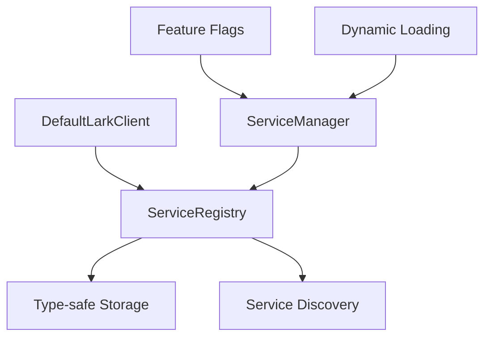

# OpenLark Client

现代化的 Rust 客户端库，为飞书开放平台提供类型安全的 API 访问。

## 🚀 特性

### ✨ **架构优势**

- **模块化设计**: 通过独立的服务注册表实现服务解耦
- **条件编译**: 只编译需要的服务，优化二进制大小
- **类型安全**: 编译时类型检查，避免运行时错误
- **向后兼容**: 提供兼容现有代码的迁移路径
- **服务发现**: 运行时动态服务注册和发现

### 🎯 **核心功能**

- **1,000+ API 支持**: 覆盖飞书开放平台主要功能
- **服务管理**: 基于功能标志的动态服务加载
- **错误处理**: 企业级错误处理和恢复机制
- **性能优化**: 共享配置和内存优化
- **构建器模式**: 流畅的 API 配置体验

## 📦 安装

在 `Cargo.toml` 中添加：

```toml
[dependencies]
openlark-client = { version = "0.15.0-dev", features = ["ccm-doc", "communication"] }
```

### 功能标志

```toml
# 云文档服务
features = ["ccm-doc", "ccm-sheets", "bitable", "ccm-wiki", "ccm-drive", "ccm"]

# 通信服务
features = ["communication"]

# HR 服务
features = ["hr"]

# AI 服务
features = ["ai"]

# 认证服务
features = ["auth"]

# 所有服务
features = ["all-services"]
```

## 🔧 快速开始

### 基础用法

```rust
use openlark_client::DefaultLarkClient;
use openlark_core::{config::Config, constants::AppType};

// 创建配置
let config = Config::builder()
    .app_id("your_app_id")
    .app_secret("your_app_secret")
    .app_type(AppType::SelfBuild)
    .build();

// 创建客户端
let client = DefaultLarkClient::new(config);
```

### 兼容构建器

```rust
// 使用兼容的构建器（向后兼容）
let client = DefaultLarkClient::builder("app_id", "app_secret")
    .with_app_type(AppType::SelfBuild)
    .build();
```

## 🎪 服务访问

### 类型安全的服务访问

```rust
// 扩展访问器（推荐）
if let Some(docs_service) = client.service_accessors().docs_ext() {
    // 使用文档服务
    println!("✅ 文档服务可用");
}

// 通用服务访问
if let Some(docs_service) = client.services()
    .get_service::<openlark_docs::docs::DocxService>("docs") {
    // 使用文档服务
    println!("✅ 文档服务可用");
}
```

### 服务发现

```rust
// 列出所有已注册的服务
for service_name in client.services().list_services() {
    println!("可用服务: {}", service_name);
}

// 检查特定服务是否可用
if client.services().has_service("docs") {
    println!("文档服务已启用");
}
```

## 🔄 迁移指南

### 从现有 LarkClient 迁移

1. **新代码**（推荐）:
   ```rust
   let config = Config::builder()
       .app_id("app_id")
       .app_secret("app_secret")
       .build();
   let client = DefaultLarkClient::new(config);
   ```

2. **兼容代码**:
   ```rust
   let client = DefaultLarkClient::builder("app_id", "app_secret").build();
   ```

3. **服务访问更新**:
   ```rust
   // 旧方式: client.docs.xxx()
   // 新方式: client.service_accessors().docs_ext().unwrap().xxx()
   ```

### 功能映射

| 原有功能 | 新功能 |
|---------|--------|
| `client.docs` | `client.service_accessors().docs_ext()` |
| `client.sheet` | `client.service_accessors().sheet_ext()` |
| `client.contact` | `client.service_accessors().contact_ext()` |
| 通用服务 | `client.services().get_service<T>()` |

## 🏗️ 架构设计

### 服务注册表模式



### 服务生命周期

1. **初始化**: 根据 Rust 功能标志决定加载的服务
2. **注册**: 在运行时将服务实例注册到注册表
3. **发现**: 通过类型安全的方法访问服务
4. **管理**: 统一的服务生命周期管理

## 📋 示例

查看 `examples/` 目录中的完整示例：

- `service_management_demo.rs`: 服务管理演示
- `migration_demo.rs`: 迁移指南演示

运行示例：

```bash
cargo run --example service_management_demo --features docs
cargo run --example migration_demo --features docs
```

## 🧪 测试

```bash
# 运行所有测试
cargo test

# 测试特定功能
cargo test --features docs

# 无功能测试
cargo test --no-default-features
```

## 📚 文档

- **API 文档**: `cargo doc --open`
- **示例**: 查看 `examples/` 目录
- **核心概念**: 参见飞书开放平台官方文档

## 🤝 贡献

欢迎提交 Issue 和 Pull Request！

## 📄 许可证

Apache License 2.0