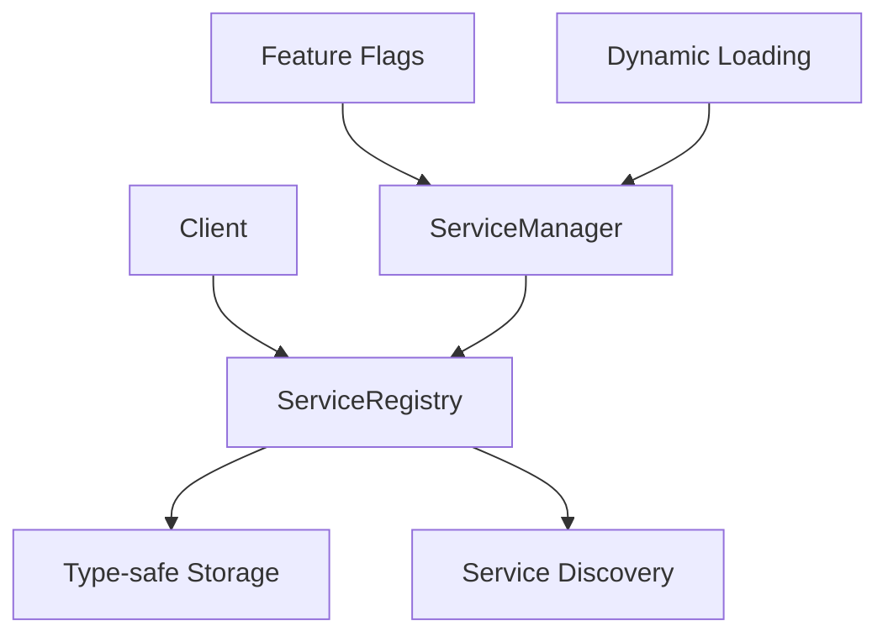

# OpenLark Client

现代化的 Rust 客户端库，为飞书开放平台提供类型安全的 API 访问。

## 🚀 特性

### ✨ **架构优势**

- **模块化设计**: 通过独立的服务注册表实现服务解耦
- **条件编译**: 只编译需要的服务，优化二进制大小
- **类型安全**: 编译时类型检查，避免运行时错误
- **向后兼容**: 提供兼容现有代码的迁移路径
- **服务发现**: 运行时动态服务注册和发现

### 🎯 **核心功能**

- **1,000+ API 支持**: 覆盖飞书开放平台主要功能
- **服务管理**: 基于功能标志的动态服务加载
- **错误处理**: 企业级错误处理和恢复机制
- **性能优化**: 共享配置和内存优化
- **构建器模式**: 流畅的 API 配置体验

## 📦 安装

在 `Cargo.toml` 中添加：

```toml
[dependencies]
openlark-client = { version = "0.15.0-dev", features = ["docs"] }
```

### 功能标志

```toml
# 默认启用：auth + communication（如需关闭：default-features = false）

# 文档服务（会启用 openlark-docs）
features = ["docs"]

# 通信服务（会启用 openlark-communication；默认已启用）
features = ["communication"]

# 认证服务（默认已启用）
features = ["auth"]

# CardKit（卡片能力，meta 调用链）
features = ["cardkit"]

# 会议服务
features = ["meeting"]

# WebSocket 支持
features = ["websocket"]

# 组合功能（P0 推荐）
features = ["p0-services"]
```

## 🧩 meta 调用链（按 CSV 映射）

本仓库提供一种“调用路径与 `api_list_export.csv` 的 `meta.*` 字段一一对应”的访问方式：

`client.{meta.Project}.{meta.Version}.{meta.Resource}.{meta.Name}(...)`

规范与示例见：`crates/openlark-client/docs/meta-api-style.md:1`

## 🔧 快速开始

### 基础用法

```rust
use openlark_client::prelude::*;
use std::time::Duration;

fn main() -> Result<()> {
    // 使用构建器创建客户端
    let _client = Client::builder()
        .app_id("your_app_id")
        .app_secret("your_app_secret")
        .base_url("https://open.feishu.cn")
        .timeout(Duration::from_secs(30))
        .build()?;
    Ok(())
}
```

### 从环境变量创建

```rust
use openlark_client::prelude::*;

fn main() -> Result<()> {
    // 需要配置 OPENLARK_APP_ID / OPENLARK_APP_SECRET
    let _client = Client::from_env()?;
    Ok(())
}
```

## 🎪 服务访问

### meta 单入口（推荐）

```rust
use openlark_client::prelude::*;

fn main() -> Result<()> {
    let client = Client::from_env()?;

    // 文档入口（需启用 docs feature）
    #[cfg(feature = "docs")]
    let _docs_config = client.docs.config();

    // 通讯入口（需启用 communication feature，默认启用）
    #[cfg(feature = "communication")]
    let _comm = &client.communication;

    Ok(())
}
```

### 服务发现

```rust
use openlark_client::prelude::*;

fn main() -> Result<()> {
    let client = Client::from_env()?;

    // 列出已注册的服务元数据
    for entry in client.registry().list_services() {
        println!("可用服务: {}", entry.metadata.name);
    }

    // 检查特定服务是否已启用（注册）
    if client.registry().has_service("docs") {
        println!("文档服务已启用");
    }

    Ok(())
}
```

## 🔄 迁移指南

### 从现有 LarkClient 迁移

1. **新代码**（推荐）:
   ```rust
   use openlark_client::prelude::*;
   let client = Client::builder()
       .app_id("app_id")
       .app_secret("app_secret")
       .build()?;
   ```

2. **服务访问更新**:
   ```rust
   // 旧方式：依赖 openlark-client 内部的服务包装层（已移除）
   // 新方式：直接使用 meta 单入口（字段链式）访问业务 crate 的能力
   // - 文档：client.docs...
   // - 通讯：client.communication...
   // - 认证：client.auth...
   ```

## 🏗️ 架构设计

### 服务注册表模式



### 服务生命周期

1. **初始化**: 根据 Rust 功能标志决定加载的服务
2. **注册**: 在运行时将服务实例注册到注册表
3. **发现**: 通过类型安全的方法访问服务
4. **管理**: 统一的服务生命周期管理

## 📋 示例

查看 `examples/` 目录中的完整示例：

- `service_management_demo.rs`: 服务管理演示
- `migration_demo.rs`: 迁移指南演示

运行示例：

```bash
cargo run --example service_management_demo --features docs
cargo run --example migration_demo --features docs
```

## 🧪 测试

```bash
# 运行所有测试
cargo test

# 测试特定功能
cargo test --features docs

# 无功能测试
cargo test --no-default-features
```

## 📚 文档

- **API 文档**: `cargo doc --open`
- **示例**: 查看 `examples/` 目录
- **核心概念**: 参见飞书开放平台官方文档

## 🤝 贡献

欢迎提交 Issue 和 Pull Request！

## 📄 许可证

Apache License 2.0
