```mermaid
graph TD
    A[openlark-core] --> B[http]
    A --> C[config]
    A --> D[error]
    A --> E[token_manager]
    A --> F[client]
    A --> G[cache]
    A --> H[observability]

    B --> B1[Transport]
    B --> B2[RequestBuilder]
    B --> B3[ResponseHandler]

    C --> C1[ConfigBuilder]
    C --> C2[Environment]
    C --> C3[Validation]

    D --> D1[LarkAPIError]
    D --> D2[ErrorCodes]
    D --> D3[UserFriendlyMessages]

    E --> E1[TokenManager]
    E --> E2[TokenRefresh]
    E --> E3[TokenCache]

    F --> F1[WebSocketClient]
    F --> F2[EventHandler]
    F --> F3[ConnectionManager]

    G --> G1[MemoryCache]
    G --> G2[CachePolicy]

    H --> H1[Metrics]
    H --> H2[Logging]
    H --> H3[Tracing]
```

[根目录](../../../CLAUDE.md) > [crates](../) > **openlark-core**

# openlark-core 核心基础设施

> 🧩 **相对路径**: `crates/openlark-core/`
> 📦 **Crate类型**: 核心库（无业务逻辑）
> 🎯 **职责**: 提供OpenLark SDK的基础设施和通用功能
> 📊 **覆盖率**: 🟢 85%

## 模块职责

openlark-core 是整个OpenLark SDK的核心基础设施，提供以下关键功能：

- **HTTP客户端**: 基于reqwest的高性能HTTP传输层
- **配置管理**: 统一的配置系统和环境变量支持
- **错误处理**: 类型安全的错误体系和用户友好的错误消息
- **令牌管理**: 自动令牌刷新和缓存机制
- **WebSocket支持**: 实时连接管理和事件处理
- **工具函数**: 通用工具和辅助函数

## 架构概览



## 核心模块

### 1. HTTP客户端 (`src/http/`)

提供高性能、类型安全的HTTP通信层：

```rust
// HTTP传输核心
pub struct Transport {
    client: reqwest::Client,
    config: Config,
}

// 请求构建器
pub struct RequestBuilder {
    method: Method,
    url: String,
    headers: HeaderMap,
    body: Option<Vec<u8>>,
}

// 响应处理器
pub struct ResponseHandler {
    retry_config: RetryConfig,
    timeout_config: TimeoutConfig,
}
```

**主要特性**:
- 连接池管理
- 自动重试机制
- 超时控制
- 请求/响应拦截器
- 压缩支持

### 2. 配置管理 (`src/config/`)

统一配置系统和环境管理：

```rust
// 配置构建器
pub struct ConfigBuilder {
    app_id: Option<String>,
    app_secret: Option<String>,
    base_url: Option<String>,
    timeout: Option<Duration>,
    retry_config: Option<RetryConfig>,
}

// 运行时配置
pub struct Config {
    pub app_id: String,
    pub app_secret: String,
    pub base_url: String,
    pub timeout: Duration,
    pub retry_config: RetryConfig,
    pub feature_flags: HashMap<String, bool>,
}
```

**配置来源**:
- 环境变量 (`APP_ID`, `APP_SECRET`, 等)
- 配置文件 (`.env`, `config.toml`)
- 代码直接配置
- 运行时动态配置

### 3. 错误处理 (`src/error/`)

类型安全的错误体系：

```rust
// 主要错误类型
#[derive(Debug, thiserror::Error)]
pub enum LarkAPIError {
    #[error("API请求失败: {message}")]
    APIError {
        code: i32,
        message: String,
        request_id: String,
    },

    #[error("网络错误: {0}")]
    NetworkError(#[from] reqwest::Error),

    #[error("认证失败: {0}")]
    AuthenticationError(String),

    #[error("令牌已过期")]
    TokenExpired,

    #[error("配置错误: {0}")]
    ConfigurationError(String),
}

// 用户友好的错误处理
impl LarkAPIError {
    pub fn user_friendly_message(&self) -> String {
        match self {
            LarkAPIError::TokenExpired => "登录已过期，请重新登录".to_string(),
            LarkAPIError::NetworkError(e) => format!("网络连接失败: {}", e),
            // ... 更多用户友好消息
        }
    }

    pub fn is_retryable(&self) -> bool {
        matches!(self, LarkAPIError::NetworkError(_) | LarkAPIError::TokenExpired)
    }
}
```

### 4. 令牌管理 (`src/token_manager/`)

自动令牌刷新和缓存：

```rust
// 令牌管理器
pub struct TokenManager {
    cache: Arc<dyn TokenCache>,
    refresh_handler: Arc<dyn TokenRefreshHandler>,
}

// 令牌信息
#[derive(Debug, Clone)]
pub struct TokenInfo {
    pub access_token: String,
    pub refresh_token: Option<String>,
    pub expires_at: DateTime<Utc>,
    pub token_type: String,
}

// 令牌缓存特征
#[async_trait]
pub trait TokenCache: Send + Sync {
    async fn get(&self, key: &str) -> Option<TokenInfo>;
    async fn set(&self, key: &str, token: TokenInfo, ttl: Duration);
    async fn invalidate(&self, key: &str);
}
```

**特性**:
- 多级缓存（内存 + Redis）
- 自动刷新机制
- 线程安全
- 过期管理

### 5. WebSocket客户端 (`src/client/ws_client/`)

实时通信支持：

```rust
// WebSocket客户端
pub struct WebSocketClient {
    transport: WebSocketTransport,
    event_handler: Arc<dyn EventHandler>,
    connection_manager: ConnectionManager,
}

// 事件处理器
#[async_trait]
pub trait EventHandler: Send + Sync {
    async fn handle_message(&self, message: WebSocketMessage) -> SDKResult<()>;
    async fn handle_event(&self, event: LarkEvent) -> SDKResult<()>;
}

// 连接管理器
pub struct ConnectionManager {
    reconnect_config: ReconnectConfig,
    heartbeat_config: HeartbeatConfig,
}
```

## 使用示例

### 基础配置和客户端创建

```rust
use openlark_core::prelude::*;

// 环境变量配置
let config = Config::from_env()?;

// 手动配置
let config = ConfigBuilder::new()
    .app_id("your_app_id")
    .app_secret("your_app_secret")
    .base_url("https://open.feishu.cn")
    .timeout(Duration::from_secs(30))
    .enable_debug_mode(true)
    .build()?;

// 创建HTTP传输
let transport = Transport::new(config);

// 创建令牌管理器
let token_manager = TokenManager::new(
    MemoryTokenCache::new(),
    DefaultTokenRefreshHandler::new()
);

// 创建WebSocket客户端
let ws_client = WebSocketClient::builder()
    .config(config.clone())
    .event_handler(MyEventHandler::new())
    .reconnect_config(ReconnectConfig::default())
    .build()?;

// 连接WebSocket
ws_client.connect().await?;
```

### 错误处理最佳实践

```rust
use openlark_core::error::{LarkAPIError, SDKResult};

async fn example_api_call() -> SDKResult<ResponseData> {
    match api_call().await {
        Ok(response) => Ok(response),
        Err(error) => {
            // 记录错误
            tracing::error!("API调用失败: {}", error);

            // 根据错误类型处理
            match error {
                LarkAPIError::TokenExpired => {
                    // 尝试刷新令牌
                    token_manager.refresh_token().await?;
                    // 重试请求
                    api_call().await
                },
                LarkAPIError::NetworkError(_) if error.is_retryable() => {
                    // 重试网络错误
                    tokio::time::sleep(Duration::from_secs(1)).await;
                    api_call().await
                },
                other => Err(other)
            }
        }
    }
}
```

### 自定义事件处理

```rust
struct MyEventHandler {
    message_handlers: HashMap<String, Box<dyn MessageHandler>>,
}

#[async_trait]
impl EventHandler for MyEventHandler {
    async fn handle_message(&self, message: WebSocketMessage) -> SDKResult<()> {
        match message.msg_type.as_str() {
            "p2p_message_read_v1" => {
                let event: MessageReadEvent = serde_json::from_str(&message.data)?;
                self.handle_message_read(event).await?;
            },
            "im_chat_member_user_added_v1" => {
                let event: ChatMemberAddedEvent = serde_json::from_str(&message.data)?;
                self.handle_member_added(event).await?;
            },
            _ => {
                tracing::debug!("未处理的消息类型: {}", message.msg_type);
            }
        }
        Ok(())
    }
}

impl MyEventHandler {
    async fn handle_message_read(&self, event: MessageReadEvent) -> SDKResult<()> {
        // 处理消息已读事件
        println!("用户 {} 已读消息 {}", event.user_id, event.message_id);
        Ok(())
    }

    async fn handle_member_added(&self, event: ChatMemberAddedEvent) -> SDKResult<()> {
        // 处理群成员添加事件
        println!("新成员 {} 加入群聊 {}", event.user_id, event.chat_id);
        Ok(())
    }
}
```

## 性能优化

### 1. 连接池配置

```rust
let transport = Transport::builder()
    .pool_max_idle_per_host(10)
    .pool_idle_timeout(Duration::from_secs(30))
    .http2_keepalive_interval(Duration::from_secs(30))
    .http2_keepalive_timeout(Duration::from_secs(10))
    .build()?;
```

### 2. 缓存策略

```rust
// 内存缓存配置
let cache = MemoryTokenCache::builder()
    .max_size(1000)
    .ttl(Duration::from_secs(3600))
    .cleanup_interval(Duration::from_secs(300))
    .build();

// Redis缓存配置
let redis_cache = RedisTokenCache::new("redis://localhost:6379")
    .key_prefix("openlark:")
    .ttl(Duration::from_secs(3600));
```

### 3. 监控和指标

```rust
use openlark_core::observability::*;

// 启用指标收集
Metrics::init_default();

// 自定义指标
let request_counter = Counter::new("api_requests_total", "API请求总数");
let response_time = Histogram::new("api_response_time_seconds", "API响应时间");

// 在请求中使用
let _timer = response_time.start_timer();
request_counter.inc();
let response = transport.send(request).await?;
```

## 测试策略

### 1. 单元测试

```rust
#[cfg(test)]
mod tests {
    use super::*;

    #[tokio::test]
    async fn test_config_builder() {
        let config = ConfigBuilder::new()
            .app_id("test_app_id")
            .app_secret("test_app_secret")
            .build()
            .unwrap();

        assert_eq!(config.app_id, "test_app_id");
        assert_eq!(config.app_secret, "test_app_secret");
    }

    #[tokio::test]
    async fn test_error_handling() {
        let error = LarkAPIError::TokenExpired;
        assert!(error.user_friendly_message().contains("登录已过期"));
        assert!(!error.is_retryable());
    }
}
```

### 2. 集成测试

```rust
#[cfg(test)]
mod integration_tests {
    use super::*;

    #[tokio::test]
    async fn test_websocket_connection() {
        let config = Config::from_env().expect("环境配置错误");
        let ws_client = WebSocketClient::new(config);

        // 测试连接建立
        ws_client.connect().await.expect("WebSocket连接失败");

        // 测试消息发送和接收
        // ...
    }
}
```

## 常见问题 (FAQ)

### Q: 如何处理网络连接不稳定？

A: openlark-core提供了自动重试机制和连接池管理：

```rust
let config = ConfigBuilder::new()
    .retry_config(RetryConfig {
        max_attempts: 3,
        backoff_factor: 2.0,
        max_delay: Duration::from_secs(30),
    })
    .build()?;
```

### Q: 如何优化性能？

A: 可以通过以下方式优化性能：
- 启用连接池
- 合理设置超时时间
- 使用缓存减少API调用
- 启用HTTP/2支持

### Q: 如何处理不同环境的配置？

A: 使用环境变量和配置文件组合：

```rust
let config = ConfigBuilder::new()
    .from_env()                    // 从环境变量读取
    .from_file("config.toml")?     // 从配置文件读取
    .override(|c| {                // 代码覆盖
        c.timeout = Duration::from_secs(60);
    })
    .build()?;
```

## 相关文件清单

### 核心文件
- `src/lib.rs` - 库入口点，公共导出
- `src/prelude.rs` - 常用类型和特征导出
- `src/config/` - 配置管理模块
- `src/error/` - 错误处理系统
- `src/http/` - HTTP客户端实现
- `src/token_manager/` - 令牌管理
- `src/client/` - WebSocket客户端

### 工具和辅助模块
- `src/cache/` - 缓存实现
- `src/observability/` - 监控和指标
- `src/utils/` - 工具函数
- `src/validation/` - 数据验证
- `src/test_utils.rs` - 测试工具

### 配置文件
- `Cargo.toml` - 依赖配置
- `Cargo.lock` - 锁定版本（工作空间级别）

## 变更记录 (Changelog)

### 2025-11-16 15:09:25 - 初始化文档
- ✨ **新增**: 完整的模块架构文档
- 📝 **详细**: 核心功能说明和使用示例
- 🔧 **优化**: 错误处理和性能优化指南
- 🧪 **测试**: 单元测试和集成测试策略
- 📚 **文档**: 常见问题和最佳实践