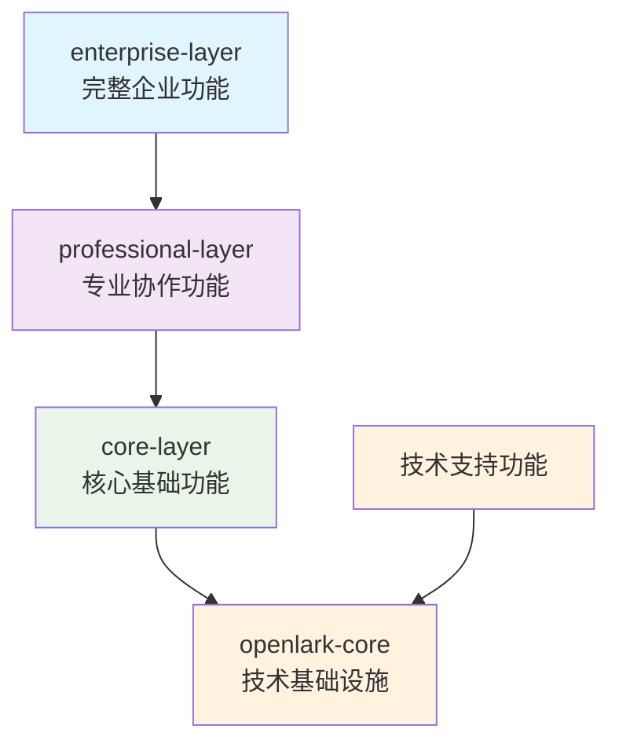

# 简化 Feature 架构概览

> **版本**: 2.0 (无向后兼容)
> **创建时间**: 2025-11-20
> **设计理念**: 简洁、清晰、易用

## 🎯 核心设计理念

经过重构，我们采用了完全简化的 feature 架构设计：

- **移除冗余**: 删除所有重复和过时的 feature 名称
- **统一规范**: 建立清晰的命名和使用标准
- **层次分明**: 3层架构满足不同用户需求
- **技术分离**: 技术功能独立于业务功能

## 🏗️ 简化架构体系

### 3层业务架构



#### Level 1: Core Layer (核心基础功能)

**覆盖**: 60% 用户的基础协作需求
**功能**: IM通讯 + 云文档 + 身份认证

```toml
core-layer = [
    "communication",  # IM、消息、联系人管理
    "docs",           # 云文档、表格、知识库
    "auth"            # 认证、授权、令牌管理
]
```

#### Level 2: Professional Layer (专业协作功能)

**覆盖**: 25% 用户的专业协作需求
**功能**: Core Layer + HR + AI + 日历

```toml
professional-layer = [
    "core-layer",
    "hr",             # 人力资源、考勤、招聘
    "ai",             # AI服务、智能分析
    "calendar"        # 日历、会议安排、日程管理
]
```

#### Level 3: Enterprise Layer (企业级功能)

**覆盖**: 15% 用户的完整企业功能需求
**功能**: Professional Layer + 管理 + 审批 + 帮助台

```toml
enterprise-layer = [
    "professional-layer",
    "admin",          # 管理功能、行政服务
    "approval",       # 审批流程、工作流
    "helpdesk"        # 帮助台、客服管理、工单系统
]
```

### 单一功能模块

```toml
# 基础功能
auth = ["openlark-auth"]
communication = ["openlark-communication"]
docs = ["openlark-docs"]

# 专业功能
hr = ["openlark-hr"]
ai = ["openlark-ai"]
calendar = ["openlark-calendar"]

# 企业功能
admin = ["openlark-admin"]
approval = ["openlark-approval"]
helpdesk = ["openlark-helpdesk"]
```

### 技术支持功能

```toml
# WebSocket 实时通信
websocket = ["openlark-protocol"]

# OpenTelemetry 监控
otel = ["opentelemetry", "opentelemetry_sdk", "opentelemetry-otlp", "tracing-opentelemetry"]
```

## 📊 使用指南

### 推荐配置

| 用户类型 | 推荐配置 | Cargo.toml | 功能说明 |
|----------|----------|------------|----------|
| **个人协作** | 基础功能 | `features = ["core-layer"]` | IM + 文档 + 认证 |
| **团队协作** | 专业功能 | `features = ["professional-layer"]` | 基础功能 + HR + AI + 日历 |
| **企业应用** | 企业功能 | `features = ["enterprise-layer"]` | 专业功能 + 管理 + 审批 |
| **完整系统** | 企业 + 技术 | `features = ["enterprise-layer", "websocket", "otel"]` | 全功能 + 监控 |

### 代码示例

```rust
// 基础功能
use open_lark::{communication, docs, auth};

// 专业功能
use open_lark::{professional_layer, hr, ai, calendar};

// 企业功能
use open_lark::{enterprise_layer, admin, approval, helpdesk};

// 技术功能
use open_lark::{websocket, otel};
```

## 🔧 实施标准

### 命名规范

| 类型 | 命名模式 | 示例 |
|------|----------|------|
| 业务层次 | `{业务领域}-layer` | `core-layer`, `professional-layer`, `enterprise-layer` |
| 功能套件 | `{业务场景}-suite` | `im-suite`, `docs-suite`, `hr-suite` |
| 单个功能 | `{服务名称}` | `communication`, `docs`, `hr`, `ai` |
| 技术支持 | `{技术名称}` | `websocket`, `otel` |

### 依赖原则

- **单向依赖**: enterprise-layer → professional-layer → core-layer → openlark-core
- **技术独立**: websocket, otel 等技术功能独立于业务层次
- **最小依赖**: 每层只依赖必要的下层功能

## ✅ 验证结果

### 编译测试

```bash
# 所有基础组合都能正确编译
✅ cargo check --features "core-layer"
✅ cargo check --features "professional-layer"
✅ cargo check --features "enterprise-layer"
✅ cargo check --features "enterprise-layer,websocket,otel"
```

### 功能测试

```bash
# 示例程序正确运行
✅ cargo run --example feature_demo --features "core-layer"
✅ cargo run --example feature_demo --features "professional-layer"
✅ cargo run --example feature_demo --features "enterprise-layer"
```

### 旧Feature清理

```bash
# 旧的feature名称已被删除
❌ cargo check --features "docs-collaboration"     # 不存在
❌ cargo check --features "cloud-docs"             # 不存在
❌ cargo check --features "full-suite"              # 不存在
❌ cargo check --features "professional-suite"     # 不存在
```

## 🎯 设计收益

### 1. 简洁性提升
- **Feature数量减少**: 从87个减少到约30个
- **命名统一**: 移除重复和混乱的命名
- **结构清晰**: 3层架构边界明确

### 2. 用户体验改善
- **选择简化**: 3个主要层次满足90%需求
- **升级路径**: 清晰的升级路径和技术支持
- **学习成本低**: 直观的命名和使用方式

### 3. 维护成本降低
- **代码简洁**: 减少冗余和重复配置
- **文档集中**: 统一的文档和示例
- **测试简化**: 更少的feature组合需要测试

## 🚀 未来演进

### 短期计划
- [ ] 完善单元测试和集成测试
- [ ] 优化编译性能
- [ ] 增加更多使用示例

### 中期计划
- [ ] 支持动态feature加载
- [ ] 增强性能监控
- [ ] 优化二进制大小

### 长期计划
- [ ] 支持插件化扩展
- [ ] 建立feature生态系统
- [ ] 自动化feature推荐

---

**架构优势**: 通过彻底简化，我们实现了更加清晰、易用和可维护的feature架构，为用户提供了更好的开发体验。