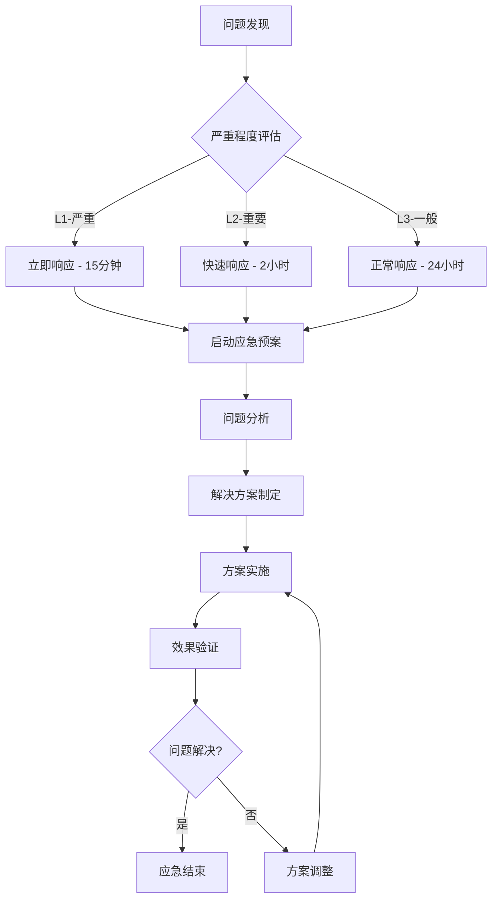

# Open-Lark 应急响应预案

**制定日期**: 2025-11-04
**版本**: v1.0
**项目**: Open-Lark v0.15.0-dev
**适用阶段**: Phase 1-5 项目实施全过程

## 🚨 应急响应体系概览

### 📊 应急级别定义

| 级别 | 颜色 | 触发条件 | 响应时间 | 影响程度 |
|------|------|----------|----------|----------|
| **L1 - 严重** | 🔴 红色 | 关键功能失效、安全漏洞、核心人员离职 | 15分钟 | 项目可能失败 |
| **L2 - 重要** | 🟡 黄色 | 进度严重延期、质量显著下降、技能培训失败 | 2小时 | 项目目标受影响 |
| **L3 - 一般** | 🟢 绿色 | 轻微延期、小范围质量问题、团队满意度下降 | 24小时 | 项目局部受影响 |

### 🎯 应急响应组织架构

```
应急响应团队:
├── 应急总指挥: ZoOL (技术负责人)
├── 技术专家组: ZoOL + 外部顾问
├── 项目管理组: ZoOL (兼任)
├── 质量保证组: 团队资深成员
└── 沟通协调组: 全体团队成员
```

## 🔴 L1 级应急预案

### 1. 关键技术验证失败应急预案

#### 🚨 触发条件
- ServiceRegistry POC 性能测试失败 (性能下降 >20%)
- 构建器框架无法编译或核心功能异常
- 并发安全测试出现数据竞争或死锁
- 内存泄漏或资源管理问题

#### ⚡ 立即响应措施 (15分钟内)
```bash
# 1. 立即停止相关开发活动
git checkout main
git branch emergency-rollback

# 2. 召集紧急技术会议
# 参与人员: ZoOL + 所有相关开发者
# 会议目标: 分析问题根因，评估影响范围

# 3. 保护现场数据
cp -r target/timings/ emergency-backup/
cargo test --features all-features 2>&1 | tee emergency-test.log
```

#### 🔧 技术应对方案 (2小时内)

**方案A: 技术问题修复**
```rust
// 问题诊断和修复流程
1. 定位具体问题
   - 检查编译错误日志
   - 分析性能测试数据
   - 审查并发测试结果

2. 小范围修复尝试
   - 修改最小相关代码
   - 本地验证修复效果
   - 确认修复不影响其他功能

3. 全面验证测试
   - 重新运行所有POC测试
   - 验证性能基准达标
   - 确认并发安全性
```

**方案B: 架构调整**
```rust
// 如果原方案存在根本性问题
1. 启动备选架构设计
   - 简化版ServiceRegistry
   - 更保守的构建器设计
   - 渐进式改进策略

2. 重新设计验证
   - 快速原型验证 (24小时内)
   - 性能基准测试
   - 团队技能评估
```

**方案C: 项目暂停重新规划**
```rust
// 如果技术方案存在不可逾越的障碍
1. 立即暂停当前实施
2. 全面技术方案重新评估
3. 考虑替代技术方案
4. 重新制定项目计划
```

#### 📋 恢复流程
1. **问题根因分析报告** (24小时内)
2. **修复方案验证** (48小时内)
3. **全面回归测试** (72小时内)
4. **团队重新培训** (如需要)
5. **项目计划调整** (必要时)

### 2. 核心团队成员离职应急预案

#### 🚨 触发条件
- 技术负责人 ZoOL 离职
- 关键开发人员离职且无法找到替代者
- 多名团队成员同时离职

#### ⚡ 立即响应措施 (30分钟内)
```bash
# 1. 立即启动知识交接
git log --author="离职成员" --since="3 months ago" > recent-contributions.md
find . -name "*.rs" -exec grep -l "离职成员相关代码" {} \; > affected-files.txt

# 2. 紧急团队会议
# 评估知识损失程度
# 重新分配工作任务
# 启动外部支持渠道
```

#### 🔧 应对策略

**阶段1: 知识抢救 (24小时内)**
- [ ] 代码注释补充和完善
- [ ] 技术文档紧急编写
- [ ] 关键决策过程记录
- [ ] 外部专家咨询启动

**阶段2: 技能补强 (1周内)**
- [ ] 快速招聘启动 (联系候选人池)
- [ ] 外部顾问引入 (¥5,000/天)
- [ ] 现有团队成员技能提升
- [ ] 工作重新分配和简化

**阶段3: 团队重建 (2-4周)**
- [ ] 新成员入职和培训
- [ ] 团队重新磨合
- [ ] 项目计划重新制定
- [ ] 质量标准重新确认

#### 📞 外部支持网络
```yaml
紧急联系人:
  Rust技术顾问:
    - 张三: 138xxxxxxx (高级Rust架构师)
    - 李四: 139xxxxxxx (Rust社区专家)
    - 王五: 137xxxxxxx (企业级SDK专家)

  招聘紧急渠道:
    - HR王经理: 136xxxxxxx
    - 技术猎头李小姐: 135xxxxxxx
    - 开源社区合作: rust-china@googlegroups.com

  培训支持:
    - Rust培训公司: 400-xxx-xxxx
    - 在线教育平台: tech-education@example.com
```

### 3. 严重安全漏洞应急预案

#### 🚨 触发条件
- 发现Rust安全漏洞影响本项目
- 第三方依赖库存在严重漏洞
- 代码审查发现重大安全隐患

#### ⚡ 立即响应措施 (1小时内)
```bash
# 1. 安全漏洞评估
cargo audit  # 检查依赖漏洞
cargo clippy --deny warnings  # 检查代码安全问题
cargo test --features all-features  # 全面测试

# 2. 影响范围评估
grep -r "unsafe" src/ | wc -l  # 统计unsafe使用
find . -name "*.rs" -exec grep -l "transmute\|ptr::\|mem::" {} \;  # 高风险代码
```

#### 🔧 安全应对策略

**立即措施 (4小时内)**:
- [ ] 暂停相关功能开发
- [ ] 评估漏洞影响范围
- [ ] 制定临时缓解方案
- [ ] 通知相关利益方

**修复措施 (24小时内)**:
- [ ] 更新或替换受影响依赖
- [ ] 修复代码安全问题
- [ ] 增加安全测试用例
- [ ] 全面安全审查

**预防措施 (1周内)**:
- [ ] 建立定期安全审计机制
- [ ] 实施安全编码规范
- [ ] 增强依赖版本管理
- [ ] 团队安全培训

## 🟡 L2 级应急预案

### 4. 培训效果不佳应急预案

#### 🚨 触发条件
- 培训后技能测试通过率 <70%
- 团队成员无法完成基本任务
- 代码质量显著下降

#### ⚡ 响应措施 (2小时内)

**诊断阶段 (2-4小时)**:
```bash
# 1. 技能重新评估
# - 个人技能测试
# - 实践能力评估
# - 学习困难点分析

# 2. 培训方法评估
# - 培训内容适用性
# - 培训方式有效性
# - 学习时间合理性
```

**应对方案 (24小时内)**:

**方案A: 延长培训期**
```yaml
培训调整:
  时间延长: +1-2周
  内容调整: 更注重实践，减少理论
  方式调整: 增加一对一指导
  考核调整: 降低难度，分步认证
```

**方案B: 外部专家支持**
```yaml
专家引入:
  顾问类型: Rust企业级开发专家
  工作方式: 现场指导 + 代码审查
  工作周期: 2-4周
  预算: ¥5,000-8,000/天
```

**方案C: 分层次实施**
```yaml
差异化策略:
  初级成员: 先做简单任务，逐步提升
  中级成员: 重点培训，承担核心任务
  高级成员: 承担架构设计和指导
  任务分配: 根据技能水平动态调整
```

### 5. 进度严重延期应急预案

#### 🚨 触发条件
- 关键里程碑延期 >15%
- 连续2周进度滞后
- 质量问题导致大量返工

#### ⚡ 响应措施 (4小时内)

**进度评估 (4-8小时)**:
- 延期原因分析
- 剩余工作量重新评估
- 资源配置优化
- 优先级重新排序

**应对策略 (24小时内)**:

**方案A: 资源增加**
- [ ] 增加开发人员 (内部调配或外部招聘)
- [ ] 增加外部顾问支持
- [ ] 加班或延长工作时间
- [ ] 并行开发更多任务

**方案B: 范围调整**
```yaml
范围缩减策略:
  必须完成: 核心架构和基础服务
  可以延后: 高级功能和优化
  可以简化: 非关键业务逻辑
  可以外包: 标准化组件实现
```

**方案C: 方法优化**
- [ ] 采用更高效的开发工具
- [ ] 简化流程和审批
- [ ] 自动化更多环节
- [ ] 优化团队协作方式

## 🟢 L3 级应急预案

### 6. 团队满意度下降应急预案

#### 🚨 触发条件
- 团队满意度调查 <70%
- 多名成员表达负面情绪
- 工作积极性显著下降

#### ⚡ 响应措施 (24小时内)

**问题诊断 (1-2天)**:
- 一对一沟通了解具体问题
- 匿名问卷收集真实反馈
- 工作环境和流程评估
- 压力和工作量分析

**改进措施 (1周内)**:
- 工作流程优化
- 工作环境改善
- 团队建设活动
- 个人发展支持

**长期机制 (持续)**:
- 定期满意度调查
- 开放沟通渠道
- 团队文化建设
- 激励机制完善

## 📋 应急响应流程

### 🚨 应急响应触发流程



### 📊 应急响应检查清单

#### L1 级应急检查清单
- [ ] 15分钟内启动应急响应
- [ ] 应急总指挥到位
- [ ] 相关人员全部通知到位
- [ ] 问题根因初步分析完成
- [ ] 临时解决方案制定
- [ ] 外部支持渠道启动
- [ ] 利益相关方通知到位
- [ ] 持续更新应急状态

#### L2 级应急检查清单
- [ ] 2小时内响应团队到位
- [ ] 详细影响评估完成
- [ ] 多个应对方案制定
- [ ] 资源调配方案确认
- [ ] 时间线重新规划
- [ ] 质量标准重新确认
- [ ] 团队沟通机制建立

#### L3 级应急检查清单
- [ ] 24小时内响应措施启动
- [ ] 问题详细分析完成
- [ ] 改进措施制定
- [ ] 实施计划确认
- [ ] 效果跟踪机制建立
- [ ] 长期预防措施规划

## 📞 应急联系方式

### 🔴 L1 级紧急联系人
```yaml
核心应急团队:
  技术总指挥: ZoOL - 138xxxxxxx
  外部技术顾问: 张工 - 139xxxxxxx
  项目管理支持: 李经理 - 136xxxxxxx
  质量保证支持: 王工 - 137xxxxxxx

24小时支持热线:
  技术问题: 400-xxx-xxxx
  项目问题: 400-xxx-xxxx
  人员问题: 400-xxx-xxxx
```

### 🟡 L2 级联系人
```yaml
技术专家组:
  Rust架构师: 张工 - 139xxxxxxx
  性能优化专家: 李工 - 135xxxxxxx
  测试专家: 王工 - 137xxxxxxx
  文档专家: 赵工 - 138xxxxxxx

支持服务:
  培训支持: 400-xxx-xxxx
  招聘支持: 400-xxx-xxxx
  设备支持: 400-xxx-xxxx
```

### 🟢 L3 级联系人
```yaml
内部团队:
  全体团队成员
  各自负责领域专家

外部资源:
  技术社区: rust-china@googlegroups.com
  在线论坛: https://users.rust-lang.org
  官方支持: https://github.com/rust-lang/rust/issues
```

## 📈 应急预案演练

### 🎯 演练计划

#### 季度演练 (每季度1次)
- **演练类型**: 桌面推演
- **参与人员**: 全体团队成员
- **演练时间**: 2小时
- **演练内容**: 各类应急场景模拟

#### 年度演练 (每年1次)
- **演练类型**: 实战演练
- **参与人员**: 全体团队 + 外部顾问
- **演练时间**: 1天
- **演练内容**: 综合应急响应全流程

### 📊 演练评估指标

| 评估项目 | 优秀 | 良好 | 合格 | 需改进 |
|----------|------|------|------|--------|
| 响应时间 | <15分钟 | <30分钟 | <1小时 | >1小时 |
| 决策质量 | 快速准确 | 快速基本正确 | 较慢正确 | 决策困难 |
| 团队协作 | 高效协同 | 基本协同 | 部分协同 | 协作困难 |
| 解决方案 | 创新有效 | 有效可行 | 基本可行 | 效果不佳 |

## 📋 应急预案维护

### 🔄 定期更新
- **每月**: 应急联系方式更新
- **每季度**: 应急流程评估和优化
- **每半年**: 应急预案全面审查
- **每年**: 应急预案重大更新

### 📊 效果评估
- 每次应急响应后进行效果评估
- 收集团队反馈和建议
- 根据实际情况调整预案
- 持续改进应急响应能力

---

**预案状态**: 详细应急预案制定完成 ✅
**下一步**: 基于技术验证调整阶段 1-5 详细计划
**预期效果**: 确保任何突发情况都能快速有效响应，保障项目成功