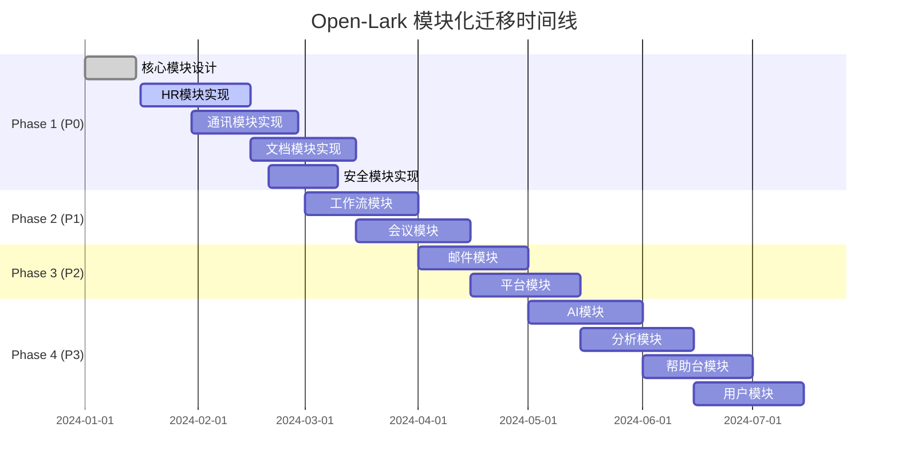

# Open-Lark 模块化迁移指南

## 概述

本文档提供从当前架构到新模块化架构的详细迁移指南，包括具体的步骤、工具和最佳实践。

## 迁移策略

### 整体原则

1. **渐进式迁移**: 分阶段进行，确保每个阶段都有可用的中间版本
2. **向后兼容**: 在迁移过程中保持API兼容性
3. **质量优先**: 每个阶段都要通过完整的质量检查
4. **文档同步**: 代码和文档同步更新

### 迁移阶段规划



## 详细迁移步骤

### Phase 1: 核心业务模块 (P0优先级)

#### 1.1 环境准备

**步骤1**: 备份当前代码
```bash
# 创建备份分支
git checkout -b backup/pre-migration
git push origin backup/pre-migration

# 创建迁移分支
git checkout main
git checkout -b feature/modular-migration
```

**步骤2**: 更新开发工具
```bash
# 安装Python依赖（用于工具脚本）
pip install -r tools/requirements.txt

# 确保Rust工具链最新
rustup update
cargo install cargo-expand cargo-watch
```

#### 1.2 HR模块迁移 (openlark-hr)

**目标**: 合并hire(182) + corehr(144) + feishu_people(105) + attendance(39) + payroll(12) + ehr(2) = 484 APIs

**步骤1**: 创建新的HR模块结构
```bash
mkdir -p crates/openlark-hr/src/{hire,corehr,people,attendance,payroll}/{v1,models}
mkdir -p crates/openlark-hr/{tests,examples}
```

**步骤2**: 创建Cargo.toml
```toml
[package]
name = "openlark-hr"
version = "0.1.0"
edition = "2021"
description = "HR management module for Open-Lark SDK"

[dependencies]
openlark-core = { workspace = true }
serde = { workspace = true }
serde_json = { workspace = true }
reqwest = { workspace = true }
thiserror = { workspace = true }
tokio = { workspace = true }
chrono = { workspace = true }
uuid = { workspace = true }

[features]
default = []
websocket = ["openlark-protocol"]
```

**步骤3**: 迁移核心数据模型
```rust
// crates/openlark-hr/src/models/mod.rs
pub mod employee;
pub mod department;
pub mod offer;
pub mod candidate;
pub mod attendance_record;

use serde::{Deserialize, Serialize};

#[derive(Debug, Clone, Serialize, Deserialize)]
pub struct Employee {
    pub user_id: String,
    pub name: String,
    pub department_id: String,
    pub employee_id: Option<String>,
    pub position: Option<String>,
    pub mobile: Option<String>,
    pub email: Option<String>,
}

#[derive(Debug, Clone, Serialize, Deserialize)]
pub struct Department {
    pub department_id: String,
    pub name: String,
    pub parent_department_id: Option<String>,
    pub leader_user_id: Option<String>,
}
```

**步骤4**: 实现API服务结构
```rust
// crates/openlark-hr/src/lib.rs
pub mod models;
pub mod hire;
pub mod corehr;
pub mod people;
pub mod attendance;
pub mod payroll;

use openlark_core::{Config, SDKResult};

pub struct HRService {
    pub config: Config,
}

impl HRService {
    pub fn new(config: Config) -> Self {
        Self { config }
    }

    pub fn hire(&self) -> hire::HireService {
        hire::HireService::new(self.config.clone())
    }

    pub fn corehr(&self) -> corehr::CoreHRService {
        corehr::CoreHRService::new(self.config.clone())
    }

    pub fn people(&self) -> people::PeopleService {
        people::PeopleService::new(self.config.clone())
    }

    pub fn attendance(&self) -> attendance::AttendanceService {
        attendance::AttendanceService::new(self.config.clone())
    }
}
```

**步骤5**: 实现具体API
```rust
// crates/openlark-hr/src/corehr/v1/employee.rs
use openlark_core::{Config, SDKResult, HttpClient};
use crate::models::{Employee, EmployeeCreateRequestV1, EmployeeCreateResponseV1};

pub struct EmployeeService {
    config: Config,
}

impl EmployeeService {
    pub(crate) fn new(config: Config) -> Self {
        Self { config }
    }

    pub async fn create(&self, request: EmployeeCreateRequestV1) -> SDKResult<EmployeeCreateResponseV1> {
        let client = HttpClient::new(&self.config)?;
        let url = format!("{}/contact/v3/users", self.config.api_base_url);

        let response = client
            .post(&url)
            .json(&request)
            .send()
            .await?;

        let result: EmployeeCreateResponseV1 = response.json().await?;
        Ok(result)
    }

    pub async fn get(&self, user_id: &str) -> SDKResult<Employee> {
        let client = HttpClient::new(&self.config)?;
        let url = format!("{}/contact/v3/users/{}", self.config.api_base_url, user_id);

        let response = client.get(&url).send().await?;
        let result: Employee = response.json().await?;
        Ok(result)
    }
}
```

**步骤6**: 创建测试
```rust
// crates/openlark-hr/tests/unit/employee_tests.rs
use openlark_core::Config;
use openlark_hr::{HRService, EmployeeCreateRequestV1};

#[tokio::test]
async fn test_employee_create_request() {
    let request = EmployeeCreateRequestV1 {
        name: "测试员工".to_string(),
        department_id: "dept_123".to_string(),
        mobile: "13800138000".to_string(),
        email: Some("test@example.com".to_string()),
    };

    let json = serde_json::to_string(&request).unwrap();
    assert!(json.contains("测试员工"));
    assert!(json.contains("13800138000"));
}
```

#### 1.3 通讯模块迁移 (openlark-communication)

**目标**: 合并contact(77) + im(75) + moments(1) = 153 APIs

**关键迁移点**:
- 保持现有的消息发送API兼容性
- 统一联系人管理接口
- 优化群组管理功能

#### 1.4 文档模块迁移 (openlark-docs)

**目标**: 合并ccm(174) + base(49) + baike(27) + minutes(4) = 254 APIs

**关键迁移点**:
- 统一文档操作接口
- 保持文件上传/下载兼容性
- 优化知识库管理功能

#### 1.5 安全模块迁移 (openlark-security)

**目标**: 合并auth(11) + passport(2) + security_and_compliance(8) + trust_party(5) + acs(14) + human_authentication(4) = 44 APIs

**关键迁移点**:
- 保持认证流程兼容性
- 统一权限管理接口
- 增强安全合规功能

### Phase 2: 业务流程模块 (P1优先级)

#### 2.1 工作流模块 (openlark-workflow)

**目标**: 合并task(75) + approval(53) + board(6) = 134 APIs

**实现重点**:
- 统一任务管理接口
- 保持审批流程兼容性
- 优化看板功能

#### 2.2 会议模块 (openlark-meeting)

**目标**: 合并calendar(44) + vc(56) + meeting_room(17) = 117 APIs

**实现重点**:
- 统一日程管理接口
- 保持视频会议兼容性
- 优化会议室预订功能

### Phase 3: 辅助功能模块 (P2优先级)

#### 3.1 邮件模块 (openlark-mail)
#### 3.2 平台模块 (openlark-platform)

### Phase 4: 扩展功能模块 (P3优先级)

#### 4.1 AI模块 (openlark-ai)
#### 4.2 分析模块 (openlark-analytics)
#### 4.3 帮助台模块 (openlark-helpdesk)
#### 4.4 用户模块 (openlark-user)

## 迁移工具使用

### API分类工具

```bash
# 分析API数据
python tools/classify_apis.py analysis/data/api_list_export.csv

# 查看分类结果
cat tools/output/classification_report.md

# 查看生成的Rust代码
cat tools/output/module_mapping.rs
```

### 迁移验证工具

```bash
# 验证迁移进度
python tools/migration_validator.py

# 生成详细报告
python tools/migration_validator.py --output migration_report.json

# 验证特定模块
python tools/migration_validator.py --verbose
```

### 自动化脚本

```bash
#!/bin/bash
# tools/migrate_crate.sh - 自动化crate创建

CRATE_NAME=$1
DESCRIPTION=$2

if [ -z "$CRATE_NAME" ] || [ -z "$DESCRIPTION" ]; then
    echo "用法: $0 <crate名称> <描述>"
    exit 1
fi

# 创建目录结构
mkdir -p "crates/$CRATE_NAME/src/{models,tests,examples}"

# 创建Cargo.toml
cat > "crates/$CRATE_NAME/Cargo.toml" << EOF
[package]
name = "$CRATE_NAME"
version = "0.1.0"
edition = "2021"
description = "$DESCRIPTION for Open-Lark SDK"

[dependencies]
openlark-core = { workspace = true }
serde = { workspace = true }
serde_json = { workspace = true }
reqwest = { workspace = true }
thiserror = { workspace = true }
tokio = { workspace = true }
chrono = { workspace = true }
uuid = { workspace = true }

[features]
default = []
websocket = ["openlark-protocol"]
EOF

# 创建lib.rs模板
cat > "crates/$CRATE_NAME/src/lib.rs" << EOF
//! $DESCRIPTION module for Open-Lark

pub mod models;

use openlark_core::{Config, SDKResult};

pub struct Service {
    pub config: Config,
}

impl Service {
    pub fn new(config: Config) -> Self {
        Self { config }
    }
}
EOF

echo "✅ Crate $CRATE_NAME 创建完成"
```

## 质量保证

### 编译检查

```bash
# 检查所有crate编译
cargo check --workspace --all-features

# 检查特定模块
cargo check -p openlark-hr

# 格式检查
cargo fmt --all -- --check

# Clippy检查
cargo clippy --workspace --all-features -- -Dwarnings
```

### 测试策略

```bash
# 运行所有测试
cargo test --workspace --all-features

# 运行特定模块测试
cargo test -p openlark-hr

# 运行集成测试
cargo test --test integration

# 生成覆盖率报告
cargo llvm-cov --workspace --lcov --output-path lcov.info
```

### 性能基准

```bash
# 运行性能测试
cargo bench --workspace

# 检查编译时间
cargo build --workspace --timings
```

## 兼容性处理

### API兼容性策略

1. **保持现有API签名**: 新模块中的API保持与现有API相同的签名
2. **版本化支持**: 支持多个API版本并存
3. **渐进式废弃**: 提供迁移路径，逐步废弃旧API

### 示例：兼容性包装

```rust
// crates/openlark-client/src/compat.rs
//! 向后兼容性支持

use crate::{LarkClient, SDKResult};
use openlark_hr::{HRService, EmployeeCreateRequestV3};
use openlark_communication::{CommunicationService, MessageSendRequestV1};

impl LarkClient {
    /// 兼容性包装：创建员工（旧API）
    #[deprecated(note = "使用 client.hr().corehr().v3().user_create() 替代")]
    pub async fn create_user_v3(&self, request: EmployeeCreateRequestV3) -> SDKResult<crate::models::User> {
        let hr_service = HRService::new(self.config.clone());
        let response = hr_service.corehr().v3().user_create(request).await?;
        // 转换为旧格式
        Ok(response.user.into())
    }

    /// 兼容性包装：发送消息（旧API）
    #[deprecated(note = "使用 client.communication().im().v1().message_send() 替代")]
    pub async fn send_message_v1(&self, request: MessageSendRequestV1) -> SDKResult<crate::models::Message> {
        let comm_service = CommunicationService::new(self.config.clone());
        let response = comm_service.im().v1().message_send(request).await?;
        // 转换为旧格式
        Ok(response.message.into())
    }
}
```

### Feature配置兼容性

```toml
# Cargo.toml - 保持向后兼容
[features]
# 新的功能分组
communication = ["openlark-communication"]
docs = ["openlark-docs"]
hr = ["openlark-hr"]

# 旧的兼容性支持
im = ["communication"]  # 向后兼容
cloud-docs = ["docs"]   # 向后兼容
```

## 部署和发布

### 发布流程

1. **预发布检查**:
```bash
# 运行完整检查
python tools/migration_validator.py --verbose

# 运行所有测试
cargo test --workspace --all-features

# 检查文档生成
cargo doc --workspace --no-deps
```

2. **版本标记**:
```bash
# 标记版本
git tag -a v0.15.0 -m "模块化架构重构完成"

# 推送标签
git push origin v0.15.0
```

3. **发布到crates.io**:
```bash
# 发布核心模块
cargo publish -p openlark-core
cargo publish -p openlark-client
cargo publish -p openlark-protocol

# 发布业务模块（按优先级）
cargo publish -p openlark-hr
cargo publish -p openlark-communication
cargo publish -p openlark-docs
cargo publish -p openlark-security
```

### 文档更新

1. **API文档**: 自动生成并发布到docs.rs
2. **使用指南**: 更新README和示例代码
3. **迁移指南**: 提供详细的迁移说明

## 回滚策略

### 回滚触发条件

1. **严重兼容性问题**: 影响现有用户的功能
2. **性能严重下降**: 关键API性能降低超过50%
3. **安全漏洞**: 发现严重安全问题

### 回滚步骤

1. **立即停止发布**:
```bash
# 从crates.io撤回（如果可能）
# 切换到备份分支
git checkout backup/pre-migration
```

2. **发布修复版本**:
```bash
# 创建修复分支
git checkout -b hotfix/rollback-issues

# 修复问题并发布
cargo publish --allow-dirty
```

3. **通知用户**: 通过issue、公告等渠道通知用户

## 监控和维护

### 发布后监控

1. **使用统计**: 监控各模块的使用情况
2. **错误报告**: 跟踪错误报告和问题反馈
3. **性能指标**: 监控API响应时间和服务可用性

### 持续维护

1. **定期更新**: 根据飞书API更新调整实现
2. **性能优化**: 基于使用数据进行优化
3. **文档维护**: 保持文档与代码同步

## 故障排除

### 常见问题

1. **编译错误**:
   - 检查依赖版本冲突
   - 确认feature配置正确
   - 验证Rust版本兼容性

2. **测试失败**:
   - 检查环境变量配置
   - 验证mock服务器配置
   - 确认API凭据有效性

3. **性能问题**:
   - 使用性能分析工具
   - 检查内存泄漏
   - 优化网络请求

### 调试工具

```bash
# 启用详细日志
RUST_LOG=debug cargo run --example debug_example

# 使用调试模式编译
cargo build --workspace --features debug

# 运行时分析
cargo run --example profiling_example --features profiling
```

## 总结

本迁移指南提供了从当前架构到新模块化架构的完整路径。通过分阶段实施、严格质量控制和充分测试，确保迁移过程平稳进行，同时为用户提供更好的开发体验和更高的代码质量。

迁移完成后，Open-Lark将具备：
- 更清晰的模块结构
- 更好的可维护性
- 更高的性能
- 更强的扩展性
- 更完善的测试覆盖

这将为项目的长期发展奠定坚实基础。