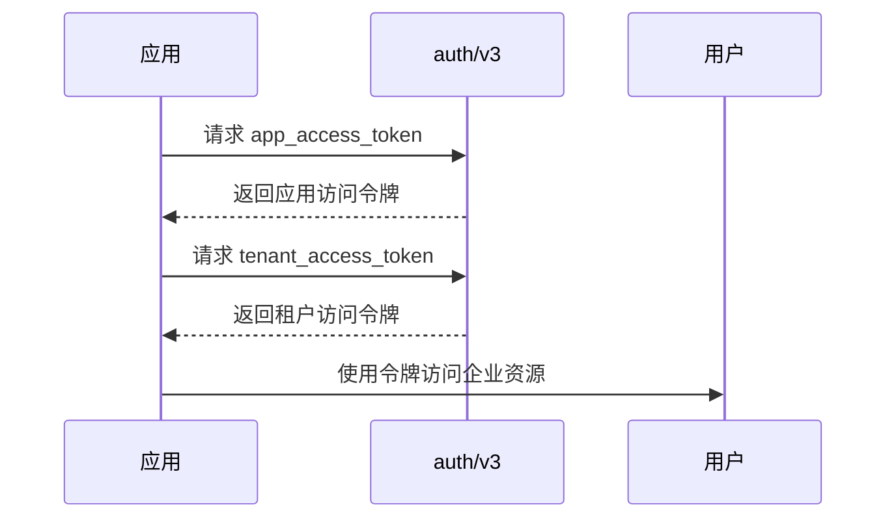
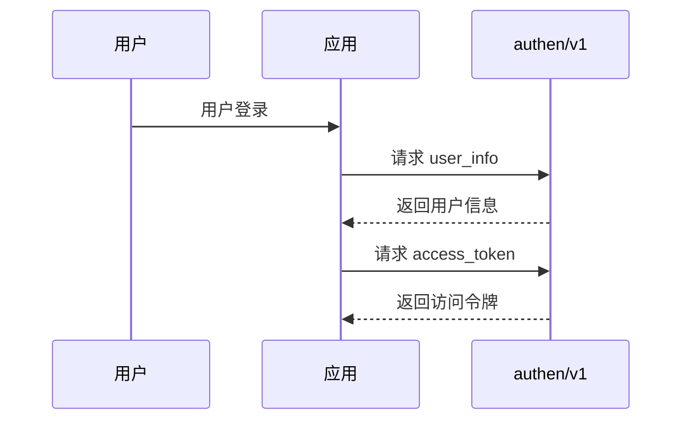
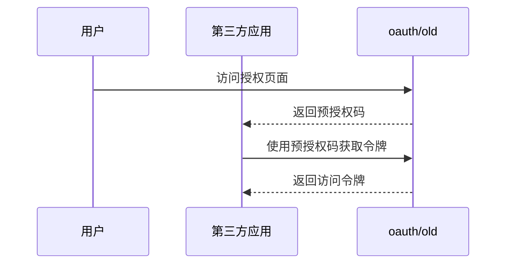
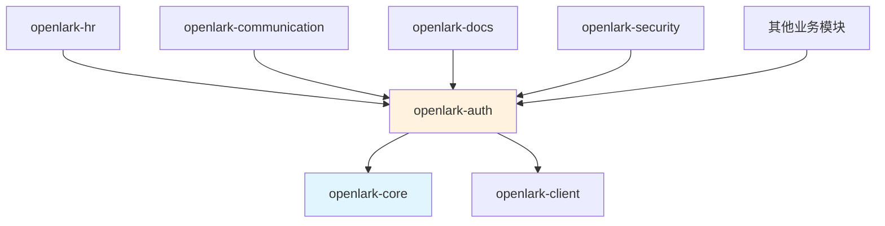

# Open-Lark 认证服务模块映射文档

## 模块概述

**模块标识**: `openlark-auth`
**业务价值**: 极高 (所有API调用的基础认证)
**API总数**: 11个 (0.6%) (0.5%)
**版本覆盖**: v1, v3, old
**核心功能**: 身份认证、令牌管理、OAuth授权

## Project-Version-Resource 架构设计

### 组织原则
采用 project-version-resource 三层结构组织认证服务：

1. **Project层**: 认证服务项目分类
   - `auth` - 企业应用认证 (v3)
   - `authen` - 用户身份认证 (v1)
   - `oauth` - OAuth授权 (old)

2. **Version层**: API版本管理
   - `v3` - 最新企业认证API
   - `v1` - 用户认证API
   - `old` - 向后兼容版本

3. **Resource层**: 具体的认证资源
   - `auth` - 认证令牌相关
   - `user_info` - 用户信息获取
   - `oidc` - OIDC协议支持
   - `access_token` - 访问令牌管理

## API详细分析

| Project | API数量 | Version | 主要功能 | 资源类型 |
|---------|---------|---------|---------|----------|
| **auth** | 5个 | v3 | 企业应用认证 | auth (令牌管理) |
| **authen** | 5个 | v1 | 用户身份认证 | user_info, oidc, access_token, refresh_access_token |
| **oauth** | 1个 | old | OAuth授权 | default |


### 按Resource详细分布

#### auth Project (v3) - 企业应用认证

| Resource | API数量 | 关键API | 路径格式 | 功能描述 |
|----------|---------|---------|----------|----------|
| **auth** | 5个 | tenant_access_token_internal | `POST:/open-apis/auth/v3/tenant_access_token/internal` | 自建应用获取租户访问令牌 |
| | | app_access_token_internal | `POST:/open-apis/auth/v3/app_access_token/internal` | 自建应用获取应用访问令牌 |
| | | app_ticket_resend | `POST:/open-apis/auth/v3/app_ticket/resend` | 重新推送应用票据 |
| | | app_access_token | `POST:/open-apis/auth/v3/app_access_token` | 商店应用获取应用访问令牌 |
| | | tenant_access_token | `POST:/open-apis/auth/v3/tenant_access_token` | 商店应用获取租户访问令牌 |

#### authen Project (v1) - 用户身份认证

| Resource | API数量 | 关键API | 路径格式 | 功能描述 |
|----------|---------|---------|----------|----------|
| **user_info** | 1个 | get | `GET:/open-apis/authen/v1/user_info` | 获取登录用户信息 |
| **oidc.access_token** | 1个 | create | `POST:/open-apis/authen/v1/oidc/access_token` | 获取OIDC访问令牌 |
| **oidc.refresh_access_token** | 1个 | create | `POST:/open-apis/authen/v1/oidc/refresh_access_token` | 刷新OIDC访问令牌 |
| **access_token** | 1个 | create | `POST:/open-apis/authen/v1/access_token` | 获取用户访问令牌 |

#### oauth Project (old) - OAuth授权

| Resource | API数量 | 关键API | 路径格式 | 功能描述 |
|----------|---------|---------|----------|----------|
| **default** | 1个 | v1/index | `GET:/open-apis/authen/v1/index` | 获取登录预授权码 |

## 业务场景分类

### 1. 企业应用认证场景 (auth/v3)
**适用场景**: 企业自建应用、应用商店应用
**核心流程**:


**关键API**:
- `tenant_access_token_internal()` - 自建应用租户令牌
- `app_access_token_internal()` - 自建应用令牌
- `app_access_token()` - 商店应用令牌
- `tenant_access_token()` - 商店应用租户令牌

### 2. 用户身份认证场景 (authen/v1)
**适用场景**: 用户登录、个人信息获取
**核心流程**:


**关键API**:
- `get_user_info()` - 获取用户信息
- `create_oidc_access_token()` - OIDC令牌获取
- `create_oidc_refresh_access_token()` - OIDC令牌刷新
- `create_access_token()` - 标准令牌获取

### 3. OAuth授权场景 (oauth/old)
**适用场景**: 第三方应用授权、网页登录
**核心流程**:


## 目录结构设计

```
crates/openlark-auth/src/
├── lib.rs                           # 模块入口
├── models/                          # 共享数据模型
│   ├── mod.rs
│   ├── token.rs                     # 令牌模型
│   ├── user_info.rs                 # 用户信息模型
│   └── oauth.rs                     # OAuth模型
├── auth/                            # 企业应用认证 (v3)
│   ├── lib.rs                       # auth模块入口
│   ├── v3/                          # API版本v3
│   │   ├── mod.rs
│   │   ├── tenant_access_token.rs   # 租户访问令牌API
│   │   │   ├── internal()           // 自建应用获取
│   │   │   └── store()              // 商店应用获取
│   │   ├── app_access_token.rs      # 应用访问令牌API
│   │   │   ├── internal()           // 自建应用获取
│   │   │   └── store()              // 商店应用获取
│   │   └── app_ticket.rs            # 应用票据API
│   │       └── resend()             // 重新推送票据
│   └── models/
│       ├── token_request.rs         # 令牌请求模型
│       ├── token_response.rs        # 令牌响应模型
│       └── ticket_request.rs        # 票据请求模型
├── authen/                          # 用户身份认证 (v1)
│   ├── lib.rs                       # authen模块入口
│   ├── v1/                          # API版本v1
│   │   ├── mod.rs
│   │   ├── user_info.rs             # 用户信息API
│   │   │   └── get()                // 获取用户信息
│   │   ├── oidc.rs                  # OIDC认证API
│   │   │   ├── access_token()       // 获取访问令牌
│   │   │   └── refresh_access_token() // 刷新访问令牌
│   │   └── access_token.rs          # 标准令牌API
│   │       └── create()             // 创建访问令牌
│   └── models/
│       ├── user_info_response.rs    # 用户信息响应
│       ├── oidc_token_response.rs   # OIDC令牌响应
│       └── token_request.rs         # 令牌请求模型
└── oauth/                           # OAuth授权 (old)
    ├── lib.rs                       # oauth模块入口
    ├── v1/                          # API版本v1 (向后兼容)
    │   ├── mod.rs
    │   └── authorization.rs         # 授权API
    │       └── get_index()          // 获取授权页面
    └── models/
        └── authorization_response.rs # 授权响应模型
```

## 关键API示例

### 企业应用认证 (auth/v3)

```rust
// 获取自建应用租户访问令牌
let tenant_token = auth.v3.tenant_access_token_internal()
    .app_id("app_id")
    .app_secret("app_secret")
    .send()
    .await?;

// 获取商店应用访问令牌
let app_token = auth.v3.app_access_token()
    .app_id("app_id")
    .app_secret("app_secret")
    .send()
    .await?;

// 重新推送应用票据
auth.v3.app_ticket_resend()
    .app_id("app_id")
    .app_secret("app_secret")
    .send()
    .await?;
```

### 用户身份认证 (authen/v1)

```rust
// 获取用户信息
let user_info = authen.v1.user_info.get()
    .user_access_token("user_access_token")
    .send()
    .await?;

// 获取OIDC访问令牌
let oidc_token = authen.v1.oidc.create_access_token()
    .grant_type("authorization_code")
    .code("authorization_code")
    .send()
    .await?;

// 刷新OIDC访问令牌
let refreshed_token = authen.v1.oidc.create_refresh_access_token()
    .refresh_token("refresh_token")
    .send()
    .await?;
```

### OAuth授权 (oauth/old)

```rust
// 获取登录预授权码 (向后兼容)
let auth_url = oauth.v1.authorization.get_index()
    .app_id("app_id")
    .redirect_uri("redirect_uri")
    .state("state")
    .build_url();
```

## 特性和配置

```toml
[dependencies]
openlark-auth = { workspace = true }

[features]
# 默认功能
default = ["enterprise_auth", "user_auth"]

# 企业应用认证
enterprise_auth = []
# 用户身份认证
user_auth = []
# OAuth授权 (向后兼容)
oauth = []
# 完整认证套件
full_auth = ["enterprise_auth", "user_auth", "oauth"]
# 仅企业认证
enterprise_only = ["enterprise_auth"]
# 仅用户认证
user_only = ["user_auth"]
```

## 使用示例

```rust
use openlark_auth::{AuthService, AuthConfig};

// 创建认证服务
let auth_service = AuthService::new(AuthConfig::new(
    "app_id",
    "app_secret"
))?;

// 企业应用场景
let tenant_token = auth_service.auth()
    .v3()
    .tenant_access_token_internal()
    .send()
    .await?;

let app_token = auth_service.auth()
    .v3()
    .app_access_token_internal()
    .send()
    .await?;

// 用户认证场景
let user_info = auth_service.authen()
    .v1()
    .user_info()
    .get()
    .user_access_token("user_access_token")
    .send()
    .await?;

// OIDC场景
let oidc_token = auth_service.authen()
    .v1()
    .oidc()
    .create_access_token()
    .grant_type("authorization_code")
    .code("auth_code")
    .send()
    .await?;
```

## 依赖关系



## 测试策略

### 单元测试覆盖
- 每个API独立测试
- 令牌管理逻辑验证
- 错误处理测试
- 参数验证测试

### 集成测试覆盖
- 完整认证流程测试
- 跨版本兼容性测试
- 令牌刷新场景测试

### 性能测试
- 令牌获取性能基准
- 并发认证请求测试
- 内存泄漏检测

## 质量保证

### API覆盖率目标
- **当前覆盖率**: 100% (11/11 APIs)
- **测试目标**: 95%+
- **文档目标**: 100%

### 安全要求
- 敏感信息加密存储
- 令牌安全传输
- 认证状态管理
- 防重放攻击机制

### 性能指标
- 令牌获取响应时间 < 200ms
- 并发认证支持 > 1000 TPS
- 内存使用 < 10MB


### 📝 版本兼容性说明

#### OIDC相关API迁移说明
部分OIDC相关API已迁移至历史版本，但功能仍然可用：

- **获取OIDC访问令牌**: 已迁移至 [历史版本文档](https://open.feishu.cn/server-docs/historic-version/authen/create-3)
- **刷新OIDC访问令牌**: 已迁移至 [历史版本文档](https://open.feishu.cn/server-docs/historic-version/authen/create-4)

#### 推荐迁移策略
- 新项目建议使用标准访问令牌API (`access_token` 和 `refresh_access_token`)
- 现有OIDC项目可继续使用，但建议逐步迁移至标准API
- 历史版本API将继续保持兼容性

## 版本兼容性

| 版本 | 状态 | 支持情况 | 迁移建议 |
|------|------|---------|----------|
| **v3** | ✅ 当前主版本 | 完全支持 | 推荐新项目使用 |
| **v1** | ✅ 稳定版本 | 完全支持 | 用户认证场景 |
| **old** | ⚠️ 向后兼容 | 有限支持 | 建议迁移到v3 |

## 总结

openlark-auth模块作为认证服务核心，提供了完整的身份认证和令牌管理功能：

- **企业应用认证**: 支持自建和商店应用的完整认证流程
- **用户身份认证**: 提供用户信息获取和OIDC协议支持
- **OAuth授权**: 保持向后兼容的第三方授权机制
- **高可靠性**: 完整的错误处理和安全机制
- **易用性**: 简洁的API设计和丰富的示例代码

该模块为所有其他业务模块提供了基础认证支持，是构建飞书应用的核心基础设施。