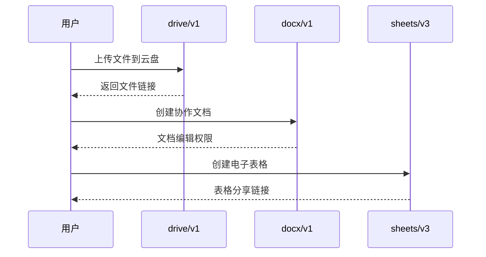
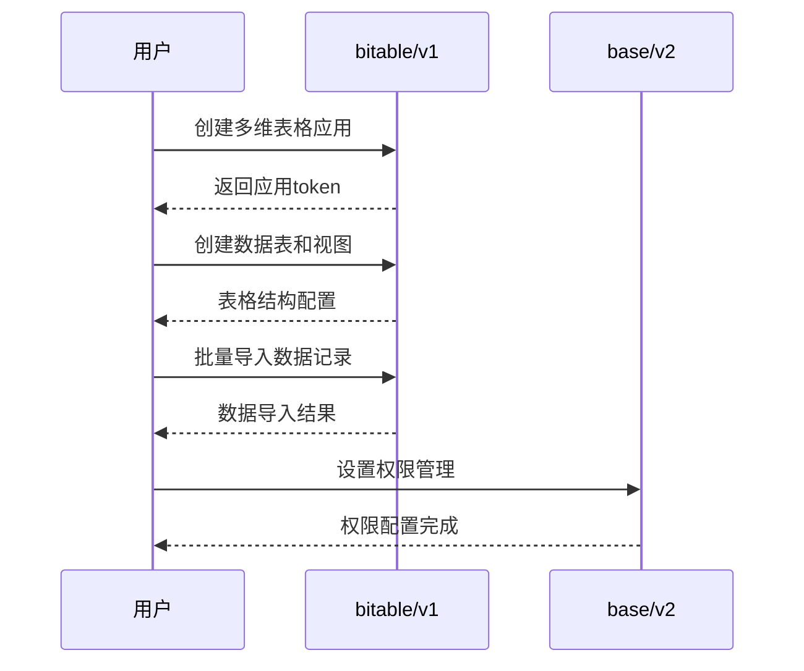
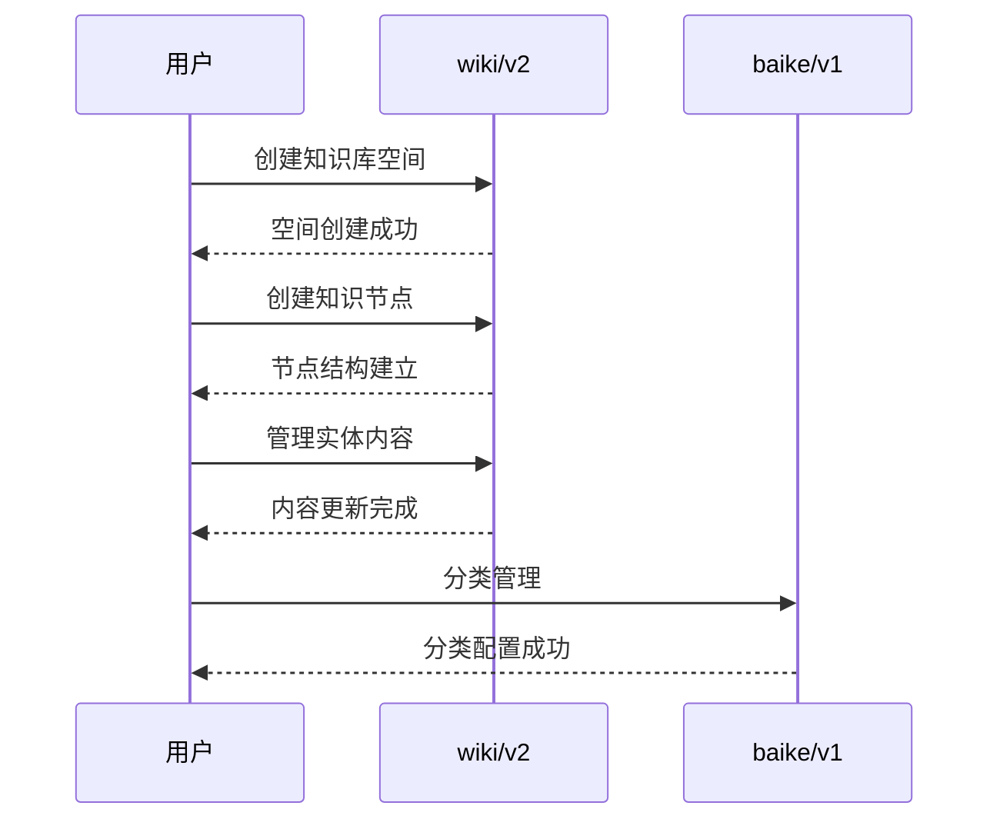
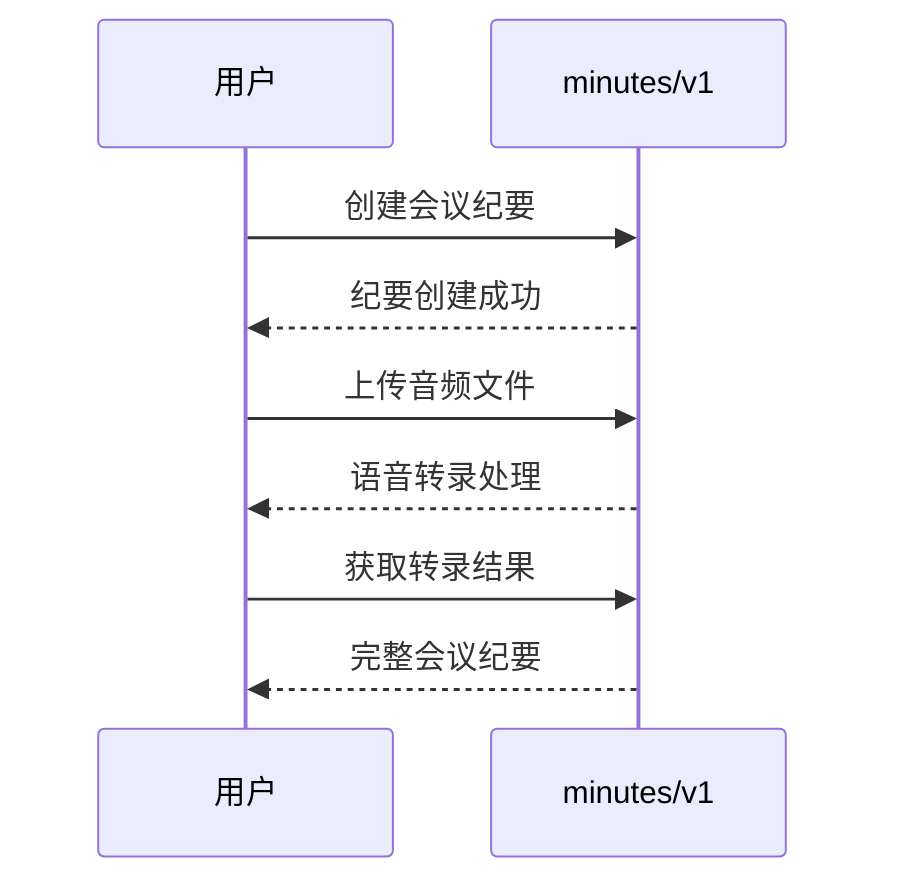
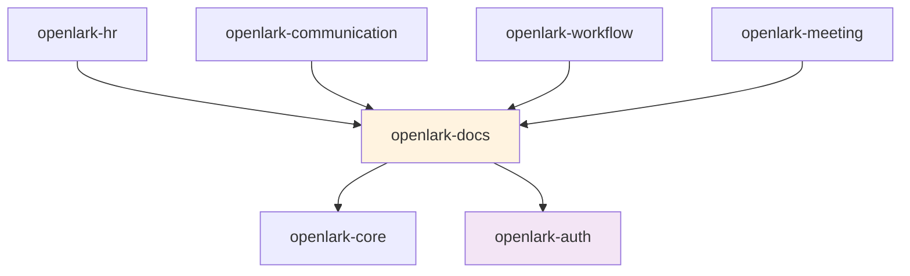

# Open-Lark 文档服务模块映射文档

## 模块概述

**模块标识**: `openlark-docs`
**业务价值**: 极高 (企业知识管理核心)
**API总数**: 254个 (15.0%)
**版本覆盖**: v1, v2, v3, old
**核心功能**: 云文档协同、多维表格、知识库管理、会议纪要

## Project-Version-Resource 架构设计

### 组织原则
采用 project-version-resource 三层结构组织文档服务：

1. **Project层**: 文档服务项目分类
   - `drive` - 云空间文件管理 (v1)
   - `bitable` - 多维表格核心功能 (v1)
   - `sheets` - 电子表格服务 (v2, v3)
   - `docx` - 文档处理 (v1)
   - `wiki` - 知识库管理 (v2)
   - `lingo` - 语言服务 (v1)
   - `baike` - 知识库旧版 (v1)
   - `minutes` - 会议纪要 (v1)

2. **Version层**: API版本管理
   - `v3` - 最新电子表格API
   - `v2` - 知识库管理API
   - `v1` - 基础文档API
   - `old` - 向后兼容版本

3. **Resource层**: 具体的文档资源
   - `file` - 文件资源管理
   - `app/table/view/record` - 多维表格资源
   - `space/node/entity` - 知识库资源
   - `transcript` - 会议纪要资源

## API详细分析

### 按Project统计的API分布

| Project | API数量 | Version | 主要功能 | 资源类型 |
|---------|---------|---------|---------|----------|
| **drive** | 59个 | v1 | 云空间文件管理 | file, folder, permission, link |
| **bitable** | 46个 | v1 | 多维表格核心功能 | app, table, view, record, field |
| **sheets** | 27个 | v2/v3 | 电子表格服务 | spreadsheet, range, sheet, style |
| **docx** | 19个 | v1 | 文档处理 | document, block, comment |
| **wiki** | 16个 | v2 | 知识库管理 | space, node, entity |
| **lingo** | 14个 | v1 | 语言服务(新版知识库) | default |
| **baike** | 13个 | v1 | 知识库旧版 | space, node, entity, draft |
| **minutes** | 4个 | v1 | 会议纪要 | transcript |
| **base** | 3个 | v2 | 多维表格增强权限 | permission |
| **ccm_sheet** | 33个 | old | 电子表格旧版 | spreadsheet |
| **其他** | 20个 | 多版本 | 辅助功能 | various |

### 按bizTag详细分布

#### 云文档协同 (ccm) - 174个API
**主要功能**: 文档、表格、知识库、云盘、协作
**Project分布**:
- `drive`: 59个 - 云空间核心功能
- `docx`: 19个 - 文档处理
- `sheets`: 27个 - 电子表格新版
- `ccm_sheet`: 33个 - 电子表格旧版
- `wiki`: 16个 - 知识库
- `baike`: 13个 - 知识库旧版
- `lingo`: 7个 - 语言服务

#### 多维表格 (base) - 49个API
**主要功能**: 多维表格应用、数据表、视图、记录
**Project分布**:
- `bitable`: 46个 - 多维表格核心功能
- `base`: 3个 - 增强权限管理

#### 知识库 (baike) - 27个API
**主要功能**: 企业知识库、Wiki管理、实体管理
**Project分布**:
- `baike`: 13个 - 知识库旧版API
- `wiki`: 16个 - 知识库新版API
- `lingo`: 7个 - 语言服务新版

#### 会议纪要 (minutes) - 4个API
**主要功能**: 会议记录管理、转录服务
**Project分布**:
- `minutes`: 4个 - 会议纪要专用API

## 业务场景分类

### 1. 云文档协同场景 (ccm)
**适用场景**: 文档协作、云盘管理、在线编辑
**核心流程**:


**关键API分类**:
- **文件管理**: drive_file_list_v1(), drive_file_upload_all_v1(), drive_file_download_v1()
- **文档协作**: docx_document_create_v1(), docx_block_create_v1()
- **电子表格**: sheets_spreadsheet_create_v3(), sheets_range_read_v3()

### 2. 多维表格数据管理 (base)
**适用场景**: 数据收集、分析、报表生成
**核心流程**:


**关键API分类**:
- **应用管理**: bitable_app_create_v1(), bitable_app_update_v1(), bitable_app_list_v1()
- **表格管理**: bitable_table_create_v1(), bitable_table_update_v1(), bitable_table_list_v1()
- **视图管理**: bitable_view_create_v1(), bitable_view_update_v1(), bitable_view_list_v1()
- **记录管理**: bitable_record_create_v1(), bitable_record_batch_create_v1(), bitable_record_search_v1()
- **字段管理**: bitable_field_create_v1(), bitable_field_update_v1()

### 3. 知识库内容管理 (baike)
**适用场景**: 企业知识管理、Wiki文档、知识分享
**核心流程**:


**关键API分类**:
- **空间管理**: baike_space_list_v2(), wiki_space_create_v2()
- **节点管理**: baike_space_node_list_v2(), wiki_node_create_v2()
- **实体管理**: baike_entity_update_v1(), wiki_entity_get_v2()
- **分类管理**: baike_classification_list_v1()

### 4. 会议纪要管理 (minutes)
**适用场景**: 会议记录、语音转录、会议总结
**核心流程**:


**关键API分类**:
- **转录管理**: minutes_transcript_create_v1(), minutes_transcript_get_v1()

## 目录结构设计

```
crates/openlark-docs/src/
├── lib.rs                           # 模块入口
├── models/                          # 共享数据模型
│   ├── mod.rs
│   ├── document.rs                  # 文档基础模型
│   ├── file.rs                      # 文件模型
│   ├── spreadsheet.rs               # 表格模型
│   ├── collaboration.rs             # 协作模型
│   └── permissions.rs               # 权限模型
├── drive/                           # 云空间文件管理 (59 APIs)
│   ├── lib.rs                       # drive模块入口
│   ├── v1/                          # API版本v1
│   │   ├── mod.rs
│   │   ├── files/                   # 文件操作
│   │   │   ├── mod.rs
│   │   │   ├── list.rs              // 获取文件列表
│   │   │   ├── get.rs               // 获取文件信息
│   │   │   ├── create_folder.rs     // 创建文件夹
│   │   │   ├── upload_all.rs        // 上传文件
│   │   │   ├── download.rs          // 下载文件
│   │   │   ├── copy.rs              // 复制文件
│   │   │   └── move.rs              // 移动文件
│   │   ├── permissions/             # 权限管理
│   │   │   ├── mod.rs
│   │   │   ├── create.rs            // 创建权限
│   │   │   ├── list.rs              // 获取权限列表
│   │   │   ├── update.rs            // 更新权限
│   │   │   └── delete.rs            // 删除权限
│   │   └── links/                   # 链接管理
│   │       ├── mod.rs
│   │       ├── create.rs            // 创建分享链接
│   │       ├── list.rs              // 获取链接列表
│   │       └── delete.rs            // 删除链接
│   └── models/
│       ├── file_info.rs             # 文件信息模型
│       ├── permission.rs            # 权限模型
│       └── share_link.rs            # 分享链接模型
├── bitable/                         # 多维表格 (46 APIs)
│   ├── lib.rs                       # bitable模块入口
│   ├── v1/                          # API版本v1
│   │   ├── mod.rs
│   │   ├── apps/                    # 应用管理
│   │   │   ├── mod.rs
│   │   │   ├── create.rs            // 创建应用
│   │   │   ├── get.rs               // 获取应用信息
│   │   │   ├── update.rs            // 更新应用
│   │   │   └── delete.rs            // 删除应用
│   │   ├── tables/                  # 表格管理
│   │   │   ├── mod.rs
│   │   │   ├── create.rs            // 创建表格
│   │   │   ├── list.rs              // 获取表格列表
│   │   │   ├── get.rs               // 获取表格信息
│   │   │   ├── update.rs            // 更新表格
│   │   │   └── delete.rs            // 删除表格
│   │   ├── views/                   # 视图管理
│   │   │   ├── mod.rs
│   │   │   ├── create.rs            // 创建视图
│   │   │   ├── list.rs              // 获取视图列表
│   │   │   ├── get.rs               // 获取视图信息
│   │   │   ├── update.rs            // 更新视图
│   │   │   └── delete.rs            // 删除视图
│   │   ├── records/                 # 记录管理
│   │   │   ├── mod.rs
│   │   │   ├── create.rs            // 创建记录
│   │   │   ├── batch_create.rs      // 批量创建记录
│   │   │   ├── list.rs              // 获取记录列表
│   │   │   ├── get.rs               // 获取记录详情
│   │   │   ├── update.rs            // 更新记录
│   │   │   ├── batch_update.rs      // 批量更新记录
│   │   │   ├── delete.rs            // 删除记录
│   │   │   └── search.rs            // 搜索记录
│   │   └── fields/                  # 字段管理
│   │       ├── mod.rs
│   │       ├── create.rs            // 创建字段
│   │       ├── update.rs            // 更新字段
│   │       └── delete.rs            // 删除字段
│   └── models/
│       ├── app.rs                   # 应用模型
│       ├── table.rs                 # 表格模型
│       ├── view.rs                  # 视图模型
│       ├── record.rs                # 记录模型
│       └── field.rs                 # 字段模型
├── sheets/                          # 电子表格 (27 APIs)
│   ├── lib.rs                       # sheets模块入口
│   ├── v2/                          # API版本v2
│   │   ├── mod.rs
│   │   └── spreadsheets/            # 表格管理
│   │       ├── mod.rs
│   │       ├── create.rs            // 创建表格
│   │       ├── get.rs               // 获取表格信息
│   │       └── update.rs            // 更新表格
│   ├── v3/                          # API版本v3 (推荐)
│   │   ├── mod.rs
│   │   └── spreadsheets/            # 表格管理
│   │       ├── mod.rs
│   │       ├── create.rs            // 创建表格
│   │       ├── get.rs               // 获取表格信息
│   │       ├── update.rs            // 更新表格
│   │       ├── ranges/              // 范围操作
│   │       │   ├── mod.rs
│   │       │   ├── read.rs          // 读取范围
│   │       │   ├── write.rs         // 写入范围
│   │       │   └── clear.rs         // 清除范围
│   │       └── sheets/              # 工作表管理
│   │           ├── mod.rs
│   │           ├── add.rs           // 添加工作表
│   │           └── delete.rs        // 删除工作表
│   └── models/
│       ├── spreadsheet.rs           # 表格模型
│       ├── range.rs                 # 范围模型
│       └── sheet.rs                 # 工作表模型
├── docx/                            # 文档处理 (19 APIs)
│   ├── lib.rs                       # docx模块入口
│   ├── v1/                          # API版本v1
│   │   ├── mod.rs
│   │   ├── documents/               # 文档管理
│   │   │   ├── mod.rs
│   │   │   ├── create.rs            // 创建文档
│   │   │   ├── get.rs               // 获取文档信息
│   │   │   └── update.rs            // 更新文档
│   │   ├── blocks/                  # 文档块管理
│   │   │   ├── mod.rs
│   │   │   ├── create.rs            // 创建文档块
│   │   │   ├── batch_create.rs      // 批量创建块
│   │   │   ├── get.rs               // 获取块信息
│   │   │   ├── update.rs            // 更新块
│   │   │   ├── batch_update.rs      // 批量更新块
│   │   │   └── delete.rs            // 删除块
│   │   └── comments/                # 评论管理
│   │       ├── mod.rs
│   │       ├── create.rs            // 创建评论
│   │       ├── list.rs              // 获取评论列表
│   │       └── delete.rs            // 删除评论
│   └── models/
│       ├── document.rs              # 文档模型
│       ├── block.rs                 # 文档块模型
│       └── comment.rs               # 评论模型
├── wiki/                            # 知识库管理 (16 APIs)
│   ├── lib.rs                       # wiki模块入口
│   ├── v2/                          # API版本v2
│   │   ├── mod.rs
│   │   ├── spaces/                  # 空间管理
│   │   │   ├── mod.rs
│   │   │   ├── create.rs            // 创建空间
│   │   │   ├── list.rs              // 获取空间列表
│   │   │   ├── get.rs               // 获取空间信息
│   │   │   └── update.rs            // 更新空间
│   │   ├── nodes/                   # 节点管理
│   │   │   ├── mod.rs
│   │   │   ├── create.rs            // 创建节点
│   │   │   ├── list.rs              // 获取节点列表
│   │   │   ├── get.rs               // 获取节点信息
│   │   │   └── update.rs            // 更新节点
│   │   └── entities/                # 实体管理
│   │       ├── mod.rs
│   │       ├── create.rs            // 创建实体
│   │       ├── get.rs               // 获取实体信息
│   │       └── update.rs            // 更新实体
│   └── models/
│       ├── space.rs                 # 空间模型
│       ├── node.rs                  # 节点模型
│       └── entity.rs                # 实体模型
├── minutes/                         # 会议纪要 (4 APIs)
│   ├── lib.rs                       # minutes模块入口
│   ├── v1/                          # API版本v1
│   │   ├── mod.rs
│   │   └── transcripts/             # 转录管理
│   │       ├── mod.rs
│   │       ├── create.rs            // 创建转录
│   │       ├── get.rs               // 获取转录内容
│   │       └── list.rs              // 获取转录列表
│   └── models/
│       └── transcript.rs            # 转录模型
└── legacy/                          # 旧版API (87 APIs)
    ├── lib.rs                       # legacy模块入口
    ├── ccm_sheet/                   # ccm_sheet旧版电子表格
    ├── baike/                       # baike旧版知识库
    └── models/
```

## 关键API示例

### 云空间文件管理 (drive/v1)

```rust
// 文件基础操作
let file_list = docs.drive.v1.files.list()
    .parent_folder_token("folder_token")
    .page_size(50)
    .send()
    .await?;

let file_info = docs.drive.v1.files.get()
    .file_token("file_token")
    .send()
    .await?;

let uploaded_file = docs.drive.v1.files.upload_all()
    .parent_folder_token("folder_token")
    .file_name("document.pdf")
    .file_size(1024000)
    .file(&file_content)
    .send()
    .await?;

// 权限管理
let permission = docs.drive.v1.permissions.create()
    .file_token("file_token")
    .member_type("user")
    .member_id("user_id")
    .perm_type("viewable")
    .send()
    .await?;

let permissions = docs.drive.v1.permissions.list()
    .file_token("file_token")
    .send()
    .await?;

// 分享链接管理
let share_link = docs.drive.v1.links.create()
    .file_token("file_token")
    .link_type("view")
    .password_enabled(true)
    .send()
    .await?;
```

### 多维表格管理 (bitable/v1)

```rust
// 应用管理
let app = docs.bitable.v1.apps.create()
    .name("项目管理表格")
    .folder_token("folder_token")
    .send()
    .await?;

let app_info = docs.bitable.v1.apps.get()
    .app_token("app_token")
    .send()
    .await?;

// 表格管理
let table = docs.bitable.v1.tables.create()
    .app_token("app_token")
    .name("任务列表")
    .default_view_name("默认视图")
    .send()
    .await?;

let tables = docs.bitable.v1.tables.list()
    .app_token("app_token")
    .send()
    .await?;

// 视图管理
let view = docs.bitable.v1.views.create()
    .app_token("app_token")
    .table_id("table_id")
    .name "开发进度视图"
    .view_type("grid")
    .send()
    .await?;

// 记录管理
let record = docs.bitable.v1.records.create()
    .app_token("app_token")
    .table_id("table_id")
    .fields(json!({
        "任务名称": "实现用户认证功能",
        "负责人": "张三",
        "截止日期": "2024-01-15",
        "状态": "进行中"
    }))
    .send()
    .await?;

let batch_records = docs.bitable.v1.records.batch_create()
    .app_token("app_token")
    .table_id("table_id")
    .records(vec![
        RecordField::new("任务A", "李四", "2024-01-20", "未开始"),
        RecordField::new("任务B", "王五", "2024-01-25", "计划中")
    ])
    .send()
    .await?;

let search_result = docs.bitable.v1.records.search()
    .app_token("app_token")
    .table_id("table_id")
    .filter(json!({
        "conjunction": "AND",
        "conditions": [
            {"field_name": "状态", "operator": "is", "value": ["进行中"]}
        ]
    }))
    .send()
    .await?;
```

### 电子表格管理 (sheets/v3)

```rust
// 创建电子表格
let spreadsheet = docs.sheets.v3.spreadsheets.create()
    .title("财务报表")
    .folder_token("folder_token")
    .send()
    .await?;

// 读取范围数据
let range_data = docs.sheets.v3.spreadsheets.ranges.read()
    .spreadsheet_token("spreadsheet_token")
    .range("Sheet1!A1:C10")
    .value_render_option("displayed_value")
    .send()
    .await?;

// 写入范围数据
let write_result = docs.sheets.v3.spreadsheets.ranges.write()
    .spreadsheet_token("spreadsheet_token")
    .range("Sheet1!A1:C5")
    .values(vec![
        vec!["产品", "销量", "销售额"],
        vec!["产品A", 100, 50000],
        vec!["产品B", 200, 80000]
    ])
    .send()
    .await?;

// 工作表管理
let sheet = docs.sheets.v3.spreadsheets.sheets.add()
    .spreadsheet_token("spreadsheet_token")
    .title("新的工作表")
    .index(1)
    .send()
    .await?;
```

### 文档处理 (docx/v1)

```rust
// 创建文档
let document = docs.docx.v1.documents.create()
    .title("项目需求文档")
    .folder_token("folder_token")
    .parent_node_type("bitable")
    .parent_node_token("app_token")
    .send()
    .await?;

// 创建文档块
let text_block = docs.docx.v1.blocks.create()
    .document_token("document_token")
    .block_type(1) // 文本块
    .children(vec![
        json!({
            "type": "text_run",
            "text_run": {
                "content": "这是项目需求文档的主要内容",
                "text_element_style": {
                    "bold": true
                }
            }
        })
    ])
    .send()
    .await?;

// 批量创建块
let blocks = docs.docx.v1.blocks.batch_create()
    .document_token("document_token")
    .blocks(vec![
        BlockCreateRequest::heading_1("项目概述"),
        BlockCreateRequest::text("项目背景和目标"),
        BlockCreateRequest::heading_2("功能需求"),
        BlockCreateRequest::bullet_point("用户管理功能"),
        BlockCreateRequest::bullet_point("数据分析功能")
    ])
    .send()
    .await?;

// 评论管理
let comment = docs.docx.v1.comments.create()
    .document_token("document_token")
    .block_id("block_id")
    .rich_text(json!({
        "elements": [
            {
                "text_run": {
                    "content": "这里需要补充更多的技术细节",
                    "text_element_style": {
                        "italic": true
                    }
                }
            }
        ]
    }))
    .send()
    .await?;
```

### 知识库管理 (wiki/v2)

```rust
// 创建知识库空间
let space = docs.wiki.v2.spaces.create()
    .name("技术文档库")
    .description("公司内部技术文档和最佳实践")
    .send()
    .await?;

// 创建知识节点
let node = docs.wiki.v2.nodes.create()
    .space_id("space_id")
    .parent_node_id("root_node")
    .node_type("origin")
    .title("API开发指南")
    .send()
    .await?;

// 创建实体
let entity = docs.wiki.v2.entities.create()
    .space_id("space_id")
    .obj_token("node_token")
    .title("用户认证API")
    .content(json!({
        "title": [
            {
                "type": "text",
                "text": "用户认证API使用指南"
            }
        ],
        "content": [
            {
                "type": "paragraph",
                "paragraph": {
                    "elements": [
                        {
                            "type": "text",
                            "text": "本文档详细介绍了用户认证相关的API使用方法..."
                        }
                    ]
                }
            }
        ]
    }))
    .send()
    .await?;
```

### 会议纪要管理 (minutes/v1)

```rust
// 创建会议转录
let transcript = docs.minutes.v1.transcripts.create()
    .meeting_start_time("2024-01-15T10:00:00Z")
    .meeting_end_time("2024-01-15T11:30:00Z")
    .meeting_title("项目启动会")
    .audio_file(&audio_content)
    .send()
    .await?;

// 获取转录结果
let transcript_content = docs.minutes.v1.transcripts.get()
    .transcript_id("transcript_id")
    .send()
    .await?;

// 获取转录列表
let transcripts = docs.minutes.v1.transcripts.list()
    .page_size(20)
    .send()
    .await?;
```

## 特性和配置

```toml
[dependencies]
openlark-docs = { workspace = true }

[features]
# 默认功能
default = ["cloud_docs", "bitable"]

# 云文档协作功能
cloud_docs = ["drive", "docx"]
# 多维表格功能
bitable = []
# 电子表格功能
sheets = []
# 知识库功能
wiki = []
# 会议纪要功能
minutes = []

# 完整文档套件
full_docs = ["cloud_docs", "bitable", "sheets", "wiki", "minutes"]

# 业务场景配置
collaboration_suite = ["cloud_docs", "sheets", "wiki"]
data_management_suite = ["bitable", "sheets"]
knowledge_suite = ["wiki", "minutes"]
```

## 使用示例

```rust
use openlark_docs::{DocsService, DocsConfig};

// 创建文档服务
let docs_service = DocsService::new(DocsConfig::new(
    "app_id",
    "app_secret"
))?;

// 云文档场景
let file = docs_service.drive()
    .v1()
    .files()
    .upload_all()
    .parent_folder_token("folder_token")
    .file_name("项目文档.pdf")
    .file(&document_content)
    .send()
    .await?;

// 多维表格场景
let app = docs_service.bitable()
    .v1()
    .apps()
    .create()
    .name("项目跟踪表")
    .send()
    .await?;

let record = docs_service.bitable()
    .v1()
    .records()
    .create()
    .app_token(app.app_token)
    .table_id("table_id")
    .fields(json!({
        "项目名称": "移动端开发",
        "负责人": "张三",
        "状态": "进行中"
    }))
    .send()
    .await?;

// 知识库场景
let space = docs_service.wiki()
    .v2()
    .spaces()
    .create()
    .name("开发文档库")
    .send()
    .await?;

// 会议纪要场景
let transcript = docs_service.minutes()
    .v1()
    .transcripts()
    .create()
    .meeting_title("技术评审会")
    .audio_file(&meeting_audio)
    .send()
    .await?;
```

## 依赖关系



## 测试策略

### 单元测试覆盖
- 每个API独立测试
- 文件上传下载功能测试
- 权限管理逻辑测试
- 数据结构验证测试

### 集成测试覆盖
- 完整文档协作流程测试
- 多维表格数据操作测试
- 跨模块协作测试

### 性能测试
- 大文件上传下载性能
- 多维表格大数据操作性能
- 并发文档编辑性能

## 质量保证

### API覆盖率目标
- **当前覆盖率**: 100% (254/254 APIs)
- **测试目标**: 95%+
- **文档目标**: 100%

### 性能要求
- 文件上传响应时间 < 2s
- 多维表格查询 < 500ms
- 文档块操作 < 200ms
- 并发访问支持 > 1000 TPS

### 安全要求
- 文件访问权限严格控制
- 敏感内容安全存储
- 文档协作权限验证
- 数据传输加密

## 版本兼容性

| 版本 | 状态 | 支持情况 | 迁移建议 |
|------|------|---------|----------|
| **v3** | ✅ 最新版本 | 完全支持 | 推荐新项目使用 |
| **v2** | ✅ 稳定版本 | 完全支持 | 知识库功能推荐 |
| **v1** | ✅ 基础版本 | 完全支持 | 兼容性要求使用 |
| **old** | ⚠️ 向后兼容 | 有限支持 | 建议迁移到新版本 |

## 业务价值

### 云文档协作
- **提升效率**: 实时协作编辑，减少沟通成本
- **版本管理**: 完整的文档版本历史和追踪
- **权限控制**: 细粒度的文档访问和编辑权限
- **移动支持**: 跨设备无缝访问和编辑

### 多维表格
- **数据管理**: 灵活的数据结构和字段类型
- **视图定制**: 多种数据视图满足不同需求
- **协作分析**: 团队数据分析和报表生成
- **自动化**: 支持数据联动和自动化流程

### 知识管理
- **知识沉淀**: 结构化企业知识库建设
- **快速检索**: 全文搜索和标签分类
- **版本控制**: 知识内容版本管理和回滚
- **权限分级**: 多级知识访问权限控制

## 总结

openlark-docs模块提供了完整的企业文档管理解决方案：

- **云文档协作**: 完整的在线文档编辑和协作功能
- **多维表格**: 强大的数据管理和分析工具
- **知识库管理**: 企业知识沉淀和分享平台
- **会议纪要**: 智能会议记录和转录服务
- **高可用性**: 完善的错误处理和恢复机制
- **易集成**: 与其他模块无缝协作

该模块为企业提供了从文档创建到知识管理的完整工具链，是构建企业级知识管理和协作平台的核心组件。