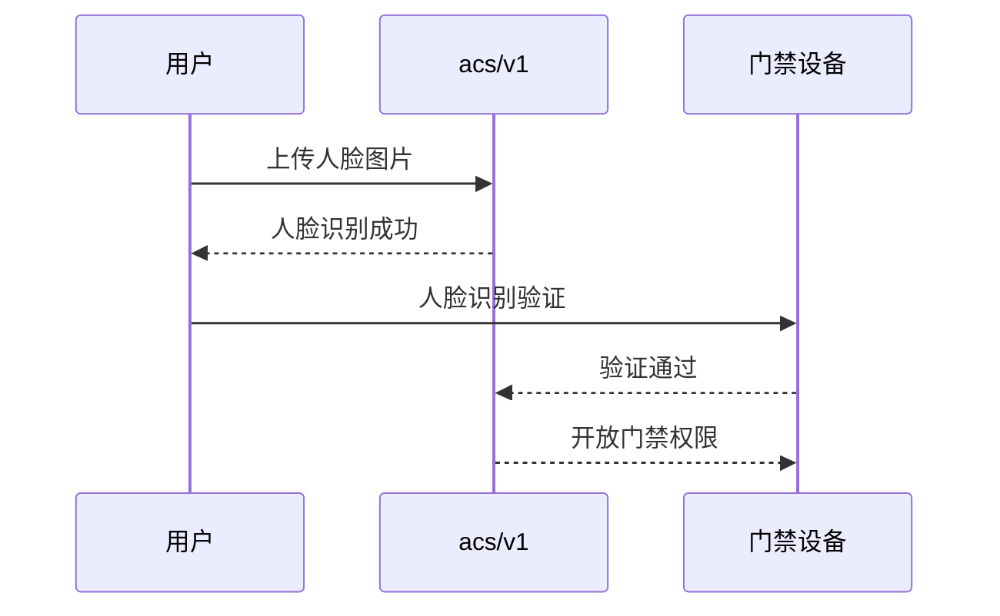
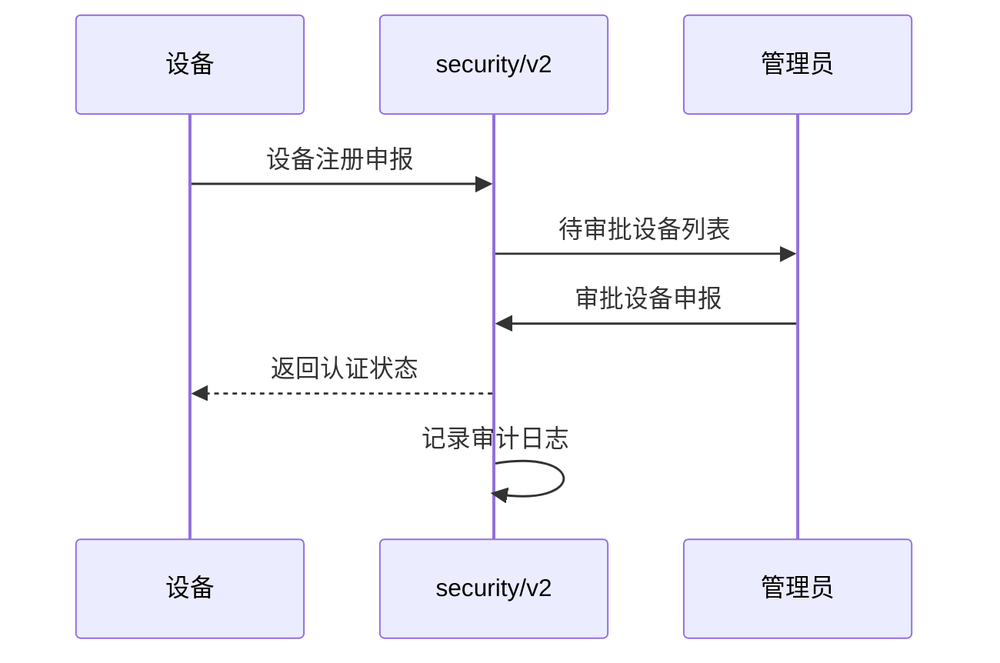
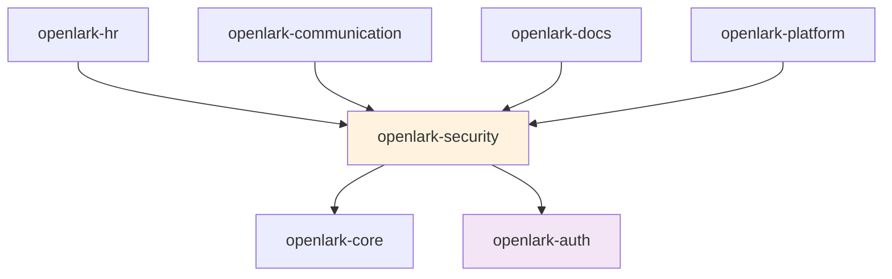

# Open-Lark 安全服务模块映射文档

## 模块概述

**模块标识**: `openlark-security`
**业务价值**: 高 (企业安全合规保障)
**API总数**: 20个 (1.2%)
**版本覆盖**: v1, v2
**核心功能**: 访问控制、安全合规、设备管理、审计日志

## Project-Version-Resource 架构设计

### 组织原则
采用 project-version-resource 三层结构组织安全服务：

1. **Project层**: 安全服务项目分类
   - `acs` - 访问控制系统 (v1)
   - `security_and_compliance` - 安全合规管理 (v1, v2)

2. **Version层**: API版本管理
   - `v1` - 基础安全功能
   - `v2` - 高级安全合规功能

3. **Resource层**: 具体的安全资源
   - `user` - 用户访问控制
   - `user.face` - 人脸识别管理
   - `rule_external` - 外部权限规则
   - `visitor` - 访客管理
   - `device` - 设备管理
   - `device_record` - 设备记录
   - `openapi_log` - 审计日志

## API详细分析

### 按Project统计的API分布

| Project | API数量 | Version | 主要功能 | 资源类型 |
|---------|---------|---------|---------|----------|
| **acs** | 12个 | v1 | 智能门禁访问控制 | user, user.face, rule_external, visitor, device, access_record |
| **security_and_compliance** | 8个 | v1/v2 | 安全合规设备管理 | device_record, device_apply_record, openapi_log |

### ACS Project (v1) - 智能门禁访问控制

#### Resource分布详情

| Resource | API数量 | 关键操作 | 路径格式 | 功能描述 |
|----------|---------|---------|----------|----------|
| **user** | 3个 | get, list, patch | `GET|PATCH:/open-apis/acs/v1/users` | 门禁用户信息管理 |
| **user.face** | 2个 | get, update | `GET|PUT:/open-apis/acs/v1/users/:user_id/face` | 用户人脸图片管理 |
| **rule_external** | 4个 | create, get, delete, device_bind | `POST|GET|DELETE:/open-apis/acs/v1/rule_external` | 外部权限规则管理 |
| **visitor** | 2个 | create, delete | `POST|DELETE:/open-apis/acs/v1/visitors` | 访客权限管理 |
| **device** | 1个 | list | `GET:/open-apis/acs/v1/devices` | 门禁设备管理 |

#### 具体API列表

**用户管理 (user)**:
- `GET:/open-apis/acs/v1/users/:user_id` - 获取单个用户信息
- `GET:/open-apis/acs/v1/users` - 获取用户列表
- `PATCH:/open-apis/acs/v1/users/:user_id` - 修改用户部分信息

**人脸识别 (user.face)**:
- `GET:/open-apis/acs/v1/users/:user_id/face` - 下载人脸图片
- `PUT:/open-apis/acs/v1/users/:user_id/face` - 上传人脸图片

**权限规则 (rule_external)**:
- `POST:/open-apis/acs/v1/rule_external` - 创建或更新权限组
- `GET:/open-apis/acs/v1/rule_external` - 获取权限组信息
- `DELETE:/open-apis/acs/v1/rule_external` - 删除权限组
- `POST:/open-apis/acs/v1/rule_external/device_bind` - 设备绑定权限组

**访客管理 (visitor)**:
- `POST:/open-apis/acs/v1/visitors` - 添加访客
- `DELETE:/open-apis/acs/v1/visitors/:visitor_id` - 删除访客

**设备管理 (device)**:
- `GET:/open-apis/acs/v1/devices` - 获取门禁设备列表

### Security and Compliance Project (v1/v2) - 安全合规管理

#### Resource分布详情

| Resource | API数量 | Version | 关键操作 | 路径格式 | 功能描述 |
|----------|---------|---------|---------|----------|----------|
| **device_record** | 6个 | v2 | CRUD完整操作 | `GET|POST|PUT|DELETE:/open-apis/security_and_compliance/v2/device_records` | 设备记录管理 |
| **device_apply_record** | 1个 | v2 | 审批操作 | `PUT:/open-apis/security_and_compliance/v2/device_apply_records` | 设备申报审批 |
| **openapi_log** | 1个 | v1 | 查询操作 | `POST:/open-apis/security_and_compliance/v1/openapi_logs` | API审计日志 |

#### 具体API列表

**设备记录管理 (device_record - v2)**:
- `GET:/open-apis/security_and_compliance/v2/device_records/mine` - 获取客户端设备认证信息
- `POST:/open-apis/security_and_compliance/v2/device_records` - 新增设备
- `GET:/open-apis/security_and_compliance/v2/device_records` - 查询设备信息
- `GET:/open-apis/security_and_compliance/v2/device_records/:device_record_id` - 获取设备信息
- `PUT:/open-apis/security_and_compliance/v2/device_records/:device_record_id` - 更新设备
- `DELETE:/open-apis/security_and_compliance/v2/device_records/:device_record_id` - 删除设备

**设备申报审批 (device_apply_record - v2)**:
- `PUT:/open-apis/security_and_compliance/v2/device_apply_records/:device_apply_record_id` - 审批设备申报

**审计日志管理 (openapi_log - v1)**:
- `POST:/open-apis/security_and_compliance/v1/openapi_logs/list_data` - 获取OpenAPI审计日志数据

## 业务场景分类

### 1. 智能门禁场景 (acs/v1)
**适用场景**: 企业门禁管理、人脸识别考勤、访客管理
**核心流程**:


**关键功能**:
- 用户人脸信息管理
- 门禁权限规则配置
- 访客临时权限管理
- 设备状态监控

### 2. 安全合规场景 (security_and_compliance/v2)
**适用场景**: 企业设备合规管理、安全审计
**核心流程**:


**关键功能**:
- 设备合规性检查
- 设备申报审批流程
- 安全事件审计记录
- 设备生命周期管理

## 目录结构设计

```
crates/openlark-security/src/
├── lib.rs                           # 模块入口
├── models/                          # 共享数据模型
│   ├── mod.rs
│   ├── user.rs                      # 门禁用户模型
│   ├── device.rs                    # 设备管理模型
│   ├── access_record.rs             # 访问记录模型
│   └── audit_log.rs                 # 审计日志模型
├── acs/                             # 智能门禁访问控制 (v1)
│   ├── lib.rs                       # acs模块入口
│   ├── v1/                          # API版本v1
│   │   ├── mod.rs
│   │   ├── users/                   # 用户管理
│   │   │   ├── mod.rs
│   │   │   ├── get.rs               // 获取单个用户
│   │   │   ├── list.rs              // 获取用户列表
│   │   │   └── patch.rs             // 修改用户信息
│   │   ├── user_faces/              # 人脸管理
│   │   │   ├── mod.rs
│   │   │   ├── get.rs               // 下载人脸图片
│   │   │   └── update.rs            // 上传人脸图片
│   │   ├── rule_external/           # 权限规则
│   │   │   ├── mod.rs
│   │   │   ├── create.rs            // 创建权限组
│   │   │   ├── get.rs               // 获取权限组
│   │   │   ├── delete.rs            // 删除权限组
│   │   │   └── device_bind.rs       // 设备绑定权限
│   │   ├── visitors/                # 访客管理
│   │   │   ├── mod.rs
│   │   │   ├── create.rs            // 添加访客
│   │   │   └── delete.rs            // 删除访客
│   │   └── devices/                 # 设备管理
│   │       ├── mod.rs
│   │       └── list.rs              // 获取设备列表
│   └── models/
│       ├── user_info.rs             # 用户信息模型
│       ├── face_image.rs            # 人脸图片模型
│       ├── permission_rule.rs       # 权限规则模型
│       ├── visitor_info.rs          # 访客信息模型
│       └── device_info.rs           # 设备信息模型
└── security_and_compliance/         # 安全合规管理
    ├── lib.rs                       # 安全合规模块入口
    ├── v2/                          # API版本v2 (主要)
    │   ├── mod.rs
    │   ├── device_records/          # 设备记录管理
    │   │   ├── mod.rs
    │   │   ├── mine.rs              // 获取我的设备
    │   │   ├── create.rs            // 新增设备
    │   │   ├── list.rs              // 查询设备
    │   │   ├── get.rs               // 获取设备详情
    │   │   ├── update.rs            // 更新设备
    │   │   └── delete.rs            // 删除设备
    │   └── device_apply_records/    # 设备申报审批
    │       ├── mod.rs
    │       └── approve.rs           // 审批申报
    ├── v1/                          # API版本v1 (审计日志)
    │   ├── mod.rs
    │   └── openapi_logs/            # 审计日志
    │       ├── mod.rs
    │       └── list_data.rs         // 获取日志数据
    └── models/
        ├── device_record.rs         # 设备记录模型
        ├── device_apply_record.rs    # 设备申报模型
        └── audit_log.rs             # 审计日志模型
```

## 关键API示例

### 智能门禁管理 (acs/v1)

```rust
// 用户管理
let user_info = security.acs.v1.users.get()
    .user_id("user_id")
    .send()
    .await?;

let users = security.acs.v1.users.list()
    .page_size(20)
    .page_token("page_token")
    .send()
    .await?;

security.acs.v1.users.patch()
    .user_id("user_id")
    .name("新用户名")
    .send()
    .await?;

// 人脸管理
let face_data = security.acs.v1.user_faces.get()
    .user_id("user_id")
    .send()
    .await?;

security.acs.v1.user_faces.update()
    .user_id("user_id")
    .face_image(face_image_bytes)
    .send()
    .await?;

// 权限规则管理
let rule = security.acs.v1.rule_external.create()
    .name("办公区域权限")
    .description("允许进入办公区域")
    .device_ids(vec!["device_1", "device_2"])
    .send()
    .await?;

security.acs.v1.rule_external.device_bind()
    .rule_id("rule_id")
    .device_id("device_id")
    .send()
    .await?;

// 访客管理
let visitor = security.acs.v1.visitors.create()
    .name("访客姓名")
    .phone("13800138000")
    .visit_reason("商务拜访")
    .valid_from(start_time)
    .valid_until(end_time)
    .send()
    .await?;

security.acs.v1.visitors.delete()
    .visitor_id("visitor_id")
    .send()
    .await?;

// 设备管理
let devices = security.acs.v1.devices.list()
    .status("online")
    .send()
    .await?;
```

### 安全合规管理 (security_and_compliance/v2)

```rust
// 设备记录管理
let my_devices = security.security_and_compliance.v2.device_records.mine()
    .send()
    .await?;

let device = security.security_and_compliance.v2.device_records.create()
    .device_name("我的MacBook")
    .device_type("laptop")
    .device_id("unique_device_id")
    .send()
    .await?;

let devices = security.security_and_compliance.v2.device_records.list()
    .page_size(20)
    .filter_status("pending")
    .send()
    .await?;

security.security_and_compliance.v2.device_records.update()
    .device_record_id("record_id")
    .status("approved")
    .send()
    .await?;

// 设备申报审批
security.security_and_compliance.v2.device_apply_records.approve()
    .device_apply_record_id("apply_id")
    .approved(true)
    .comment("审批通过")
    .send()
    .await?;

// 审计日志查询
let audit_logs = security.security_and_compliance.v1.openapi_logs.list_data()
    .start_time(start_timestamp)
    .end_time(end_timestamp)
    .api_path_filter("/open-apis/auth/v3/tenant_access_token")
    .user_id_filter("user_id")
    .page_size(100)
    .send()
    .await?;
```

## 特性和配置

```toml
[dependencies]
openlark-security = { workspace = true }

[features]
# 默认功能
default = ["access_control", "compliance"]

# 访问控制功能
access_control = []
# 安全合规功能
compliance = []
# 完整安全套件
full_security = ["access_control", "compliance"]
# 仅访问控制
access_only = ["access_control"]
# 仅安全合规
compliance_only = ["compliance"]
```

## 使用示例

```rust
use openlark_security::{SecurityService, SecurityConfig};

// 创建安全服务
let security_service = SecurityService::new(SecurityConfig::new(
    "app_id",
    "app_secret"
))?;

// 门禁场景
let user = security_service.acs()
    .v1()
    .users()
    .get()
    .user_id("user_123")
    .send()
    .await?;

security_service.acs()
    .v1()
    .user_faces()
    .update()
    .user_id("user_123")
    .face_image(&face_image_data)
    .send()
    .await?;

// 安全合规场景
let devices = security_service.security_and_compliance()
    .v2()
    .device_records()
    .list()
    .page_size(50)
    .send()
    .await?;

security_service.security_and_compliance()
    .v2()
    .device_apply_records()
    .approve()
    .device_apply_record_id("apply_456")
    .approved(true)
    .comment("设备合规检查通过")
    .send()
    .await?;

// 审计日志场景
let logs = security_service.security_and_compliance()
    .v1()
    .openapi_logs()
    .list_data()
    .start_time(start_time)
    .end_time(end_time)
    .api_path_filter("/open-apis/auth/")
    .send()
    .await?;
```

## 依赖关系



## 测试策略

### 单元测试覆盖
- 每个API独立测试
- 权限验证逻辑测试
- 设备管理流程测试
- 错误处理测试

### 集成测试覆盖
- 完整门禁流程测试
- 设备合规审批流程测试
- 审计日志完整性测试

### 安全测试
- 权限绕过测试
- 敏感信息泄露测试
- 访问控制验证

## 质量保证

### API覆盖率目标
- **当前覆盖率**: 100% (20/20 APIs)
- **测试目标**: 95%+
- **文档目标**: 100%

### 安全要求
- 访问权限严格控制
- 敏感操作审计记录
- 人脸数据安全存储
- 设备认证机制完善

### 性能指标
- 门禁验证响应时间 < 100ms
- 设备管理操作 < 500ms
- 审计日志查询 < 1s
- 并发访问支持 > 500 TPS

## 版本兼容性

| 版本 | 状态 | 支持情况 | 迁移建议 |
|------|------|---------|----------|
| **v2** | ✅ 当前主版本 | 完全支持 | 推荐新项目使用 |
| **v1** | ✅ 稳定版本 | 完全支持 | 兼容性要求使用 |

## 业务价值

### 智能门禁系统
- **安全提升**: 人脸识别技术提升安全性
- **便捷管理**: 集中化门禁权限管理
- **访客控制**: 临时访客权限精细化管理
- **设备监控**: 门禁设备状态实时监控

### 安全合规管理
- **设备合规**: 企业设备合规性检查
- **审计追踪**: 完整的操作审计日志
- **权限控制**: 细粒度访问控制机制
- **风险控制**: 安全风险识别和预防

## 总结

openlark-security模块提供了完整的企业安全服务解决方案：

- **访问控制**: 智能门禁和人脸识别管理
- **安全合规**: 设备合规审批和审计日志
- **权限管理**: 细粒度权限控制和访客管理
- **高安全性**: 完善的安全机制和审计功能
- **易集成**: 与其他模块无缝集成

该模块为企业提供了从物理门禁到数字合规的全方位安全保障，是构建企业级应用的重要安全基础设施。