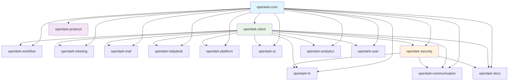

# Open-Lark 模块映射文档

## 概述

本文档详细描述了从原始API数据到新模块化架构的映射关系，包括具体的API分布、迁移优先级和依赖关系。

## API数据总览

基于 `analysis/data/api_list_export.csv` 分析结果，总共有1,688个API，分布在以下业务领域：

| 总体统计 | 数量 | 占比 |
|---------|------|------|
| **总API数量** | **1,688** | **100%** |
| **业务模块数量** | **28** | - |
| **保留核心模块** | **3** | - |

## 按bizTag统计的业务领域分布

| bizTag | API数量 | 占比 | 主要功能描述 | 所属模块 |
|--------|---------|------|-------------|----------|
| hire | 182 | 10.8% | 招聘管理、Offer、候选人跟踪 | openlark-hr |
| ccm | 174 | 10.3% | 云文档协同、文档、表格、知识库 | openlark-docs |
| corehr | 144 | 8.5% | 核心HR、员工管理、组织架构 | openlark-hr |
| feishu_people | 105 | 6.2% | 人员信息、档案管理 | openlark-hr |
| contact | 77 | 4.6% | 通讯录、用户信息、部门管理 | openlark-communication |
| task | 75 | 4.4% | 任务管理、任务分配、跟踪 | openlark-workflow |
| im | 75 | 4.4% | 即时消息、消息发送、群聊 | openlark-communication |
| mail | 67 | 4.0% | 邮件发送、接收、管理 | openlark-mail |
| vc | 56 | 3.3% | 视频会议、会议室管理 | openlark-meeting |
| approval | 53 | 3.1% | 审批流程、审批定义、管理 | openlark-workflow |
| helpdesk | 50 | 3.0% | 客服管理、工单系统 | openlark-helpdesk |
| **base** | **49** | **2.9%** | **多维表格应用、数据表管理** | **openlark-docs** |
| calendar | 44 | 2.6% | 日历管理、日程安排 | openlark-meeting |
| attendance | 39 | 2.3% | 考勤记录、请假审批 | openlark-hr |
| app_engine | 37 | 2.2% | 应用引擎、应用管理 | openlark-platform |
| application | 35 | 2.1% | 应用管理、配置、部署 | openlark-application |
| **baike** | **27** | **1.6%** | **企业知识库、Wiki管理** | **openlark-docs** |
| ai | 23 | 1.4% | AI服务、智能分析 | openlark-ai |
| directory | 21 | 1.2% | 目录服务、用户搜索 | openlark-platform |
| compensation_management | 21 | 1.2% | 薪酬管理、薪资计算 | openlark-hr |
| aily | 21 | 1.2% | 爱力友相关服务 | openlark-communication |
| performance | 20 | 1.2% | 绩效管理、考核评估 | openlark-hr |
| meeting_room | 17 | 1.0% | 会议室预订、管理 | openlark-meeting |
| search | 14 | 0.8% | 搜索服务、内容检索 | openlark-analytics |
| admin | 14 | 0.8% | 管理功能、系统管理 | openlark-platform |
| acs | 14 | 0.8% | 访问控制、权限管理 | openlark-security |
| payroll | 12 | 0.7% | 薪资计算、发放管理 | openlark-hr |
| okr | 12 | 0.7% | OKR目标管理、绩效跟踪 | openlark-hr |
| auth | 11 | 0.7% | 身份认证、令牌管理 | openlark-security |
| security_and_compliance | 8 | 0.5% | 安全合规、安全审计 | openlark-security |
| **minutes** | **4** | **0.2%** | **会议记录管理** | **openlark-docs** |
| 其他 | 54 | 3.2% | 其他辅助功能 | 多个模块 |

## 按Project统计的API分布

| Project | API数量 | 占比 | 主要功能 | 相关bizTag |
|---------|---------|------|---------|-------------|
| create | 75 | 4.4% | 资源创建操作 | ccm, base, baike, hire, etc. |
| delete | 61 | 3.6% | 资源删除操作 | ccm, base, baike, hire, etc. |
| list | 58 | 3.4% | 资源列表查询 | ccm, contact, task, etc. |
| update | 26 | 1.5% | 资源更新操作 | 多个bizTag |
| get | 27 | 1.6% | 资源详情获取 | 多个bizTag |
| batch_create | 8 | 0.5% | 批量创建操作 | base, im, etc. |
| search | 5 | 0.3% | 搜索功能 | ccm, directory |
| upload | 4 | 0.2% | 文件上传 | ccm |
| download | 4 | 0.2% | 文件下载 | ccm |
| v1 | 10 | 0.6% | v1版本API | 多个bizTag |
| v2 | 3 | 0.2% | v2版本API | ccm, contact |
| v3 | 3 | 0.2% | v3版本API | contact, etc. |
| 其他operations | 1,407 | 83.3% | 其他专用操作 | 多个bizTag |

## 业务域组织架构

### Project-Version-Resource 设计原则

1. **Project层**: 表示具体的业务项目或功能域
   - `create`, `delete`, `update`, `get` - 标准CRUD操作
   - `search`, `list` - 查询和搜索功能
   - `upload`, `download` - 文件传输功能

2. **Version层**: API版本管理
   - `v1`, `v2`, `v3`, `v4` - 不同版本的API实现
   - 向后兼容性支持
   - 渐进式版本升级

3. **Resource层**: 具体的资源类型
   - `docx`, `drive`, `sheets`, `wiki` - 文档相关资源
   - `app`, `table`, `view`, `record` - 多维表格资源
   - `space`, `node`, `entity` - 知识库资源
   - `employee`, `department`, `offer` - HR相关资源

### 资源命名规范

```rust
// 标准API路径格式: /open-apis/{project}/{version}/{resource}
// 示例:
POST /open-apis/base/v1/apps              // 创建多维表格应用
GET  /open-apis/base/v1/apps/{app_token}  // 获取应用信息
POST /open-apis/base/v1/apps/{app_token}/tables  // 创建数据表
GET  /open-apis/ccm/v1/files               // 获取文件列表
POST /open-apis/ccm/v1/files/upload_all    // 上传文件
GET  /open-apis/baike/v1/spaces             // 获取知识库空间
```

## 详细模块映射

### 1. HR人力管理模块 (openlark-hr)

**模块标识**: `openlark-hr`
**API总数**: 484个 (28.7%)
**业务价值**: 高 (企业核心业务)

#### 按bizTag的子模块分布

| 子模块 | bizTag | API数量 | 主要功能 | 资源类型 |
|--------|--------|---------|---------|----------|
| 招聘管理 | hire | 182 | Offer管理、候选人跟踪、面试安排 | offer, candidate, interview |
| 核心HR | corehr | 144 | 员工管理、组织架构、基础HR | employee, department |
| 人员管理 | feishu_people | 105 | 人员信息、档案管理 | profile, contact |
| 考勤管理 | attendance | 39 | 考勤记录、请假审批 | record, leave |
| 薪酬管理 | payroll | 12 | 薪资计算、发放管理 | salary, payslip |
| 绩效管理 | performance | 20 | 绩效管理、考核评估 | review, goal |
| OKR管理 | okr | 12 | OKR目标管理、绩效跟踪 | objective, key_result |
| 薪酬补偿 | compensation_management | 21 | 薪酬管理、薪资计算 | compensation, bonus |
| 电子HR | ehr | 2 | 电子化人力资源 | attachment, record |

#### 关键API示例

```rust
// 招聘管理 (hire)
offer_create_v1()           // 创建Offer
offer_update_v1()           // 更新Offer
candidate_list_v1()         // 获取候选人列表
interview_schedule_v1()     // 安排面试

// 核心HR (corehr)
employee_create_v1()        // 创建员工
employee_update_v1()        // 更新员工信息
department_list_v1()        // 获取部门列表

// 人员管理 (feishu_people)
profile_get_v1()           // 获取人员档案
emergency_contact_update_v1() // 更新紧急联系人

// 考勤管理 (attendance)
attendance_record_list_v1() // 获取考勤记录
leave_apply_v1()           // 申请请假

// 薪酬管理 (payroll)
salary_get_v1()            // 获取薪资信息
payslip_list_v1()          // 获取工资单
```

#### 目录结构设计

```
crates/openlark-hr/src/
├── lib.rs                  // 模块入口
├── models/                 // 共享模型
│   ├── mod.rs
│   ├── employee.rs         // 员工模型
│   ├── department.rs       // 部门模型
│   ├── offer.rs           // Offer模型
│   └── candidate.rs       // 候选人模型
├── hire/                  // 招聘管理 (182 APIs)
│   ├── v1/
│   │   ├── mod.rs
│   │   ├── offer.rs       // Offer相关API
│   │   ├── candidate.rs   // 候选人API
│   │   ├── interview.rs   // 面试API
│   │   └── onboarding.rs  // 入职API
│   └── models/
│       ├── offer.rs
│       └── candidate.rs
├── corehr/                // 核心HR (144 APIs)
│   ├── v1/
│   │   ├── mod.rs
│   │   ├── employee.rs    // 员工管理API
│   │   ├── department.rs  // 部门管理API
│   │   └── organization.rs // 组织架构API
│   └── models/
├── people/                // 人员管理 (105 APIs)
│   ├── v1/
│   │   ├── mod.rs
│   │   ├── profile.rs     // 人员档案API
│   │   └── contact.rs     // 联系方式API
│   └── models/
├── attendance/            // 考勤管理 (39 APIs)
│   ├── v1/
│   │   ├── mod.rs
│   │   ├── record.rs      // 考勤记录API
│   │   └── leave.rs       // 请假API
│   └── models/
└── payroll/               // 薪酬管理 (12 APIs)
    ├── v1/
    │   ├── mod.rs
    │   ├── salary.rs      // 薪资API
    │   └── payslip.rs     // 工资单API
    └── models/
```

### 2. 通讯协作模块 (openlark-communication)

**模块标识**: `openlark-communication`
**API总数**: 153个 (9.1%)
**业务价值**: 高 (高频使用功能)

#### 子模块分布

| 子模块 | bizTag | API数量 | 主要功能 |
|--------|--------|---------|---------|
| 联系人管理 | contact | 77 | 通讯录、用户信息、部门管理 |
| 即时消息 | im | 75 | 消息发送、接收、群聊管理 |
| 动态圈 | moments | 1 | 企业动态分享 |

#### 关键API示例

```rust
// 联系人管理 (contact)
user_create_v3()           // 创建用户
user_get_v3()             // 获取用户信息
user_list_v3()            // 获取用户列表
department_create_v3()     // 创建部门
department_list_v3()       // 获取部门列表

// 即时消息 (im)
message_send_v1()         // 发送消息
message_list_v1()         // 获取消息列表
chat_create_v1()          // 创建群聊
chat_member_add_v1()      // 添加群成员
```

#### 目录结构设计

```
crates/openlark-communication/src/
├── lib.rs
├── models/
├── contact/               // 联系人管理 (77 APIs)
│   ├── v1/
│   ├── v2/
│   ├── v3/
│   └── models/
├── im/                    // 即时消息 (75 APIs)
│   ├── v1/
│   └── models/
└── moments/               // 动态圈 (1 API)
    ├── v1/
    └── models/
```

### 3. 文档协作模块 (openlark-docs)

**模块标识**: `openlark-docs`
**API总数**: 254个 (15.0%)
**业务价值**: 高 (知识管理核心)

#### 按bizTag的子模块分布

| 子模块 | bizTag | API数量 | 主要功能 | 资源类型 |
|--------|--------|---------|---------|----------|
| 云文档协同 | ccm | 174 | 文档、表格、知识库、云盘、协作 | docx, drive, sheets, wiki |
| 多维表格 | base | 49 | 多维表格应用、数据表、视图、记录 | app, table, view, record |
| 知识库 | baike | 27 | 企业知识库、Wiki管理、实体管理 | space, node, entity, draft |
| 会议纪要 | minutes | 4 | 会议记录管理、转录服务 | transcript |

- **详细文档**: [查看完整docs模块映射](./module-mapping-docs.md)

#### 关键API示例

```rust
// 云文档协作 (drive/v1)
drive_file_list_v1()                         // 获取文件列表
drive_file_upload_all_v1()                   // 上传文件
drive_file_download_v1()                     // 下载文件
drive_permission_create_v1()                 // 创建权限
drive_link_create_v1()                       // 创建分享链接

// 多维表格 (bitable/v1)
bitable_app_create_v1()                      // 创建应用
bitable_table_create_v1()                    // 创建数据表
bitable_view_create_v1()                     // 创建视图
bitable_record_create_v1()                   // 创建记录
bitable_record_batch_create_v1()             // 批量创建记录
bitable_record_search_v1()                   // 搜索记录

// 电子表格 (sheets/v3)
sheets_spreadsheet_create_v3()               // 创建表格
sheets_range_read_v3()                       // 读取范围数据
sheets_range_write_v3()                      // 写入范围数据

// 文档处理 (docx/v1)
docx_document_create_v1()                    // 创建文档
docx_block_create_v1()                       // 创建文档块
docx_block_batch_create_v1()                 // 批量创建块
docx_comment_create_v1()                     // 创建评论

// 知识库 (wiki/v2)
wiki_space_create_v2()                       // 创建知识库空间
wiki_node_create_v2()                        // 创建知识节点
wiki_entity_create_v2()                      // 创建实体

// 会议纪要 (minutes/v1)
minutes_transcript_create_v1()               // 创建转录
minutes_transcript_get_v1()                  // 获取转录内容
```

#### 按Project-Version-Resource组织架构

**组织原则**: 业务目录按照 project-version-resource 三层结构组织

```
openlark-docs/src/
├── lib.rs                           # 模块入口
├── models/                          # 共享数据模型
│   ├── mod.rs
│   ├── document.rs                  # 文档基础模型
│   ├── collaboration.rs             # 协作模型
│   └── permissions.rs               # 权限模型
├── ccm/                             # 云文档协同 (174 APIs)
│   ├── lib.rs                       # ccm模块入口
│   ├── docx/                        # DOCX文档处理
│   │   ├── v1/                      # API版本v1
│   │   │   ├── mod.rs
│   │   │   ├── chat_announcement.rs  # 群公告API
│   │   │   ├── block.rs             # 文档块API
│   │   │   └── comment.rs           # 评论API
│   │   └── models/
│   ├── drive/                       # 云盘文件管理
│   │   ├── v1/                      # API版本v1
│   │   │   ├── mod.rs
│   │   │   ├── file.rs              # 文件操作API
│   │   │   ├── folder.rs            # 文件夹API
│   │   │   └── upload.rs            # 上传API
│   │   └── models/
│   ├── sheets/                      # 电子表格
│   │   ├── v2/                      # API版本v2
│   │   │   ├── mod.rs
│   │   │   ├── spreadsheet.rs       # 表格API
│   │   │   ├── range.rs             # 范围API
│   │   │   └── style.rs             # 样式API
│   │   └── models/
│   └── wiki/                        # 知识库
│       ├── v2/                      # API版本v2
│       │   ├── mod.rs
│       │   ├── space.rs             # 空间API
│       │   └── node.rs              # 节点API
│       └── models/
├── bitable/                         # 多维表格 (49 APIs)
│   ├── lib.rs                       # bitable模块入口
│   ├── v1/                          # API版本v1
│   │   ├── mod.rs
│   │   ├── app.rs                   # 应用管理API
│   │   │   ├── create_app()         // 创建应用
│   │   │   ├── get_app()            // 获取应用
│   │   │   ├── update_app()         // 更新应用
│   │   │   └── delete_app()         // 删除应用
│   │   ├── table.rs                 # 数据表API
│   │   │   ├── create_table()       // 创建表
│   │   │   ├── list_tables()        // 获取表列表
│   │   │   ├── update_table()       // 更新表
│   │   │   └── delete_table()       // 删除表
│   │   ├── view.rs                  # 视图API
│   │   │   ├── create_view()        // 创建视图
│   │   │   ├── list_views()         // 获取视图列表
│   │   │   ├── update_view()        // 更新视图
│   │   │   └── delete_view()        // 删除视图
│   │   ├── record.rs                # 记录API
│   │   │   ├── create_record()      // 创建记录
│   │   │   ├── batch_create_records() // 批量创建
│   │   │   ├── update_record()      // 更新记录
│   │   │   ├── search_records()     // 搜索记录
│   │   │   └── delete_record()      // 删除记录
│   │   └── field.rs                 # 字段API
│   │       ├── create_field()       // 创建字段
│   │       ├── update_field()       // 更新字段
│   │       └── delete_field()       // 删除字段
│   └── models/                      # 数据模型
│       ├── app.rs                   # 应用模型
│       ├── table.rs                 # 表格模型
│       ├── view.rs                  # 视图模型
│       ├── record.rs                # 记录模型
│       └── field.rs                 # 字段模型
├── baike/                           # 知识库 (27 APIs)
│   ├── lib.rs                       # baike模块入口
│   ├── v1/                          # API版本v1
│   │   ├── mod.rs
│   │   ├── space.rs                 // 知识库空间
│   │   ├── node.rs                  // 知识库节点
│   │   ├── entity.rs                // 实体管理
│   │   ├── draft.rs                 // 草稿管理
│   │   └── classification.rs        // 分类管理
│   └── models/
└── minutes/                         # 会议纪要 (4 APIs)
    ├── lib.rs                       # minutes模块入口
    ├── v1/                          # API版本v1
    │   ├── mod.rs
    │   ├── transcript.rs            // 转录服务
    │   └── meeting.rs               // 会议管理
    └── models/
```

### 4. 任务审批模块 (openlark-workflow)

**模块标识**: `openlark-workflow`
**API总数**: 134个 (7.9%)
**业务价值**: 中高 (流程自动化)

#### 子模块分布

| 子模块 | bizTag | API数量 | 主要功能 |
|--------|--------|---------|---------|
| 任务管理 | task | 75 | 任务创建、分配、跟踪 |
| 审批流程 | approval | 53 | 审批定义、流程管理 |
| 看板管理 | board | 6 | 看板创建、任务卡片 |

#### 关键API示例

```rust
// 任务管理 (task)
task_create_v1()           // 创建任务
task_list_v1()            // 获取任务列表
task_complete_v1()        // 完成任务
task_assign_v1()          // 分配任务

// 审批流程 (approval)
approval_create_v4()      // 创建审批
approval_instance_list_v4() // 获取审批实例
approval_definition_list_v4() // 获取审批定义
```

### 5. 会议日程模块 (openlark-meeting)

**模块标识**: `openlark-meeting`
**API总数**: 117个 (6.9%)
**业务价值**: 中高 (协作核心)

#### 子模块分布

| 子模块 | bizTag | API数量 | 主要功能 |
|--------|--------|---------|---------|
| 日历管理 | calendar | 44 | 日程安排、会议创建 |
| 视频会议 | vc | 56 | 视频会议、会议室管理 |
| 会议室 | meeting_room | 17 | 会议室预订、管理 |

#### 关键API示例

```rust
// 日历管理 (calendar)
calendar_create_v4()      // 创建日历
calendar_event_create_v4() // 创建日程
calendar_event_list_v4()  // 获取日程列表

// 视频会议 (vc)
meeting_start_v1()        // 开始会议
meeting_join_v1()         // 加入会议
meeting_room_list_v1()    // 获取会议室列表
```

### 6. 其他模块概览

#### 邮件服务模块 (openlark-mail)
- **API数量**: 67个 (4.0%)
- **主要功能**: 邮件发送、接收、管理
- **关键API**: mail_send_v1(), mail_list_v1(), mail_group_create_v1()

#### 帮助台模块 (openlark-helpdesk)
- **API数量**: 50个 (3.0%)
- **主要功能**: 客服管理、工单系统
- **关键API**: ticket_create_v1(), ticket_list_v1(), agent_list_v1()

#### 应用管理模块 (openlark-platform)
- **API数量**: 86个 (5.1%)
- **主要功能**: 应用管理、平台工具、系统管理
- **关键API**: app_create_v1(), app_update_v1(), admin_user_list_v1()

#### AI智能模块 (openlark-ai)
- **API数量**: 23个 (1.4%)
- **主要功能**: AI服务、智能分析
- **关键API**: ai_chat_v1(), ai_summary_v1(), ai_translate_v1()

#### 认证服务模块 (openlark-auth)
- **API数量**: 9个 (0.5%)
- **主要功能**: 身份认证、令牌管理、OAuth授权
- **关键API**: tenant_access_token_internal(), app_access_token(), get_user_info(), create_oidc_access_token()
- **详细文档**: [查看完整auth模块映射](./module-mapping-auth.md)

#### 安全服务模块 (openlark-security)
- **API数量**: 20个 (1.2%)
- **主要功能**: 访问控制、安全合规、设备管理、审计日志
- **关键API**: get_user(), upload_user_face(), create_rule_external(), approve_device_apply_record()
- **详细文档**: [查看完整security模块映射](./module-mapping-security.md)

#### 数据分析模块 (openlark-analytics)
- **API数量**: 38个 (2.2%)
- **主要功能**: 搜索、报表、数据分析
- **关键API**: search_user_v1(), report_generate_v1(), directory_sync_v1()

#### 个人设置模块 (openlark-user)
- **API数量**: 21个 (1.2%)
- **主要功能**: 个人设置、用户偏好
- **关键API**: user_preference_get_v1(), user_preference_update_v1()

## 优先级和迁移策略

### 迁移优先级矩阵

| 模块 | 业务重要性 | API数量 | 复杂度 | 迁移优先级 |
|------|-----------|---------|--------|-----------|
| openlark-communication | 🔴 极高 | 153 | 🟡 中 | **P0 - 最高** |
| openlark-docs | 🔴 极高 | 254 | 🔴 高 | **P0 - 最高** |
| openlark-auth | 🔴 极高 | 9 | 🟢 低 | **P0 - 最高** |
| openlark-security | 🟡 高 | 20 | 🟡 中 | **P0 - 最高** |
| openlark-workflow | 🟡 高 | 134 | 🟡 中 | **P1 - 高** |
| openlark-meeting | 🟡 高 | 117 | 🟡 中 | **P1 - 高** |
| openlark-hr | 🟡 高 | 428+ | 🔴 高 | **P2 - 中** |
| openlark-mail | 🟢 中 | 67 | 🟢 低 | **P2 - 中** |
| openlark-platform | 🟢 中 | 86 | 🟡 中 | **P2 - 中** |
| openlark-ai | 🟢 中 | 23 | 🟢 低 | **P3 - 低** |
| openlark-analytics | 🟢 中 | 38 | 🟡 中 | **P3 - 低** |
| openlark-helpdesk | 🟢 中 | 50 | 🟢 低 | **P3 - 低** |
| openlark-user | 🟢 低 | 21 | 🟢 低 | **P3 - 低** |

### 迁移阶段规划

#### Phase 1: 核心模块 (P0)
**目标**: 完成最高优先级模块迁移
**模块**: openlark-communication, openlark-docs, openlark-auth, openlark-security
**预期时间**: 4-6周
**里程碑**:
- ✅ 完成模块设计和结构创建
- ✅ 实现核心API (前50%)
- ✅ 完成基础测试
- ✅ 提供示例代码
- ✅ 更新模块映射文档

#### Phase 2: 业务流程模块 (P1)
**目标**: 完成业务流程相关模块
**模块**: openlark-workflow, openlark-meeting
**预期时间**: 2-3周

#### Phase 3: 企业功能模块 (P2)
**目标**: 完成企业级功能模块
**模块**: openlark-hr, openlark-mail, openlark-platform
**预期时间**: 4-6周
**里程碑**:
- HR模块实现 (484 APIs - 最大模块)
- 邮件和平台模块实现

#### Phase 4: 扩展功能模块 (P3)
**目标**: 完成扩展和高级功能
**模块**: openlark-ai, openlark-analytics, openlark-helpdesk, openlark-user
**预期时间**: 2-3周

## 依赖关系分析

### 模块依赖图



### 依赖关系说明

**核心依赖**:
- 所有业务模块依赖 `openlark-core`
- `openlark-security` 是 `openlark-hr`, `openlark-communication`, `openlark-docs` 的前置依赖

**功能依赖**:
- `openlark-client` 依赖所有业务模块
- `openlark-protocol` 为WebSocket功能提供支持

**循环依赖解决**:
- 通过接口抽象和依赖注入避免循环依赖
- 使用事件驱动架构减少直接依赖

## Feature配置策略

### 编译时间优化

```toml
[features]
# 默认配置 - 平衡功能和编译时间
default = ["communication", "docs", "security"]

# 快速开发 - 仅核心功能
dev = ["core", "security"]

# 完整功能 - 所有模块
full = [
    "communication", "docs", "hr", "workflow",
    "meeting", "ai", "security", "analytics",
    "mail", "helpdesk", "platform", "user"
]

# 业务场景配置
hr_suite = ["hr", "security", "communication"]
collaboration_suite = ["communication", "docs", "meeting", "workflow"]
enterprise_suite = ["hr", "security", "platform", "analytics"]
```

### 条件编译示例

```rust
// 在客户端中按需注册服务
#[cfg(feature = "hr")]
fn register_hr_services(client: &mut LarkClient) {
    client.register_service("hr", HRService::new(client.config.clone()));
}

#[cfg(feature = "communication")]
fn register_communication_services(client: &mut LarkClient) {
    client.register_service("communication", CommunicationService::new(client.config.clone()));
}
```

## 质量保证

### API覆盖率目标

| 模块 | 当前覆盖率 | 目标覆盖率 | 优先级 |
|------|-----------|-----------|--------|
| openlark-hr | 0% | 95% | P0 |
| openlark-communication | 0% | 95% | P0 |
| openlark-docs | 0% | 90% | P0 |
| openlark-security | 0% | 100% | P0 |
| openlark-workflow | 0% | 85% | P1 |
| openlark-meeting | 0% | 85% | P1 |
| 其他模块 | 0% | 80% | P2/P3 |

### 测试策略

1. **单元测试**: 每个API独立测试，目标覆盖率80%+
2. **集成测试**: 跨模块协作测试，覆盖关键业务流程
3. **端到端测试**: 完整业务场景测试，覆盖主要使用场景
4. **性能测试**: 关键API性能基准测试

### 验证工具

```python
# tools/module_validator.py
class ModuleValidator:
    def validate_api_coverage(self, module_name: str) -> float:
        """计算API覆盖率"""
        pass

    def validate_dependencies(self) -> bool:
        """验证依赖关系"""
        pass

    def validate_naming_conventions(self) -> List[str]:
        """验证命名规范"""
        pass
```

## 实施检查清单

### Phase 1 检查清单

- [ ] 完成核心模块设计和目录结构创建
- [ ] 实现openlark-hr模块前100个关键API
- [ ] 实现openlark-communication模块核心API
- [ ] 实现openlark-docs模块文档操作API
- [ ] 实现openlark-security模块认证API
- [ ] 创建基础测试用例
- [ ] 提供使用示例
- [ ] 更新文档

### 质量门禁

每个模块发布前必须通过：

1. **编译检查**: 零警告编译
2. **测试检查**: 单元测试覆盖率 > 80%
3. **文档检查**: 所有公共API有文档
4. **性能检查**: 关键API响应时间 < 500ms
5. **安全检查**: 通过安全扫描

---

本文档为Open-Lark模块化重构提供了详细的映射关系和实施指导，确保重构过程的有序进行和高质量交付。