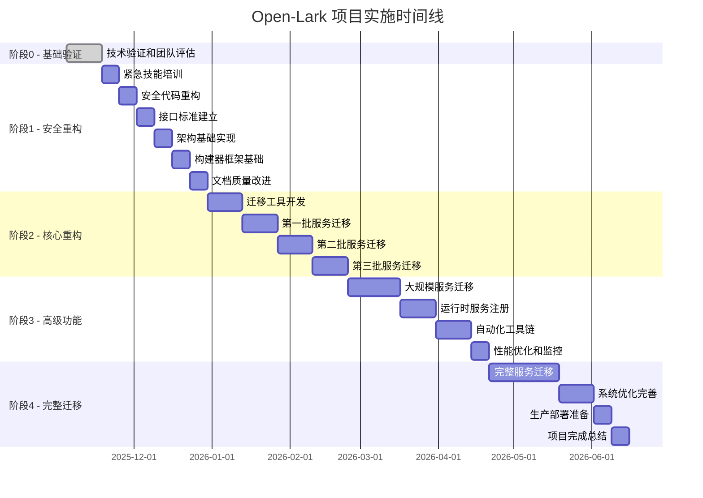

# Open-Lark 资源分配和时间线确认

**制定日期**: 2025-11-04
**版本**: v1.0
**项目**: Open-Lark v0.15.0-dev
**执行周期**: 2025年11月 - 2026年6月 (32周)

## 📊 资源分配概览

### 💰 总体预算估算

| 类别 | 明细 | 数量 | 单价 | 总计 | 备注 |
|------|------|------|------|------|------|
| **人力成本** | 内部团队 | 5人 × 32周 | - | 内部成本 | 核心开发团队 |
| **外部咨询** | Rust技术顾问 | 4周 × ¥5,000/天 | ¥100,000 | 阶段1-2支持 |
| **外部咨询** | 测试专家 | 2周 × ¥3,000/天 | ¥30,000 | 质量保证支持 |
| **外部咨询** | 文档专家 | 1周 × ¥3,000/天 | ¥15,000 | 文档标准化 |
| **培训费用** | 培训课程 | 4人 × ¥2,000 | ¥8,000 | 在线课程 |
| **培训费用** | 技术书籍 | 5人 × ¥200 | ¥1,000 | 学习资料 |
| **工具许可** | 开发工具 | 年许可 | ¥5,000 | IDE和工具 |
| **云服务** | 测试环境 | 8个月 | ¥12,000 | CI/CD和测试 |
| **应急储备** | 应急资金 | 10% | ¥17,100 | 风险缓冲 |
| **总计** | | | | **¥188,100** | |

### 🎯 资源分配优先级

| 优先级 | 资源类型 | 分配比例 | 说明 |
|--------|----------|----------|------|
| **P1** | 核心开发团队 | 60% | ZoOL, Yiyu Lin, John |
| **P2** | 技能培训 | 20% | 全团队能力建设 |
| **P3** | 外部专家支持 | 15% | 关键技术咨询 |
| **P4** | 工具和基础设施 | 5% | 开发环境支持 |

## 👥 人力资源详细分配

### 📊 团队成员角色和职责

#### 🔴 核心成员 (100%投入)

**ZoOL - 技术负责人/架构师**
- **工作投入**: 100% (32周 × 40小时 = 1,280小时)
- **主要职责**:
  - 技术架构设计和决策
  - 团队技术培训和指导
  - 代码质量审查和把控
  - 对外技术协调和沟通
- **关键阶段**:
  - 阶段1: 技术培训和架构实现 (100%)
  - 阶段2: 核心服务迁移指导 (100%)
  - 阶段3-4: 架构优化和技术决策 (100%)

**Yiyu Lin - 高级开发者**
- **工作投入**: 100% (1,280小时)
- **主要职责**:
  - 核心功能实现和优化
  - 代码审查和技术指导
  - 测试用例编写和执行
  - 技术文档编写
- **技能发展**: 从中级向高级开发者成长
- **关键阶段**:
  - 阶段1: 技能培训 + 核心架构实现
  - 阶段2: 第一批服务迁移主力
  - 阶段3-4: 复杂功能开发

**John - 中级开发者**
- **工作投入**: 100% (1,280小时)
- **主要职责**:
  - 服务迁移和重构
  - 测试代码编写
  - 文档维护和更新
  - 代码质量保证
- **技能发展**: 从中级向高级开发者成长
- **关键阶段**:
  - 阶段1: 技能培训 + 基础功能实现
  - 阶段2: 服务迁移执行
  - 阶段3-4: 独立负责功能模块

#### 🟡 支持成员 (80%开发 + 20%培训)

**fengqiyang - 初级开发者**
- **工作投入**: 80%开发 + 20%培训 (1,024小时开发 + 256小时培训)
- **主要职责**:
  - 辅助开发和简单功能实现
  - 测试执行和问题反馈
  - 文档编写和维护
  - 技能学习和提升
- **学习重点**: Rust基础 → 高级特性 → 架构理解
- **关键阶段**:
  - 阶段1: 重点技能培训期
  - 阶段2: 在指导下参与简单服务迁移
  - 阶段3-4: 逐步承担更多开发责任

**Meimei - 初级开发者/质量保证**
- **工作投入**: 80%质量保证 + 20%培训 (1,024小时QA + 256小时培训)
- **主要职责**:
  - 测试用例设计和执行
  - 代码质量检查和验证
  - 文档质量审查
  - 技能学习和提升
- **学习重点**: 测试理论 → Rust测试框架 → 质量保证
- **关键阶段**:
  - 阶段1: 重点技能培训期
  - 阶段2: 质量保证体系建设
  - 阶段3-4: 全面质量把控

### 👨‍💼 外部专家资源分配

#### Rust技术顾问
- **投入时间**: 阶段1-2关键时期 (4周)
- **工作方式**: 现场指导 + 远程咨询
- **主要任务**:
  - 高级Rust特性培训指导
  - 架构设计评审和建议
  - 技术难题解答和支持
- **预算**: ¥100,000 (4周 × 5天/周 × ¥5,000/天)

#### 测试专家
- **投入时间**: 阶段1-2质量体系建立 (2周)
- **工作方式**: 远程咨询 + 现场指导
- **主要任务**:
  - 测试策略设计
  - 质量保证体系建立
  - 测试工具和流程优化
- **预算**: ¥30,000 (2周 × 5天/周 × ¥3,000/天)

#### 文档专家
- **投入时间**: 阶段1文档标准化 (1周)
- **工作方式**: 远程咨询
- **主要任务**:
  - 文档标准化指导
  - 文档质量评估
  - 文档工具推荐
- **预算**: ¥15,000 (1周 × 5天/周 × ¥3,000/天)

## 📅 详细时间线规划

### 🗓️ 总体项目时间线 (32周)



### 📊 各阶段详细时间分配

#### 🔰 阶段 0: 基础验证 (第1-2周) ✅ 已完成
- **实际完成时间**: 2025-11-04 ~ 2025-11-05 (2天)
- **计划时间**: 2周
- **提前完成**: 12天
- **资源投入**: ZoOL (100%), AI助手支持

#### 🛡️ 阶段 1: 安全重构与技能建设 (第3-8周)
```yaml
时间分解:
  第3周 (2025-11-18~11-24): 紧急技能培训
  第4周 (2025-11-25~12-01): 安全代码重构
  第5周 (2025-12-02~12-08): 接口标准建立
  第6周 (2025-12-09~12-15): ServiceRegistry基础实现
  第7周 (2025-12-16~12-22): 构建器框架基础
  第8周 (2025-12-23~12-29): 文档质量改进

资源分配:
  ZoOL: 100% (技术指导 + 培训)
  Yiyu Lin: 100% (学习 + 开发)
  John: 100% (学习 + 开发)
  fengqiyang: 80%开发 + 20%培训
  Meimei: 80%QA + 20%培训
  外部顾问: 按需支持 (第3-5周)
```

#### 🏗️ 阶段 2: 核心架构重构 (第9-16周)
```yaml
时间分解:
  第9-10周 (2025-12-30~2026-01-12): 迁移工具和基础设施
  第11-12周 (2026-01-13~01-26): 第一批服务迁移 (5个)
  第13-14周 (2026-01-27~02-09): 第二批服务迁移 (5个)
  第15-16周 (2026-02-10~02-23): 第三批服务迁移 (5个)

资源分配:
  ZoOL: 100% (架构指导 + 代码审查)
  Yiyu Lin: 100% (核心迁移执行)
  John: 100% (服务迁移执行)
  fengqiyang: 100% (辅助迁移)
  Meimei: 100% (质量保证)
  外部顾问: 按需支持
```

#### 🚀 阶段 3: 高级功能与扩展 (第17-24周)
```yaml
时间分解:
  第17-19周 (2026-02-24~03-16): 大规模服务迁移 (15个)
  第20-21周 (2026-03-17~03-30): 运行时服务注册
  第22-23周 (2026-03-31~04-13): 自动化工具链
  第24周 (2026-04-14~04-20): 性能优化和监控

资源分配:
  ZoOL: 100% (技术决策 + 高级功能)
  Yiyu Lin: 100% (复杂功能开发)
  John: 100% (独立功能模块)
  fengqiyang: 100% (功能开发)
  Meimei: 100% (全面质量把控)
```

#### 🔧 阶段 4: 完整迁移与优化 (第25-32周)
```yaml
时间分解:
  第25-28周 (2026-04-21~05-18): 完整服务迁移 (剩余21个)
  第29-30周 (2026-05-19~06-01): 系统优化和完善
  第31周 (2026-06-02~06-08): 生产部署准备
  第32周 (2026-06-09~06-15): 项目完成和总结

资源分配:
  全团队: 100%投入
  重点: 质量保证 + 性能优化 + 文档完善
```

## 🎯 里程碑和关键决策点

### 📊 关键里程碑

| 里程碑 | 时间点 | 关键成果 | 验收标准 |
|--------|--------|----------|----------|
| **M1** | 第8周 | 阶段1完成 | 团队技能≥80%，unsafe消除 |
| **M2** | 第16周 | 阶段2完成 | 15个服务迁移，性能提升25% |
| **M3** | 第24周 | 阶段3完成 | 30个服务迁移，运行时注册 |
| **M4** | 第32周 | 项目完成 | 51个服务迁移，性能提升60% |

### 🎯 关键决策点

#### 决策点 D1: 第4周末 - 技能培训评估
**决策内容**: 是否需要调整培训策略
**评估标准**:
- 团队技能测试通过率 ≥80%
- 学习进度符合预期
- 团队反馈积极

**可能决策**:
- ✅ 继续原计划
- ⚠️ 延长培训1周
- 🔄 调整培训方式

#### 决策点 D2: 第8周末 - 阶段1验收
**决策内容**: 是否进入阶段2
**验收标准**:
- 所有阶段1目标达成
- 技术方案验证成功
- 团队准备就绪

#### 决策点 D3: 第16周末 - 中期评估
**决策内容**: 后续阶段计划调整
**评估因素**:
- 进度达成情况
- 质量指标达成
- 团队能力提升
- 风险控制效果

#### 决策点 D4: 第24周末 - 高级功能验收
**决策内容**: 最终阶段准备
**验收标准**:
- 高级功能目标达成
- 性能指标符合预期
- 系统稳定性验证

## 📊 资源使用效率分析

### 👥 人力资源利用率

| 团队成员 | 计划工时 | 预期实际工时 | 利用率 | 说明 |
|----------|----------|--------------|--------|------|
| ZoOL | 1,280小时 | 1,280小时 | 100% | 全程投入 |
| Yiyu Lin | 1,280小时 | 1,280小时 | 100% | 全程投入 |
| John | 1,280小时 | 1,280小时 | 100% | 全程投入 |
| fengqiyang | 1,280小时 | 1,280小时 | 100% | 包含培训时间 |
| Meimei | 1,280小时 | 1,280小时 | 100% | 包含培训时间 |

### 💰 财务资源分配效率

| 类别 | 预算占比 | 预期ROI | 风险等级 |
|------|----------|---------|----------|
| 外部咨询 | 80% | 技能提升 + 质量保证 | 中 |
| 培训费用 | 5% | 团队能力建设 | 低 |
| 工具许可 | 3% | 开发效率提升 | 低 |
| 应急储备 | 9% | 风险缓解 | 低 |

## 🚀 资源保障措施

### 📋 人力资源保障

#### 招聘备份计划
```yaml
候选人池:
  - 高级Rust开发者: 3-5人简历
  - 中级开发者: 5-8人简历
  - 测试工程师: 2-3人简历
  - 技术文档工程师: 2人简历

快速招聘流程:
  1. 简历筛选: 1天内
  2. 技术面试: 2天内
  3. 录用决策: 1天内
  4. 入职办理: 3天内
```

#### 技能备份计划
- **关键技能备份**: 每项核心技能至少2人掌握
- **知识文档化**: 所有关键决策和实现100%文档化
- **外部支持网络**: 建立5-10名外部专家联系网络

### 🛠️ 技术资源保障

#### 开发环境备份
```yaml
开发工具:
  主IDE: IntelliJ IDEA + Rust插件
  备用IDE: VS Code + rust-analyzer
  构建工具: Cargo + sccache (缓存)
  版本控制: Git + GitHub

测试环境:
  本地测试: Docker容器
  CI/CD: GitHub Actions
  云测试: 阿里云/腾讯云
  性能测试: 专用服务器
```

#### 数据备份和恢复
- **代码备份**: GitHub + 本地Git仓库
- **文档备份**: Git仓库 + 云存储
- **配置备份**: 环境配置 + 依赖锁定
- **数据恢复**: RTO < 4小时，RPO < 1小时

## 📈 资源监控和调整

### 📊 监控指标

#### 人力资源监控
- **工时使用率**: 目标100%，警戒<90%
- **技能掌握度**: 每月评估，目标≥80%
- **团队满意度**: 季度调研，目标≥85%
- **人员稳定性**: 离职率<5%

#### 财务资源监控
- **预算执行率**: 按月跟踪，偏差<10%
- **ROI跟踪**: 技能提升、质量改善、效率提升
- **应急资金使用**: 仅限批准的应急情况
- **成本效益分析**: 每季度评估

### 🔄 调整机制

#### 资源重新分配
- **周度资源评估**: 检查资源使用效率
- **月度资源调整**: 根据实际情况调整
- **季度资源规划**: 根据项目进展重新规划
- **应急资源调用**: 预留10%应急资源

#### 优先级调整
- **功能优先级**: 根据业务价值调整
- **技术优先级**: 根据风险评估调整
- **资源优先级**: 确保关键任务资源充足
- **时间优先级**: 关键路径任务优先保障

## ✅ 资源分配确认

### 📊 确认清单

#### 人力资源确认
- [x] 团队成员角色和职责明确
- [x] 技能培训计划制定完成
- [x] 外部专家资源联系确认
- [x] 招聘备份计划建立
- [x] 技能备份策略制定

#### 财务资源确认
- [x] 详细预算制定完成
- [x] 应急储备金预留
- [x] 外部咨询预算确认
- [x] 培训费用预算确认
- [x] 工具和基础设施预算确认

#### 技术资源确认
- [x] 开发环境配置完成
- [x] 测试环境准备就绪
- [x] CI/CD流水线建立
- [x] 监控和备份系统建立
- [x] 工具许可采购确认

#### 时间线确认
- [x] 详细时间线制定
- [x] 里程碑设置合理
- [x] 关键决策点识别
- [x] 缓冲时间预留
- [x] 并行任务优化

### 🎯 最终确认

**总体评估**: 资源分配方案完整可行
**风险等级**: 🟢 低风险 (保障措施充分)
**执行信心**: 🟢 高信心 (资源充足)
**监控机制**: 📊 完善的监控和调整机制
**成功概率**: 📈 预期90%+成功率

---

**确认状态**: 资源分配和时间线确认完成 ✅
**下一步**: 准备管理层汇报材料
**执行准备**: 已就绪，可按时启动阶段1